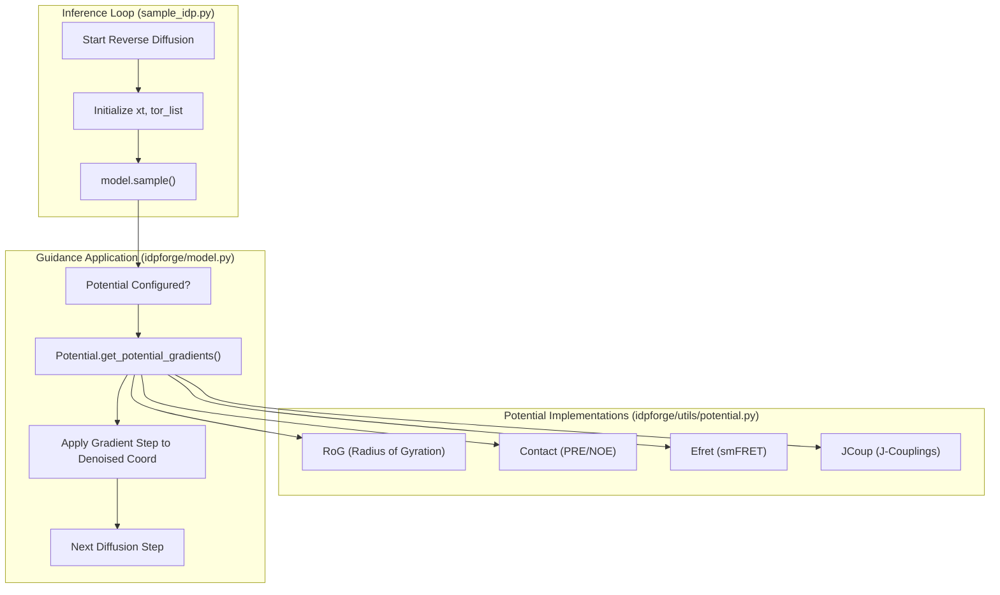
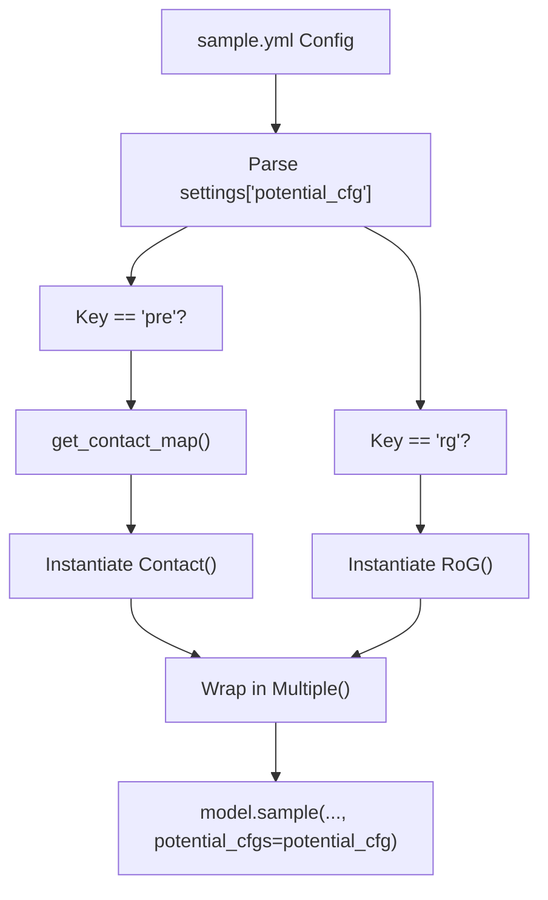

# Experimental Guidance Potentials

> **Relevant source files**
> * [idpforge/utils/potential.py](https://github.com/THGLab/IDPForge/blob/a12c2846/idpforge/utils/potential.py)
> * [sample_idp.py](https://github.com/THGLab/IDPForge/blob/a12c2846/sample_idp.py)
> * [sample_ldr.py](https://github.com/THGLab/IDPForge/blob/a12c2846/sample_ldr.py)

IDPForge incorporates a gradient-based guidance system that allows experimental data to steer the reverse diffusion process. By defining differentiable "potentials" based on physical observables (Radius of Gyration, FRET, PRE, J-Couplings), the model can generate ensembles that are statistically consistent with experimental measurements while remaining within the learned structural manifold of intrinsically disordered proteins (IDPs).

## Potential Guidance Framework

The guidance system is implemented in `idpforge/utils/potential.py`. It operates by calculating the gradient of a potential function with respect to the atomic coordinates during each step of the reverse diffusion process. These gradients are then used to shift the predicted denoised structure toward states that better satisfy the experimental constraints.

### The Potential Base Class

All guidance terms inherit from the `Potential` interface [idpforge/utils/potential.py L15-L18](https://github.com/THGLab/IDPForge/blob/a12c2846/idpforge/utils/potential.py#L15-L18)

 This class defines the contract for computing potentials and their corresponding gradients.

* **`compute(xyz)`**: Calculates a scalar potential value from the current coordinates `[B, L, 5, 3]`. The system is designed to **maximize** this value [idpforge/utils/potential.py L19-L31](https://github.com/THGLab/IDPForge/blob/a12c2846/idpforge/utils/potential.py#L19-L31)
* **`get_potential_gradients(xyz)`**: Uses PyTorch's `autograd` to compute the gradient of the potential with respect to the input coordinates. It specifically handles zeroing out gradients for atoms not involved in the potential calculation and ensures that gradients are propagated to the backbone atoms (N, Ca, C) [idpforge/utils/potential.py L33-L53](https://github.com/THGLab/IDPForge/blob/a12c2846/idpforge/utils/potential.py#L33-L53)

### Guidance Logic Data Flow

The following diagram illustrates how the `Potential` classes interface with the sampling loop in `sample_idp.py`.

**Potential Integration Overview**

**Sources:** [sample_idp.py L142-L156](https://github.com/THGLab/IDPForge/blob/a12c2846/sample_idp.py#L142-L156)

 [idpforge/utils/potential.py L15-L53](https://github.com/THGLab/IDPForge/blob/a12c2846/idpforge/utils/potential.py#L15-L53)

## Available Potential Types

IDPForge provides several specialized potential classes to handle different types of experimental data. These are mapped in the `Potentials` dispatch table [idpforge/utils/potential.py L162-L168](https://github.com/THGLab/IDPForge/blob/a12c2846/idpforge/utils/potential.py#L162-L168)

| Potential Key | Class | Description | Implementation Detail |
| --- | --- | --- | --- |
| `rg` | `RoG` | Radius of Gyration | Minimizes squared error between ensemble mean Rg and target [idpforge/utils/potential.py L56-L67](https://github.com/THGLab/IDPForge/blob/a12c2846/idpforge/utils/potential.py#L56-L67) |
| `contact` | `Contact` | Distance Restraints (PRE/NOE) | Uses a differentiable coordination-style function to enforce distance bounds [idpforge/utils/potential.py L70-L98](https://github.com/THGLab/IDPForge/blob/a12c2846/idpforge/utils/potential.py#L70-L98) |
| `fret` | `Efret` | smFRET Efficiency | Calculates FRET efficiency using $E = 1 / (1 + (r/R_0)^6)$ [idpforge/utils/potential.py L101-L123](https://github.com/THGLab/IDPForge/blob/a12c2846/idpforge/utils/potential.py#L101-L123) |
| `jcoup` | `JCoup` | Scalar J-Couplings | Uses Karplus equations to relate $\phi$ dihedrals to J-values [idpforge/utils/potential.py L126-L148](https://github.com/THGLab/IDPForge/blob/a12c2846/idpforge/utils/potential.py#L126-L148) |
| `multiple` | `Multiple` | Weighted Sum | Combines multiple potential terms into a single objective [idpforge/utils/potential.py L151-L159](https://github.com/THGLab/IDPForge/blob/a12c2846/idpforge/utils/potential.py#L151-L159) |

### Implementation Details

#### Radius of Gyration (RoG)

Calculates the distance of Ca atoms from the centroid. The potential returned is the negative squared error, encouraging the model to match the `target` Rg [idpforge/utils/potential.py L61-L67](https://github.com/THGLab/IDPForge/blob/a12c2846/idpforge/utils/potential.py#L61-L67)

#### Contact Potential (Contact)

Used for PRE (Paramagnetic Resonance Enhancement) or NOE (Nuclear Overhauser Effect) data. It calculates a differentiable distance gram (`dgram`) and applies a loss if distances fall outside the specified `contact_bounds` [idpforge/utils/potential.py L93-L95](https://github.com/THGLab/IDPForge/blob/a12c2846/idpforge/utils/potential.py#L93-L95)

 It includes an `exp_mask_p` parameter to randomly mask experimental constraints during sampling, which helps maintain ensemble diversity [idpforge/utils/potential.py L96-L97](https://github.com/THGLab/IDPForge/blob/a12c2846/idpforge/utils/potential.py#L96-L97)

#### J-Couplings (JCoup)

Calculates the $\phi$ dihedral angle using `get_dih` [idpforge/utils/potential.py L143](https://github.com/THGLab/IDPForge/blob/a12c2846/idpforge/utils/potential.py#L143-L143)

 and applies a standard Karplus equation:
$J(\phi) = 6.51 \cos^2(\phi - 60^\circ) - 1.76 \cos(\phi - 60^\circ) + 1.6$ [idpforge/utils/potential.py L144-L145](https://github.com/THGLab/IDPForge/blob/a12c2846/idpforge/utils/potential.py#L144-L145)

**Sources:** [idpforge/utils/potential.py L56-L168](https://github.com/THGLab/IDPForge/blob/a12c2846/idpforge/utils/potential.py#L56-L168)

## Configuration and Application

In `sample_idp.py`, potentials are initialized based on the `sample.yml` configuration.

**Potential Initialization Logic**

**Sources:** [sample_idp.py L64-L87](https://github.com/THGLab/IDPForge/blob/a12c2846/sample_idp.py#L64-L87)

 [idpforge/utils/potential.py L151-L159](https://github.com/THGLab/IDPForge/blob/a12c2846/idpforge/utils/potential.py#L151-L159)

### Key Parameters in Configuration

* **`timescale`**: Controls the diffusion steps during which guidance is active [sample_idp.py L66](https://github.com/THGLab/IDPForge/blob/a12c2846/sample_idp.py#L66-L66)
* **`grad_clip`**: Prevents unstable updates by clipping the magnitude of the potential gradient [sample_idp.py L67](https://github.com/THGLab/IDPForge/blob/a12c2846/sample_idp.py#L67-L67)
* **`weights`**: A dictionary mapping potential types to their relative importance in the `Multiple` potential sum [idpforge/utils/potential.py L155](https://github.com/THGLab/IDPForge/blob/a12c2846/idpforge/utils/potential.py#L155-L155)
* **`exp_mask_p`**: Probability of keeping an experimental constraint in a given step; used to prevent over-fitting to specific restraints [idpforge/utils/potential.py L81](https://github.com/THGLab/IDPForge/blob/a12c2846/idpforge/utils/potential.py#L81-L81)

### Gradient Step Application

The gradients obtained from `Potential.get_potential_gradients()` are applied to the predicted coordinates. For distance-based potentials (RoG, Contact, Efret), the system ensures gradients are propagated to the Ca atoms [idpforge/utils/potential.py L46-L48](https://github.com/THGLab/IDPForge/blob/a12c2846/idpforge/utils/potential.py#L46-L48)

 For J-Couplings, gradients are calculated for the N-Ca-C backbone atoms to influence the torsion angles [idpforge/utils/potential.py L36-L37](https://github.com/THGLab/IDPForge/blob/a12c2846/idpforge/utils/potential.py#L36-L37)

**Sources:** [idpforge/utils/potential.py L33-L53](https://github.com/THGLab/IDPForge/blob/a12c2846/idpforge/utils/potential.py#L33-L53)

 [sample_idp.py L64-L87](https://github.com/THGLab/IDPForge/blob/a12c2846/sample_idp.py#L64-L87)