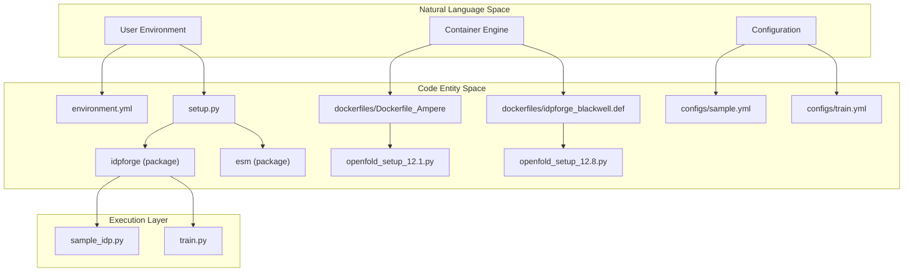
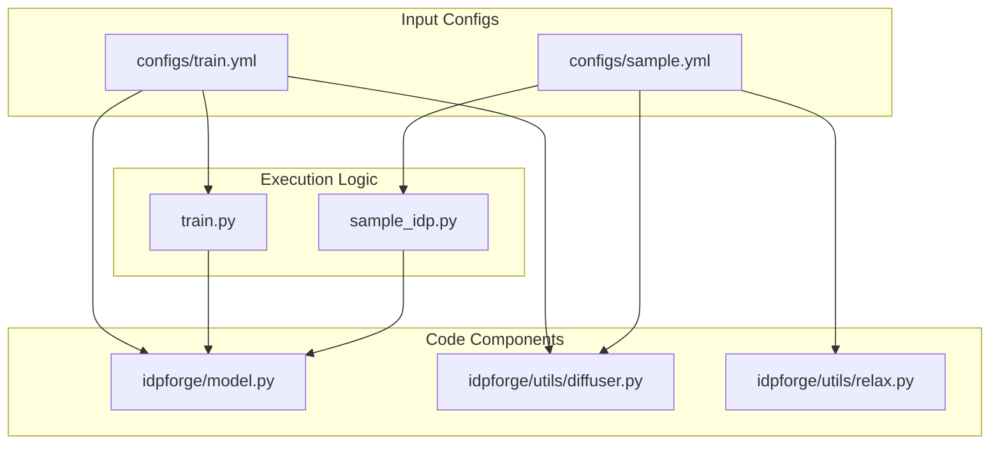

# Getting Started: Installation & Configuration

> **Relevant source files**
> * [README.md](https://github.com/THGLab/IDPForge/blob/a12c2846/README.md?plain=1)
> * [configs/sample.yml](https://github.com/THGLab/IDPForge/blob/a12c2846/configs/sample.yml)
> * [configs/train.yml](https://github.com/THGLab/IDPForge/blob/a12c2846/configs/train.yml)
> * [dockerfiles/Dockerfile_Ampere](https://github.com/THGLab/IDPForge/blob/a12c2846/dockerfiles/Dockerfile_Ampere)
> * [dockerfiles/Dockerfile_Blackwell](https://github.com/THGLab/IDPForge/blob/a12c2846/dockerfiles/Dockerfile_Blackwell)
> * [dockerfiles/env.yml](https://github.com/THGLab/IDPForge/blob/a12c2846/dockerfiles/env.yml)
> * [dockerfiles/idpforge_ampere.def](https://github.com/THGLab/IDPForge/blob/a12c2846/dockerfiles/idpforge_ampere.def)
> * [dockerfiles/idpforge_blackwell.def](https://github.com/THGLab/IDPForge/blob/a12c2846/dockerfiles/idpforge_blackwell.def)
> * [dockerfiles/openfold_setup_12.1.py](https://github.com/THGLab/IDPForge/blob/a12c2846/dockerfiles/openfold_setup_12.1.py)
> * [dockerfiles/openfold_setup_12.8.py](https://github.com/THGLab/IDPForge/blob/a12c2846/dockerfiles/openfold_setup_12.8.py)
> * [environment.yml](https://github.com/THGLab/IDPForge/blob/a12c2846/environment.yml)
> * [setup.py](https://github.com/THGLab/IDPForge/blob/a12c2846/setup.py)

This page provides a technical guide for setting up the IDPForge environment. IDPForge requires a specific stack of machine learning libraries (PyTorch, PyTorch Lightning), molecular dynamics tools (OpenMM, MDTraj), and bioinformatics utilities (OpenFold, ESM2).

## Environment Setup Strategies

IDPForge supports two primary installation paths depending on the target hardware (Ampere vs. Blackwell architectures) and the deployment environment (Local vs. HPC).

### 1. Conda/Mamba Installation

The primary method uses `environment.yml` to resolve dependencies. The project explicitly pins `pip==25.2` as newer versions may cause installation conflicts with specific ML components [dockerfiles/Dockerfile_Ampere L25-L27](https://github.com/THGLab/IDPForge/blob/a12c2846/dockerfiles/Dockerfile_Ampere#L25-L27)

| Component | Default (Ampere/Older) | Alternative (Blackwell/Newer) |
| --- | --- | --- |
| **CUDA Toolkit** | 12.1 | 12.8 |
| **PyTorch** | 2.5.1 | 2.7.1 |
| **Python** | 3.10 | 3.10 |

**Key Dependencies:**

* **ML Core:** `torch`, `pytorch-lightning`, `einops`, `ml-collections` [environment.yml L62-L75](https://github.com/THGLab/IDPForge/blob/a12c2846/environment.yml#L62-L75)
* **Bioinformatics:** `hmmer`, `hhsuite`, `mmseqs2`, `pdb-tools` [environment.yml L48-L52](https://github.com/THGLab/IDPForge/blob/a12c2846/environment.yml#L48-L52)
* **Simulation/Structure:** `openmm`, `pdbfixer`, `mdtraj`, `biopython` [environment.yml L39-L45](https://github.com/THGLab/IDPForge/blob/a12c2846/environment.yml#L39-L45)

**Installation Workflow:**

1. Create environment: `conda env create -f environment.yml` [README.md L26](https://github.com/THGLab/IDPForge/blob/a12c2846/README.md?plain=1#L26-L26)
2. Install IDPForge as an editable module: `pip install -e .` [README.md L40](https://github.com/THGLab/IDPForge/blob/a12c2846/README.md?plain=1#L40-L40)
3. Setup OpenFold (see below).

### 2. OpenFold Integration

IDPForge relies on OpenFold for its structure module kernels. Because OpenFold requires custom CUDA kernel compilation, IDPForge provides specialized setup scripts to ensure compatibility with modern CUDA versions.

**OpenFold Setup Procedure:**

1. Clone OpenFold into the same parent directory as IDPForge [README.md L49-L53](https://github.com/THGLab/IDPForge/blob/a12c2846/README.md?plain=1#L49-L53)
2. Download `stereo_chemical_props.txt` into `openfold/openfold/resources` [README.md L61-L65](https://github.com/THGLab/IDPForge/blob/a12c2846/README.md?plain=1#L61-L65)
3. Replace `openfold/setup.py` with the versioned script from IDPForge: * For CUDA 12.1: `dockerfiles/openfold_setup_12.1.py` [dockerfiles/openfold_setup_12.1.py L1-L114](https://github.com/THGLab/IDPForge/blob/a12c2846/dockerfiles/openfold_setup_12.1.py#L1-L114) * For CUDA 12.8: `dockerfiles/openfold_setup_12.8.py` [dockerfiles/openfold_setup_12.8.py L1-L116](https://github.com/THGLab/IDPForge/blob/a12c2846/dockerfiles/openfold_setup_12.8.py#L1-L116)
4. Install with build isolation disabled: `pip install -e . --no-build-isolation` [README.md L94](https://github.com/THGLab/IDPForge/blob/a12c2846/README.md?plain=1#L94-L94)

**Sources:** [README.md L13-L97](https://github.com/THGLab/IDPForge/blob/a12c2846/README.md?plain=1#L13-L97)

 [environment.yml L1-L82](https://github.com/THGLab/IDPForge/blob/a12c2846/environment.yml#L1-L82)

 [setup.py L1-L23](https://github.com/THGLab/IDPForge/blob/a12c2846/setup.py#L1-L23)

 [dockerfiles/openfold_setup_12.1.py L1-L114](https://github.com/THGLab/IDPForge/blob/a12c2846/dockerfiles/openfold_setup_12.1.py#L1-L114)

 [dockerfiles/openfold_setup_12.8.py L1-L116](https://github.com/THGLab/IDPForge/blob/a12c2846/dockerfiles/openfold_setup_12.8.py#L1-L116)

---

## Containerized Deployment

For reproducible environments, IDPForge provides both Dockerfiles and Apptainer (Singularity) definition files. These containers bundle the environment, including the complex OpenFold kernel compilation.

### System Architecture Diagram: Installation & Runtime

This diagram maps the high-level installation components to their respective code entities and file locations.

**Sources:** [README.md L212-L220](https://github.com/THGLab/IDPForge/blob/a12c2846/README.md?plain=1#L212-L220)

 [dockerfiles/Dockerfile_Ampere L1-L63](https://github.com/THGLab/IDPForge/blob/a12c2846/dockerfiles/Dockerfile_Ampere#L1-L63)

 [dockerfiles/idpforge_ampere.def L1-L120](https://github.com/THGLab/IDPForge/blob/a12c2846/dockerfiles/idpforge_ampere.def#L1-L120)

 [setup.py L12](https://github.com/THGLab/IDPForge/blob/a12c2846/setup.py#L12-L12)

---

## Configuration Files

IDPForge uses YAML configuration files to manage model hyperparameters, diffusion schedules, and data paths.

### 1. Training Configuration (configs/train.yml)

Controls the neural network architecture and the training loop parameters.

* **Diffusion Schedule:** Defines the linear noise schedule for both Euclidean (coordinates) and Torsional (angles) space via `euclid_b0/bT` and `torsion_b0/bT` [configs/train.yml L57-L60](https://github.com/THGLab/IDPForge/blob/a12c2846/configs/train.yml#L57-L60)
* **Loss Weights:** Balances FAPE (Frame Aligned Point Error), distance, angular, and violation losses [configs/train.yml L31-L35](https://github.com/THGLab/IDPForge/blob/a12c2846/configs/train.yml#L31-L35)
* **Model Architecture:** Configures the `trunk` (number of blocks, state dimensions) and the `structure_module` (IPA heads, transition layers) [configs/train.yml L69-L93](https://github.com/THGLab/IDPForge/blob/a12c2846/configs/train.yml#L69-L93)

### 2. Inference Configuration (configs/sample.yml)

Controls the generation of protein ensembles.

* **Inference Steps:** `n_tsteps_inf` (often set to 40) defines the number of reverse diffusion steps [configs/sample.yml L45](https://github.com/THGLab/IDPForge/blob/a12c2846/configs/sample.yml#L45-L45)
* **Potential Guidance:** The `potential` flag enables gradient-based guidance during sampling (e.g., using PRE or FRET data) [configs/sample.yml L34-L38](https://github.com/THGLab/IDPForge/blob/a12c2846/configs/sample.yml#L34-L38)
* **Relaxation:** Parameters for the AMBER force field relaxation post-sampling, including `tolerance` and `stiffness` [configs/sample.yml L51-L56](https://github.com/THGLab/IDPForge/blob/a12c2846/configs/sample.yml#L51-L56)

### Configuration Data Flow

The following diagram illustrates how configuration entities interact with the sampling and training scripts.

**Sources:** [configs/train.yml L1-L93](https://github.com/THGLab/IDPForge/blob/a12c2846/configs/train.yml#L1-L93)

 [configs/sample.yml L1-L56](https://github.com/THGLab/IDPForge/blob/a12c2846/configs/sample.yml#L1-L56)

 [train.py L1-L46](https://github.com/THGLab/IDPForge/blob/a12c2846/train.py#L1-L46)

 [sample_idp.py L1-L42](https://github.com/THGLab/IDPForge/blob/a12c2846/sample_idp.py#L1-L42)

---

## External Data & Weights

IDPForge requires pre-computed files and model weights that are not stored in the repository due to size.

1. **Model Weights:** `weights/mdl.ckpt` should be placed in the repository root [README.md L204](https://github.com/THGLab/IDPForge/blob/a12c2846/README.md?plain=1#L204-L204)
2. **IGSO3 Cache:** `data/diff_igso3.pkl` is required for rotational diffusion calculations [configs/train.yml L29](https://github.com/THGLab/IDPForge/blob/a12c2846/configs/train.yml#L29-L29)
3. **Fragment Library:** `data/example_data.pkl` provides the secondary structure fragments used during sampling [configs/sample.yml L42](https://github.com/THGLab/IDPForge/blob/a12c2846/configs/sample.yml#L42-L42)

**Sources:** [README.md L200-L205](https://github.com/THGLab/IDPForge/blob/a12c2846/README.md?plain=1#L200-L205)

 [configs/sample.yml L42](https://github.com/THGLab/IDPForge/blob/a12c2846/configs/sample.yml#L42-L42)

 [configs/train.yml L29](https://github.com/THGLab/IDPForge/blob/a12c2846/configs/train.yml#L29-L29)