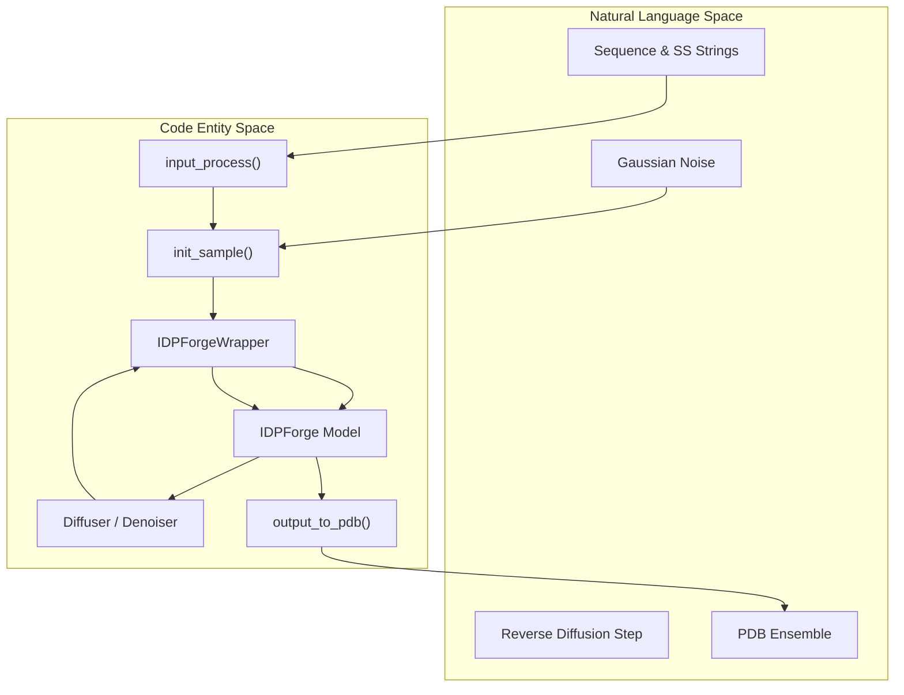
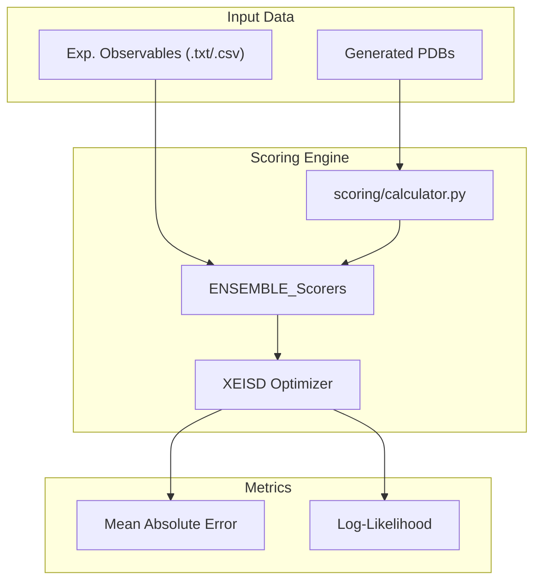

# Glossary

> **Relevant source files**
> * [AlphaFlex/Data_Inputs/knot_screening.json](https://github.com/THGLab/IDPForge/blob/a12c2846/AlphaFlex/Data_Inputs/knot_screening.json)
> * [AlphaFlex/README.md](https://github.com/THGLab/IDPForge/blob/a12c2846/AlphaFlex/README.md?plain=1)
> * [README.md](https://github.com/THGLab/IDPForge/blob/a12c2846/README.md?plain=1)
> * [configs/sample.yml](https://github.com/THGLab/IDPForge/blob/a12c2846/configs/sample.yml)
> * [idpforge/loss.py](https://github.com/THGLab/IDPForge/blob/a12c2846/idpforge/loss.py)
> * [idpforge/misc.py](https://github.com/THGLab/IDPForge/blob/a12c2846/idpforge/misc.py)
> * [idpforge/utils/diff_utils.py](https://github.com/THGLab/IDPForge/blob/a12c2846/idpforge/utils/diff_utils.py)
> * [idpforge/utils/potential.py](https://github.com/THGLab/IDPForge/blob/a12c2846/idpforge/utils/potential.py)
> * [idpforge/utils/pre_relax.py](https://github.com/THGLab/IDPForge/blob/a12c2846/idpforge/utils/pre_relax.py)
> * [idpforge/utils/structure_validation.py](https://github.com/THGLab/IDPForge/blob/a12c2846/idpforge/utils/structure_validation.py)
> * [idpforge/utils/validation_metrics.py](https://github.com/THGLab/IDPForge/blob/a12c2846/idpforge/utils/validation_metrics.py)
> * [idpforge/wrapper.py](https://github.com/THGLab/IDPForge/blob/a12c2846/idpforge/wrapper.py)
> * [scoring/scorer.py](https://github.com/THGLab/IDPForge/blob/a12c2846/scoring/scorer.py)

This page provides technical definitions for domain-specific terminology, architectural components, and implementation details within the **IDPForge** and **AlphaFlex** frameworks.

## Core Concepts

### Intrinsically Disordered Proteins (IDP)

Proteins that lack a fixed or ordered three-dimensional structure under physiological conditions. IDPForge models these as ensembles of conformers rather than a single static structure [README.md L1-L3](https://github.com/THGLab/IDPForge/blob/a12c2846/README.md?plain=1#L1-L3)

### Intrinsically Disordered Regions (IDR)

Specific segments within a protein that are disordered, often flanking or connecting folded domains. AlphaFlex categorizes these based on their structural context:

* **Tail**: An IDR located at the N- or C-terminus of a protein, adjacent to one folded domain [AlphaFlex/README.md L53-L54](https://github.com/THGLab/IDPForge/blob/a12c2846/AlphaFlex/README.md?plain=1#L53-L54)
* **Linker**: An IDR that connects two folded domains [AlphaFlex/README.md L53-L54](https://github.com/THGLab/IDPForge/blob/a12c2846/AlphaFlex/README.md?plain=1#L53-L54)
* **Loop**: An IDR that exists within a single folded domain [AlphaFlex/README.md L53-L54](https://github.com/THGLab/IDPForge/blob/a12c2846/AlphaFlex/README.md?plain=1#L53-L54)

### Conformational Ensemble

A collection of structural models representing the dynamic landscape of an IDP. IDPForge generates these ensembles using a diffusion-based generative process [README.md L1-L3](https://github.com/THGLab/IDPForge/blob/a12c2846/README.md?plain=1#L1-L3)

---

## Architectural Components

### IDPForge Trunk & Structure Module

The neural network architecture is encapsulated in the `IDPForge` class [idpforge/wrapper.py L21-L25](https://github.com/THGLab/IDPForge/blob/a12c2846/idpforge/wrapper.py#L21-L25)

 It integrates an ESM2-based trunk with a structure module derived from ESMFold/OpenFold.

* **Self-Conditioning**: A technique where the model's previous prediction at $t+1$ is fed back as an input at step $t$ to improve structural consistency [idpforge/wrapper.py L65-L68](https://github.com/THGLab/IDPForge/blob/a12c2846/idpforge/wrapper.py#L65-L68)  [configs/sample.yml L8](https://github.com/THGLab/IDPForge/blob/a12c2846/configs/sample.yml#L8-L8)
* **IPA (Invariant Point Attention)**: The mechanism used in the structure module to update residue frames and positions while maintaining rotational and translational invariance [configs/sample.yml L21-L25](https://github.com/THGLab/IDPForge/blob/a12c2846/configs/sample.yml#L21-L25)

### Diffuser and Denoiser

The diffusion framework manages the transition from noise to structured coordinates.

* **IGSO(3)**: Isotropic Gaussian on the Special Orthogonal group. Used for diffusing and denoising residue orientations (rotations) [idpforge/utils/diff_utils.py L16-L17](https://github.com/THGLab/IDPForge/blob/a12c2846/idpforge/utils/diff_utils.py#L16-L17)  [idpforge/utils/diff_utils.py L149-L152](https://github.com/THGLab/IDPForge/blob/a12c2846/idpforge/utils/diff_utils.py#L149-L152)
* **Linear Beta Schedule**: A noise schedule where the variance $\beta$ increases linearly over time steps $T$ [idpforge/utils/diff_utils.py L56-L61](https://github.com/THGLab/IDPForge/blob/a12c2846/idpforge/utils/diff_utils.py#L56-L61)

### Secondary Structure (SS) Encoding

Secondary structure information is treated as a primary input feature.

* **sstype_order**: A mapping of SS characters (H=Helix, E=Strand, C=Coil) to numerical tokens [idpforge/misc.py L24-L27](https://github.com/THGLab/IDPForge/blob/a12c2846/idpforge/misc.py#L24-L27)
* **assign_rama**: A utility that assigns SS labels based on Ramachandran torsion angles [idpforge/misc.py L28](https://github.com/THGLab/IDPForge/blob/a12c2846/idpforge/misc.py#L28-L28)  [idpforge/misc.py L61-L63](https://github.com/THGLab/IDPForge/blob/a12c2846/idpforge/misc.py#L61-L63)
* **Coil Sampling**: The process of randomly assigning specific torsion-based coil subtypes to "C" regions to increase ensemble diversity [idpforge/misc.py L64-L67](https://github.com/THGLab/IDPForge/blob/a12c2846/idpforge/misc.py#L64-L67)

**Sources:** [idpforge/wrapper.py L17-L36](https://github.com/THGLab/IDPForge/blob/a12c2846/idpforge/wrapper.py#L17-L36)

 [idpforge/misc.py L55-L73](https://github.com/THGLab/IDPForge/blob/a12c2846/idpforge/misc.py#L55-L73)

 [idpforge/utils/diff_utils.py L56-L76](https://github.com/THGLab/IDPForge/blob/a12c2846/idpforge/utils/diff_utils.py#L56-L76)

 [configs/sample.yml L1-L33](https://github.com/THGLab/IDPForge/blob/a12c2846/configs/sample.yml#L1-L33)

---

## Data Flow & System Interaction

The following diagram maps the high-level generation concepts to specific code entities and data structures.

### Diagram 1: Conformer Generation Data Flow

"Reverse Diffusion Loop" to "Code Entity Space"

**Sources:** [idpforge/misc.py L99-L117](https://github.com/THGLab/IDPForge/blob/a12c2846/idpforge/misc.py#L99-L117)

 [idpforge/misc.py L119-L140](https://github.com/THGLab/IDPForge/blob/a12c2846/idpforge/misc.py#L119-L140)

 [idpforge/wrapper.py L56-L83](https://github.com/THGLab/IDPForge/blob/a12c2846/idpforge/wrapper.py#L56-L83)

 [idpforge/utils/diff_utils.py L126-L160](https://github.com/THGLab/IDPForge/blob/a12c2846/idpforge/utils/diff_utils.py#L126-L160)

 [idpforge/utils/diff_utils.py L187-L200](https://github.com/THGLab/IDPForge/blob/a12c2846/idpforge/utils/diff_utils.py#L187-L200)

---

## Structural Validation & Constraints

### Knot Screening

A quality gate used in AlphaFlex to ensure generated conformers match the expected topology of their folded domains.

* **knot_screening.json**: A database containing pre-calculated knot types (e.g., Unknot, $3_1$) for UniProt entries [AlphaFlex/Data_Inputs/knot_screening.json L1-L20](https://github.com/THGLab/IDPForge/blob/a12c2846/AlphaFlex/Data_Inputs/knot_screening.json#L1-L20)
* **AlphaKnot2 Hybrid**: A validation logic using Alexander and HOMFLY polynomials to classify protein topology [idpforge/utils/structure_validation.py L22-L28](https://github.com/THGLab/IDPForge/blob/a12c2846/idpforge/utils/structure_validation.py#L22-L28)

### Structural Violations

Calculated during training and inference to penalize unphysical structures.

* **FAPE (Frame Aligned Point Error)**: Measures the error in atom positions relative to residue frames [idpforge/loss.py L30-L39](https://github.com/THGLab/IDPForge/blob/a12c2846/idpforge/loss.py#L30-L39)
* **Connectivity Loss**: A penalty applied if $C\alpha-C\alpha$ distances exceed physical limits (~3.8 Å) [idpforge/loss.py L135-L137](https://github.com/THGLab/IDPForge/blob/a12c2846/idpforge/loss.py#L135-L137)
* **Chirality Check**: A check using the scalar triple product of $N, C, C\alpha, C\beta$ to ensure L-amino acid stereochemistry [idpforge/utils/structure_validation.py L99-L119](https://github.com/THGLab/IDPForge/blob/a12c2846/idpforge/utils/structure_validation.py#L99-L119)

**Sources:** [idpforge/loss.py L42-L89](https://github.com/THGLab/IDPForge/blob/a12c2846/idpforge/loss.py#L42-L89)

 [idpforge/utils/structure_validation.py L39-L69](https://github.com/THGLab/IDPForge/blob/a12c2846/idpforge/utils/structure_validation.py#L39-L69)

 [idpforge/utils/structure_validation.py L99-L130](https://github.com/THGLab/IDPForge/blob/a12c2846/idpforge/utils/structure_validation.py#L99-L130)

 [AlphaFlex/Data_Inputs/knot_screening.json L1-L80](https://github.com/THGLab/IDPForge/blob/a12c2846/AlphaFlex/Data_Inputs/knot_screening.json#L1-L80)

---

## Scoring & Experimental Guidance

### X-EISD (Experimental Ensemble Inference)

A maximum log-likelihood framework used to score ensembles against experimental data [scoring/scorer.py L1-L2](https://github.com/THGLab/IDPForge/blob/a12c2846/scoring/scorer.py#L1-L2)

* **Back-Calculators**: Functions that convert 3D coordinates into observable properties like $R_g$ (Radius of Gyration), Chemical Shifts, or FRET efficiencies [idpforge/utils/validation_metrics.py L4-L29](https://github.com/THGLab/IDPForge/blob/a12c2846/idpforge/utils/validation_metrics.py#L4-L29)
* **Potential Guidance**: The integration of experimental data as a gradient-based energy term during reverse diffusion to bias the ensemble toward experimental agreement [configs/sample.yml L34-L40](https://github.com/THGLab/IDPForge/blob/a12c2846/configs/sample.yml#L34-L40)

### Diagram 2: Ensemble Scoring Pipeline

"Experimental Validation" to "Code Entity Space"

**Sources:** [scoring/scorer.py L132-L135](https://github.com/THGLab/IDPForge/blob/a12c2846/scoring/scorer.py#L132-L135)

 [idpforge/utils/validation_metrics.py L32-L53](https://github.com/THGLab/IDPForge/blob/a12c2846/idpforge/utils/validation_metrics.py#L32-L53)

 [idpforge/loss.py L124-L130](https://github.com/THGLab/IDPForge/blob/a12c2846/idpforge/loss.py#L124-L130)

---

## Table of Technical Abbreviations

| Abbreviation | Full Term | Definition | Code Pointer |
| --- | --- | --- | --- |
| **SS** | Secondary Structure | Helix (H), Sheet (E), or Coil (C) labels. | `idpforge/misc.py:24` |
| **IPA** | Invariant Point Attention | Attention mechanism for structural updates. | `configs/sample.yml:21` |
| **FAPE** | Frame Aligned Point Error | Loss function for structural alignment. | `idpforge/loss.py:8` |
| **IGSO3** | Isotropic Gaussian on SO(3) | Rotational diffusion distribution. | `idpforge/utils/igso3_utils.py` |
| **LDR** | Long Disordered Region | Disordered segments within a folded context. | `AlphaFlex/README.md:86` |
| **X-EISD** | Experimental EISD | Maximum log-likelihood ensemble scoring. | `scoring/scorer.py:1` |
| **EMA** | Exponential Moving Average | Model weight smoothing during training. | `idpforge/wrapper.py:27` |

**Sources:** [idpforge/misc.py L24-L27](https://github.com/THGLab/IDPForge/blob/a12c2846/idpforge/misc.py#L24-L27)

 [idpforge/loss.py L8](https://github.com/THGLab/IDPForge/blob/a12c2846/idpforge/loss.py#L8-L8)

 [idpforge/wrapper.py L27](https://github.com/THGLab/IDPForge/blob/a12c2846/idpforge/wrapper.py#L27-L27)

 [scoring/scorer.py L1](https://github.com/THGLab/IDPForge/blob/a12c2846/scoring/scorer.py#L1-L1)

 [AlphaFlex/README.md L86-L88](https://github.com/THGLab/IDPForge/blob/a12c2846/AlphaFlex/README.md?plain=1#L86-L88)