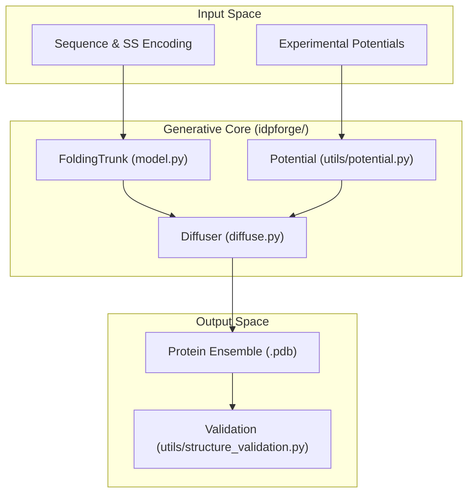
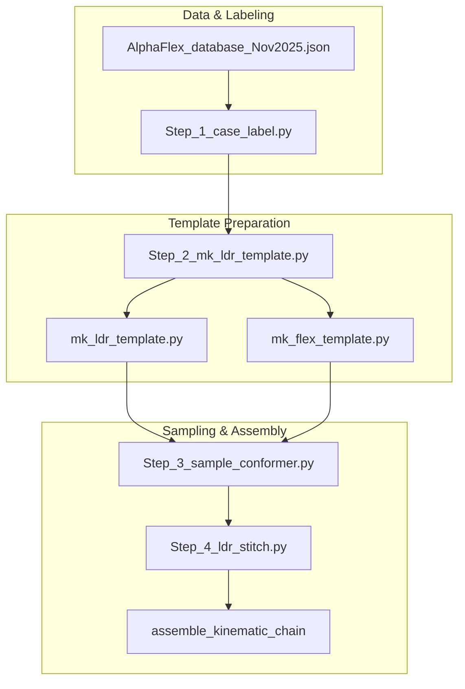

# IDPForge & AlphaFlex Overview

> **Relevant source files**
> * [AlphaFlex/Data_Inputs/knot_screening.json](https://github.com/THGLab/IDPForge/blob/a12c2846/AlphaFlex/Data_Inputs/knot_screening.json)
> * [AlphaFlex/README.md](https://github.com/THGLab/IDPForge/blob/a12c2846/AlphaFlex/README.md?plain=1)
> * [LICENSE](https://github.com/THGLab/IDPForge/blob/a12c2846/LICENSE)
> * [README.md](https://github.com/THGLab/IDPForge/blob/a12c2846/README.md?plain=1)
> * [configs/sample.yml](https://github.com/THGLab/IDPForge/blob/a12c2846/configs/sample.yml)
> * [data/sic1_pre_exp.txt](https://github.com/THGLab/IDPForge/blob/a12c2846/data/sic1_pre_exp.txt)
> * [environment.yml](https://github.com/THGLab/IDPForge/blob/a12c2846/environment.yml)
> * [esm/__init__.py](https://github.com/THGLab/IDPForge/blob/a12c2846/esm/__init__.py)
> * [setup.py](https://github.com/THGLab/IDPForge/blob/a12c2846/setup.py)

IDPForge is a generative transformer-based protein language diffusion model designed to create all-atom ensembles for Intrinsically Disordered Proteins (IDPs) and proteins containing Intrinsically Disordered Regions (IDRs). While traditional structural biology tools often struggle with the conformational heterogeneity of disordered proteins, IDPForge leverages ESM2-based embeddings and diffusion processes to sample valid structural ensembles that can be optionally guided by experimental data.

AlphaFlex (AFX-IDPForge) is an extension pipeline built upon IDPForge to handle large-scale ensemble generation for proteins with complex architectures, such as those containing multiple folded domains connected by disordered linkers.

### System Relation & Purpose

| System | Primary Purpose | Key Entities |
| --- | --- | --- |
| **IDPForge** | Core generative model and sampling engine. | `idpforge/model.py`, `idpforge/diffuse.py` |
| **AlphaFlex** | Orchestration pipeline for multi-domain/IDR proteins. | `Step_1_case_label.py` through `Step_4_ldr_stitch.py` |

Sources: [README.md L1-L4](https://github.com/THGLab/IDPForge/blob/a12c2846/README.md?plain=1#L1-L4)

 [AlphaFlex/README.md L1-L5](https://github.com/THGLab/IDPForge/blob/a12c2846/AlphaFlex/README.md?plain=1#L1-L5)

 [setup.py L5-L8](https://github.com/THGLab/IDPForge/blob/a12c2846/setup.py#L5-L8)

---

## Core Capabilities

IDPForge and AlphaFlex provide a comprehensive toolkit for IDP/IDR modeling:

* **Generative Diffusion:** Uses a diffusion framework to sample protein conformations in both Euclidean (backbone coordinates) and torsional (dihedral angles) space.
* **Experimental Guidance:** Incorporates gradient-based potentials during reverse diffusion to bias ensembles toward experimental observables such as Paramagnetic Relaxation Enhancement (PRE) or smFRET.
* **Folded Context Retention:** Specifically designed to model disordered regions while maintaining the structural integrity of pre-existing folded domains.
* **Topological Validation:** Includes a structural validation suite to ensure generated ensembles are free of knots (unless native) and physical violations.
* **Large-Scale Orchestration:** The AlphaFlex pipeline automates the classification, template preparation, sampling, and kinematic stitching of complex proteins.

Sources: [README.md L1-L4](https://github.com/THGLab/IDPForge/blob/a12c2846/README.md?plain=1#L1-L4)

 [configs/sample.yml L34-L40](https://github.com/THGLab/IDPForge/blob/a12c2846/configs/sample.yml#L34-L40)

 [AlphaFlex/README.md L49-L115](https://github.com/THGLab/IDPForge/blob/a12c2846/AlphaFlex/README.md?plain=1#L49-L115)

---

## High-Level Architecture

The system transitions from protein sequence and secondary structure definitions into a 3D coordinate space through a series of neural modules and diffusion steps.

### Conceptual Workflow: Natural Language to Code Entity Space

The following diagram maps the high-level scientific concepts to the specific code entities that implement them.

**Diagram: IDPForge Generative Flow**

Sources: [idpforge/model.py L1-L100](https://github.com/THGLab/IDPForge/blob/a12c2846/idpforge/model.py#L1-L100)

 [idpforge/diffuse.py L1-L50](https://github.com/THGLab/IDPForge/blob/a12c2846/idpforge/diffuse.py#L1-L50)

 [idpforge/utils/potential.py L1-L50](https://github.com/THGLab/IDPForge/blob/a12c2846/idpforge/utils/potential.py#L1-L50)

 [idpforge/utils/structure_validation.py L1-L50](https://github.com/THGLab/IDPForge/blob/a12c2846/idpforge/utils/structure_validation.py#L1-L50)

### AlphaFlex Pipeline Architecture

The AlphaFlex pipeline manages the lifecycle of generating ensembles for proteins with folded domains (templates) and disordered regions (IDRs).

**Diagram: AlphaFlex Multi-Step Pipeline**

Sources: [AlphaFlex/README.md L49-L115](https://github.com/THGLab/IDPForge/blob/a12c2846/AlphaFlex/README.md?plain=1#L49-L115)

 [AlphaFlex/config.py L1-L50](https://github.com/THGLab/IDPForge/blob/a12c2846/AlphaFlex/config.py#L1-L50)

---

## Detailed Documentation Sections

For in-depth technical information, please refer to the following child pages:

### 1.1 Getting StartedNaN-NaN

Covers the environment setup using `environment.yml`, the integration of `OpenFold` resources, and the primary configuration files (`sample.yml`, `train.yml`) used to control model hyperparameters and diffusion schedules.

* **Key Files:** `environment.yml`, `setup.py`, `configs/sample.yml`
* **Details:** [README.md L15-L97](https://github.com/THGLab/IDPForge/blob/a12c2846/README.md?plain=1#L15-L97)

### 1.2 Data Files & Example Data

Documents the required data structures for training and inference, including secondary structure encodings, IGSO3 diffusion caches, and experimental data formats (e.g., `sic1_pre_exp.txt`).

* **Key Files:** `data/example_data.pkl`, `data/sic1_pre_exp.txt`, `AlphaFlex/Data_Inputs/knot_screening.json`
* **Details:** [README.md L200-L205](https://github.com/THGLab/IDPForge/blob/a12c2846/README.md?plain=1#L200-L205)  [AlphaFlex/README.md L7-L16](https://github.com/THGLab/IDPForge/blob/a12c2846/AlphaFlex/README.md?plain=1#L7-L16)

---

*Note: This is a high-level parent page. For implementation details, loss functions, and specific model layers, see the [IDPForge Core Model Architecture](https://github.com/THGLab/IDPForge/blob/a12c2846/IDPForge Core Model Architecture)

 section.*