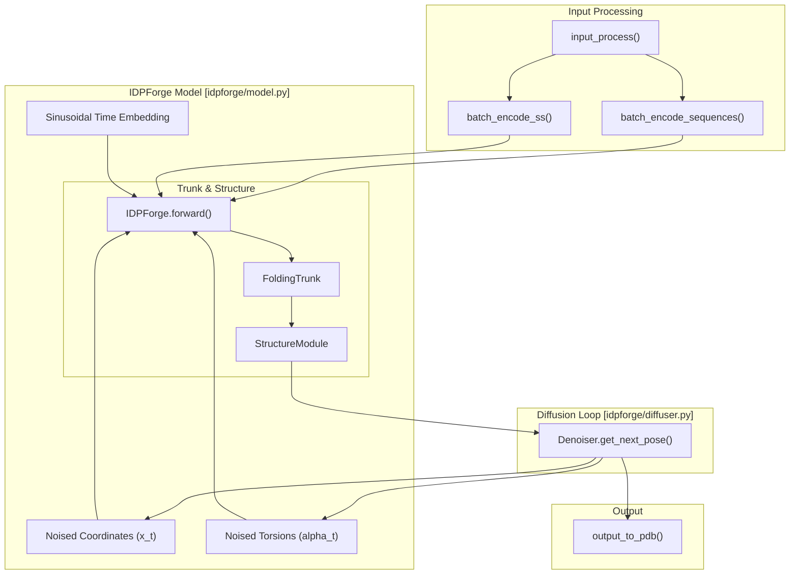
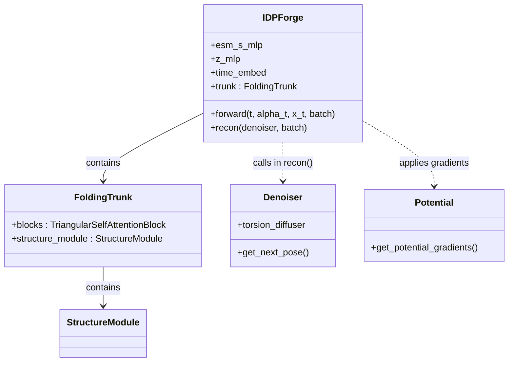

# IDPForge Core Model Architecture

> **Relevant source files**
> * [README.md](https://github.com/THGLab/IDPForge/blob/a12c2846/README.md?plain=1)
> * [configs/sample.yml](https://github.com/THGLab/IDPForge/blob/a12c2846/configs/sample.yml)
> * [idpforge/esm_wrapper.py](https://github.com/THGLab/IDPForge/blob/a12c2846/idpforge/esm_wrapper.py)
> * [idpforge/model.py](https://github.com/THGLab/IDPForge/blob/a12c2846/idpforge/model.py)

IDPForge is a transformer-based protein language diffusion model designed to generate all-atom ensembles of Intrinsically Disordered Proteins (IDPs) and Intrinsically Disordered Regions (IDRs) [README.md L1-L4](https://github.com/THGLab/IDPForge/blob/a12c2846/README.md?plain=1#L1-L4)

 The architecture integrates the structural reasoning capabilities of ESMFold with a diffusion framework to model the conformational flexibility inherent in disordered proteins.

### System Overview Diagram

The following diagram illustrates the high-level data flow between the core components of the IDPForge system.

**Sources:** [idpforge/model.py L36-L153](https://github.com/THGLab/IDPForge/blob/a12c2846/idpforge/model.py#L36-L153)

 [idpforge/misc.py L21](https://github.com/THGLab/IDPForge/blob/a12c2846/idpforge/misc.py#L21-L21)

 [README.md L1-L4](https://github.com/THGLab/IDPForge/blob/a12c2846/README.md?plain=1#L1-L4)

---

### Core Components

#### 1. Neural Network Architecture (Trunk & Structure Module)

The `IDPForge` class [idpforge/model.py L36-L38](https://github.com/THGLab/IDPForge/blob/a12c2846/idpforge/model.py#L36-L38)

 serves as the central neural network. It utilizes an ESM2-based `FoldingTrunk` [idpforge/model.py L69](https://github.com/THGLab/IDPForge/blob/a12c2846/idpforge/model.py#L69-L69)

 to process sequence and pairwise information. Unlike standard folding models, IDPForge incorporates:

* **Time Embeddings:** Sinusoidal embeddings that inform the model of the current diffusion step [idpforge/model.py L59-L61](https://github.com/THGLab/IDPForge/blob/a12c2846/idpforge/model.py#L59-L61)
* **Secondary Structure Encoding:** Explicit embeddings for secondary structure types (e.g., Helix, Sheet, Coil) to bias the ensemble generation [idpforge/model.py L67](https://github.com/THGLab/IDPForge/blob/a12c2846/idpforge/model.py#L67-L67)
* **IPA Structure Module:** An Invariant Point Attention (IPA) module that predicts 3D coordinates and torsion angles [configs/sample.yml L18-L30](https://github.com/THGLab/IDPForge/blob/a12c2846/configs/sample.yml#L18-L30)

For details, see [Model Architecture: Trunk, Structure Module & ESM Integration](/THGLab/IDPForge/2.1-model-architecture:-trunk-structure-module-and-esm-integration).

#### 2. Diffusion Process & IGSO3 Utilities

IDPForge treats protein conformation generation as a reverse diffusion task. The `Diffuser` and `Denoiser` classes manage the transition from high-entropy (noisy) states to structured ensembles.

* **Euclidean Diffusion:** Applied to backbone $C\alpha$ coordinates.
* **Torsional Diffusion:** Applied to protein backbone and sidechain dihedral angles using IGSO3 rotational distributions to maintain proper geometry [idpforge/model.py L194-L196](https://github.com/THGLab/IDPForge/blob/a12c2846/idpforge/model.py#L194-L196)

For details, see [Diffusion Process: Diffuser, Denoiser & IGSO3 Utilities](/THGLab/IDPForge/2.2-diffusion-process:-diffuser-denoiser-and-igso3-utilities).

#### 3. Input Processing & Secondary Structure Assignment

Before reaching the model, raw protein sequences and secondary structure strings are transformed into tensors via `input_process()` [idpforge/model.py L21](https://github.com/THGLab/IDPForge/blob/a12c2846/idpforge/model.py#L21-L21)

 This stage handles:

* **Ramachandran Assignment:** Converting $(\phi, \psi)$ angles into discrete secondary structure labels using `assign_rama`.
* **Chimeric Handling:** Managing residue index offsets for IDRs grafted onto folded domains.

For details, see [Input Processing & Secondary Structure Encoding](/THGLab/IDPForge/2.3-input-processing-and-secondary-structure-encoding).

#### 4. Experimental Guidance Potentials

During the reverse diffusion sampling loop (`recon`), the model can be guided by experimental data [idpforge/model.py L190-L192](https://github.com/THGLab/IDPForge/blob/a12c2846/idpforge/model.py#L190-L192)

 The `Potential` system allows the integration of:

* **Radius of Gyration (RoG):** Compacting or expanding the ensemble.
* **PRE/FRET:** Distance restraints derived from Paramagnetic Relaxation Enhancement or Förster Resonance Energy Transfer.
* **J-Couplings:** NMR-derived local geometry restraints.

For details, see [Experimental Guidance Potentials](/THGLab/IDPForge/2.4-experimental-guidance-potentials).

---

### Architecture-Code Mapping

This diagram maps specific codebase entities to their functional roles within the architecture.

**Sources:** [idpforge/model.py L36-L70](https://github.com/THGLab/IDPForge/blob/a12c2846/idpforge/model.py#L36-L70)

 [idpforge/model.py L156-L196](https://github.com/THGLab/IDPForge/blob/a12c2846/idpforge/model.py#L156-L196)

 [configs/sample.yml L1-L33](https://github.com/THGLab/IDPForge/blob/a12c2846/configs/sample.yml#L1-L33)

### Summary Table: Core Parameters

| Component | Key Class/Function | Config Section | Purpose |
| --- | --- | --- | --- |
| **Trunk** | `FoldingTrunk` | `model.trunk` | Processes sequence/pairwise states [idpforge/model.py L69](https://github.com/THGLab/IDPForge/blob/a12c2846/idpforge/model.py#L69-L69) |
| **IPA** | `StructureModule` | `model.trunk.structure_module` | Predicts 3D frames and angles [configs/sample.yml L18](https://github.com/THGLab/IDPForge/blob/a12c2846/configs/sample.yml#L18-L18) |
| **Diffusion** | `Denoiser` | `diffuse` | Handles noise schedules and sampling [idpforge/model.py L194](https://github.com/THGLab/IDPForge/blob/a12c2846/idpforge/model.py#L194-L194) |
| **Input** | `input_process` | N/A | Tensorizes sequence and SS data [idpforge/model.py L21](https://github.com/THGLab/IDPForge/blob/a12c2846/idpforge/model.py#L21-L21) |
| **Guidance** | `Potential` | `potential_cfg` | Injects experimental constraints [idpforge/model.py L190](https://github.com/THGLab/IDPForge/blob/a12c2846/idpforge/model.py#L190-L190) |

**Sources:** [idpforge/model.py L21-L70](https://github.com/THGLab/IDPForge/blob/a12c2846/idpforge/model.py#L21-L70)

 [configs/sample.yml L1-L50](https://github.com/THGLab/IDPForge/blob/a12c2846/configs/sample.yml#L1-L50)