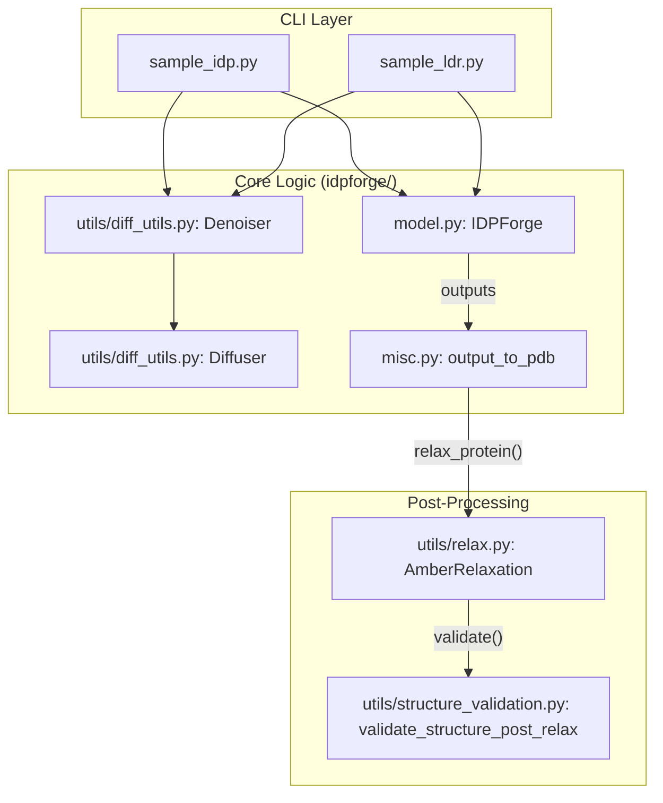
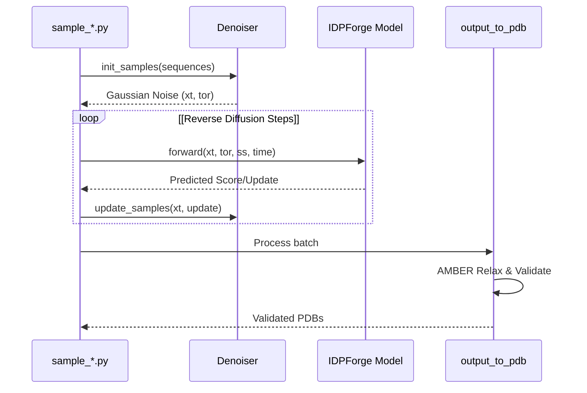

# Inference: Generating Protein Ensembles

> **Relevant source files**
> - [idpforge/misc\.py](https://github.com/THGLab/IDPForge/blob/a12c2846/idpforge/misc.py)
> - [sample\_idp\.py](https://github.com/THGLab/IDPForge/blob/a12c2846/sample_idp.py)
> - [sample\_ldr\.py](https://github.com/THGLab/IDPForge/blob/a12c2846/sample_ldr.py)

 Inference in IDPForge is the process of generating structural ensembles for intrinsically disordered proteins \(IDPs\) or intrinsically disordered regions \(IDRs\) within a folded context\. The system uses a reverse diffusion process guided by secondary structure predictions and optional experimental constraints\.

 The inference pipeline is split into two primary entry points: `sample_idp.py` for standalone disordered sequences and `sample_ldr.py` for disordered regions connected to static folded domains\. Both scripts utilize the `IDPForge` model and the `Denoiser`/`Diffuser` framework to iteratively refine protein coordinates from noise\.

### Inference Architecture Overview

 The following diagram illustrates the relationship between the high\-level inference scripts and the underlying code entities that drive the sampling process\.

 **Sampling System Bridge**

 **Sources:** [sample\_idp\.py L16-L21](https://github.com/THGLab/IDPForge/blob/a12c2846/sample_idp.py#L16-L21) [sample\_ldr\.py L19-L23](https://github.com/THGLab/IDPForge/blob/a12c2846/sample_ldr.py#L19-L23) [misc\.py L119-L135](https://github.com/THGLab/IDPForge/blob/a12c2846/idpforge/misc.py#L119-L135)

---

### Sampling Modes

#### 1\. Full IDP Sampling

 This mode is used when the entire protein sequence is considered disordered\. The `sample_idp.py` script takes a raw amino acid sequence and generates an ensemble by sampling secondary structure configurations from a database and diffusing coordinates in a global Euclidean space\.

 For details on CLI arguments, secondary structure lookup, and potential\-guided sampling, see **[Sampling Full IDPs \(sample\_idp\.py\)](https://deepwiki.com/THGLab/IDPForge/4.1-sampling-full-idps-(sample_idp.py))**\.

 **Sources:** [sample\_idp\.py L27-L29](https://github.com/THGLab/IDPForge/blob/a12c2846/sample_idp.py#L27-L29) [sample\_idp\.py L88-L104](https://github.com/THGLab/IDPForge/blob/a12c2846/sample_idp.py#L88-L104)

#### 2\. IDRs in Folded Context \(LDR\)

 The "Local Disordered Region" \(LDR\) mode is designed for chimeric proteins where one or more IDRs are grafted onto a folded template \(e\.g\., AlphaFold2 predicted domains\)\. The `sample_ldr.py` script uses a `.npz` template to define fixed coordinates and masks, ensuring the generated IDRs are physically consistent with the folded domains\.

 For details on template tiling, junction gates, and bfloat16 inference, see **[Sampling IDRs in Folded Context \(sample\_ldr\.py\)](https://deepwiki.com/THGLab/IDPForge/4.2-sampling-idrs-in-folded-context-(sample_ldr.py))**\.

 **Sources:** [sample\_ldr\.py L30-L37](https://github.com/THGLab/IDPForge/blob/a12c2846/sample_ldr.py#L30-L37) [sample\_ldr\.py L72-L75](https://github.com/THGLab/IDPForge/blob/a12c2846/sample_ldr.py#L72-L75)

---

### The Sampling Lifecycle

 Regardless of the mode, the generation process follows a standardized lifecycle managed by the `Denoiser` class [diff\_utils\.py L47](https://github.com/THGLab/IDPForge/blob/a12c2846/idpforge/utils/diff_utils.py#L47-L47)

 **Inference Data Flow**

 **Sources:** [sample\_idp\.py L141-L169](https://github.com/THGLab/IDPForge/blob/a12c2846/sample_idp.py#L141-L169) [sample\_ldr\.py L170-L200](https://github.com/THGLab/IDPForge/blob/a12c2846/sample_ldr.py#L170-L200) [misc\.py L119-L135](https://github.com/THGLab/IDPForge/blob/a12c2846/idpforge/misc.py#L119-L135)

---

### Key Components

| Component | Code Entity | Description |
| --- | --- | --- |
| Denoiser | Denoiser idpforge/utils/diff\_utils\.py47 | Manages the inference schedule and iterative updates of $x\_t$\. |
| SS Encoding | batch\_encode\_ss idpforge/misc\.py75 | Converts string\-based secondary structure \(H, E, C\) into model tokens\. |
| Output Handler | output\_to\_pdb idpforge/misc\.py119 | Orchestrates the transition from raw model tensors to relaxed PDB files\. |
| Template Prep | mk\_ldr\_template\.py | Utility to create the \.npz files required for LDR sampling\. |

---

### Post\-Generation Pipeline

 Generated conformers are not immediately saved as final results\. They must pass through a rigorous quality control pipeline to ensure biological relevance:

 1. **Backbone Continuity Check:** A pre\-relaxation filter that ensures $C\\alpha\-C\\alpha$ distances are within physical limits [misc\.py L198-L201](https://github.com/THGLab/IDPForge/blob/a12c2846/idpforge/misc.py#L198-L201)
2. **AMBER Relaxation:** The `relax_protein` function uses OpenMM to resolve steric clashes while maintaining the model's predicted topology [misc\.py L122](https://github.com/THGLab/IDPForge/blob/a12c2846/idpforge/misc.py#L122-L122)
3. **Structural Validation:** A final suite of checks for chirality, bond lengths, and knotting [misc\.py L132](https://github.com/THGLab/IDPForge/blob/a12c2846/idpforge/misc.py#L132-L132)

 For details on the relaxation and validation logic, see **[Post\-Generation Processing: Relaxation, Repair & Validation](https://deepwiki.com/THGLab/IDPForge/4.4-post-generation-processing:-relaxation-repair-and-validation)**\.

 **Sources:** [misc\.py L136-L160](https://github.com/THGLab/IDPForge/blob/a12c2846/idpforge/misc.py#L136-L160) [sample\_ldr\.py L100-L108](https://github.com/THGLab/IDPForge/blob/a12c2846/sample_ldr.py#L100-L108)

---

### Child Pages

 - **[Sampling Full IDPs \(sample\_idp\.py\)](https://deepwiki.com/THGLab/IDPForge/4.1-sampling-full-idps-(sample_idp.py))**: Standalone IDP generation and experimental guidance\.
- **[Sampling IDRs in Folded Context \(sample\_ldr\.py\)](https://deepwiki.com/THGLab/IDPForge/4.2-sampling-idrs-in-folded-context-(sample_ldr.py))**: Template\-based sampling for chimeric proteins\.
- **[Template Preparation Utilities](https://deepwiki.com/THGLab/IDPForge/4.3-template-preparation-utilities)**: Creating `.npz` templates from PDB structures\.
- **[Post\-Generation Processing: Relaxation, Repair & Validation](https://deepwiki.com/THGLab/IDPForge/4.4-post-generation-processing:-relaxation-repair-and-validation)**: The AMBER and validation quality gate\.
