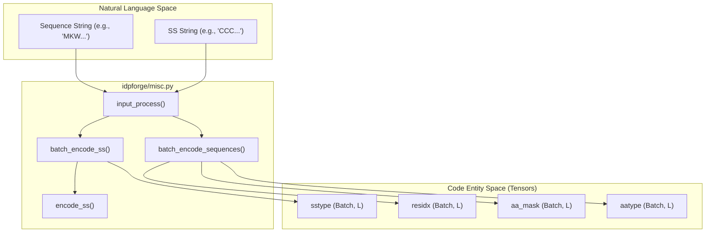
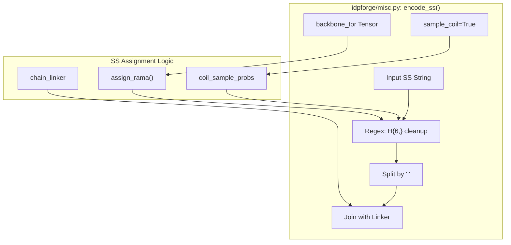

# Input Processing & Secondary Structure Encoding

> **Relevant source files**
> * [idpforge/misc.py](https://github.com/THGLab/IDPForge/blob/a12c2846/idpforge/misc.py)
> * [idpforge/utils/np_utils.py](https://github.com/THGLab/IDPForge/blob/a12c2846/idpforge/utils/np_utils.py)
> * [idpforge/utils/prep_sec.py](https://github.com/THGLab/IDPForge/blob/a12c2846/idpforge/utils/prep_sec.py)
> * [idpforge/utils/tensor_utils.py](https://github.com/THGLab/IDPForge/blob/a12c2846/idpforge/utils/tensor_utils.py)

This page details the mechanisms within IDPForge for processing protein sequences and secondary structure (SS) information into a format suitable for the neural network. It covers the conversion of natural language sequence strings and SS labels into numerical tensors, the assignment of secondary structure from Cartesian coordinates using Ramachandran space, and the handling of chimeric proteins through linker insertion and residue index offsets.

### Core Input Pipeline

The primary entry point for preparing model inputs is `input_process`, which orchestrates the encoding of both amino acid sequences and secondary structure strings.

#### input_process()

The `input_process` function [idpforge/misc.py L99-L116](https://github.com/THGLab/IDPForge/blob/a12c2846/idpforge/misc.py#L99-L116)

 performs the following operations:

1. **Sequence Encoding**: Calls `batch_encode_sequences` (inherited from ESMFold) to convert amino acid strings into `aatype` tensors.
2. **SS Encoding**: Calls `batch_encode_ss` to convert secondary structure strings into `sstype` tensors.
3. **Validation**: Ensures that the sequence mask and secondary structure mask are identical [idpforge/misc.py L110](https://github.com/THGLab/IDPForge/blob/a12c2846/idpforge/misc.py#L110-L110)
4. **Index Management**: Handles residue indexing, applying `residue_index_offset` (default 512) to distinguish non-contiguous chains or domains [idpforge/misc.py L104-L105](https://github.com/THGLab/IDPForge/blob/a12c2846/idpforge/misc.py#L104-L105)

#### Data Flow: Natural Language to Code Entities

The following diagram illustrates how raw input data is transformed into the tensor representations used by the `FoldingTrunk`.

**Input Processing Data Flow**

Sources: [idpforge/misc.py L75-L116](https://github.com/THGLab/IDPForge/blob/a12c2846/idpforge/misc.py#L75-L116)

---

### Secondary Structure Encoding Logic

Secondary structure is represented using a specific vocabulary defined in `sstype_order` [idpforge/utils/definitions.py L24-L27](https://github.com/THGLab/IDPForge/blob/a12c2846/idpforge/utils/definitions.py#L24-L27)

 The `encode_ss` function is responsible for the fine-grained logic of mapping these characters to integers.

#### Ramachandran-based Assignment

When backbone torsion angles are provided (e.g., during training or from a template), the system can dynamically assign secondary structure labels using `assign_rama` [idpforge/misc.py L61-L63](https://github.com/THGLab/IDPForge/blob/a12c2846/idpforge/misc.py#L61-L63)

The `assign_rama` function [idpforge/utils/np_utils.py L16-L32](https://github.com/THGLab/IDPForge/blob/a12c2846/idpforge/utils/np_utils.py#L16-L32)

 classifies residues based on $(\phi, \psi)$ regions:

* **A (Alpha)**: $-120^\circ < \phi < -20^\circ$ and $-100^\circ < \psi < 60^\circ$.
* **B (Beta)**: Extended regions ($-180^\circ$ to $-100^\circ$ or $150^\circ$ to $180^\circ$ for $\phi$).
* **L (Left-handed Alpha)**: $30^\circ < \phi < 100^\circ$ and $-50^\circ < \psi < 100^\circ$.
* **P (Polyproline II)**: Specifically defined region for PPII-like coils.
* **C (Coil)**: Default for any residue not falling into the above categories.

#### Coil Sampling

For disordered regions where specific SS is unknown, `encode_ss` can randomly sample coil subtypes (C, P, L) based on `coil_sample_probs` [idpforge/misc.py L64-L67](https://github.com/THGLab/IDPForge/blob/a12c2846/idpforge/misc.py#L64-L67)

 This introduces structural diversity in the ensemble generation for IDRs.

**Secondary Structure Logic Mapping**

Sources: [idpforge/misc.py L55-L73](https://github.com/THGLab/IDPForge/blob/a12c2846/idpforge/misc.py#L55-L73)

 [idpforge/utils/np_utils.py L16-L32](https://github.com/THGLab/IDPForge/blob/a12c2846/idpforge/utils/np_utils.py#L16-L32)

---

### Chimeric Proteins & Linkers

IDPForge supports multi-chain or multi-domain proteins by inserting artificial linkers and manipulating residue indices to prevent the model from assuming physical connectivity where none exists.

| Feature | Implementation | Description |
| --- | --- | --- |
| **Chain Linker** | `chain_linker` | A sequence of "G" (for AA) or "C" (for SS), typically 25 residues long, inserted between chains split by ":" [idpforge/misc.py L72-L105](https://github.com/THGLab/IDPForge/blob/a12c2846/idpforge/misc.py#L72-L105) |
| **Index Offset** | `residue_index_offset` | A large integer (default 512) added to the residue index between chains to ensure the `TriangularSelfAttentionBlock` treats them as distant [idpforge/misc.py L104-L107](https://github.com/THGLab/IDPForge/blob/a12c2846/idpforge/misc.py#L104-L107) |
| **Linker Masking** | `linker_mask` | A boolean mask identifying residues that are part of the artificial linker, used to exclude them from loss calculations or final outputs [idpforge/misc.py L106-L116](https://github.com/THGLab/IDPForge/blob/a12c2846/idpforge/misc.py#L106-L116) |

Sources: [idpforge/misc.py L99-L116](https://github.com/THGLab/IDPForge/blob/a12c2846/idpforge/misc.py#L99-L116)

---

### SS Database Fetching

For inference on sequences without known SS, `idpforge/utils/prep_sec.py` provides utilities to fetch SS fragments from a database based on sequence homology.

1. **Fragment Parsing**: `parse_df` breaks down a database of known sequence-SS pairs into $k$-mer fragments [idpforge/utils/prep_sec.py L5-L28](https://github.com/THGLab/IDPForge/blob/a12c2846/idpforge/utils/prep_sec.py#L5-L28)
2. **Stochastic Sampling**: `fetch_sec_from_seq` reconstructs a complete SS string by randomly selecting $k$-mer fragments (1-5 residues) based on their occurrence probabilities in the database [idpforge/utils/prep_sec.py L30-L62](https://github.com/THGLab/IDPForge/blob/a12c2846/idpforge/utils/prep_sec.py#L30-L62)

This mechanism allows the generator to sample realistic secondary structure propensities for intrinsically disordered proteins (IDPs) during the `sample_idp.py` workflow.

Sources: [idpforge/utils/prep_sec.py L30-L62](https://github.com/THGLab/IDPForge/blob/a12c2846/idpforge/utils/prep_sec.py#L30-L62)

 [idpforge/utils/np_utils.py L104-L150](https://github.com/THGLab/IDPForge/blob/a12c2846/idpforge/utils/np_utils.py#L104-L150)