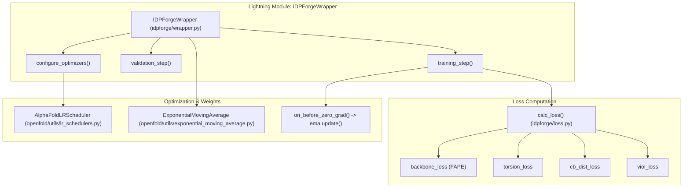
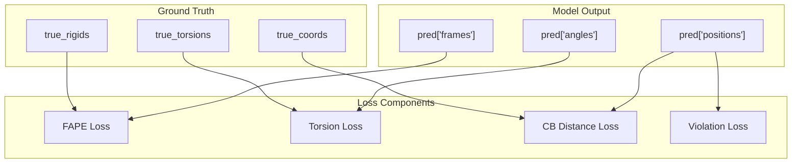

# Loss Functions & Training Wrapper

> **Relevant source files**
> * [idpforge/loss.py](https://github.com/THGLab/IDPForge/blob/a12c2846/idpforge/loss.py)
> * [idpforge/utils/validation_metrics.py](https://github.com/THGLab/IDPForge/blob/a12c2846/idpforge/utils/validation_metrics.py)
> * [idpforge/wrapper.py](https://github.com/THGLab/IDPForge/blob/a12c2846/idpforge/wrapper.py)

This page details the training infrastructure of IDPForge, centered around the `IDPForgeWrapper` PyTorch Lightning module. It covers the loss computation logic, optimization strategies, and validation metrics used to train the model for intrinsically disordered protein (IDP) ensemble generation.

## Training Wrapper Architecture

The `IDPForgeWrapper` encapsulates the `IDPForge` model, the diffusion process, and the optimization logic. It manages training and validation steps, weight averaging via EMA, and learning rate scheduling.

### Entity Mapping: Training Logic to Code

The following diagram maps high-level training concepts to their corresponding classes and functions in the codebase.

**Training Wrapper Overview**

**Sources:** [idpforge/wrapper.py L17-L36](https://github.com/THGLab/IDPForge/blob/a12c2846/idpforge/wrapper.py#L17-L36)

 [idpforge/wrapper.py L133-L135](https://github.com/THGLab/IDPForge/blob/a12c2846/idpforge/wrapper.py#L133-L135)

 [idpforge/loss.py L42-L90](https://github.com/THGLab/IDPForge/blob/a12c2846/idpforge/loss.py#L42-L90)

### Key Components

* **Self-Conditioning:** During training, the model optionally uses its own predictions from a previous diffusion step as input for the current step. This is implemented in `training_step` with a 50% probability [idpforge/wrapper.py L64-L71](https://github.com/THGLab/IDPForge/blob/a12c2846/idpforge/wrapper.py#L64-L71)
* **EMA Weight Management:** The wrapper maintains an Exponential Moving Average (EMA) of the model weights. During validation, it caches the current training weights, loads the EMA weights, and restores the training weights once the validation epoch ends [idpforge/wrapper.py L86-L91](https://github.com/THGLab/IDPForge/blob/a12c2846/idpforge/wrapper.py#L86-L91)  [idpforge/wrapper.py L128-L131](https://github.com/THGLab/IDPForge/blob/a12c2846/idpforge/wrapper.py#L128-L131)
* **Learning Rate Scheduler:** It utilizes the `AlphaFoldLRScheduler`, which implements a linear warmup followed by a decay phase, specifically tuned for protein folding models [idpforge/wrapper.py L152-L153](https://github.com/THGLab/IDPForge/blob/a12c2846/idpforge/wrapper.py#L152-L153)

---

## Loss Functions

The `calc_loss` function aggregates several structural and geometric loss components. The total loss is a weighted sum of these components as defined in the training configuration [idpforge/loss.py L88-L89](https://github.com/THGLab/IDPForge/blob/a12c2846/idpforge/loss.py#L88-L89)

### Loss Component Breakdown

| Loss Component | Function / Source | Description |
| --- | --- | --- |
| **FAPE** | `backbone_loss` & `sidechain_fape` | Frame Aligned Point Error for backbone and sidechain frames [idpforge/loss.py L54-L68](https://github.com/THGLab/IDPForge/blob/a12c2846/idpforge/loss.py#L54-L68) |
| **Torsion** | `torsion_loss` | Mean absolute error of predicted torsion angles (backbone and $\chi$) [idpforge/loss.py L44-L52](https://github.com/THGLab/IDPForge/blob/a12c2846/idpforge/loss.py#L44-L52)    [idpforge/loss.py L159-L166](https://github.com/THGLab/IDPForge/blob/a12c2846/idpforge/loss.py#L159-L166) |
| **CB Distance** | `cb_dist_loss` | Penalizes deviations in $C\beta-C\beta$ distances, with specific logic for secondary structure types [idpforge/loss.py L124-L146](https://github.com/THGLab/IDPForge/blob/a12c2846/idpforge/loss.py#L124-L146) |
| **Violation** | `viol_loss` | Penalizes steric clashes and bond length/angle violations using OpenFold utilities [idpforge/loss.py L82-L86](https://github.com/THGLab/IDPForge/blob/a12c2846/idpforge/loss.py#L82-L86) |
| **CA Connectivity** | `ca_connectivity_loss` | Ensures physical continuity of the peptide chain by penalizing $C\alpha-C\alpha$ distance deviations [idpforge/loss.py L135-L136](https://github.com/THGLab/IDPForge/blob/a12c2846/idpforge/loss.py#L135-L136) |

### Data Flow: Loss Computation

The diagram below illustrates how predicted coordinates and frames are processed through various loss functions.

**Loss Data Flow**

**Sources:** [idpforge/loss.py L42-L87](https://github.com/THGLab/IDPForge/blob/a12c2846/idpforge/loss.py#L42-L87)

 [idpforge/loss.py L124-L146](https://github.com/THGLab/IDPForge/blob/a12c2846/idpforge/loss.py#L124-L146)

### Specialized IDP Losses

* **Secondary Structure Aware Distance Loss:** In `cb_dist_loss`, the model applies different penalties based on the secondary structure type (`sstype`). For residues predicted as coils, it clamps the error to allow for the inherent flexibility of IDPs, while applying stricter penalties to regions assigned to structured states [idpforge/loss.py L138-L145](https://github.com/THGLab/IDPForge/blob/a12c2846/idpforge/loss.py#L138-L145)
* **CA Connectivity:** A specific term is added to the distance loss to reinforce the 3.8Å $C\alpha-C\alpha$ distance, preventing "breaks" in the generated chain [idpforge/loss.py L135-L136](https://github.com/THGLab/IDPForge/blob/a12c2846/idpforge/loss.py#L135-L136)

---

## Validation & Metrics

Validation is performed using the `recon` method of the model, which performs a reconstruction from noise [idpforge/wrapper.py L93](https://github.com/THGLab/IDPForge/blob/a12c2846/idpforge/wrapper.py#L93-L93)

### Validation Metrics

1. **dRMSD:** Calculates the distance root-mean-square deviation of $C\alpha$ atoms [idpforge/wrapper.py L102-L103](https://github.com/THGLab/IDPForge/blob/a12c2846/idpforge/wrapper.py#L102-L103)
2. **Structural Violations:** Monitors the physical plausibility of the generated ensembles [idpforge/wrapper.py L104-L105](https://github.com/THGLab/IDPForge/blob/a12c2846/idpforge/wrapper.py#L104-L105)
3. **Rg Distribution (`rg_error`):** A critical metric for IDPs. It computes the divergence between the predicted and true Radius of Gyration ($R_g$) distributions. * **Logic:** The `rg_dist_per_group` function groups conformers by sequence identity and compares the mean $R_g$ of the predicted ensemble against the ground truth [idpforge/utils/validation_metrics.py L32-L53](https://github.com/THGLab/IDPForge/blob/a12c2846/idpforge/utils/validation_metrics.py#L32-L53)

### Metric Implementations

| Metric | Code Reference |
| --- | --- |
| **Radius of Gyration** | `calc_rg_with_mask` [idpforge/utils/validation_metrics.py L4-L29](https://github.com/THGLab/IDPForge/blob/a12c2846/idpforge/utils/validation_metrics.py#L4-L29) |
| **Grouped Rg Error** | `rg_dist_per_group` [idpforge/utils/validation_metrics.py L32-L53](https://github.com/THGLab/IDPForge/blob/a12c2846/idpforge/utils/validation_metrics.py#L32-L53) |
| **Violation Metric** | `viol_loss(..., return_metric=True)` [idpforge/wrapper.py L104](https://github.com/THGLab/IDPForge/blob/a12c2846/idpforge/wrapper.py#L104-L104) |

**Sources:** [idpforge/wrapper.py L96-L123](https://github.com/THGLab/IDPForge/blob/a12c2846/idpforge/wrapper.py#L96-L123)

 [idpforge/utils/validation_metrics.py L1-L53](https://github.com/THGLab/IDPForge/blob/a12c2846/idpforge/utils/validation_metrics.py#L1-L53)