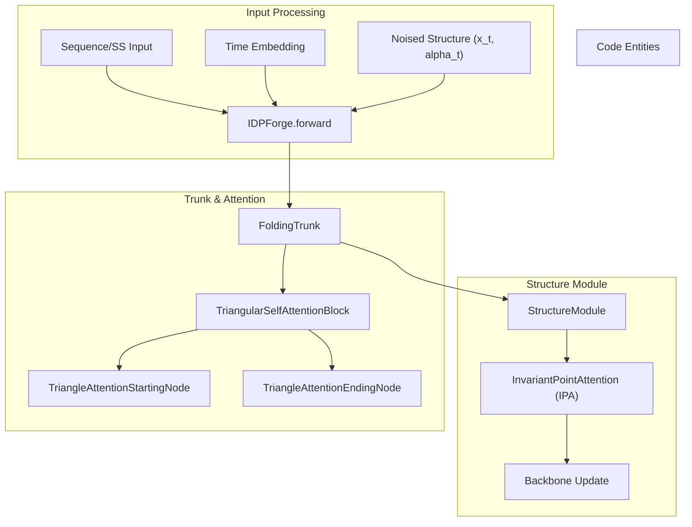
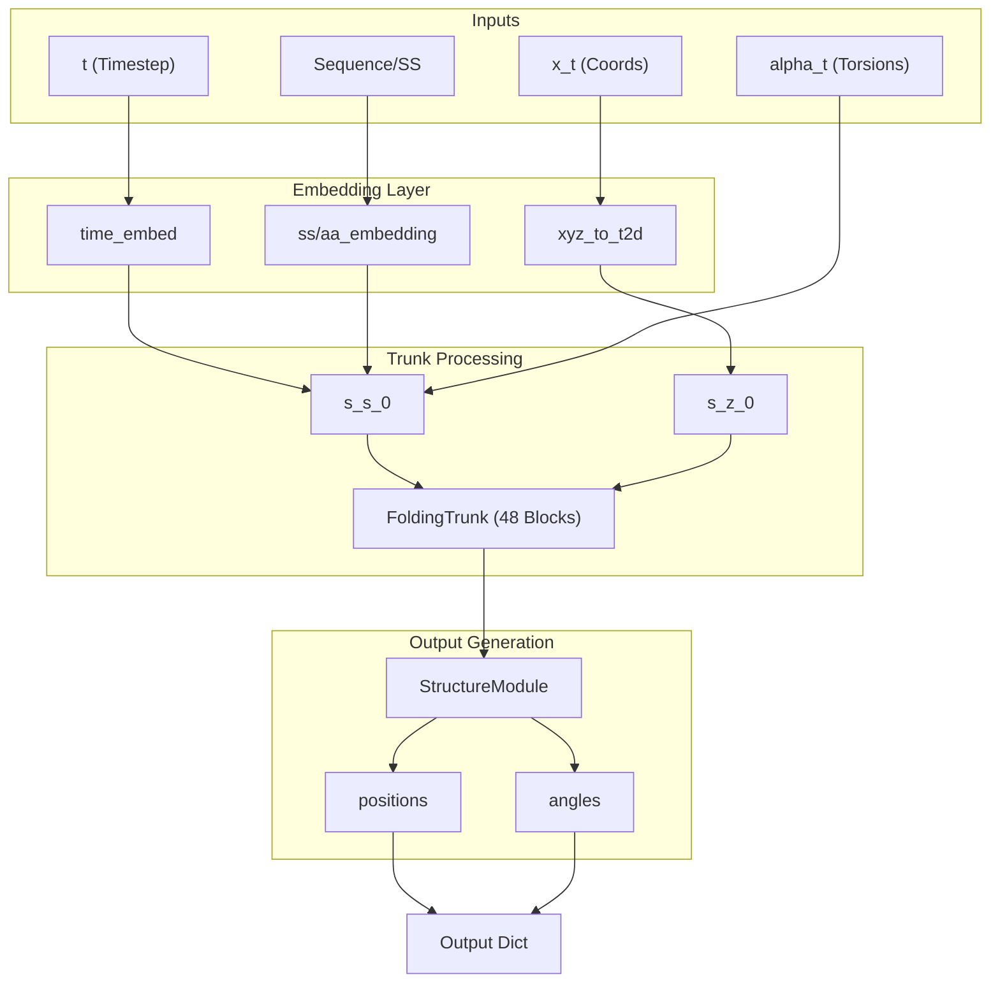

# Model Architecture: Trunk, Structure Module & ESM Integration

> **Relevant source files**
> - [esm/axial\_attention\.py](https://github.com/THGLab/IDPForge/blob/a12c2846/esm/axial_attention.py)
> - [esm/esm2\.py](https://github.com/THGLab/IDPForge/blob/a12c2846/esm/esm2.py)
> - [esm/esmfold/categorical\_mixture\.py](https://github.com/THGLab/IDPForge/blob/a12c2846/esm/esmfold/categorical_mixture.py)
> - [esm/esmfold/misc\.py](https://github.com/THGLab/IDPForge/blob/a12c2846/esm/esmfold/misc.py)
> - [esm/esmfold/tri\_self\_attn\_block\.py](https://github.com/THGLab/IDPForge/blob/a12c2846/esm/esmfold/tri_self_attn_block.py)
> - [esm/esmfold/trunk\.py](https://github.com/THGLab/IDPForge/blob/a12c2846/esm/esmfold/trunk.py)
> - [esm/modules\.py](https://github.com/THGLab/IDPForge/blob/a12c2846/esm/modules.py)
> - [esm/multihead\_attention\.py](https://github.com/THGLab/IDPForge/blob/a12c2846/esm/multihead_attention.py)
> - [esm/rotary\_embedding\.py](https://github.com/THGLab/IDPForge/blob/a12c2846/esm/rotary_embedding.py)
> - [idpforge/esm\_wrapper\.py](https://github.com/THGLab/IDPForge/blob/a12c2846/idpforge/esm_wrapper.py)
> - [idpforge/model\.py](https://github.com/THGLab/IDPForge/blob/a12c2846/idpforge/model.py)

 The IDPForge model is a deep neural network designed for the generation of intrinsically disordered protein \(IDP\) ensembles\. It leverages a modified version of the **ESMFold** architecture, integrating a diffusion\-based approach to structural prediction\. The model combines large\-scale protein language model \(ESM\-2\) embeddings with a geometry\-aware folding trunk and an Invariant Point Attention \(IPA\) structure module\.

## Core Architecture Overview

 The model, defined in `IDPForge` [model\.py L36-L69](https://github.com/THGLab/IDPForge/blob/a12c2846/idpforge/model.py#L36-L69) processes sequence, secondary structure, and noised structural features through a series of specialized modules to predict denoised backbone coordinates and torsion angles\.

### System Mapping: Conceptual to Code

 The following diagram bridges high\-level architectural components to their specific implementations within the `idpforge` and `esm` namespaces\.

 **Diagram: IDPForge Entity Mapping**



 **Sources:** [model\.py L36-L70](https://github.com/THGLab/IDPForge/blob/a12c2846/idpforge/model.py#L36-L70) [trunk\.py L113-L150](https://github.com/THGLab/IDPForge/blob/a12c2846/esm/esmfold/trunk.py#L113-L150) [tri\_self\_attn\_block\.py L26-L106](https://github.com/THGLab/IDPForge/blob/a12c2846/esm/esmfold/tri_self_attn_block.py#L26-L106)

---

## Input Embeddings & Feature Fusion

 The `forward` pass [model\.py L79-L153](https://github.com/THGLab/IDPForge/blob/a12c2846/idpforge/model.py#L79-L153) begins by fusing multiple information streams into a single\-representation state \($s$\) and a pairwise\-representation state \($z$\)\.

### 1\. Sinusoidal Time Embedding

 To inform the network of the current diffusion progress, the timestep $t$ is converted into a vector using a fixed sinusoidal embedding [model\.py L59-L61](https://github.com/THGLab/IDPForge/blob/a12c2846/idpforge/model.py#L59-L61) This embedding is concatenated with the noised torsion features `alpha_t` [model\.py L110-L111](https://github.com/THGLab/IDPForge/blob/a12c2846/idpforge/model.py#L110-L111)

### 2\. Sequence and Secondary Structure \(SS\) Encodings

 IDPForge extends the standard ESMFold input by explicitly embedding secondary structure labels\.

 - **AA Embedding:** Encodes the primary sequence [model\.py L68](https://github.com/THGLab/IDPForge/blob/a12c2846/idpforge/model.py#L68-L68)
- **SS Embedding:** Encodes 3\-state or 8\-state secondary structure definitions [model\.py L67](https://github.com/THGLab/IDPForge/blob/a12c2846/idpforge/model.py#L67-L67)
- **Feature Fusion:** The time\-torsion vector is projected via `esm_s_mlp` and summed with the AA and SS embeddings to form the initial sequence state `s_s_0` [model\.py L112-L114](https://github.com/THGLab/IDPForge/blob/a12c2846/idpforge/model.py#L112-L114)

### 3\. Geometry Encoding \(xyz\_to\_t2d\)

 The noised Cartesian coordinates $x\_t$ are converted into pairwise distances and orientations using `xyz_to_t2d` [model\.py L118-L119](https://github.com/THGLab/IDPForge/blob/a12c2846/idpforge/model.py#L118-L119) This geometric information is projected via `z_mlp` to form the initial pairwise state `s_z_0` [model\.py L51-L56](https://github.com/THGLab/IDPForge/blob/a12c2846/idpforge/model.py#L51-L56)

 **Sources:** [model\.py L51-L68](https://github.com/THGLab/IDPForge/blob/a12c2846/idpforge/model.py#L51-L68) [model\.py L110-L120](https://github.com/THGLab/IDPForge/blob/a12c2846/idpforge/model.py#L110-L120)

---

## The Folding Trunk

 The `FoldingTrunk` [trunk\.py L113](https://github.com/THGLab/IDPForge/blob/a12c2846/esm/esmfold/trunk.py#L113-L113) is the computational engine of the model, consisting of 48 blocks \(by default\) of `TriangularSelfAttentionBlock`\.

### Triangular Self\-Attention Block

 Each block updates the sequence and pairwise states through a series of specialized attention mechanisms:

 1. **Sequence\-to\-Pair Communication:** Sequence information is projected into the pairwise space [tri\_self\_attn\_block\.py L142](https://github.com/THGLab/IDPForge/blob/a12c2846/esm/esmfold/tri_self_attn_block.py#L142-L142)
2. **Pair\-to\-Sequence Communication:** Pairwise features act as a bias for sequence self\-attention [tri\_self\_attn\_block\.py L133-L137](https://github.com/THGLab/IDPForge/blob/a12c2846/esm/esmfold/tri_self_attn_block.py#L133-L137)
3. **Triangular Multiplicative Updates:** Updates edges $\(i, j\)$ based on triangles $\(i, j, k\)$ using incoming and outgoing edges [tri\_self\_attn\_block\.py L146-L151](https://github.com/THGLab/IDPForge/blob/a12c2846/esm/esmfold/tri_self_attn_block.py#L146-L151)
4. **Triangular Attention:** Attention mechanisms that respect the triangle inequality, operating on rows \(`TriangleAttentionStartingNode`\) and columns \(`TriangleAttentionEndingNode`\) [tri\_self\_attn\_block\.py L153-L164](https://github.com/THGLab/IDPForge/blob/a12c2846/esm/esmfold/tri_self_attn_block.py#L153-L164)

### Recycling Mechanism

 The trunk supports iterative refinement through "recycling\." The outputs from a previous pass \(sequence state, pairwise state, and a distogram of predicted positions\) are normalized and added back to the initial embeddings for the next iteration [model\.py L121-L129](https://github.com/THGLab/IDPForge/blob/a12c2846/idpforge/model.py#L121-L129)

 **Sources:** [tri\_self\_attn\_block\.py L132-L169](https://github.com/THGLab/IDPForge/blob/a12c2846/esm/esmfold/tri_self_attn_block.py#L132-L169) [trunk\.py L183-L205](https://github.com/THGLab/IDPForge/blob/a12c2846/esm/esmfold/trunk.py#L183-L205) [model\.py L121-L133](https://github.com/THGLab/IDPForge/blob/a12c2846/idpforge/model.py#L121-L133)

---

## Structure Module & IPA

 The final stage of the network is the `StructureModule` [trunk\.py L147](https://github.com/THGLab/IDPForge/blob/a12c2846/esm/esmfold/trunk.py#L147-L147) which transforms the abstract latent representations into physical 3D coordinates\.

### Invariant Point Attention \(IPA\)

 The core of the Structure Module is **Invariant Point Attention**\. Unlike standard attention, IPA is invariant to the global rotation and translation of the protein frames\. It operates by:

 - Maintaining a "backbone frame" \(rotation matrix and translation vector\) for each residue\.
- Performing attention in local coordinate systems\.
- Updating frames iteratively through a dedicated transition layer\.

### Torsion Prediction

 In addition to Cartesian coordinates, the model predicts torsion angles \($\\phi, \\psi, \\omega$ and sidechain $\\chi$ angles\)\. These are output as `angles` and `unnormalized_angles` in the final structure dictionary [model\.py L141-L142](https://github.com/THGLab/IDPForge/blob/a12c2846/idpforge/model.py#L141-L142)

 **Sources:** [trunk\.py L18-L34](https://github.com/THGLab/IDPForge/blob/a12c2846/esm/esmfold/trunk.py#L18-L34) [model\.py L134-L145](https://github.com/THGLab/IDPForge/blob/a12c2846/idpforge/model.py#L134-L145)

---

## Data Flow: Forward Pass

 The data flow within `IDPForge.forward` is summarized below, illustrating the transition from noised inputs to predicted structural frames\.

 **Diagram: IDPForge Forward Data Flow**



 **Sources:** [model\.py L79-L153](https://github.com/THGLab/IDPForge/blob/a12c2846/idpforge/model.py#L79-L153) [trunk\.py L160-L205](https://github.com/THGLab/IDPForge/blob/a12c2846/esm/esmfold/trunk.py#L160-L205)

---

## Implementation Details

### Sinusoidal Embedding

 The time embedding is initialized using a fixed sinusoidal pattern and is not updated during training:

```
self.time_embed = nn.Embedding(n_tsteps, cfg.t_embed_dim)self.time_embed.weight.data = sinusoidal_embedding(n_tsteps, cfg.t_embed_dim)self.time_embed.requires_grad_(False)
```

 [model\.py L59-L61](https://github.com/THGLab/IDPForge/blob/a12c2846/idpforge/model.py#L59-L61)

### ESM Integration

 While IDPForge can utilize pre\-computed ESM\-2 embeddings, the `ESM_preprocess` class in `idpforge/esm_wrapper.py` handles the conversion between OpenFold/AlphaFold residue indexing and the ESM\-2 alphabet [esm\_wrapper\.py L34-L43](https://github.com/THGLab/IDPForge/blob/a12c2846/idpforge/esm_wrapper.py#L34-L43) It specifically adds `<bos>` and `<eos>` tokens required by the language model [esm\_wrapper\.py L54-L62](https://github.com/THGLab/IDPForge/blob/a12c2846/idpforge/esm_wrapper.py#L54-L62)

 **Sources:** [model\.py L59-L61](https://github.com/THGLab/IDPForge/blob/a12c2846/idpforge/model.py#L59-L61) [esm\_wrapper\.py L34-L98](https://github.com/THGLab/IDPForge/blob/a12c2846/idpforge/esm_wrapper.py#L34-L98)
