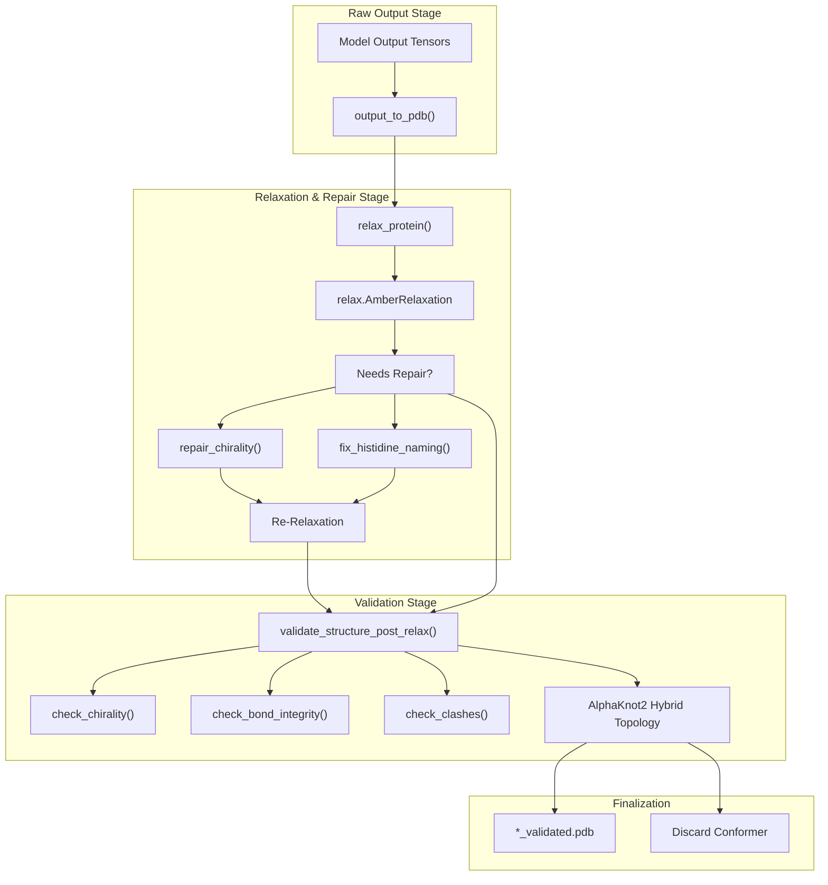
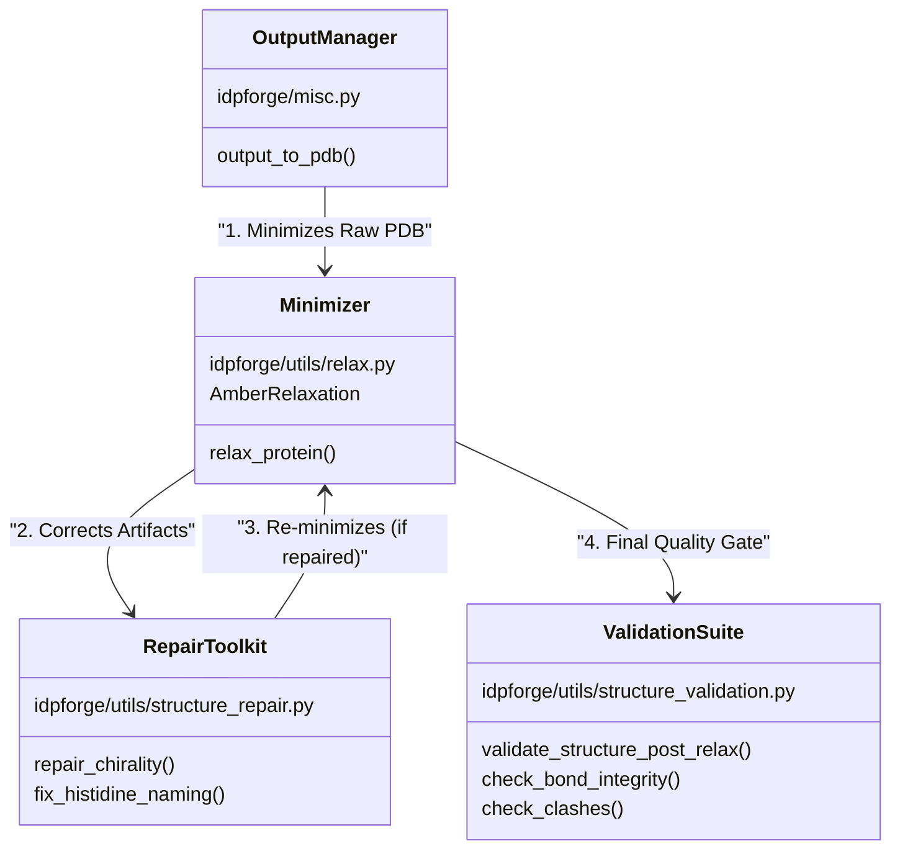

# Post-Generation Processing: Relaxation, Repair & Validation

> **Relevant source files**
> * [data/AF-P05231_ndr.npz](https://github.com/THGLab/IDPForge/blob/a12c2846/data/AF-P05231_ndr.npz)
> * [idpforge/misc.py](https://github.com/THGLab/IDPForge/blob/a12c2846/idpforge/misc.py)
> * [idpforge/utils/relax.py](https://github.com/THGLab/IDPForge/blob/a12c2846/idpforge/utils/relax.py)
> * [idpforge/utils/structure_repair.py](https://github.com/THGLab/IDPForge/blob/a12c2846/idpforge/utils/structure_repair.py)
> * [idpforge/utils/structure_validation.py](https://github.com/THGLab/IDPForge/blob/a12c2846/idpforge/utils/structure_validation.py)
> * [relax_raw.py](https://github.com/THGLab/IDPForge/blob/a12c2846/relax_raw.py)

After the diffusion model generates raw coordinates, the IDPForge pipeline performs a multi-stage post-processing sequence to ensure physical realism, stereochemical correctness, and topological integrity. This process transforms raw neural network outputs into energy-minimized, validated PDB ensembles.

### Overview of the Post-Generation Pipeline

The post-generation lifecycle is managed primarily by `output_to_pdb()` in `idpforge/misc.py` [119-135](https://github.com/THGLab/IDPForge/blob/a12c2846/119-135)

 The pipeline consists of:

1. **Conversion**: Transforming `atom14` internal representations to `atom37` PDB format [139-140](https://github.com/THGLab/IDPForge/blob/a12c2846/139-140)
2. **Pre-Relaxation Screening**: Checking backbone continuity and NaN coordinates before expensive minimization [192-201](https://github.com/THGLab/IDPForge/blob/a12c2846/192-201)
3. **AMBER Relaxation**: Using OpenMM to minimize the structure, typically with the folded domain residues restrained [idpforge/utils/relax.py L21-L25](https://github.com/THGLab/IDPForge/blob/a12c2846/idpforge/utils/relax.py#L21-L25)
4. **Structural Repair**: Fixing D-amino acid flips and Histidine naming artifacts introduced by the forcefield [idpforge/utils/structure_repair.py L35-L178](https://github.com/THGLab/IDPForge/blob/a12c2846/idpforge/utils/structure_repair.py#L35-L178)
5. **Validation Suite**: A comprehensive check for clashes, chirality, bond integrity, and topological knots [idpforge/utils/structure_validation.py L206-L258](https://github.com/THGLab/IDPForge/blob/a12c2846/idpforge/utils/structure_validation.py#L206-L258)

### Pipeline Workflow Diagram

The following diagram illustrates the flow from raw tensor output to a validated PDB file, mapping the logical steps to the specific code entities responsible for them.

**Post-Generation Processing Flow**

**Sources:** `idpforge/misc.py` [119-300](https://github.com/THGLab/IDPForge/blob/a12c2846/119-300)

 `idpforge/utils/relax.py` [21-92](https://github.com/THGLab/IDPForge/blob/a12c2846/21-92)

 `idpforge/utils/structure_validation.py` [206-258](https://github.com/THGLab/IDPForge/blob/a12c2846/206-258)

---

### AMBER Relaxation (relax_protein)

The relaxation stage utilizes the `AmberRelaxation` wrapper from OpenFold to perform energy minimization. A key feature of IDPForge is the use of a `viol_mask` to gate acceptance: the system calculates the fraction of residues with stereochemical violations and rejects conformers exceeding the `viol_threshold` (default 0.02) [idpforge/utils/relax.py L22-L63](https://github.com/THGLab/IDPForge/blob/a12c2846/idpforge/utils/relax.py#L22-L63)

For multi-domain proteins or IDRs in context, the `exclude_residues` configuration allows the folded domains to remain rigid (via harmonic restraints) while the disordered regions are free to minimize [relax_raw.py L58-L61](https://github.com/THGLab/IDPForge/blob/a12c2846/relax_raw.py#L58-L61)

For details, see [AMBER Relaxation (relax_protein)](/THGLab/IDPForge/4.4.1-amber-relaxation-(relax_protein)).

**Sources:** `idpforge/utils/relax.py` [21-92](https://github.com/THGLab/IDPForge/blob/a12c2846/21-92)

 `relax_raw.py` [47-62](https://github.com/THGLab/IDPForge/blob/a12c2846/47-62)

---

### Structural Repair & Re-Relaxation

Neural generation and forcefield minimization can occasionally produce stereochemical artifacts. IDPForge includes specialized repair utilities:

* **Chirality Repair**: `repair_chirality()` detects D-amino acids by calculating the scalar triple product of the N-CA-C-CB volume. If a flip is detected, it reflects the sidechain atoms across the N-CA-C plane to restore L-isomer geometry [idpforge/utils/structure_repair.py L35-L154](https://github.com/THGLab/IDPForge/blob/a12c2846/idpforge/utils/structure_repair.py#L35-L154)
* **Histidine Naming**: `fix_histidine_naming()` addresses a known issue where AMBER relaxation scrambles atom identities in the HIS imidazole ring. It reassigns names based on spatial geometry and hydrogen bonding patterns [idpforge/utils/structure_repair.py L156-L178](https://github.com/THGLab/IDPForge/blob/a12c2846/idpforge/utils/structure_repair.py#L156-L178)

If repairs are applied, the structure is subjected to a second round of relaxation to ensure the new coordinates are energetically stable [relax_raw.py L153-L166](https://github.com/THGLab/IDPForge/blob/a12c2846/relax_raw.py#L153-L166)

**Sources:** `idpforge/utils/structure_repair.py` [35-178](https://github.com/THGLab/IDPForge/blob/a12c2846/35-178)

 `relax_raw.py` [123-166](https://github.com/THGLab/IDPForge/blob/a12c2846/123-166)

---

### Structural Validation Suite

The final quality gate is the `validate_structure_post_relax()` function. This suite performs high-fidelity checks to ensure the ensemble is suitable for scientific analysis.

| Check | Code Entity | Description |
| --- | --- | --- |
| **Chirality** | `check_chirality()` | Uses scalar triple product to ensure L-amino acid geometry [idpforge/utils/structure_validation.py L99-L119](https://github.com/THGLab/IDPForge/blob/a12c2846/idpforge/utils/structure_validation.py#L99-L119) |
| **Bonds** | `check_bond_integrity()` | Graph-based check for stretched or broken covalent bonds [idpforge/utils/structure_validation.py L130-L190](https://github.com/THGLab/IDPForge/blob/a12c2846/idpforge/utils/structure_validation.py#L130-L190) |
| **Clashes** | `check_clashes()` | Uses `cKDTree` for fast VdW overlap detection [idpforge/utils/structure_validation.py L192-L204](https://github.com/THGLab/IDPForge/blob/a12c2846/idpforge/utils/structure_validation.py#L192-L204) |
| **Topology** | `AlphaKnot2` | Hybrid Alexander/HOMFLY polynomial check to detect unwanted knots [idpforge/utils/structure_validation.py L23-L27](https://github.com/THGLab/IDPForge/blob/a12c2846/idpforge/utils/structure_validation.py#L23-L27) |

For details, see [Structural Validation Suite](/THGLab/IDPForge/4.4.2-structural-validation-suite).

**Sources:** `idpforge/utils/structure_validation.py` [1-258](https://github.com/THGLab/IDPForge/blob/a12c2846/1-258)

---

### Code Mapping: Logic to Entities

This diagram maps the high-level processing requirements to the specific classes and functions in the `idpforge` codebase.

**System Entity Mapping**

**Sources:** `idpforge/misc.py` [119-135](https://github.com/THGLab/IDPForge/blob/a12c2846/119-135)

 `idpforge/utils/relax.py` [21-25](https://github.com/THGLab/IDPForge/blob/a12c2846/21-25)

 `idpforge/utils/structure_repair.py` [35-178](https://github.com/THGLab/IDPForge/blob/a12c2846/35-178)

 `idpforge/utils/structure_validation.py` [206-258](https://github.com/THGLab/IDPForge/blob/a12c2846/206-258)