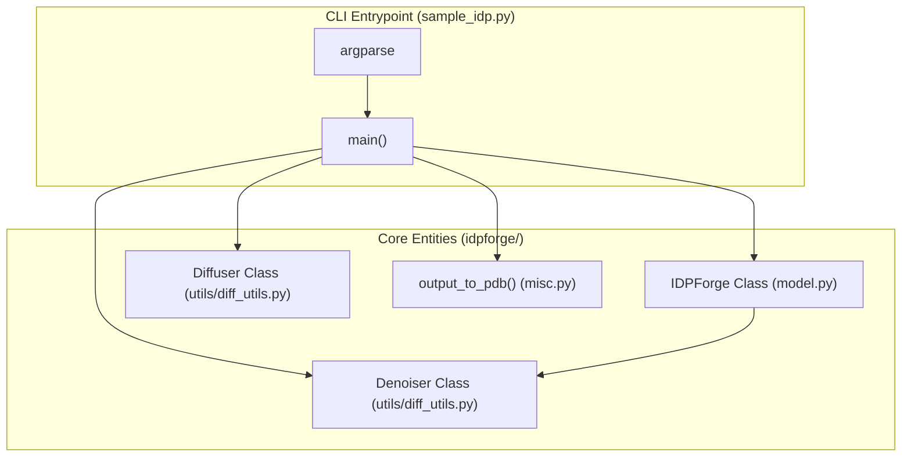
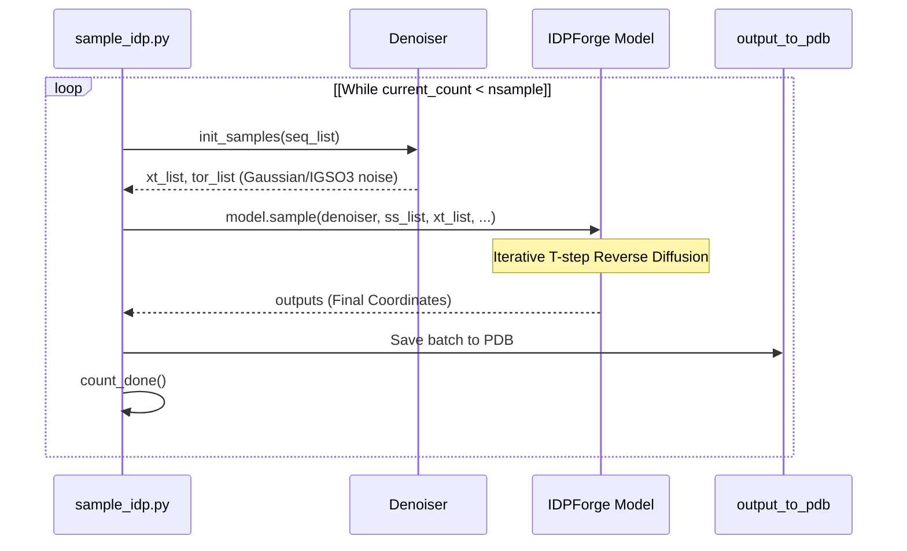

# Sampling Full IDPs (sample_idp.py)

> **Relevant source files**
> * [README.md](https://github.com/THGLab/IDPForge/blob/a12c2846/README.md?plain=1)
> * [configs/sample.yml](https://github.com/THGLab/IDPForge/blob/a12c2846/configs/sample.yml)
> * [sample_idp.py](https://github.com/THGLab/IDPForge/blob/a12c2846/sample_idp.py)

The `sample_idp.py` script serves as the primary entrypoint for generating all-atom structural ensembles of Intrinsically Disordered Proteins (IDPs). It leverages a diffusion-based transformer model to reverse-diffuse random noise into physically plausible protein conformers, optionally guided by experimental constraints.

### Sources:

* [sample_idp.py L1-L20](https://github.com/THGLab/IDPForge/blob/a12c2846/sample_idp.py#L1-L20)
* [README.md L1-L4](https://github.com/THGLab/IDPForge/blob/a12c2846/README.md?plain=1#L1-L4)

---

## CLI Arguments and Configuration

The script uses a combination of command-line arguments and a YAML configuration file to define the sampling environment.

| Argument | Description |
| --- | --- |
| `seq` | The amino acid sequence of the IDP to be sampled. |
| `ckpt_path` | Path to the trained IDPForge model weights (`.ckpt` or `.pt`). |
| `output_dir` | Directory where generated PDB files will be stored. |
| `sample_cfg` | Path to the YAML configuration file (e.g., `configs/sample.yml`). |
| `--batch` | Number of conformers to generate in a single GPU/CPU pass (default: 32). |
| `--nconf` | Total target number of conformers for the ensemble (default: 100). |
| `--cuda` | Flag to enable GPU acceleration. |
| `--ss_db` | Path to a secondary structure database (overrides config `data_path`). |

### Sources:

* [sample_idp.py L172-L183](https://github.com/THGLab/IDPForge/blob/a12c2846/sample_idp.py#L172-L183)
* [configs/sample.yml L1-L56](https://github.com/THGLab/IDPForge/blob/a12c2846/configs/sample.yml#L1-L56)

---

## Initialization and Data Flow

The sampling process begins by initializing the `Diffuser` and `Denoiser` objects, which manage the noise schedules and the iterative reverse-diffusion steps. The `IDPForge` model is then loaded with weights, specifically extracting the Exponential Moving Average (EMA) parameters.

### System Entity Mapping: Initialization

The following diagram illustrates the relationship between the CLI entrypoint and the core classes defined in the `idpforge` module.

### Sources:

* [sample_idp.py L31-L60](https://github.com/THGLab/IDPForge/blob/a12c2846/sample_idp.py#L31-L60)
* [idpforge/model.py L16](https://github.com/THGLab/IDPForge/blob/a12c2846/idpforge/model.py#L16-L16)
* [idpforge/utils/diff_utils.py L17](https://github.com/THGLab/IDPForge/blob/a12c2846/idpforge/utils/diff_utils.py#L17-L17)

---

## Secondary Structure Database Lookup

IDPForge utilizes a secondary structure (SS) database to provide structural context during sampling. The script follows a fallback logic to assign SS strings to the target sequence:

1. **Direct Path**: If `sec_path` is provided in the config, it reads SS strings directly from that file [sample_idp.py L105-L109](https://github.com/THGLab/IDPForge/blob/a12c2846/sample_idp.py#L105-L109)
2. **Database Lookup**: It uses `fetch_sec_from_seq` to find similar sequences in a pickle-based database (`example_data.pkl`) and retrieves their associated SS [sample_idp.py L90-L100](https://github.com/THGLab/IDPForge/blob/a12c2846/sample_idp.py#L90-L100)
3. **Fallback**: If lookup fails, it defaults to an "all-coil" (`C`) assignment [sample_idp.py L101-L103](https://github.com/THGLab/IDPForge/blob/a12c2846/sample_idp.py#L101-L103)

### Sources:

* [sample_idp.py L89-L109](https://github.com/THGLab/IDPForge/blob/a12c2846/sample_idp.py#L89-L109)
* [idpforge/utils/prep_sec.py L19](https://github.com/THGLab/IDPForge/blob/a12c2846/idpforge/utils/prep_sec.py#L19-L19)

---

## Generation Loop and Batching

The generation process is wrapped in a `while` loop that persists until the `nsample` target is met. This design allows for **resume-capability**: the script checks the output directory for existing files using `count_done()` and only generates the remaining required conformers [sample_idp.py L122-L140](https://github.com/THGLab/IDPForge/blob/a12c2846/sample_idp.py#L122-L140)

### Sampling Logic Flow

### Sources:

* [sample_idp.py L142-L170](https://github.com/THGLab/IDPForge/blob/a12c2846/sample_idp.py#L142-L170)
* [sample_idp.py L122-L136](https://github.com/THGLab/IDPForge/blob/a12c2846/sample_idp.py#L122-L136)

---

## Experimental Guidance Integration

If enabled in the configuration (`potential: true`), the script initializes guidance potentials that influence the diffusion gradient. This allows the generated ensemble to satisfy experimental constraints such as Paramagnetic Relaxation Enhancement (PRE) or Radius of Gyration (Rg).

* **PRE/NOE**: Converted into a contact map potential using `get_contact_map` [sample_idp.py L70-L77](https://github.com/THGLab/IDPForge/blob/a12c2846/sample_idp.py#L70-L77)
* **Rg**: Targets a specific ensemble average radius of gyration [sample_idp.py L78-L81](https://github.com/THGLab/IDPForge/blob/a12c2846/sample_idp.py#L78-L81)
* **Hyperparameters**: Guidance is controlled by `timescale` (when guidance starts) and `grad_clip` (maximum gradient magnitude) [sample_idp.py L64-L68](https://github.com/THGLab/IDPForge/blob/a12c2846/sample_idp.py#L64-L68)

### Sources:

* [sample_idp.py L64-L87](https://github.com/THGLab/IDPForge/blob/a12c2846/sample_idp.py#L64-L87)
* [idpforge/utils/np_utils.py L71](https://github.com/THGLab/IDPForge/blob/a12c2846/idpforge/utils/np_utils.py#L71-L71)

---

## Output Naming and Relaxation

Generated conformers are saved using the `output_to_pdb` function. The naming convention depends on whether AMBER relaxation is performed:

1. **Raw Outputs**: Named `{idx}_raw.pdb` if `no_relax` is true [sample_idp.py L111-L113](https://github.com/THGLab/IDPForge/blob/a12c2846/sample_idp.py#L111-L113)
2. **Validated/Relaxed**: Named `{idx}_validated.pdb` if the full relaxation and validation pipeline is active [sample_idp.py L114-L117](https://github.com/THGLab/IDPForge/blob/a12c2846/sample_idp.py#L114-L117)

The `next_available_idx()` function ensures that new batches do not overwrite existing files by finding the lowest unused integer prefix in the output directory [sample_idp.py L125-L136](https://github.com/THGLab/IDPForge/blob/a12c2846/sample_idp.py#L125-L136)

### Sources:

* [sample_idp.py L111-L120](https://github.com/THGLab/IDPForge/blob/a12c2846/sample_idp.py#L111-L120)
* [sample_idp.py L158-L160](https://github.com/THGLab/IDPForge/blob/a12c2846/sample_idp.py#L158-L160)
* [idpforge/misc.py L18](https://github.com/THGLab/IDPForge/blob/a12c2846/idpforge/misc.py#L18-L18)