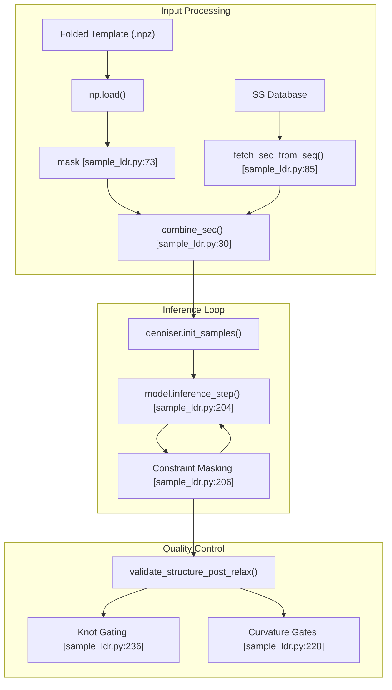
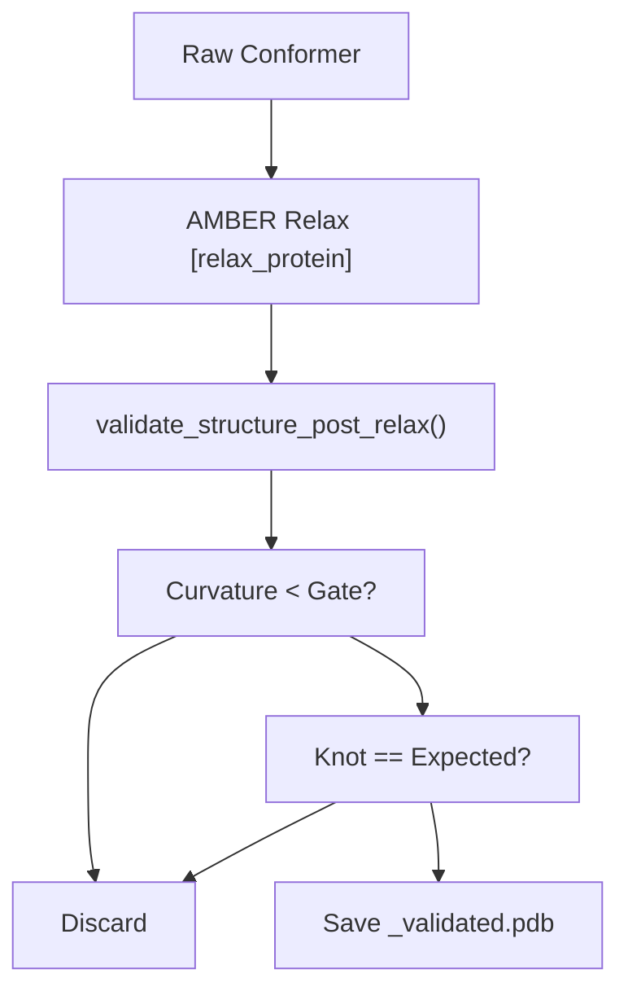

# Sampling IDRs in Folded Context (sample_ldr.py)

> **Relevant source files**
> * [mk_flex_template.py](https://github.com/THGLab/IDPForge/blob/a12c2846/mk_flex_template.py)
> * [mk_ldr_template.py](https://github.com/THGLab/IDPForge/blob/a12c2846/mk_ldr_template.py)
> * [sample_ldr.py](https://github.com/THGLab/IDPForge/blob/a12c2846/sample_ldr.py)
> * [slice_pdb.py](https://github.com/THGLab/IDPForge/blob/a12c2846/slice_pdb.py)

The `sample_ldr.py` script is the primary inference entrypoint for generating ensembles of **Intrinsically Disordered Regions (IDRs)** within the context of fixed or flexible folded domains. Unlike full-sequence IDP sampling, this mode uses structural templates to constrain specific residues while allowing the diffusion model to sample the conformational space of the disordered segments.

## Overview and Purpose

The script implements a constrained diffusion process where the folded parts of a protein are held static (or used as boundary conditions) while the disordered regions are generated by the `IDPForge` model. It handles complex multi-step pipeline requirements, including template tiling for long proteins, bfloat16 inference for memory efficiency, and structural quality gating (knot detection and curvature checks).

### Key Capabilities

* **Template-Based Constrained Diffusion**: Uses `.npz` templates generated by `mk_ldr_template.py` or `mk_flex_template.py`.
* **Secondary Structure Integration**: Combines experimental or predicted SS for disordered regions with fixed SS from folded domains.
* **Automated Truncation Handling**: Emits `_truncation.json` metadata to facilitate the "graft-back" of discarded domains in later pipeline steps.
* **Quality Gating**: Integrated filters for fold curvature, junction kappa (connectivity), and topological knot types.

Sources: `sample_ldr.py` [1-37](https://github.com/THGLab/IDPForge/blob/a12c2846/1-37)

 [114-149](https://github.com/THGLab/IDPForge/blob/a12c2846/114-149)

---

## Data Flow and Logic

The sampling process follows a loop that continues until the target number of validated conformers (`nsample`) is reached.

### 1. Template and Metadata Loading

The script loads a `.npz` template containing coordinates, sequence, and a binary `mask` (where `1` indicates a folded residue and `0` indicates a disordered residue) [sample_ldr.py L73-L75](https://github.com/THGLab/IDPForge/blob/a12c2846/sample_ldr.py#L73-L75)

. If the template was truncated during generation (e.g., to fit within GPU memory), the script emits a graft specification (`_truncation.json`) so that `Step_4_ldr_stitch.py` can later reassemble the full protein [sample_ldr.py L114-L135](https://github.com/THGLab/IDPForge/blob/a12c2846/sample_ldr.py#L114-L135)

.

### 2. Secondary Structure (SS) Merging

The function `combine_sec` merges the folded domain's known secondary structure with a sampled SS string for the IDR [sample_ldr.py L30-L31](https://github.com/THGLab/IDPForge/blob/a12c2846/sample_ldr.py#L30-L31)

. This ensures the `IDPForge` model receives a coherent `ss` input that respects the structural constraints of the template.

### 3. The Reverse Diffusion Loop

The core sampling happens within a `while` loop that manages batching and device placement:

| Stage | Code Entity | Description |
| --- | --- | --- |
| **Initialization** | `denoiser.init_samples()` | Generates initial Gaussian noise for coordinates and torsions [sample_ldr.py L179](https://github.com/THGLab/IDPForge/blob/a12c2846/sample_ldr.py#L179-L179)   . |
| **Constraint Injection** | `xt_list`, `tor_list` | Replaces noise at masked indices with template coordinates/torsions [sample_ldr.py L184-L187](https://github.com/THGLab/IDPForge/blob/a12c2846/sample_ldr.py#L184-L187)   . |
| **Reverse Step** | `model.inference_step()` | Predicts the denoised structure at time $t-1$ [sample_ldr.py L204](https://github.com/THGLab/IDPForge/blob/a12c2846/sample_ldr.py#L204-L204)   . |
| **Constraint Enforcement** | Masking | After each step, folded residues are reset to template values to prevent drift [sample_ldr.py L206-L209](https://github.com/THGLab/IDPForge/blob/a12c2846/sample_ldr.py#L206-L209)   . |

Sources: `sample_ldr.py` [30-31](https://github.com/THGLab/IDPForge/blob/a12c2846/30-31)

 [73-98](https://github.com/THGLab/IDPForge/blob/a12c2846/73-98)

 [170-210](https://github.com/THGLab/IDPForge/blob/a12c2846/170-210)

---

## Technical Implementation

### Code Entity Bridge: Natural Language to Code Space

The following diagram maps high-level sampling concepts to specific implementation details in `sample_ldr.py`.

**Figure 1: Inference Logic Mapping**

Sources: `sample_ldr.py` [30-31](https://github.com/THGLab/IDPForge/blob/a12c2846/30-31)

 [73-85](https://github.com/THGLab/IDPForge/blob/a12c2846/73-85)

 [204-236](https://github.com/THGLab/IDPForge/blob/a12c2846/204-236)

### Multi-Step Pipeline Metadata

For large proteins, `sample_ldr.py` supports a "Step-2 continuation" mode. If the template contains `step2_a_conformer` metadata, the script emits `_step2.json`. This allows the pipeline to build an IDR in fragments, pinning the first fragment as a pseudo-fold for the second generation step.

Sources: `sample_ldr.py` [137-149](https://github.com/THGLab/IDPForge/blob/a12c2846/137-149)

---

## Structural Validation and Gating

After a conformer is generated and (optionally) relaxed using AMBER, it must pass several geometric gates before being saved to the `output_dir`.

### Validation Gates

The script utilizes `validate_structure_post_relax` to compute metrics that are then compared against CLI-provided thresholds:

1. **Fold Curvature (`fold_curv_ratio`)**: Ensures the folded domain has not undergone unphysical global deformation during relaxation [sample_ldr.py L228](https://github.com/THGLab/IDPForge/blob/a12c2846/sample_ldr.py#L228-L228) .
2. **Junction Kappa (`junction_kappa`)**: Measures the local curvature at the interface between the folded domain and the IDR to ensure a natural transition [sample_ldr.py L231](https://github.com/THGLab/IDPForge/blob/a12c2846/sample_ldr.py#L231-L231) .
3. **Knot Gating (`expected_knot_type`)**: Uses the `AlphaKnot2` hybrid topology classifier to screen for unphysical knots (e.g., ensuring a "Tail" IDR remains `0.1` or "Unknotted") [sample_ldr.py L236-L245](https://github.com/THGLab/IDPForge/blob/a12c2846/sample_ldr.py#L236-L245) .

**Figure 2: Validation Flow**

Sources: `sample_ldr.py` [216-245](https://github.com/THGLab/IDPForge/blob/a12c2846/216-245)

 `idpforge/utils/structure_validation.py` [1-100](https://github.com/THGLab/IDPForge/blob/a12c2846/1-100)

---

## Configuration and CLI

### Critical Arguments

| Argument | Description |
| --- | --- |
| `--fold_template` | Path to the `.npz` file containing `coord`, `mask`, `seq`, and `sec` [sample_ldr.py L33](https://github.com/THGLab/IDPForge/blob/a12c2846/sample_ldr.py#L33-L33)   . |
| `--sample_cfg` | Path to `sample.yml` containing diffusion hyperparameters [sample_ldr.py L41](https://github.com/THGLab/IDPForge/blob/a12c2846/sample_ldr.py#L41-L41)   . |
| `--nsample` | Target number of *validated* conformers to generate [sample_ldr.py L34](https://github.com/THGLab/IDPForge/blob/a12c2846/sample_ldr.py#L34-L34)   . |
| `--fold_curv_ratio` | Threshold for global fold deformation (0.0 to disable) [sample_ldr.py L36](https://github.com/THGLab/IDPForge/blob/a12c2846/sample_ldr.py#L36-L36)   . |
| `--expected_knot_type` | String label (e.g., "0.1") to filter topological errors [sample_ldr.py L37](https://github.com/THGLab/IDPForge/blob/a12c2846/sample_ldr.py#L37-L37)   . |

### Template Structure (.npz)

The input template expected by `sample_ldr.py` must contain:

* `coord`: `(L, 37, 3)` array of heavy atom coordinates.
* `mask`: `(L,)` boolean array (`True` = Folded/Static).
* `seq`: `(L,)` sequence string.
* `sec`: `(L,)` secondary structure string (H/E/C/P/G/I/S/T/B).
* `coord_offset`: (Optional) Original PDB index for renumbering.

Sources: `sample_ldr.py` [33-41](https://github.com/THGLab/IDPForge/blob/a12c2846/33-41)

 `mk_ldr_template.py` [132-144](https://github.com/THGLab/IDPForge/blob/a12c2846/132-144)