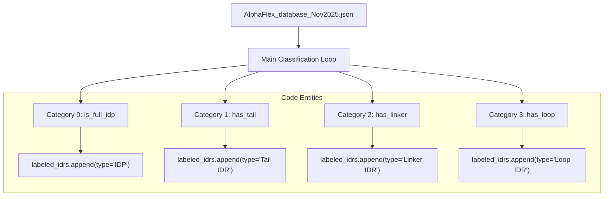
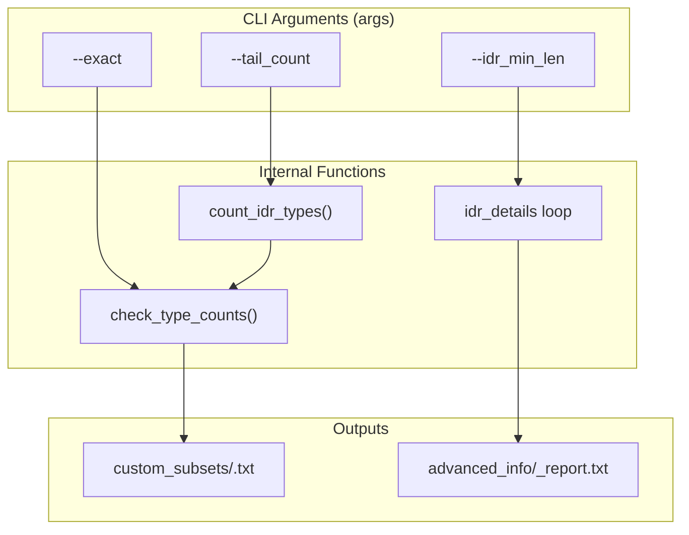

# Step 1: Case Labeling & Subset Filtering

> **Relevant source files**
> * [AlphaFlex/Data_Inputs/AF2_9606_HUMAN_v4_num_residues.json](https://github.com/THGLab/IDPForge/blob/a12c2846/AlphaFlex/Data_Inputs/AF2_9606_HUMAN_v4_num_residues.json)
> * [AlphaFlex/Data_Inputs/AlphaFlex_database_Nov2025.json](https://github.com/THGLab/IDPForge/blob/a12c2846/AlphaFlex/Data_Inputs/AlphaFlex_database_Nov2025.json)
> * [AlphaFlex/Data_Inputs/Test_Structures/O14653.pdb](https://github.com/THGLab/IDPForge/blob/a12c2846/AlphaFlex/Data_Inputs/Test_Structures/O14653.pdb)
> * [AlphaFlex/Step_1B_subset_label.py](https://github.com/THGLab/IDPForge/blob/a12c2846/AlphaFlex/Step_1B_subset_label.py)
> * [AlphaFlex/Step_1_case_label.py](https://github.com/THGLab/IDPForge/blob/a12c2846/AlphaFlex/Step_1_case_label.py)
> * [AlphaFlex/utils/file_ops.py](https://github.com/THGLab/IDPForge/blob/a12c2846/AlphaFlex/utils/file_ops.py)
> * [AlphaFlex/utils/smart_scoring.py](https://github.com/THGLab/IDPForge/blob/a12c2846/AlphaFlex/utils/smart_scoring.py)

This stage of the AlphaFlex pipeline is responsible for the topological classification of proteins based on their Intrinsically Disordered Regions (IDRs) and the subsequent filtering of these proteins into specific subsets for ensemble generation. It processes the raw AlphaFold2-derived database to assign hierarchical categories (IDP, Tails, Linkers, Loops) and enables users to define custom datasets based on length and IDR counts.

## IDR Classification Logic

The script `Step_1_case_label.py` implements a hierarchical classification system. It evaluates the position of IDRs relative to folded domains and uses Predicted Aligned Error (PAE) data to distinguish between internal disordered segments.

### Hierarchical Categories

Proteins are assigned exactly one category based on the most complex IDR type present:

| Category | Name | Description | Implementation |
| --- | --- | --- | --- |
| **0** | **IDP** | Fully disordered protein; no folded domains detected. | `is_full_idp` [AlphaFlex/Step_1_case_label.py L111-L123](https://github.com/THGLab/IDPForge/blob/a12c2846/AlphaFlex/Step_1_case_label.py#L111-L123) |
| **1** | **Tails** | Folded domain(s) with only N-terminal or C-terminal IDRs. | `has_tail` [AlphaFlex/Step_1_case_label.py L191-L193](https://github.com/THGLab/IDPForge/blob/a12c2846/AlphaFlex/Step_1_case_label.py#L191-L193) |
| **2** | **Linkers** | Internal IDRs between non-interacting folded domains. | `has_linker` [AlphaFlex/Step_1_case_label.py L188-L190](https://github.com/THGLab/IDPForge/blob/a12c2846/AlphaFlex/Step_1_case_label.py#L188-L190) |
| **3** | **Loops** | Internal IDRs between interacting domains (or within one). | `has_loop` [AlphaFlex/Step_1_case_label.py L185-L187](https://github.com/THGLab/IDPForge/blob/a12c2846/AlphaFlex/Step_1_case_label.py#L185-L187) |

### Implementation Flow

The classifier iterates through the `master_db` and uses residue ranges from the `num_residues_db` to determine terminal status. For internal IDRs, it checks the `interaction_set` (derived from `mean_pae` thresholds in the input JSON) to decide between "Loop" and "Linker" labels.

### Data Entity Mapping: Classification

The following diagram bridges the logical classification categories to the specific code variables and data structures used in `Step_1_case_label.py`.

**Classification Logic Flow**

Sources: [AlphaFlex/Step_1_case_label.py L83-L200](https://github.com/THGLab/IDPForge/blob/a12c2846/AlphaFlex/Step_1_case_label.py#L83-L200)

 [AlphaFlex/Data_Inputs/AlphaFlex_database_Nov2025.json L1-L55](https://github.com/THGLab/IDPForge/blob/a12c2846/AlphaFlex/Data_Inputs/AlphaFlex_database_Nov2025.json#L1-L55)

## Subset Filtering & Generation

`Step_1B_subset_label.py` acts as a query engine for the labeled database. It allows researchers to extract specific UniProt IDs that meet structural criteria for downstream simulation.

### Filter Criteria

1. **Protein Length**: Filters based on total residue count using `min_len` and `max_len` [AlphaFlex/Step_1B_subset_label.py L71-L77](https://github.com/THGLab/IDPForge/blob/a12c2846/AlphaFlex/Step_1B_subset_label.py#L71-L77)
2. **IDR Count**: Enforces specific numbers of Tails, Linkers, or Loops. Can be `exact` (e.g., exactly 2 tails) or `minimum` (at least 2 tails) [AlphaFlex/Step_1B_subset_label.py L32-L48](https://github.com/THGLab/IDPForge/blob/a12c2846/AlphaFlex/Step_1B_subset_label.py#L32-L48)
3. **IDR Length**: Filters individual IDR segments by length (e.g., only proteins where all IDRs are between 20-50 residues) [AlphaFlex/Step_1B_subset_label.py L126-L148](https://github.com/THGLab/IDPForge/blob/a12c2846/AlphaFlex/Step_1B_subset_label.py#L126-L148)
4. **Sampling**: Randomly selects a maximum number of IDs via `max_samples` [AlphaFlex/Step_1B_subset_label.py L170-L171](https://github.com/THGLab/IDPForge/blob/a12c2846/AlphaFlex/Step_1B_subset_label.py#L170-L171)

### Data Entity Mapping: Filtering

This diagram shows how CLI arguments in `Step_1B_subset_label.py` map to the internal processing of the labeled JSON database.

**Subset Filtering Entity Map**

Sources: [AlphaFlex/Step_1B_subset_label.py L22-L63](https://github.com/THGLab/IDPForge/blob/a12c2846/AlphaFlex/Step_1B_subset_label.py#L22-L63)

 [AlphaFlex/Step_1B_subset_label.py L107-L167](https://github.com/THGLab/IDPForge/blob/a12c2846/AlphaFlex/Step_1B_subset_label.py#L107-L167)

## Data Schemas

### AlphaFlex_database_Nov2025.json

The input database contains structural metadata for each UniProt entry.

* `idrs`: List of `[start, end]` residue ranges [AlphaFlex/Data_Inputs/AlphaFlex_database_Nov2025.json L3-L8](https://github.com/THGLab/IDPForge/blob/a12c2846/AlphaFlex/Data_Inputs/AlphaFlex_database_Nov2025.json#L3-L8)
* `mean_pae`: A dictionary mapping domain pairs (e.g., "F1-F2") to their average PAE value. Low PAE indicates interaction [AlphaFlex/Data_Inputs/AlphaFlex_database_Nov2025.json L41-L48](https://github.com/THGLab/IDPForge/blob/a12c2846/AlphaFlex/Data_Inputs/AlphaFlex_database_Nov2025.json#L41-L48)
* `interactions`: A list of domain pairs (e.g., `["F1", "F2"]`) pre-determined to be interacting [AlphaFlex/Data_Inputs/AlphaFlex_database_Nov2025.json L49-L54](https://github.com/THGLab/IDPForge/blob/a12c2846/AlphaFlex/Data_Inputs/AlphaFlex_database_Nov2025.json#L49-L54)

### Output ID List Format

The primary output of Step 1B is a plain text file containing one UniProt ID per line, located in `output_root/custom_subsets/`. This file is used as the `--split_index` or input list for Step 2 and Step 3 [AlphaFlex/Step_1B_subset_label.py L178-L192](https://github.com/THGLab/IDPForge/blob/a12c2846/AlphaFlex/Step_1B_subset_label.py#L178-L192)

## Summary Reports

For every subset generated, the system produces a filtration report (`_report.txt`) including:

* Applied length constraints.
* Breakdown of IDR types found.
* Detailed list of every IDR range and length for the included proteins.
* A statistical summary of categories (0-3) represented in the subset.

Sources: [AlphaFlex/Step_1B_subset_label.py L194-L210](https://github.com/THGLab/IDPForge/blob/a12c2846/AlphaFlex/Step_1B_subset_label.py#L194-L210)

 [AlphaFlex/Step_1_case_label.py L215-L220](https://github.com/THGLab/IDPForge/blob/a12c2846/AlphaFlex/Step_1_case_label.py#L215-L220)