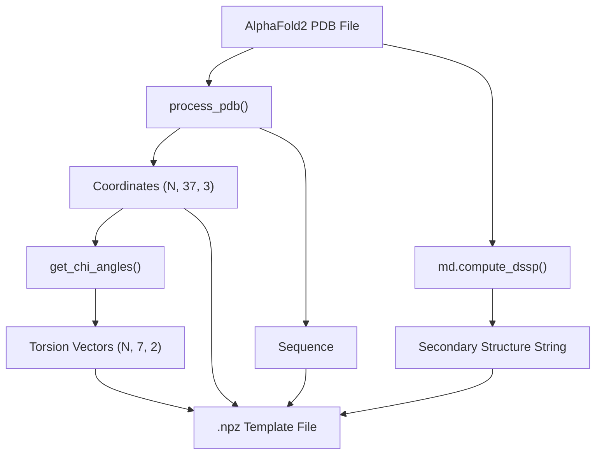
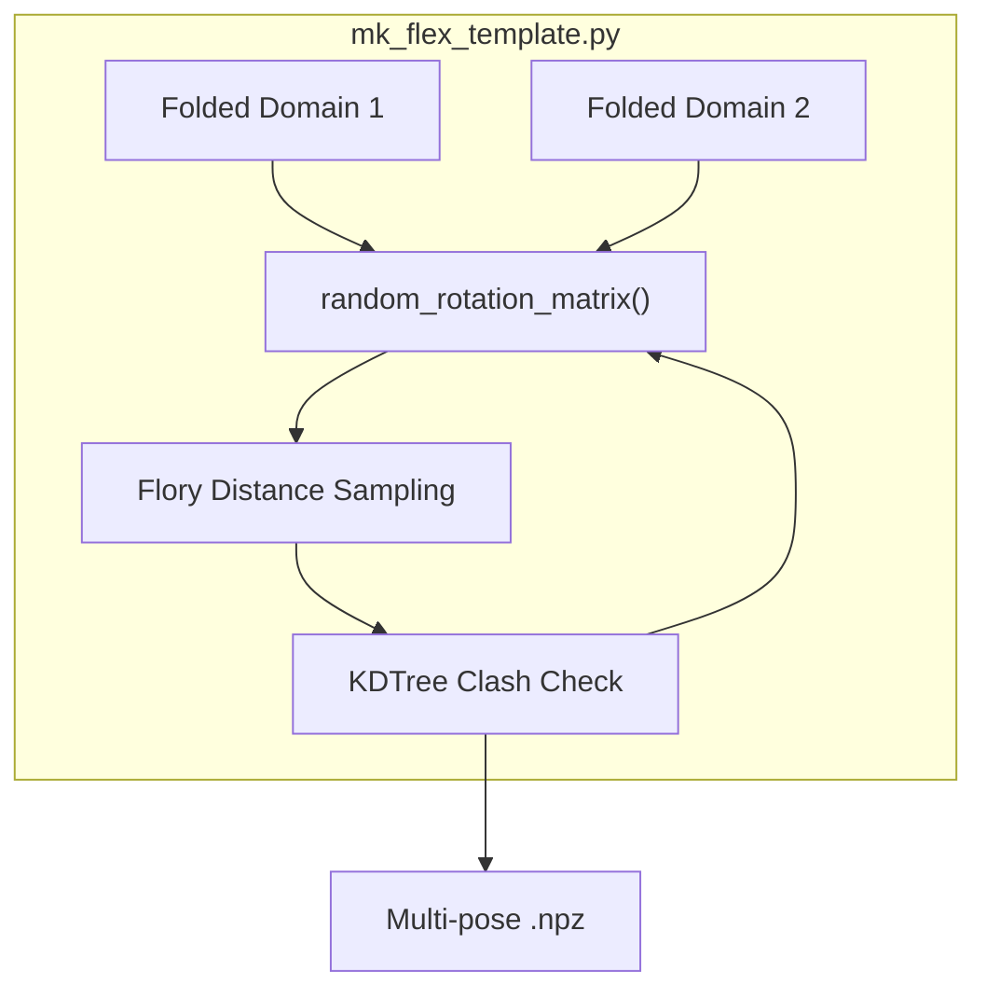

# Step 2: Template Generation

> **Relevant source files**
> * [AlphaFlex/Step_2_mk_ldr_template.py](https://github.com/THGLab/IDPForge/blob/a12c2846/AlphaFlex/Step_2_mk_ldr_template.py)
> * [mk_flex_template.py](https://github.com/THGLab/IDPForge/blob/a12c2846/mk_flex_template.py)
> * [mk_ldr_template.py](https://github.com/THGLab/IDPForge/blob/a12c2846/mk_ldr_template.py)
> * [slice_pdb.py](https://github.com/THGLab/IDPForge/blob/a12c2846/slice_pdb.py)

Step 2 of the AlphaFlex pipeline is responsible for preparing the structural templates required by the diffusion model to sample Intrinsically Disordered Regions (IDRs) within their folded contexts. This step transforms high-level protein classifications into specific `.npz` files containing coordinates, secondary structure encodings, and geometric constraints.

### Template Generation Workflow

The orchestration script `Step_2_mk_ldr_template.py` iterates through the IDs identified in Step 1, maps them to PDB files in the library, and invokes specialized generators based on the IDR category (Tail, Loop, or Linker).

#### Data Flow: From PDB to .npz Template

The following diagram illustrates how the system converts a static AlphaFold2 PDB file into a diffusion-ready template.

**Diagram: PDB Processing Pipeline**

**Sources:** `mk_ldr_template.py` [132-143](https://github.com/THGLab/IDPForge/blob/a12c2846/132-143)

 `AlphaFlex/Step_2_mk_ldr_template.py` [184-210](https://github.com/THGLab/IDPForge/blob/a12c2846/184-210)

---

### Core Components

#### 1. Static Templates (mk_ldr_template.py)

Used for **Tails** (Category 1) and **Loops** (Category 2). These templates maintain the relative orientation of the folded domain(s) exactly as found in the input PDB.

* **Seed Sampling:** For N/C-terminal tails, the script samples "seed" positions for the first disordered residue. It uses `sample_fix_distance()` to place seeds on a sphere (radius 6.46Å to 9.12Å) centered on the junction residue, ensuring no clashes with the folded domain [mk_ldr_template.py L40-L56](https://github.com/THGLab/IDPForge/blob/a12c2846/mk_ldr_template.py#L40-L56)
* **Secondary Structure:** It combines DSSP-derived states for folded regions with "C" (Coil) or Ramachandran-derived states for the IDR [mk_ldr_template.py L136-L143](https://github.com/THGLab/IDPForge/blob/a12c2846/mk_ldr_template.py#L136-L143)

#### 2. Flexible Linker Templates (mk_flex_template.py)

Used for **Linkers** (Category 3). Unlike static templates, linkers require sampling the relative orientation and distance between the two flanking folded domains to provide a diverse starting ensemble for the IDR.

* **SO(3) Sampling:** The script generates random rotation matrices via `random_rotation_matrix()` [mk_flex_template.py L29-L31](https://github.com/THGLab/IDPForge/blob/a12c2846/mk_flex_template.py#L29-L31)
* **Flory Distance:** The distance between domains is sampled based on a Flory-like polymer model: $d = 5.51 \times L^{0.588}$, where $L$ is the linker length [mk_flex_template.py L98-L100](https://github.com/THGLab/IDPForge/blob/a12c2846/mk_flex_template.py#L98-L100)
* **Clash Detection:** `random_nonclashing_transform_scaled()` uses a `scipy.spatial.KDTree` to ensure that the randomly placed domains do not overlap before saving the pose [mk_flex_template.py L48-L84](https://github.com/THGLab/IDPForge/blob/a12c2846/mk_flex_template.py#L48-L84)

**Diagram: Flexible Domain Transformation**

**Sources:** `mk_flex_template.py` [29-31, 48-84, 98-100](https://github.com/THGLab/IDPForge/blob/a12c2846/29-31, 48-84, 98-100)

---

### Size Capping and Truncation

To handle large proteins that exceed the GPU memory limits of the diffusion model (typically capped at 500–600 residues), Step 2 implements a truncation logic.

#### Truncation Mechanism

If a protein is too large, `_truncate_to_size()` (for static) or `_truncate_linker_domains()` (for linkers) crops the folded domains. It ensures the IDR is kept entirely, along with a minimum buffer (default 10 residues) of the folded domain at each junction for stitching purposes [mk_ldr_template.py L59-L125](https://github.com/THGLab/IDPForge/blob/a12c2846/mk_ldr_template.py#L59-L125)

 [mk_flex_template.py L142-L175](https://github.com/THGLab/IDPForge/blob/a12c2846/mk_flex_template.py#L142-L175)

#### Sidecar Files (.trunc.json)

When truncation occurs, `Step_2_mk_ldr_template.py` generates a `.trunc.json` sidecar file. This file contains the `graft_spec`, which records the original residue indices and the offset needed to stitch the generated IDR back into the full-length protein in Step 4 [AlphaFlex/Step_2_mk_ldr_template.py L53-L65](https://github.com/THGLab/IDPForge/blob/a12c2846/AlphaFlex/Step_2_mk_ldr_template.py#L53-L65)

 [slice_pdb.py L7-L40](https://github.com/THGLab/IDPForge/blob/a12c2846/slice_pdb.py#L7-L40)

| Function | File | Purpose |
| --- | --- | --- |
| `_truncate_to_size` | `mk_ldr_template.py` | Caps static templates to `max_residues`. |
| `_truncate_linker_domains` | `mk_flex_template.py` | Caps linker templates while preserving junctions. |
| `slice_pdb_file` | `slice_pdb.py` | Physically extracts the residue range for the truncation. |

**Sources:** `mk_ldr_template.py` [59-82](https://github.com/THGLab/IDPForge/blob/a12c2846/59-82)

 `mk_flex_template.py` [142-153](https://github.com/THGLab/IDPForge/blob/a12c2846/142-153)

 `slice_pdb.py` [7-25](https://github.com/THGLab/IDPForge/blob/a12c2846/7-25)

---

### The .npz Template Format

The output of Step 2 is a compressed NumPy file (`.npz`) containing the following keys:

* **`coord`**: `(N, 37, 3)` array of all-atom coordinates. IDR positions are typically set to zero or seed values.
* **`mask`**: `(N,)` boolean array where `True` indicates a folded residue (fixed) and `False` indicates an IDR residue (diffused).
* **`seq`**: The amino acid sequence string.
* **`sec`**: The secondary structure encoding string (H, E, C, P, etc.).
* **`torsion`**: `(N, 7, 2)` array of sine/cosine values for protein torsion angles.
* **`graft_spec`** (Optional): Metadata for re-assembling truncated proteins.

**Sources:** `mk_ldr_template.py` [108-125](https://github.com/THGLab/IDPForge/blob/a12c2846/108-125)

 `mk_flex_template.py` [166-174](https://github.com/THGLab/IDPForge/blob/a12c2846/166-174)