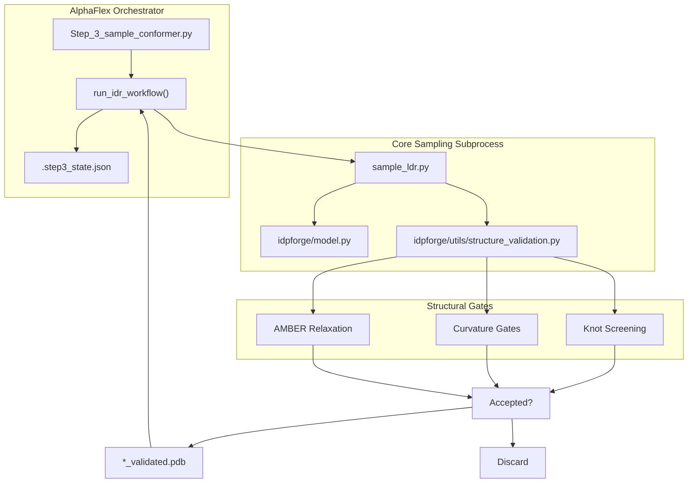
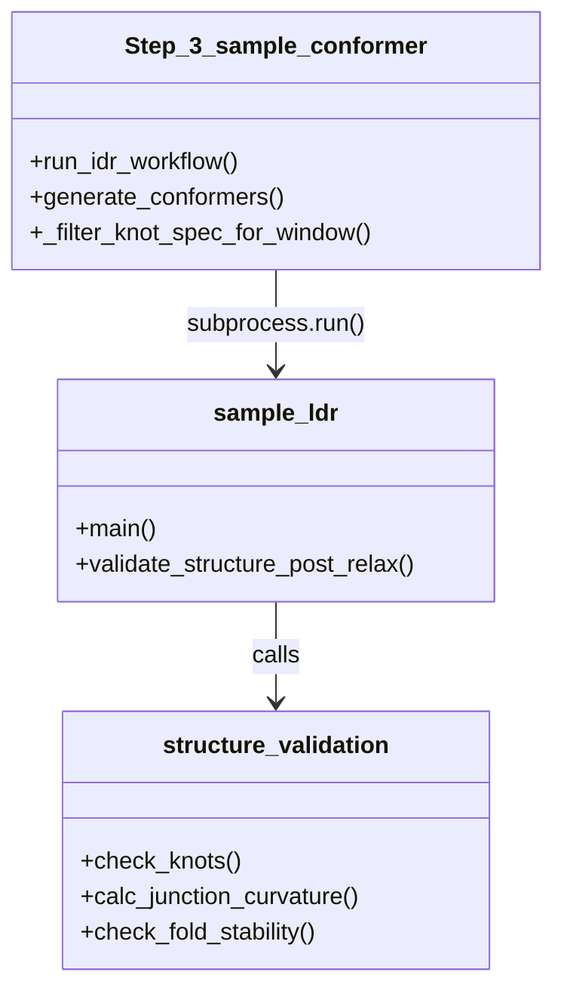

# Step 3: Conformer Sampling

> **Relevant source files**
> * [AlphaFlex/Step_3_sample_conformer.py](https://github.com/THGLab/IDPForge/blob/a12c2846/AlphaFlex/Step_3_sample_conformer.py)
> * [AlphaFlex/config.py](https://github.com/THGLab/IDPForge/blob/a12c2846/AlphaFlex/config.py)

Step 3 of the AlphaFlex pipeline is responsible for generating large-scale, validated conformer pools for each Intrinsically Disordered Region (IDR) identified in Step 1. It orchestrates the execution of the core IDPForge sampling scripts, manages state persistence to allow for interrupted runs, and applies rigorous structural filters—including knot screening and curvature gates—before conformers are accepted into the pool.

### Workflow Orchestration

The entrypoint for this stage is `Step_3_sample_conformer.py`. It functions as a high-level manager that dispatches sampling tasks to `sample_ldr.py` (for IDRs in a folded context) or `sample_idp.py` (for fully disordered proteins).

#### Key Components

* **State Persistence**: Uses `.step3_state.json` within each IDR's output directory to track `total_attempts`, allowing the pipeline to resume generation after crashes or HPC timeouts [AlphaFlex/Step_3_sample_conformer.py L27-L57](https://github.com/THGLab/IDPForge/blob/a12c2846/AlphaFlex/Step_3_sample_conformer.py#L27-L57)
* **Parallelization**: Supports HPC batching via the `--split_index` argument, allowing the total protein list to be divided across multiple jobs [AlphaFlex/Step_3_sample_conformer.py L313-L324](https://github.com/THGLab/IDPForge/blob/a12c2846/AlphaFlex/Step_3_sample_conformer.py#L313-L324)
* **Validation Gating**: Enforces quality controls defined in `AlphaFlex/config.py`, such as `SAMPLE_JUNCTION_KAPPA` (junction curvature) and `SAMPLE_FOLD_CURV_RATIO` [AlphaFlex/config.py L86-L89](https://github.com/THGLab/IDPForge/blob/a12c2846/AlphaFlex/config.py#L86-L89)

#### Data Flow: Generation to Validation

The following diagram illustrates how `Step_3_sample_conformer.py` interfaces with the core sampling logic and the validation suite.

**Diagram: Conformer Sampling Control Flow**

Sources: [AlphaFlex/Step_3_sample_conformer.py L84-L142](https://github.com/THGLab/IDPForge/blob/a12c2846/AlphaFlex/Step_3_sample_conformer.py#L84-L142)

 [AlphaFlex/Step_3_sample_conformer.py L178-L239](https://github.com/THGLab/IDPForge/blob/a12c2846/AlphaFlex/Step_3_sample_conformer.py#L178-L239)

 [AlphaFlex/config.py L78-L97](https://github.com/THGLab/IDPForge/blob/a12c2846/AlphaFlex/config.py#L78-L97)

---

### IDR and IDP Workflows

The script differentiates between "Category 0" (fully disordered proteins) and proteins containing folded domains.

#### 1. IDR Workflow (run_idr_workflow)

This function handles regions that are grafted onto folded templates. It performs the following:

* **Sidecar Management**: Copies `_truncation.json` files from Step 2 to the output directory to maintain residue numbering offsets [AlphaFlex/Step_3_sample_conformer.py L186-L191](https://github.com/THGLab/IDPForge/blob/a12c2846/AlphaFlex/Step_3_sample_conformer.py#L186-L191)
* **Knot Filtering**: If the protein is listed in the `knot_screening.json` database, it filters the expected knot types based on the specific truncation window of the IDR [AlphaFlex/Step_3_sample_conformer.py L159-L174](https://github.com/THGLab/IDPForge/blob/a12c2846/AlphaFlex/Step_3_sample_conformer.py#L159-L174)
* **Subprocess Execution**: Calls `sample_ldr.py` with specific flags for `--fold_curv_ratio`, `--fold_curv_window`, and `--junction_kappa` [AlphaFlex/Step_3_sample_conformer.py L94-L110](https://github.com/THGLab/IDPForge/blob/a12c2846/AlphaFlex/Step_3_sample_conformer.py#L94-L110)

#### 2. IDP Workflow (run_idp_workflow)

For proteins classified as fully disordered (Category 0), the script bypasses template-based sampling:

* **Subprocess Execution**: Calls `sample_idp.py` directly [AlphaFlex/Step_3_sample_conformer.py L242-L264](https://github.com/THGLab/IDPForge/blob/a12c2846/AlphaFlex/Step_3_sample_conformer.py#L242-L264)
* **Batching**: Uses `SAMPLE_BATCH_SIZE` to generate the requested `SAMPLE_N_CONFS` [AlphaFlex/config.py L81-L82](https://github.com/THGLab/IDPForge/blob/a12c2846/AlphaFlex/config.py#L81-L82)

Sources: [AlphaFlex/Step_3_sample_conformer.py L178-L239](https://github.com/THGLab/IDPForge/blob/a12c2846/AlphaFlex/Step_3_sample_conformer.py#L178-L239)

 [AlphaFlex/Step_3_sample_conformer.py L242-L282](https://github.com/THGLab/IDPForge/blob/a12c2846/AlphaFlex/Step_3_sample_conformer.py#L242-L282)

---

### Structural Validation & Knot Screening

A critical feature of Step 3 is the integration of `idpforge/utils/structure_validation.py` to ensure physical plausibility.

| Feature | Implementation | Description |
| --- | --- | --- |
| **Knot Screening** | `load_knot_screening()` | Reads `knot_screening.json` to identify domains that must remain unknotted or have specific topologies [AlphaFlex/Step_3_sample_conformer.py L24](https://github.com/THGLab/IDPForge/blob/a12c2846/AlphaFlex/Step_3_sample_conformer.py#L24-L24) |
| **Curvature Gates** | `--junction_kappa` | Measures the curvature ($\kappa$) at the junction between a folded domain and an IDR to prevent "kinked" transitions [AlphaFlex/Step_3_sample_conformer.py L102](https://github.com/THGLab/IDPForge/blob/a12c2846/AlphaFlex/Step_3_sample_conformer.py#L102-L102) |
| **Fold Stability** | `--fold_curv_ratio` | Ensures that the folded domain template has not been significantly distorted during the diffusion or relaxation process [AlphaFlex/Step_3_sample_conformer.py L100](https://github.com/THGLab/IDPForge/blob/a12c2846/AlphaFlex/Step_3_sample_conformer.py#L100-L100) |
| **Intermediate Cleanup** | `_cleanup_dir()` | Automatically deletes `*_raw.pdb` and `*_relaxed.pdb` files, retaining only the final `*_validated.pdb` to save disk space [AlphaFlex/Step_3_sample_conformer.py L59-L67](https://github.com/THGLab/IDPForge/blob/a12c2846/AlphaFlex/Step_3_sample_conformer.py#L59-L67) |

**Code-to-System Mapping: Validation Logic**

Sources: [AlphaFlex/Step_3_sample_conformer.py L94-L124](https://github.com/THGLab/IDPForge/blob/a12c2846/AlphaFlex/Step_3_sample_conformer.py#L94-L124)

 [AlphaFlex/Step_3_sample_conformer.py L159-L174](https://github.com/THGLab/IDPForge/blob/a12c2846/AlphaFlex/Step_3_sample_conformer.py#L159-L174)

 [AlphaFlex/config.py L86-L89](https://github.com/THGLab/IDPForge/blob/a12c2846/AlphaFlex/config.py#L86-L89)

---

### HPC Execution & Splitting

To handle large datasets (e.g., the Human Proteome), `Step_3_sample_conformer.py` includes logic to split the workload.

* **Protein Selection**: The script reads the `idp_cases_to_run.json` generated in Step 2 [AlphaFlex/Step_3_sample_conformer.py L307-L311](https://github.com/THGLab/IDPForge/blob/a12c2846/AlphaFlex/Step_3_sample_conformer.py#L307-L311)
* **Chunking**: Using the `--split_index` and `--total_splits` arguments, the script calculates a subset of proteins to process: `proteins[split_index::total_splits]` [AlphaFlex/Step_3_sample_conformer.py L321-L324](https://github.com/THGLab/IDPForge/blob/a12c2846/AlphaFlex/Step_3_sample_conformer.py#L321-L324)
* **Logging**: Each protein's output is captured in a dedicated log file within the `logs/Step_3/` directory, facilitating debugging of specific failures [AlphaFlex/Step_3_sample_conformer.py L301-L304](https://github.com/THGLab/IDPForge/blob/a12c2846/AlphaFlex/Step_3_sample_conformer.py#L301-L304)

Sources: [AlphaFlex/Step_3_sample_conformer.py L285-L330](https://github.com/THGLab/IDPForge/blob/a12c2846/AlphaFlex/Step_3_sample_conformer.py#L285-L330)

 [AlphaFlex/config.py L56](https://github.com/THGLab/IDPForge/blob/a12c2846/AlphaFlex/config.py#L56-L56)