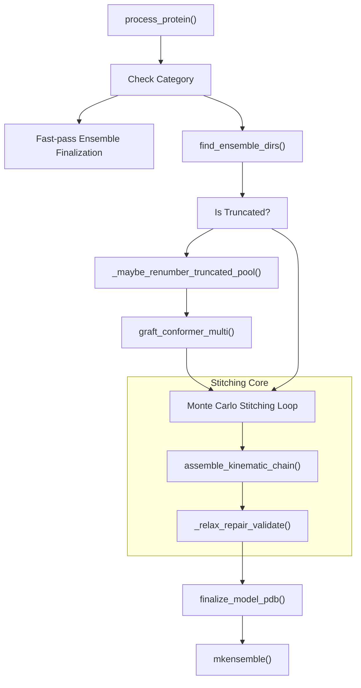
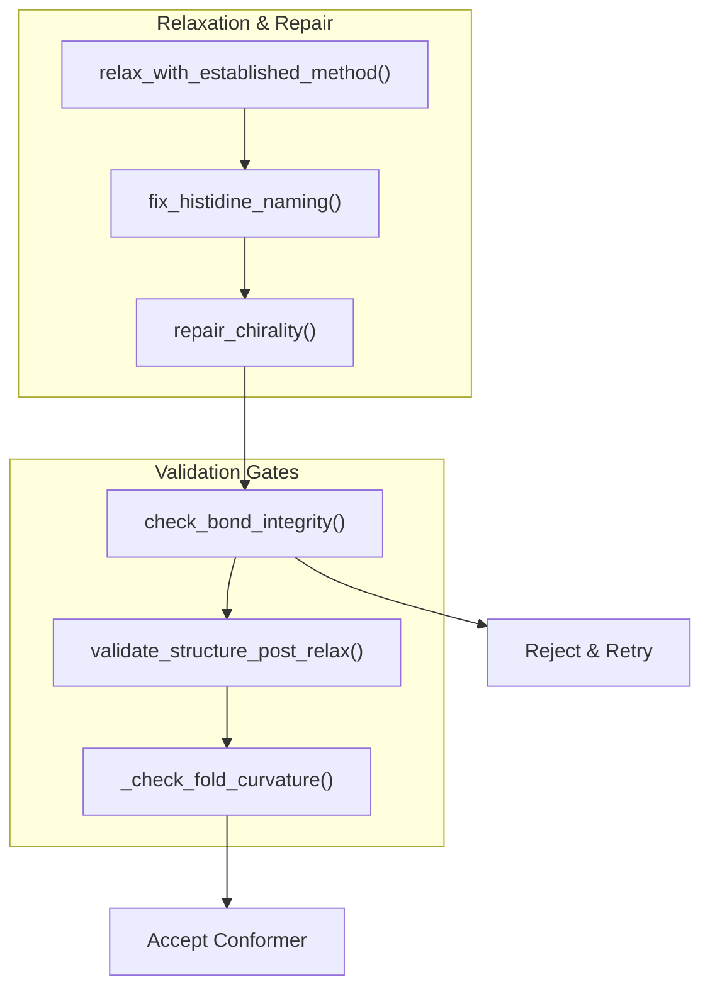

# Step 4: Kinematic Stitching & Ensemble Assembly

> **Relevant source files**
> * [AlphaFlex/Step_4_ldr_stitch.py](https://github.com/THGLab/IDPForge/blob/a12c2846/AlphaFlex/Step_4_ldr_stitch.py)
> * [AlphaFlex/utils/graft_back.py](https://github.com/THGLab/IDPForge/blob/a12c2846/AlphaFlex/utils/graft_back.py)
> * [AlphaFlex/utils/stitch.py](https://github.com/THGLab/IDPForge/blob/a12c2846/AlphaFlex/utils/stitch.py)
> * [AlphaFlex/utils/truncate.py](https://github.com/THGLab/IDPForge/blob/a12c2846/AlphaFlex/utils/truncate.py)

Step 4 is the final stage of the AlphaFlex pipeline, responsible for integrating independently sampled Intrinsically Disordered Regions (IDRs) into their respective folded domain contexts to produce full-length protein ensembles. This process utilizes kinematic chain assembly to ensure geometric continuity, followed by physics-based relaxation and a multi-tiered structural validation gate.

### Overview of Assembly Workflow

The stitching process in `Step_4_ldr_stitch.py` handles three primary structural categories:

1. **Category-0 (Full IDPs):** Fast-pass assembly that bypasses kinematic stitching, focusing on ensemble PDB finalization.
2. **Category-1/2 (Tails and Linkers):** Kinematic assembly of one or more IDRs onto a static folded template.
3. **Category-3 (Loops):** Complex stitching requiring two-point kinematic anchors to maintain loop closure.

For proteins that were truncated during Step 2 to fit within memory limits, this step performs a "Graft-Back" operation to restore the full-length sequence before relaxation.

Sources: [AlphaFlex/Step_4_ldr_stitch.py L1-L12](https://github.com/THGLab/IDPForge/blob/a12c2846/AlphaFlex/Step_4_ldr_stitch.py#L1-L12)

 | [AlphaFlex/utils/stitch.py L112-L128](https://github.com/THGLab/IDPForge/blob/a12c2846/AlphaFlex/utils/stitch.py#L112-L128)

---

### Implementation Architecture

The following diagram maps the high-level logic of `Step_4_ldr_stitch.py` to the underlying code entities and utility functions.

**Kinematic Assembly Logic Flow**

Sources: [AlphaFlex/Step_4_ldr_stitch.py L23-L50](https://github.com/THGLab/IDPForge/blob/a12c2846/AlphaFlex/Step_4_ldr_stitch.py#L23-L50)

 [AlphaFlex/Step_4_ldr_stitch.py L191-L220](https://github.com/THGLab/IDPForge/blob/a12c2846/AlphaFlex/Step_4_ldr_stitch.py#L191-L220)

 [AlphaFlex/utils/stitch.py L132-L165](https://github.com/THGLab/IDPForge/blob/a12c2846/AlphaFlex/utils/stitch.py#L132-L165)

---

### Kinematic Chain Assembly

The core assembly logic resides in `assemble_kinematic_chain` [AlphaFlex/utils/stitch.py L254-L325](https://github.com/THGLab/IDPForge/blob/a12c2846/AlphaFlex/utils/stitch.py#L254-L325)

 It treats the protein as a series of segments (folded domains and disordered regions) and uses BioPython's `Superimposer` to align them at junctions.

#### Segment Mapping and Alignment

The system builds a segment map using `build_segment_map` [AlphaFlex/utils/stitch.py L207-L251](https://github.com/THGLab/IDPForge/blob/a12c2846/AlphaFlex/utils/stitch.py#L207-L251)

 which identifies the sequence ranges for all structural components. For each disordered segment, the assembler:

1. Identifies the **Alignment Stub**: A small set of residues (defined by `ALIGNMENT_STUB_HALF_SIZE` [AlphaFlex/utils/stitch.py L20](https://github.com/THGLab/IDPForge/blob/a12c2846/AlphaFlex/utils/stitch.py#L20-L20) ) at the junction between the folded domain and the IDR.
2. Performs **Rigid Transformation**: Uses the Kabsch algorithm (via `Superimposer`) to transform the IDR conformer coordinates into the coordinate frame of the folded template.
3. **Kinematic Propagation**: As each segment is added, subsequent segments are transformed relative to the new cumulative structure, maintaining the kinematic chain.

Sources: [AlphaFlex/utils/stitch.py L254-L325](https://github.com/THGLab/IDPForge/blob/a12c2846/AlphaFlex/utils/stitch.py#L254-L325)

 [AlphaFlex/utils/graft_back.py L47-L56](https://github.com/THGLab/IDPForge/blob/a12c2846/AlphaFlex/utils/graft_back.py#L47-L56)

---

### Graft-Back for Truncated Pools

For large proteins where IDRs were sampled using truncated templates (Step 2), the `graft_back.py` utility restores the missing folded domains.

| Function | Purpose |
| --- | --- |
| `graft_conformer` | Restores distal folded domains for a single-IDR fragment using a 3-step Kabsch-based graft [AlphaFlex/utils/graft_back.py L93-L160](https://github.com/THGLab/IDPForge/blob/a12c2846/AlphaFlex/utils/graft_back.py#L93-L160) |
| `graft_conformer_multi` | Orchestrates independent grafting of multiple domains for complex linkers [AlphaFlex/utils/graft_back.py L162-L180](https://github.com/THGLab/IDPForge/blob/a12c2846/AlphaFlex/utils/graft_back.py#L162-L180) |
| `renumber_pool` | Maps truncated residue indices back to native UniProt numbering [AlphaFlex/utils/stitch.py L114](https://github.com/THGLab/IDPForge/blob/a12c2846/AlphaFlex/utils/stitch.py#L114-L114) |

The graft quality is monitored via the `junction_gap` and `seam_gap` metrics, which measure the Euclidean distance between the $C\alpha$ atoms at the splice site [AlphaFlex/utils/graft_back.py L145-L159](https://github.com/THGLab/IDPForge/blob/a12c2846/AlphaFlex/utils/graft_back.py#L145-L159)

Sources: [AlphaFlex/utils/graft_back.py L93-L180](https://github.com/THGLab/IDPForge/blob/a12c2846/AlphaFlex/utils/graft_back.py#L93-L180)

 [AlphaFlex/utils/truncate.py L5-L63](https://github.com/THGLab/IDPForge/blob/a12c2846/AlphaFlex/utils/truncate.py#L5-L63)

---

### The _relax_repair_validate Quality Gate

Every stitched conformer must pass a multi-stage quality gate before being accepted into the final ensemble. This is encapsulated in `_relax_repair_validate` [AlphaFlex/Step_4_ldr_stitch.py L256-L320](https://github.com/THGLab/IDPForge/blob/a12c2846/AlphaFlex/Step_4_ldr_stitch.py#L256-L320)

**Validation and Repair Pipeline**

#### AMBER Relaxation with Restraints

The function `relax_with_established_method` [AlphaFlex/Step_4_ldr_stitch.py L128-L189](https://github.com/THGLab/IDPForge/blob/a12c2846/AlphaFlex/Step_4_ldr_stitch.py#L128-L189)

 performs energy minimization using the AMBER99SB forcefield via OpenMM. Crucially, it applies harmonic restraints to the folded domains while allowing the IDRs to relax freely. This is controlled by the `idr_indices` passed to the `viol_mask` in `relax_protein` [AlphaFlex/Step_4_ldr_stitch.py L163-L171](https://github.com/THGLab/IDPForge/blob/a12c2846/AlphaFlex/Step_4_ldr_stitch.py#L163-L171)

#### Structural Integrity Checks

* **Chirality Repair:** `repair_chirality` [AlphaFlex/Step_4_ldr_stitch.py L102](https://github.com/THGLab/IDPForge/blob/a12c2846/AlphaFlex/Step_4_ldr_stitch.py#L102-L102)  corrects D-amino acids and improper planarity resulting from the stitching or relaxation process.
* **Bond Integrity:** `check_bond_integrity` [AlphaFlex/Step_4_ldr_stitch.py L103](https://github.com/THGLab/IDPForge/blob/a12c2846/AlphaFlex/Step_4_ldr_stitch.py#L103-L103)  ensures no unphysical bond lengths exist at the kinematic junctions.
* **Fold Curvature:** `_check_fold_curvature` [AlphaFlex/Step_4_ldr_stitch.py L91](https://github.com/THGLab/IDPForge/blob/a12c2846/AlphaFlex/Step_4_ldr_stitch.py#L91-L91)  validates that the static folded domains have not been distorted during relaxation.

Sources: [AlphaFlex/Step_4_ldr_stitch.py L128-L189](https://github.com/THGLab/IDPForge/blob/a12c2846/AlphaFlex/Step_4_ldr_stitch.py#L128-L189)

 [AlphaFlex/Step_4_ldr_stitch.py L256-L320](https://github.com/THGLab/IDPForge/blob/a12c2846/AlphaFlex/Step_4_ldr_stitch.py#L256-L320)

 [idpforge/utils/relax.py L89](https://github.com/THGLab/IDPForge/blob/a12c2846/idpforge/utils/relax.py#L89-L89)

---

### Ensemble Finalization

Once the target number of conformers (defined in `config.py`) is reached, the single-model PDBs are aggregated.

1. **PDB Finalization:** `finalize_model_pdb` [AlphaFlex/Step_4_ldr_stitch.py L90](https://github.com/THGLab/IDPForge/blob/a12c2846/AlphaFlex/Step_4_ldr_stitch.py#L90-L90)  adds necessary metadata, TER records, and standardizes atom naming.
2. **Ensemble Concatenation:** `mkensemble` [AlphaFlex/Step_4_ldr_stitch.py L38-L48](https://github.com/THGLab/IDPForge/blob/a12c2846/AlphaFlex/Step_4_ldr_stitch.py#L38-L48)  reads the validated PDB files and concatenates them into a single multi-MODEL PDB file, removing redundant headers like `CRYST1` or `MASTER` records.
3. **Stale Cleanup:** `_clear_stale_ensembles` [AlphaFlex/Step_4_ldr_stitch.py L62-L69](https://github.com/THGLab/IDPForge/blob/a12c2846/AlphaFlex/Step_4_ldr_stitch.py#L62-L69)  ensures that previous failed or incomplete runs do not contaminate the final output directory.

Sources: [AlphaFlex/Step_4_ldr_stitch.py L38-L69](https://github.com/THGLab/IDPForge/blob/a12c2846/AlphaFlex/Step_4_ldr_stitch.py#L38-L69)

 [idpforge/misc.py L90](https://github.com/THGLab/IDPForge/blob/a12c2846/idpforge/misc.py#L90-L90)