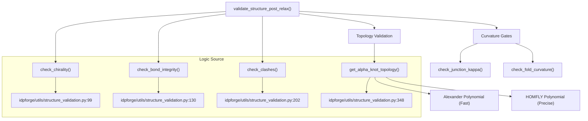
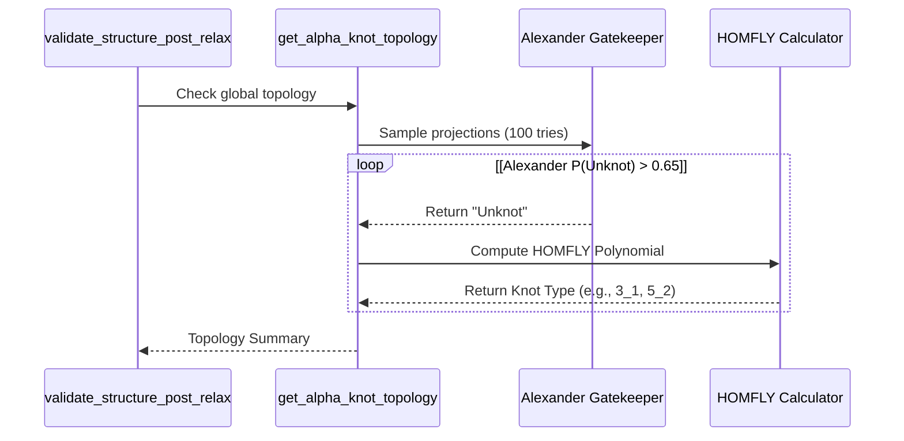

# Structural Validation Suite

> **Relevant source files**
> * [idpforge/utils/structure_validation.py](https://github.com/THGLab/IDPForge/blob/a12c2846/idpforge/utils/structure_validation.py)

The Structural Validation Suite, primarily implemented in `idpforge/utils/structure_validation.py`, provides a comprehensive set of geometric and topological checks to ensure the physical viability of generated protein ensembles. It is executed as a post-generation quality gate, particularly within the AlphaFlex pipeline's ensemble assembly stage.

## Core Validation Workflow

The primary entry point for validation is `validate_structure_post_relax()`. This function orchestrates a series of checks ranging from basic chemical integrity to complex knot topology analysis.

### Data Flow and Initialization

The suite accepts an OpenMM `Topology` and `Positions` object. It converts these to high-precision `float64` NumPy arrays to avoid rounding errors during geometric calculations [idpforge/utils/structure_validation.py L89-L94](https://github.com/THGLab/IDPForge/blob/a12c2846/idpforge/utils/structure_validation.py#L89-L94)

### Validation Sequence

1. **Chirality Check**: Ensures all non-glycine residues maintain L-amino acid stereochemistry [idpforge/utils/structure_validation.py L99-L100](https://github.com/THGLab/IDPForge/blob/a12c2846/idpforge/utils/structure_validation.py#L99-L100)
2. **Bond Integrity**: Uses a graph-based comparison to detect broken covalent bonds [idpforge/utils/structure_validation.py L130-L131](https://github.com/THGLab/IDPForge/blob/a12c2846/idpforge/utils/structure_validation.py#L130-L131)
3. **Clash Detection**: Identifies steric overlaps between non-bonded heavy atoms [idpforge/utils/structure_validation.py L202-L203](https://github.com/THGLab/IDPForge/blob/a12c2846/idpforge/utils/structure_validation.py#L202-L203)
4. **Topology (Knot) Analysis**: Employs a hybrid Alexander-HOMFLY polynomial approach to classify the global and domain-specific fold topology [idpforge/utils/structure_validation.py L348-L350](https://github.com/THGLab/IDPForge/blob/a12c2846/idpforge/utils/structure_validation.py#L348-L350)
5. **Curvature Gating**: Measures the geometric strain at junction points and within folded domains [idpforge/utils/structure_validation.py L449-L450](https://github.com/THGLab/IDPForge/blob/a12c2846/idpforge/utils/structure_validation.py#L449-L450)

**Sources:** [idpforge/utils/structure_validation.py L89-L203](https://github.com/THGLab/IDPForge/blob/a12c2846/idpforge/utils/structure_validation.py#L89-L203)

 [idpforge/utils/structure_validation.py L348-L450](https://github.com/THGLab/IDPForge/blob/a12c2846/idpforge/utils/structure_validation.py#L348-L450)

---

## Geometric Integrity Checks

### Chirality Validation

The `check_chirality()` function validates the $C_\alpha$ stereocenter. For each residue (excluding Glycine), it calculates the **scalar triple product** of the vectors from $C_\alpha$ to $N$, $C$, and $C_\beta$ [idpforge/utils/structure_validation.py L109-L114](https://github.com/THGLab/IDPForge/blob/a12c2846/idpforge/utils/structure_validation.py#L109-L114)

* **Threshold**: A volume $< 1.0 \text{ \AA}^3$ is flagged as a violation (D-amino acid or distorted planar geometry) [idpforge/utils/structure_validation.py L116-L118](https://github.com/THGLab/IDPForge/blob/a12c2846/idpforge/utils/structure_validation.py#L116-L118)

### Bond Integrity

`check_bond_integrity()` performs an atom-name-agnostic graph comparison. It builds an "expected" bond graph from the topology and an "observed" graph based on a distance cutoff (default 2.0 \AA) [idpforge/utils/structure_validation.py L121-L122](https://github.com/THGLab/IDPForge/blob/a12c2846/idpforge/utils/structure_validation.py#L121-L122)

 [idpforge/utils/structure_validation.py L166](https://github.com/THGLab/IDPForge/blob/a12c2846/idpforge/utils/structure_validation.py#L166-L166)

 If the degree sequences of these graphs do not match, the residue is flagged for broken covalent bonds [idpforge/utils/structure_validation.py L170-L175](https://github.com/THGLab/IDPForge/blob/a12c2846/idpforge/utils/structure_validation.py#L170-L175)

### Steric Clash Detection

Clashes are detected using a `cKDTree` for efficient neighbor searching [idpforge/utils/structure_validation.py L214](https://github.com/THGLab/IDPForge/blob/a12c2846/idpforge/utils/structure_validation.py#L214-L214)

* **Radius**: The system uses VDW radii (C: 1.70, N: 1.55, O: 1.52, S: 1.80) [idpforge/utils/structure_validation.py L20](https://github.com/THGLab/IDPForge/blob/a12c2846/idpforge/utils/structure_validation.py#L20-L20)
* **Gate**: A clash is defined as two non-bonded heavy atoms closer than $0.7 \times (\text{vdw}_1 + \text{vdw}_2)$ [idpforge/utils/structure_validation.py L216](https://github.com/THGLab/IDPForge/blob/a12c2846/idpforge/utils/structure_validation.py#L216-L216)

**Sources:** [idpforge/utils/structure_validation.py L19-L20](https://github.com/THGLab/IDPForge/blob/a12c2846/idpforge/utils/structure_validation.py#L19-L20)

 [idpforge/utils/structure_validation.py L99-L186](https://github.com/THGLab/IDPForge/blob/a12c2846/idpforge/utils/structure_validation.py#L99-L186)

 [idpforge/utils/structure_validation.py L202-L225](https://github.com/THGLab/IDPForge/blob/a12c2846/idpforge/utils/structure_validation.py#L202-L225)

---

## AlphaKnot2 Hybrid Topology Classification

The suite implements a robust topology engine in `get_alpha_knot_topology()` to prevent the generation of spurious knots in IDRs or the loss of native knots in folded domains.

### The Hybrid Approach

1. **Alexander Polynomial**: A fast, probabilistic check (`ALEXANDER_TRIES = 100`) acts as a gatekeeper [idpforge/utils/structure_validation.py L23-L25](https://github.com/THGLab/IDPForge/blob/a12c2846/idpforge/utils/structure_validation.py#L23-L25)  If the Alexander polynomial indicates an unknot with high probability, the structure is cleared quickly.
2. **HOMFLY Polynomial**: If the Alexander check is ambiguous or indicates a knot, the system invokes the `pyknotid` library to calculate the HOMFLY polynomial, which is a more powerful topological invariant [idpforge/utils/structure_validation.py L382-L390](https://github.com/THGLab/IDPForge/blob/a12c2846/idpforge/utils/structure_validation.py#L382-L390)

### Domain-Specific Validation

The function `validate_per_domain_knots()` compares the observed topology of specific residue ranges against an expected `knot_screening.json` specification [idpforge/utils/structure_validation.py L47-L69](https://github.com/THGLab/IDPForge/blob/a12c2846/idpforge/utils/structure_validation.py#L47-L69)

 [idpforge/utils/structure_validation.py L421-L425](https://github.com/THGLab/IDPForge/blob/a12c2846/idpforge/utils/structure_validation.py#L421-L425)

 This ensures that if a protein is known to be a 3_1 knot (trefoil), the generated ensemble preserves that specific topology [idpforge/utils/structure_validation.py L435-L440](https://github.com/THGLab/IDPForge/blob/a12c2846/idpforge/utils/structure_validation.py#L435-L440)

**Sources:** [idpforge/utils/structure_validation.py L22-L44](https://github.com/THGLab/IDPForge/blob/a12c2846/idpforge/utils/structure_validation.py#L22-L44)

 [idpforge/utils/structure_validation.py L348-L440](https://github.com/THGLab/IDPForge/blob/a12c2846/idpforge/utils/structure_validation.py#L348-L440)

---

## Curvature and Junction Gates

To prevent unphysical "kinks" at the transition between folded domains and disordered linkers, the suite applies curvature constraints.

### Junction Kappa

`check_junction_kappa()` calculates the local curvature ($\kappa$) at the junction points defined in the graft specification. It uses a sliding window (default 20 residues) to compute the angle between segments [idpforge/utils/structure_validation.py L33](https://github.com/THGLab/IDPForge/blob/a12c2846/idpforge/utils/structure_validation.py#L33-L33)

 [idpforge/utils/structure_validation.py L449-L455](https://github.com/THGLab/IDPForge/blob/a12c2846/idpforge/utils/structure_validation.py#L449-L455)

### Fold Curvature

`check_fold_curvature()` ensures that the internal geometry of the folded domains has not been distorted during the diffusion or relaxation process [idpforge/utils/structure_validation.py L476-L480](https://github.com/THGLab/IDPForge/blob/a12c2846/idpforge/utils/structure_validation.py#L476-L480)

 It computes the mean curvature of the $C_\alpha$ trace within the domain and flags structures exceeding the `fold_kappa_max` threshold [idpforge/utils/structure_validation.py L490-L495](https://github.com/THGLab/IDPForge/blob/a12c2846/idpforge/utils/structure_validation.py#L490-L495)

| Gate | Function | Threshold Parameter | Purpose |
| --- | --- | --- | --- |
| **Junction** | `check_junction_kappa` | `junction_kappa_max` | Prevents sharp V-shaped kinks at IDR-Folded interfaces. |
| **Fold** | `check_fold_curvature` | `fold_kappa_max` | Detects global deformation of folded templates. |
| **Knot** | `validate_per_domain_knots` | `knot_screening.json` | Ensures topological consistency with native state. |

**Sources:** [idpforge/utils/structure_validation.py L33](https://github.com/THGLab/IDPForge/blob/a12c2846/idpforge/utils/structure_validation.py#L33-L33)

 [idpforge/utils/structure_validation.py L449-L500](https://github.com/THGLab/IDPForge/blob/a12c2846/idpforge/utils/structure_validation.py#L449-L500)