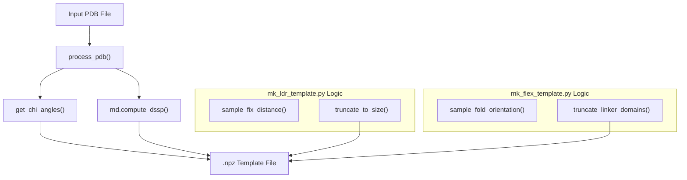

# Template Preparation Utilities

> **Relevant source files**
> * [mk_flex_template.py](https://github.com/THGLab/IDPForge/blob/a12c2846/mk_flex_template.py)
> * [mk_ldr_template.py](https://github.com/THGLab/IDPForge/blob/a12c2846/mk_ldr_template.py)
> * [slice_pdb.py](https://github.com/THGLab/IDPForge/blob/a12c2846/slice_pdb.py)

The template preparation utilities provide the necessary pre-processing to generate `.npz` files used by the inference engine (`sample_ldr.py`). These utilities handle the extraction of structural data from PDB files, size-capping for large proteins, and the initialization of disordered region coordinates via geometric sampling or random domain placement.

## Core Utilities Overview

The pipeline utilizes two primary scripts to prepare templates based on the protein's architecture:

1. **`mk_ldr_template.py`**: Used for Intrinsically Disordered Regions (IDRs) that are flanking or embedded within a static folded context (e.g., N/C-terminal tails or loops).
2. **`mk_flex_template.py`**: Used for flexible multi-domain proteins where a linker connects two folded domains that can rotate and translate relative to one another.

### System Mapping: Utilities to Code Entities

The following diagram maps the logical preparation steps to the specific functions and classes in the codebase.

**Template Preparation Data Flow**

**Sources:** `mk_ldr_template.py` [132-143](https://github.com/THGLab/IDPForge/blob/a12c2846/132-143)

 `mk_flex_template.py` [181-195](https://github.com/THGLab/IDPForge/blob/a12c2846/181-195)

---

## Folded Domain Extraction and Feature Encoding

Both utilities begin by extracting atomic coordinates and sequence information using `process_pdb` [mk_ldr_template.py L132](https://github.com/THGLab/IDPForge/blob/a12c2846/mk_ldr_template.py#L132-L132)

 The scripts then calculate essential structural features required by the IDPForge model:

* **Torsion Angles**: Side-chain $\chi$ angles are calculated via `get_chi_angles` and converted into $(\sin, \cos)$ pairs [mk_ldr_template.py L133-L134](https://github.com/THGLab/IDPForge/blob/a12c2846/mk_ldr_template.py#L133-L134)
* **Secondary Structure (SS)**: SS is derived using MDTraj's DSSP implementation [mk_ldr_template.py L137](https://github.com/THGLab/IDPForge/blob/a12c2846/mk_ldr_template.py#L137-L137)  For residues not classified as Helix (H) or Sheet (E), the `assign_rama` function classifies them based on $(\phi, \psi)$ angles into Ramachandran-based categories (e.g., 'P' for Polyproline II, 'B' for Beta-like) [mk_ldr_template.py L142-L143](https://github.com/THGLab/IDPForge/blob/a12c2846/mk_ldr_template.py#L142-L143)

**Sources:** `mk_ldr_template.py` [132-143](https://github.com/THGLab/IDPForge/blob/a12c2846/132-143)

 `mk_flex_template.py` [181-195](https://github.com/THGLab/IDPForge/blob/a12c2846/181-195)

---

## Static IDR Initialization (mk_ldr_template.py)

For proteins with static folded domains, the script must provide "seed" coordinates for the disordered regions to initialize the diffusion process.

### Seed-Distance Sampling

The function `sample_fix_distance` generates initial CA coordinates for the first residue of an IDR tail or the midpoint of an IDR loop.

* It samples points on a sphere with a radius between `SEED_FLOOR` (6.46 Å) and `SEED_CEILING` (9.12 Å) [mk_ldr_template.py L23-L24](https://github.com/THGLab/IDPForge/blob/a12c2846/mk_ldr_template.py#L23-L24)
* To prevent steric clashes in the initial template, it drops any sampled points within `min_fold_dist` of existing folded CA atoms [mk_ldr_template.py L40-L56](https://github.com/THGLab/IDPForge/blob/a12c2846/mk_ldr_template.py#L40-L56)

### Size-Capping and Truncation

For proteins exceeding the model's capacity (e.g., `max_residues`), the `_truncate_to_size` function trims the folded domains while preserving the junction interface.

* **Budget Allocation**: It ensures the total system (IDR + kept fold) fits within `max_residues`.
* **Junction Preservation**: It maintains a minimum of 10 residues (default) per side of the IDR to ensure the model captures the junction geometry [mk_ldr_template.py L74-L81](https://github.com/THGLab/IDPForge/blob/a12c2846/mk_ldr_template.py#L74-L81)
* **Graft Specification**: The script outputs a `graft_offset` and `graft_fold_range` in the `.npz` file, which is used by the AlphaFlex Step 4 stitching logic to reassemble the full-length protein [mk_ldr_template.py L111-L116](https://github.com/THGLab/IDPForge/blob/a12c2846/mk_ldr_template.py#L111-L116)

**Sources:** `mk_ldr_template.py` [40-56](https://github.com/THGLab/IDPForge/blob/a12c2846/40-56)

 [59-125](https://github.com/THGLab/IDPForge/blob/a12c2846/59-125)

---

## Flexible Domain Placement (mk_flex_template.py)

When modeling a linker between two domains, the domains are treated as rigid bodies that are randomly oriented to create a diverse starting ensemble.

### Random SO(3) Transformations

The script applies random rotations and translations to the second domain (`fold2`) relative to the first (`fold1`).

* **Rotation**: Uses `scipy.spatial.transform.Rotation.random()` to sample uniformly from the SO(3) group [mk_flex_template.py L29-L31](https://github.com/THGLab/IDPForge/blob/a12c2846/mk_flex_template.py#L29-L31)
* **Translation**: The distance $d$ between domains is sampled from a normal distribution based on Flory’s polymer theory: $d = 5.51 \times L^{0.588}$, where $L$ is the linker length [mk_flex_template.py L98-L99](https://github.com/THGLab/IDPForge/blob/a12c2846/mk_flex_template.py#L98-L99)

### Collision Detection

The function `random_nonclashing_transform_scaled` uses a `KDTree` to ensure that the randomly placed domains do not clash (minimum distance > 3.8 Å) [mk_flex_template.py L48-L84](https://github.com/THGLab/IDPForge/blob/a12c2846/mk_flex_template.py#L48-L84)

 If a non-clashing pose cannot be found after `max_attempts`, it falls back to a potentially clashing pose to allow the diffusion process to resolve the geometry [mk_flex_template.py L127-L139](https://github.com/THGLab/IDPForge/blob/a12c2846/mk_flex_template.py#L127-L139)

**Sources:** `mk_flex_template.py` [29-31](https://github.com/THGLab/IDPForge/blob/a12c2846/29-31)

 [48-84](https://github.com/THGLab/IDPForge/blob/a12c2846/48-84)

 [98-102](https://github.com/THGLab/IDPForge/blob/a12c2846/98-102)

---

## The .npz Template Format

The output of these utilities is a compressed NumPy file containing the following keys:

| Key | Description |
| --- | --- |
| `coord` | `(L, 37, 3)` array of atomic coordinates (all-atom). |
| `torsion` | `(L, 7, 2)` array of $(\sin, \cos)$ for $\chi$ angles. |
| `mask` | `(L,)` boolean mask (True for folded, False for IDR). |
| `seq` | One-letter amino acid sequence string. |
| `sec` | Secondary structure encoding string (H, E, C, P, B, etc.). |
| `graft_offset` | (Optional) Index offset for re-stitching truncated domains. |

**Sources:** `mk_ldr_template.py` [108-125](https://github.com/THGLab/IDPForge/blob/a12c2846/108-125)

 `mk_flex_template.py` [220-230](https://github.com/THGLab/IDPForge/blob/a12c2846/220-230)

---

## Auxiliary PDB Slicing

The `slice_pdb.py` script is a standalone utility used to extract specific residue ranges from a PDB file. It is frequently used to isolate a single domain from a multi-domain AF2 structure before passing it to the template preparation scripts.

* **Logic**: It parses `ATOM` and `HETATM` records and filters by the `resSeq` field [slice_pdb.py L15-L20](https://github.com/THGLab/IDPForge/blob/a12c2846/slice_pdb.py#L15-L20)
* **Renumbering**: It can optionally renumber the output PDB starting from 1 using the `--renumber` flag [slice_pdb.py L21-L22](https://github.com/THGLab/IDPForge/blob/a12c2846/slice_pdb.py#L21-L22)

**Sources:** `slice_pdb.py` [7-40](https://github.com/THGLab/IDPForge/blob/a12c2846/7-40)