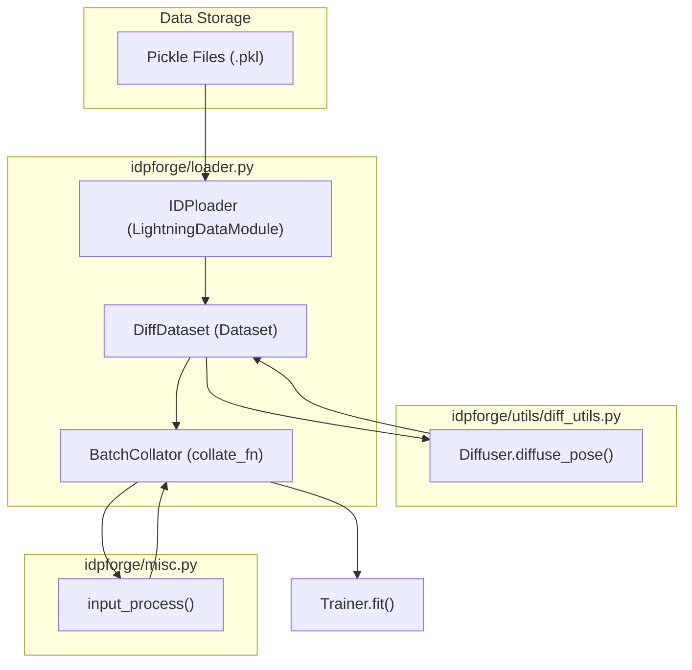

# Training Entrypoint & Data Loading

> **Relevant source files**
> * [configs/train.yml](https://github.com/THGLab/IDPForge/blob/a12c2846/configs/train.yml)
> * [idpforge/loader.py](https://github.com/THGLab/IDPForge/blob/a12c2846/idpforge/loader.py)
> * [train.py](https://github.com/THGLab/IDPForge/blob/a12c2846/train.py)

This section documents the training infrastructure of IDPForge, focusing on the `train.py` entrypoint and the data pipeline implemented in `idpforge/loader.py`. The pipeline handles the ingestion of protein conformational ensembles, applies diffusion noise in both Euclidean and torsional spaces, and batches the resulting data for the neural network.

## Training Entrypoint

The training process is orchestrated by `train.py`, which utilizes **PyTorch Lightning** to manage the training loop, checkpointing, and logging [train.py L14-L17](https://github.com/THGLab/IDPForge/blob/a12c2846/train.py#L14-L17)

 It serves as the bridge between the configuration files, the data loading module, and the model wrapper.

### Initialization and Configuration

The script begins by initializing the `Diffuser` and `Denoiser` objects using parameters defined in the `diffuse` section of the configuration YAML [train.py L25-L28](https://github.com/THGLab/IDPForge/blob/a12c2846/train.py#L25-L28)

 These objects define the noise schedules for Euclidean coordinates and torsion angles.

The training configuration (typically `configs/train.yml`) specifies critical hyperparameters:

* **Data Paths**: Locations for training and validation pickle files [configs/train.yml L9-L12](https://github.com/THGLab/IDPForge/blob/a12c2846/configs/train.yml#L9-L12)
* **Batch Sizes**: Separate sizes for training and validation [configs/train.yml L13-L14](https://github.com/THGLab/IDPForge/blob/a12c2846/configs/train.yml#L13-L14)
* **Trainer Settings**: Gradient clipping, accumulation, and hardware acceleration (GPU) [configs/train.yml L23-L27](https://github.com/THGLab/IDPForge/blob/a12c2846/configs/train.yml#L23-L27)
* **Loss Weights**: Balancing factors for FAPE, distance, angular, and violation losses [configs/train.yml L31-L35](https://github.com/THGLab/IDPForge/blob/a12c2846/configs/train.yml#L31-L35)

### Checkpointing and Callbacks

`train.py` implements several `ModelCheckpoint` strategies to ensure robust training recovery and model selection:

1. **Best 5**: Saves the top 5 models based on `val_loss` [train.py L59-L67](https://github.com/THGLab/IDPForge/blob/a12c2846/train.py#L59-L67)
2. **Latest 10**: Keeps the 10 most recent checkpoints for resume capability [train.py L70-L78](https://github.com/THGLab/IDPForge/blob/a12c2846/train.py#L70-L78)
3. **Periodic**: Saves a checkpoint every 10 epochs regardless of performance [train.py L81-L86](https://github.com/THGLab/IDPForge/blob/a12c2846/train.py#L81-L86)

Sources: [train.py L21-L118](https://github.com/THGLab/IDPForge/blob/a12c2846/train.py#L21-L118)

 [configs/train.yml L1-L60](https://github.com/THGLab/IDPForge/blob/a12c2846/configs/train.yml#L1-L60)

## Data Loading Architecture

The data loading system is built around the `IDPloader` (a `LightningDataModule`), which manages the `DiffDataset` and `BatchCollator`.

### Data Flow Overview

The following diagram illustrates how raw protein data is transformed into diffused training batches.

**Training Data Flow: From Pickle to Batch**

Sources: [idpforge/loader.py L18-L144](https://github.com/THGLab/IDPForge/blob/a12c2846/idpforge/loader.py#L18-L144)

 [train.py L29-L36](https://github.com/THGLab/IDPForge/blob/a12c2846/train.py#L29-L36)

### DiffDataset Implementation

The `DiffDataset` class is responsible for loading the ground truth coordinates, sequences, and secondary structure (SS) labels. Its primary role is to apply the diffusion process to each sample during the `__getitem__` call [idpforge/loader.py L62-L99](https://github.com/THGLab/IDPForge/blob/a12c2846/idpforge/loader.py#L62-L99)

* **Noise Injection**: It calls `diffuse_pose()` from the `Diffuser` to generate noisy coordinates (`x_t`) and noisy torsion angles (`alpha_t`) [idpforge/loader.py L63-L64](https://github.com/THGLab/IDPForge/blob/a12c2846/idpforge/loader.py#L63-L64)
* **Time-Step Sampling**: During training, a time-step $T$ is sampled using a weighted distribution where later time-steps (more noise) are prioritized [idpforge/loader.py L67-L68](https://github.com/THGLab/IDPForge/blob/a12c2846/idpforge/loader.py#L67-L68)
* **Torsion & Frame Calculation**: It calculates the ground truth dihedral angles (omega, phi, psi, chi) and transforms them into local reference frames using `torsion_angles_to_frames` [idpforge/loader.py L75-L86](https://github.com/THGLab/IDPForge/blob/a12c2846/idpforge/loader.py#L75-L86)

### BatchCollator and Input Processing

Because protein sequences vary in length, the `BatchCollator` handles padding and tensor alignment. It utilizes `input_process()` from `idpforge/misc.py` to convert raw sequence strings and SS strings into numerical embeddings and generate attention masks [idpforge/loader.py L24-L29](https://github.com/THGLab/IDPForge/blob/a12c2846/idpforge/loader.py#L24-L29)

Key outputs of the collator include:

* `sequence`: Padded token IDs for the ESM2 trunk.
* `ss`: Padded secondary structure encodings.
* `x_t` / `alpha_t`: Noisy Euclidean and torsional inputs for the denoiser.
* `T`: The diffusion time-step, broadcasted across the residue dimension [idpforge/loader.py L40-L41](https://github.com/THGLab/IDPForge/blob/a12c2846/idpforge/loader.py#L40-L41)

Sources: [idpforge/loader.py L18-L45](https://github.com/THGLab/IDPForge/blob/a12c2846/idpforge/loader.py#L18-L45)

 [idpforge/loader.py L48-L100](https://github.com/THGLab/IDPForge/blob/a12c2846/idpforge/loader.py#L48-L100)

## Code Entity Mapping

This diagram maps the conceptual training stages to the specific classes and functions in the codebase.

**System Entity Mapping**

Sources: [train.py L21-L39](https://github.com/THGLab/IDPForge/blob/a12c2846/train.py#L21-L39)

 [idpforge/loader.py L18-L102](https://github.com/THGLab/IDPForge/blob/a12c2846/idpforge/loader.py#L18-L102)

 [idpforge/utils/diff_utils.py L14-L15](https://github.com/THGLab/IDPForge/blob/a12c2846/idpforge/utils/diff_utils.py#L14-L15)

## Training Data Format

The training data is stored as pickle files containing four main components:

1. **SS**: Secondary structure labels (strings or integer encodings).
2. **Sequence**: Amino acid sequences.
3. **Coords**: Ground truth atomic coordinates (typically $N, CA, C, O, CB$).
4. **RGs**: (Optional) Radius of Gyration values for validation metrics.

These are loaded into `DiffDataset` as a list of tuples or dictionaries [idpforge/loader.py L126-L128](https://github.com/THGLab/IDPForge/blob/a12c2846/idpforge/loader.py#L126-L128)

Sources: [idpforge/loader.py L49-L56](https://github.com/THGLab/IDPForge/blob/a12c2846/idpforge/loader.py#L49-L56)

 [idpforge/loader.py L121-L131](https://github.com/THGLab/IDPForge/blob/a12c2846/idpforge/loader.py#L121-L131)