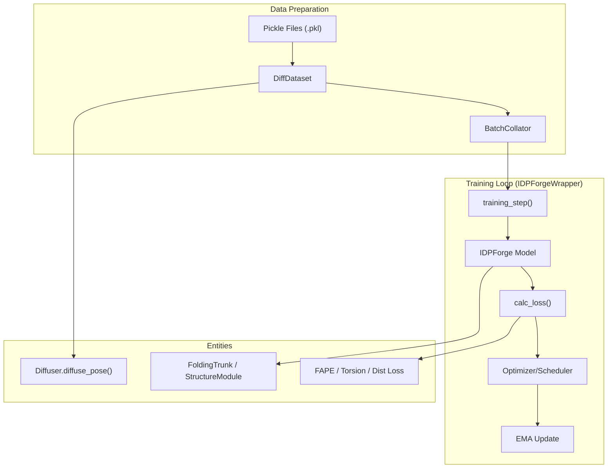
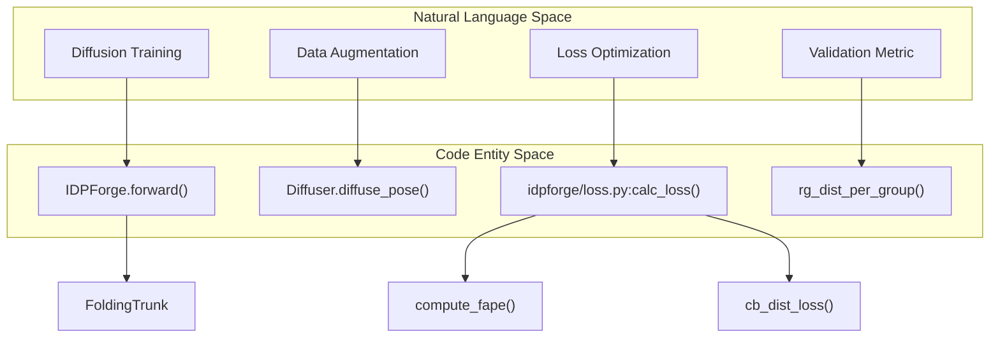

# Training Pipeline

> **Relevant source files**
> * [idpforge/loader.py](https://github.com/THGLab/IDPForge/blob/a12c2846/idpforge/loader.py)
> * [idpforge/loss.py](https://github.com/THGLab/IDPForge/blob/a12c2846/idpforge/loss.py)
> * [idpforge/utils/validation_metrics.py](https://github.com/THGLab/IDPForge/blob/a12c2846/idpforge/utils/validation_metrics.py)
> * [idpforge/wrapper.py](https://github.com/THGLab/IDPForge/blob/a12c2846/idpforge/wrapper.py)
> * [train.py](https://github.com/THGLab/IDPForge/blob/a12c2846/train.py)

The training pipeline for IDPForge is built on **PyTorch Lightning**, providing a structured framework for training the diffusion model on intrinsically disordered protein (IDP) ensembles. The pipeline handles the orchestration of rotational and Euclidean diffusion schedules, complex loss calculations including structural violations and secondary structure-aware distance losses, and model weight management via Exponential Moving Average (EMA).

## Training Architecture Overview

The training process is centralized in `train.py`, which initializes the diffusion parameters, data modules, and the model wrapper.

### Training Flow

The following diagram illustrates the relationship between the data loading, the diffusion process, and the training loop.

**Sources:** [train.py L21-L39](https://github.com/THGLab/IDPForge/blob/a12c2846/train.py#L21-L39)

 [idpforge/wrapper.py L56-L83](https://github.com/THGLab/IDPForge/blob/a12c2846/idpforge/wrapper.py#L56-L83)

 [idpforge/loader.py L18-L45](https://github.com/THGLab/IDPForge/blob/a12c2846/idpforge/loader.py#L18-L45)

---

## Training Entrypoint & Data Loading

The `train.py` script serves as the primary entrypoint. It configures the `Diffuser` and `Denoiser` based on the `n_tsteps` defined in the YAML configuration and passes them to the `IDPloader`.

* **Data Loading:** `IDPloader` (a `LightningDataModule`) manages `DiffDataset` instances that load pre-processed protein ensembles.
* **Diffusion in Dataset:** The `DiffDataset` applies noise to ground-truth coordinates on-the-fly using `diffuser.diffuse_pose()`, generating the $x_t$ (Euclidean) and $\alpha_t$ (torsional) inputs required for the denoising task.
* **Batching:** `BatchCollator` utilizes `input_process()` to handle sequence encoding and secondary structure mapping for variable-length proteins in a single batch.

For details on data formats and the loading mechanism, see [Training Entrypoint & Data Loading](/THGLab/IDPForge/3.1-training-entrypoint-and-data-loading).

**Sources:** [train.py L25-L35](https://github.com/THGLab/IDPForge/blob/a12c2846/train.py#L25-L35)

 [idpforge/loader.py L62-L99](https://github.com/THGLab/IDPForge/blob/a12c2846/idpforge/loader.py#L62-L99)

 [idpforge/loader.py L102-L115](https://github.com/THGLab/IDPForge/blob/a12c2846/idpforge/loader.py#L102-L115)

---

## Loss Functions & Training Wrapper

Training logic is encapsulated in `IDPForgeWrapper`, which inherits from `pl.LightningModule`. It manages the forward pass, loss calculation, and validation metrics.

### Key Components

* **IDPForgeWrapper:** Orchestrates the `training_step` and `validation_step`. It implements **self-conditioning**, where the model occasionally uses its own previous prediction as an input to improve refinement.
* **Loss Function (`calc_loss`):** A composite loss function including: * **FAPE Loss:** Frame Aligned Point Error for backbone and sidechain atoms. * **Torsion Loss:** Measures the error in predicted dihedral angles. * **CB Distance Loss:** A custom distance loss that enforces secondary structure constraints and CA-CA connectivity.
* **EMA & Scheduling:** Uses `ExponentialMovingAverage` to maintain a smoothed version of model weights for validation and inference. The learning rate is managed by `AlphaFoldLRScheduler`.

For details on specific loss terms and the PyTorch Lightning implementation, see [Loss Functions & Training Wrapper](/THGLab/IDPForge/3.2-loss-functions-and-training-wrapper).

**Sources:** [idpforge/wrapper.py L17-L36](https://github.com/THGLab/IDPForge/blob/a12c2846/idpforge/wrapper.py#L17-L36)

 [idpforge/wrapper.py L65-L76](https://github.com/THGLab/IDPForge/blob/a12c2846/idpforge/wrapper.py#L65-L76)

 [idpforge/loss.py L42-L89](https://github.com/THGLab/IDPForge/blob/a12c2846/idpforge/loss.py#L42-L89)

 [idpforge/wrapper.py L133-L135](https://github.com/THGLab/IDPForge/blob/a12c2846/idpforge/wrapper.py#L133-L135)

---

## Training Logic to Code Mapping

This diagram maps high-level training concepts to the specific classes and functions in the IDPForge codebase.

**Sources:** [idpforge/model.py L6-L7](https://github.com/THGLab/IDPForge/blob/a12c2846/idpforge/model.py#L6-L7)

 [idpforge/loss.py L42-L52](https://github.com/THGLab/IDPForge/blob/a12c2846/idpforge/loss.py#L42-L52)

 [idpforge/utils/diff_utils.py L11-L12](https://github.com/THGLab/IDPForge/blob/a12c2846/idpforge/utils/diff_utils.py#L11-L12)

 [idpforge/utils/validation_metrics.py L32-L38](https://github.com/THGLab/IDPForge/blob/a12c2846/idpforge/utils/validation_metrics.py#L32-L38)

## Summary Table of Training Configuration

| Component | Code Reference | Description |
| --- | --- | --- |
| **Model Wrapper** | `IDPForgeWrapper` | PyTorch Lightning module for training/validation. |
| **Loss Calculation** | `calc_loss()` | Aggregates FAPE, torsion, distance, and violation losses. |
| **Data Module** | `IDPloader` | Handles training/validation datasets and multi-worker loading. |
| **LR Scheduler** | `AlphaFoldLRScheduler` | Custom scheduler with warmup and decay steps. |
| **EMA** | `ExponentialMovingAverage` | Maintains stable weights for evaluation. |

**Sources:** [idpforge/wrapper.py L17](https://github.com/THGLab/IDPForge/blob/a12c2846/idpforge/wrapper.py#L17-L17)

 [idpforge/loss.py L42](https://github.com/THGLab/IDPForge/blob/a12c2846/idpforge/loss.py#L42-L42)

 [idpforge/loader.py L102](https://github.com/THGLab/IDPForge/blob/a12c2846/idpforge/loader.py#L102-L102)

 [idpforge/wrapper.py L152](https://github.com/THGLab/IDPForge/blob/a12c2846/idpforge/wrapper.py#L152-L152)

 [idpforge/wrapper.py L27](https://github.com/THGLab/IDPForge/blob/a12c2846/idpforge/wrapper.py#L27-L27)