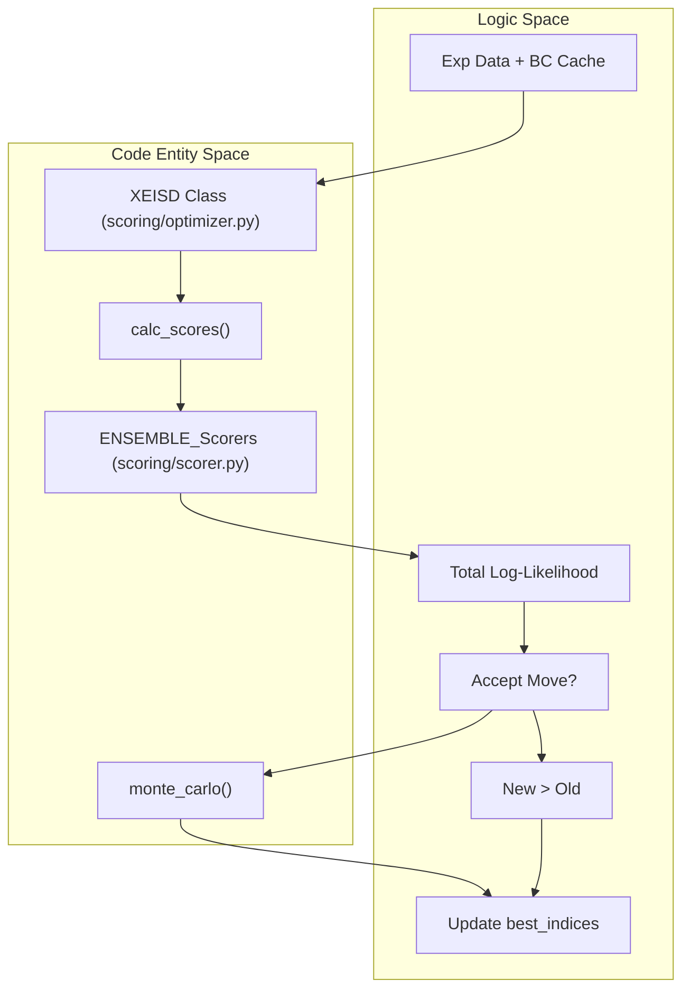
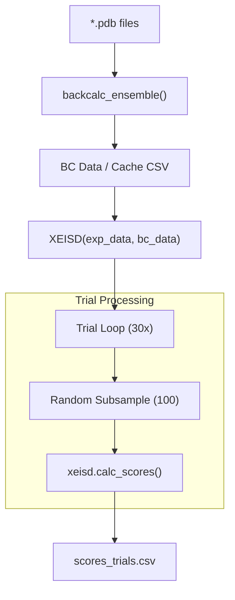

# X-EISD Scoring, Optimization & Normalization

> **Relevant source files**
> * [score_ensemble.py](https://github.com/THGLab/IDPForge/blob/a12c2846/score_ensemble.py)
> * [scoring/normalize.py](https://github.com/THGLab/IDPForge/blob/a12c2846/scoring/normalize.py)
> * [scoring/optimizer.py](https://github.com/THGLab/IDPForge/blob/a12c2846/scoring/optimizer.py)
> * [scoring/rg.py](https://github.com/THGLab/IDPForge/blob/a12c2846/scoring/rg.py)
> * [scoring/scorer.py](https://github.com/THGLab/IDPForge/blob/a12c2846/scoring/scorer.py)

The X-EISD (Experimental Enhanced Information for Structural Distributions) module provides the framework for evaluating generated protein ensembles against experimental data. It implements maximum log-likelihood scoring for multiple experimental observables, provides utilities for ensemble optimization via Monte Carlo sampling, and includes a normalization pipeline for benchmarking against alternative structural models.

## X-EISD Scoring Framework

The scoring system calculates the agreement between back-calculated values from the generated ensemble and experimental data. It accounts for both experimental uncertainty and back-calculation error using a maximum log-likelihood approach.

### Key Scoring Components

The `ENSEMBLE_Scorers` dictionary in `scoring/scorer.py` dispatches specific scoring functions for different data types:

* **Chemical Shifts (`cs`)**: Uses `cs_score_ensemble` to compare predicted shifts against experimental values, accounting for atom-specific back-calculation sigmas [scoring/scorer.py L41-L53](https://github.com/THGLab/IDPForge/blob/a12c2846/scoring/scorer.py#L41-L53)
* **J-Couplings (`jc`)**: Uses `jc_score_ensemble` to solve for Karplus parameters ($A, B, C$) that maximize the likelihood of the observed couplings [scoring/scorer.py L88-L100](https://github.com/THGLab/IDPForge/blob/a12c2846/scoring/scorer.py#L88-L100)
* **Distances (NOE/PRE)**: Uses `dist_score_ensemble` which performs $r^{-6}$ averaging over the ensemble before calculating the log-likelihood [scoring/scorer.py L103-L118](https://github.com/THGLab/IDPForge/blob/a12c2846/scoring/scorer.py#L103-L118)
* **Generic (smFRET)**: Uses `generic_score_ensemble` for simple value-to-value comparison [scoring/scorer.py L121-L129](https://github.com/THGLab/IDPForge/blob/a12c2846/scoring/scorer.py#L121-L129)

### Mathematical Implementation

The core likelihood calculation relies on two primary functions:

1. `calc_opt_params`: Calculates the optimal parameters that maximize the likelihood given experimental and back-calculation uncertainties [scoring/scorer.py L6-L15](https://github.com/THGLab/IDPForge/blob/a12c2846/scoring/scorer.py#L6-L15)
2. `normal_loglike`: Computes the log-probability under a normal distribution, with stability handling for zero-sigma cases [scoring/scorer.py L18-L32](https://github.com/THGLab/IDPForge/blob/a12c2846/scoring/scorer.py#L18-L32)

**Sources:** [scoring/scorer.py L1-L135](https://github.com/THGLab/IDPForge/blob/a12c2846/scoring/scorer.py#L1-L135)

---

## Ensemble Optimization

The `XEISD` class in `scoring/optimizer.py` provides an API for both scoring static ensembles and optimizing sub-ensembles from a larger pool of generated conformers.

### The XEISD Class

The class is initialized with experimental data and pre-calculated back-calculation data [scoring/optimizer.py L20-L29](https://github.com/THGLab/IDPForge/blob/a12c2846/scoring/optimizer.py#L20-L29)

* `calc_scores(dtypes, indices)`: Computes MAE and X-EISD scores for a specific subset of the conformer pool defined by `indices` [scoring/optimizer.py L46-L66](https://github.com/THGLab/IDPForge/blob/a12c2846/scoring/optimizer.py#L46-L66)
* `optimize(...)`: Performs a stochastic search to find a sub-ensemble of size `ens_size` that maximizes the total log-likelihood across requested properties [scoring/optimizer.py L68-L107](https://github.com/THGLab/IDPForge/blob/a12c2846/scoring/optimizer.py#L68-L107)

### Optimization Algorithms

The `optimize` method supports two modes:

1. **Greedy (`max`)**: Only accepts moves that strictly increase the total score [scoring/optimizer.py L96-L97](https://github.com/THGLab/IDPForge/blob/a12c2846/scoring/optimizer.py#L96-L97)
2. **Metropolis-Hastings (`mc`)**: Uses the `monte_carlo` function to accept moves based on a temperature parameter `beta` [scoring/optimizer.py L8-L99](https://github.com/THGLab/IDPForge/blob/a12c2846/scoring/optimizer.py#L8-L99)

### Optimization Data Flow

The following diagram bridges the logical optimization flow to the code entities.

**Diagram: X-EISD Optimization Loop**

**Sources:** [scoring/optimizer.py L1-L107](https://github.com/THGLab/IDPForge/blob/a12c2846/scoring/optimizer.py#L1-L107)

 [scoring/scorer.py L132-L135](https://github.com/THGLab/IDPForge/blob/a12c2846/scoring/scorer.py#L132-L135)

---

## Radius of Gyration (Rg) Calculation

The `scoring/rg.py` module handles the calculation of mass-weighted Radius of Gyration for ensembles. This is specifically used for the $%\left|dRg\right|/Rg$ metric in benchmarking.

* **Atomic Masses**: Defined in `ATOMIC_MASS` (C:12, O:16, N:14, S:32, H:1) [scoring/rg.py L20](https://github.com/THGLab/IDPForge/blob/a12c2846/scoring/rg.py#L20-L20)
* **Mass-Weighted Rg**: Implemented in `calc_rg(pdb_path)`, which calculates the center of mass (CM) and then the mass-weighted root-mean-square deviation from that center [scoring/rg.py L59-L69](https://github.com/THGLab/IDPForge/blob/a12c2846/scoring/rg.py#L59-L69)
* **Trial Sampling**: The `process_one` function generates `rg_trials.csv` by calculating the mean Rg over 30 trials of 100-conformer random subsamples [scoring/rg.py L94-L120](https://github.com/THGLab/IDPForge/blob/a12c2846/scoring/rg.py#L94-L120)

**Sources:** [scoring/rg.py L1-L134](https://github.com/THGLab/IDPForge/blob/a12c2846/scoring/rg.py#L1-L134)

---

## The score_ensemble.py CLI

`score_ensemble.py` is the main entry point for scoring generated PDBs. It supports several operational modes.

### Operational Modes

1. **Default Benchmark Mode**: Performs 30 trials of 100-conformer random subsampling with replacement, reporting mean and standard deviation of MAE and log-likelihood [score_ensemble.py L4-L85](https://github.com/THGLab/IDPForge/blob/a12c2846/score_ensemble.py#L4-L85)
2. **All-Conformer Mode (`--all`)**: Scores the entire pool of PDBs in a single pass [score_ensemble.py L7-L82](https://github.com/THGLab/IDPForge/blob/a12c2846/score_ensemble.py#L7-L82)
3. **Rg Mode (`--rg`)**: Triggers the Rg calculation pipeline to generate `rg_trials.csv` [score_ensemble.py L8-L134](https://github.com/THGLab/IDPForge/blob/a12c2846/score_ensemble.py#L8-L134)
4. **Normalization Mode (`--normalize`)**: Aggregates scores across different methods to build benchmark tables [score_ensemble.py L10-L131](https://github.com/THGLab/IDPForge/blob/a12c2846/score_ensemble.py#L10-L131)

### Data Flow for Scoring

The CLI manages the lifecycle from PDB files to final CSV scores.

**Diagram: score_ensemble.py Data Flow**

**Sources:** [score_ensemble.py L1-L110](https://github.com/THGLab/IDPForge/blob/a12c2846/score_ensemble.py#L1-L110)

 [scoring/calculator.py L21](https://github.com/THGLab/IDPForge/blob/a12c2846/scoring/calculator.py#L21-L21)

---

## Normalization & Benchmarking

The `scoring/normalize.py` module implements the cross-method normalization defined in the IDPForge benchmarking protocol.

### Normalization Logic

* **Canonical Sets**: `derive_canonical_sets` identifies which proteins have which experimental data types available [scoring/normalize.py L15-L32](https://github.com/THGLab/IDPForge/blob/a12c2846/scoring/normalize.py#L15-L32)
* **Equation S11**: Implemented in `normalize_per_protein`. It scales scores such that $X_{norm} = (X - X_{min}) / (X_{max} - X_{min})$ per protein across all compared methods [scoring/normalize.py L61-L71](https://github.com/THGLab/IDPForge/blob/a12c2846/scoring/normalize.py#L61-L71)
* **Aggregation**: * NOE and PRE scores are summed into a single "NOE/PRE" category [scoring/normalize.py L114-L121](https://github.com/THGLab/IDPForge/blob/a12c2846/scoring/normalize.py#L114-L121) * The "Total" score is an aggregate of all available observables normalized per protein [scoring/normalize.py L135-L149](https://github.com/THGLab/IDPForge/blob/a12c2846/scoring/normalize.py#L135-L149) * `chi2_CS` is calculated as the mean over trials of the per-shift $\chi^2$ [scoring/normalize.py L154-L162](https://github.com/THGLab/IDPForge/blob/a12c2846/scoring/normalize.py#L154-L162)

### Output Tables

The `run` function generates a summary `pd.DataFrame` containing normalized scores for CS, JC, NOE/PRE, FRET, and Total, alongside the $\chi^2_{CS}$ and $%\left|dRg\right|/Rg$ metrics [scoring/normalize.py L128-L162](https://github.com/THGLab/IDPForge/blob/a12c2846/scoring/normalize.py#L128-L162)

**Sources:** [scoring/normalize.py L1-L162](https://github.com/THGLab/IDPForge/blob/a12c2846/scoring/normalize.py#L1-L162)