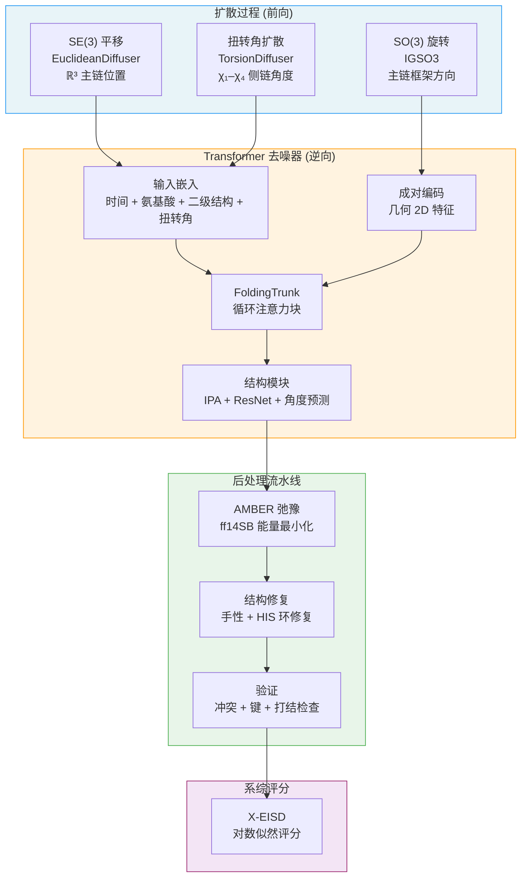

---
slug:1-overview
blog_type:normal
---


**IDPForge**（Intrinsically Disordered Protein, FOlded and disordered Region GEnerator，天然无序蛋白折叠与无序区生成器）是一个基于 Transformer 的蛋白质语言扩散模型，用于生成天然无序蛋白（IDP）和保留其折叠结构域的天然无序区（IDR）的全原子结构系综。它的运行机制是：在 **ℝ³** 中联合扩散主链平移，通过 IGSO(3) 分布在 **SO(3)** 中扩散主链旋转，并扩散侧链扭转角——然后通过借鉴 ESMFold 改进而来的循环 Transformer 网络学习对这种复合结构进行去噪。最终结果是得到一个经过物理验证且可由实验引导的构象系综，能够捕捉无序序列固有的构象异质性。

来源：[README.md](/README.md#L1-L5), [setup.py](/setup.py#L1-L23)

## 为什么选择 IDPForge？

传统的结构预测工具（如 AlphaFold2 和 ESMFold）在处理折叠蛋白时表现出色，但它们生成的是单一的静态结构，这会错误地表示无序区——往往将它们折叠成低置信度、不符合物理规律的构象。IDPForge 弥补了这一根本缺陷，它将无序性视为**结构上的分布**，而非单一的预测。它生成多种物理上合理的构象，这些构象共同代表了无序蛋白或无序区的构象系综，从而支持下游的生物物理分析、实验验证和系综重加权。

下表总结了 IDPForge 与相关工具的定位对比：

| 能力 | AlphaFold2 / ESMFold | RFdiffusion | **IDPForge** |
|---|---|---|---|
| 折叠结构预测 | ✅ | ✅ | ✅ (模板固定) |
| IDP/IDR 系综生成 | ❌ | ❌ | ✅ |
| SE(3) 主链扩散 | ❌ | ✅ | ✅ |
| SO(3) IGSO(3) 旋转扩散 | ❌ | 部分 | ✅ |
| 扭转角扩散 | ❌ | ❌ | ✅ |
| 实验引导 (PRE, Rg) | ❌ | ❌ | ✅ |
| 折叠结构域保留 | N/A | ❌ | ✅ |
| AMBER 弛豫 + 修复 | ❌ | ❌ | ✅ |
| X-EISD 系综评分 | ❌ | ❌ | ✅ |

来源：[README.md](/README.md#L1-L5), [idpforge/model.py](/idpforge/model.py#L1-L50)

## 架构一览

IDPForge 的架构将三个扩散过程、一个循环 Transformer 去噪器以及一个多阶段后处理流水线串联成一个统一的生成工作流：



来源：[idpforge/utils/diff_utils.py](/idpforge/utils/diff_utils.py#L400-L599), [idpforge/model.py](/idpforge/model.py#L53-L130)

## 核心模型：IDPForge Transformer

`IDPForge` 模块是核心神经网络，负责从带噪输入中预测干净的结构。其前向传播通过求和三个嵌入流——正弦**时间步嵌入**、**氨基酸类型**嵌入和**二级结构**嵌入——来构建**单序列表示** `s_s_0`，然后通过 MLP 将其送入主干的序列状态维度。**成对表示** `s_z_0` 由从带噪主链坐标 `x_t` 导出的几何 2D 特征（距离和角度区间）构建而成。两种表示随后通过 `FoldingTrunk`，该模块应用带有可选**循环**（默认最多 3 次迭代）的交替三角自注意力和过渡块。主干的结构模块随后通过不变点注意力（IPA）生成 SE(3) 框架、侧链框架和扭转角。

<CgxTip>在推理期间，`recon` 方法从时间步 T→0 向后迭代，在每个步骤调用 `forward`，并将坐标/扭转角更新委托给 `Denoiser`。当提供**折叠模板**时，折叠掩码中的残基在每个逆向步骤都被固定在时间步 0——这就是 IDPForge 在仅对无序区进行采样时保留折叠结构域几何结构的方式。</CgxTip>

来源：[idpforge/model.py](/idpforge/model.py#L53-L200), [idpforge/model.py](/idpforge/model.py#L130-L283)

## 三个扩散过程

IDPForge 沿着三个互补通道对蛋白质结构进行扩散，每个通道都有各自的噪声时间表和逆向时间去噪公式：

| 扩散空间 | 类 | 前向过程 | 逆向更新 | 关键参数 |
|---|---|---|---|---|
| **ℝ³ 平移** | `EuclideanDiffuser` | Cα 位置上的线性 β 时间表 | 解析高斯转移 `μ(x_t, x̂_0, t)` | `euclid_b0=0.01`, `euclid_bT=0.06` |
| **SO(3) 旋转** | `IGSO3` | 在递增的 σ(t) 下从 IGSO(3) 采样 | SO(3) 切空间上基于分数的逆向 SDE | `min_b=1.5`, `max_b=2.5`，缓存的 CDF |
| **扭转角** | `TorsionDiffuser` | [−π, π) 上 χ₁–χ₄ 的线性 β 时间表 | 带有解析 μ, σ 的包裹高斯分布 | `torsion_b0=0.01`, `torsion_bT=0.06` |

`Diffuser` 类协调所有这三个过程：给定一个干净的姿态，它返回扩散主链坐标 `[T, L, 5, 3]`、刚体框架 `[T, L, 4, 4]` 和扭转角编码 `[T, L, 4, 2]`（sin/cos 对）的轨迹。`Denoiser` 类处理逆向方向，将模型预测的 `x̂_0` 与当前的 `x_t` 结合，对平移和扭转角使用解析后验，对旋转使用 IGSO(3) 分数近似。

来源：[idpforge/utils/diff_utils.py](/idpforge/utils/diff_utils.py#L1-L200), [idpforge/utils/diff_utils.py](/idpforge/utils/diff_utils.py#L200-L400)

## 两种采样模式

IDPForge 提供了两个不同的采样入口点，反映了两种基本用例：

**完全无序蛋白**（`sample_idp.py`）——给定一条纯氨基酸序列，从头生成一个完整的 IDP 系综。二级结构注释要么从预构建的数据库中获取，要么默认为全卷曲。整条链在无模板约束下进行扩散和去噪。

**带有折叠结构域的 IDR**（`sample_ldr.py`）——给定一个预构建的 `.npz` 模板（由 `mk_ldr_template.py` 创建），仅对无序区进行采样，同时保持折叠残基固定。该模板提供冻结的主链坐标、扭转角和二值掩码。在每个逆向时间步，掩码残基被重置为其模板值（时间步 0），确保折叠结构域保持不受扰动。此模式还支持长序列的注意力分块以及多构象模板的坐标偏移。

来源：[sample_idp.py](/sample_idp.py#L1-L80), [sample_ldr.py](/sample_ldr.py#L1-L100)

## 后处理与验证

原始扩散输出在进入最终系综之前，需经过严格的三阶段流水线：

1. **AMBER 弛豫** —— 使用 ff14SB 力场进行能量最小化。折叠结构域残基受到谐约束限制；IDR 残基和连接处自由弛豫。可通过 `configs/sample.yml` 中的 `max_iterations`、`stiffness` 和 `tolerance` 进行配置。
2. **修复** —— 检测并纠正弛豫过程中引入的 D-型氨基酸手性反转和断裂的组氨酸环键。修复后的结构会重新进行弛豫。
3. **验证** —— 统一检查手性完整性、键长/键角、冲突分数（带有自适应智能阈值）以及通过打结检测的主链拓扑。只有通过所有检查的结构才会被重命名为 `N_validated.pdb`。

此循环（生成 → 弛豫 → 修复 → 验证）重复进行，直到达到目标构象数，并持久化状态以便从中断中恢复。

来源：[README.md](/README.md#L268-L290), [configs/sample.yml](/configs/sample.yml#L42-L57)

## 使用 X-EISD 进行系综评分

`score_ensemble.py` 脚本和 `scoring/` 模块提供了集成的 X-EISD（实验推断结构测定）系综评分功能。给定一个 PDB 结构系综和实验数据，它会反算可观测量，并报告每个属性的 MAE 和 X-EISD 对数似然：

| 可观测量 | 标志 | 反算方法 | 外部依赖 |
|---|---|---|---|
| J-耦合 | `--jc` | Karplus 方程 | 无 |
| NOE 距离 | `--noe` | 逆 6 次幂平均 | 无 |
| PRE 距离 | `--pre` | 逆 6 次幂平均 | 无 |
| smFRET | `--fret` | 染料间距离 | 无 |
| 化学位移 | `--cs` | UCBShift (CSpred) | 独立的 conda 环境 |

默认基准测试协议运行 30 次试验，每次抽取 100 个构象的子样本，生成 `scores_trials.csv`。`--normalize` 标志用于汇总跨方法比较表。

来源：[README.md](/README.md#L330-L380), [scoring/scorer.py](/scoring/scorer.py#L1-L136)

## AlphaFlex 流水线

`AlphaFlex/` 目录为来自 AlphaFold2 数据库的蛋白质批处理提供了一个端到端的自动化流水线 (AFX-IDPForge)：

| 步骤 | 脚本 | 功能 |
|---|---|---|
| 1 | `Step_1_case_label.py` | 将每个 IDR 分类为尾部、连接子或环；分配类别标签 |
| 1B | `Step_1B_subset_label.py` | 按长度、IDR 类型计数和 IDR 长度范围过滤蛋白质 |
| 2 | `Step_2_mk_ldr_template.py` | 为每个 IDR 构建模板（冻结折叠 + 动态 IDR 放置） |
| 3 | `Step_3_sample_conformer.py` | 通过扩散循环为每个 IDR 生成验证过的构象 |
| 4 | `Step_4_ldr_stitch.py` | 蒙特卡洛拼接多 IDR 蛋白质；最小化并验证 |

第 4 步的蒙特卡洛拼接对于多 IDR 蛋白质尤为值得关注：它通过对重叠连接残基进行对齐，按顺序将采样的 IDR 构象嫁接到折叠结构域上，然后对折叠区域施加约束进行全结构 AMBER 最小化。

来源：[AlphaFlex/README.md](/AlphaFlex/README.md#L1-L80), [AlphaFlex/README.md](/AlphaFlex/README.md#L80-L146)

## 项目结构

```
IDPForge/
├── idpforge/                     # 核心库
│   ├── model.py                  # IDPForge Transformer 网络
│   ├── wrapper.py                # PyTorch Lightning 训练包装器
│   ├── loader.py                 # 扩散数据集与数据模块
│   ├── loss.py                   # FAPE、扭转角、距离、违规损失
│   ├── esm_wrapper.py            # ESM2 嵌入集成
│   ├── misc.py                   # I/O 工具 (PDB 输出, 输入处理)
│   └── utils/
│       ├── diff_utils.py         # Diffuser, Denoiser, EuclideanDiffuser, IGSO3, TorsionDiffuser
│       ├── igso3_utils.py        # IGSO(3) 数值计算与 Exp 映射
│       ├── tensor_utils.py       # 几何张量操作 (二面角, t2d, 对齐)
│       ├── potential.py          # 实验引导势 (PRE, Rg)
│       ├── pre_relax.py          # 预弛豫修复
│       ├── relax.py              # AMBER 弛豫引擎
│       ├── structure_repair.py   # D-型氨基酸与 HIS 环修复
│       ├── structure_validation.py  # 统一验证检查
│       └── validation_metrics.py # Rg 与逐组距离度量
├── esm/                          # 重构的 ESM2 模块 (注意力, 主干)
├── scoring/                      # X-EISD 系综评分模块
├── AlphaFlex/                    # 自动化 AFX-IDPForge 流水线 (步骤 1–4)
├── configs/
│   ├── sample.yml                # 采样配置
│   └── train.yml                 # 训练配置
├── dockerfiles/                  # Docker 与 Apptainer 配方 (Ampere/Blackwell)
├── sample_idp.py                 # 入口点：完全无序蛋白采样
├── sample_ldr.py                 # 入口点：带有折叠模板的 IDR 采样
├── mk_ldr_template.py            # IDR 采样的模板构建器
├── mk_flex_template.py           # 连接子 IDR 采样的模板构建器
├── score_ensemble.py             # X-EISD 系综评分入口点
├── train.py                      # 训练入口点
├── environment.yml               # Conda 环境规范
└── setup.py                      # 包安装 (v1.1.0)
```

来源：[setup.py](/setup.py#L1-L23), [idpforge/model.py](/idpforge/model.py#L1-L50)

## 训练概述

训练使用带有 `IDPForgeWrapper` 的 PyTorch Lightning，该包装器封装了核心模型，具有参数的**指数移动平均 (EMA)**（衰减率 decay=0.99）、带有预热和步衰减的 **AlphaFold 风格学习率调度器**，以及一个复合损失函数。数据流水线（`IDPloader`）加载 pickle 序列化的结构数据集，在训练时应用完整的前向扩散，并使用线性加权采样时间步，该加权强调较后（噪声更大）的步骤。自条件化随机应用：有 50% 的概率，模型在时间步 t+1 的自身预测将作为时间步 t 的额外输入。复合训练损失结合了 **FAPE**（框架对齐点误差）、**角度**（扭转角）、**距离**（Cβ–Cβ）和**违规**项，其中距离和违规损失仅在达到可配置的 epoch 阈值后才激活。

来源：[train.py](/train.py#L1-L80), [idpforge/wrapper.py](/idpforge/wrapper.py#L1-L100), [idpforge/loss.py](/idpforge/loss.py#L1-L70)

<CgxTip>模型权重和示例数据通过 Figshare 分发。发布的检查点使用的是 EMA 权重 (`pl_sd["ema"]["params"]`)，而非原始训练权重。加载时，会检查 `openfold` 版本，以处理 openfold v2+ 中引入的键重命名 (`points.` → `points.linear.`)。</CgxTip>

来源：[README.md](/README.md#L200-L210), [sample_idp.py](/sample_idp.py#L40-L55)

## 接下来去哪

文档的编排旨在循序渐进地构建理解——从让软件运行起来，到数学与架构基础，再到实际用法和高级功能：

1. **[快速开始](2-quick-start)** —— 安装 IDPForge，下载权重，并生成你的第一个 IDP 系综
2. **[Docker 和 HPC 设置](3-docker-and-hpc-setup)** —— 用于可重复性和集群环境的容器化部署
3. **[架构概述](4-architecture-overview)** —— 所有模块如何连接的详细解析
4. **[IDPForge Transformer 网络](5-idpforge-transformer-network)** —— 深入探讨去噪器网络架构
5. **[SE(3) 主链扩散](6-se-3-backbone-diffusion)** —— ℝ³ 上的平移扩散
6. **[SO(3) 旋转扩散](7-so-3-rotational-diffusion)** —— 主链框架上基于 IGSO(3) 分数的扩散
7. **[扭转角扩散](8-torsion-angle-diffusion)** —— 侧链 χ 角的加噪与去噪
8. **[IDP 采样（完全无序）](12-idp-sampling-fully-disordered)** —— `sample_idp.py` 的完整使用指南
9. **[带有折叠模板的 IDR 采样](13-idr-sampling-with-folded-templates)** —— 使用 `sample_ldr.py` 及模板准备
10. **[AlphaFlex 工作流概述](18-alphaflex-workflow-overview)** —— 自动化 AFX-IDPForge 流水线