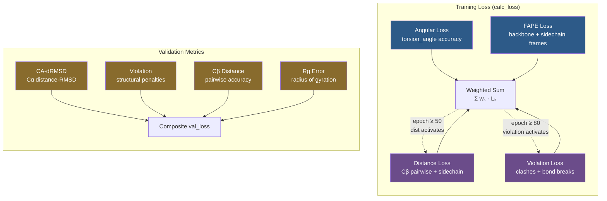

---
slug:10-loss-functions
blog_type:normal
---


IDPForge 训练了一个去噪网络，该网络必须从带噪输入中同时恢复**主链几何结构**、**侧链构象**、**成对距离**以及**扭转角**。其损失系统是一个**多项复合**体系，具备依赖轮次的调度机制、二级结构感知的加权策略，以及独立的训练/验证流水线——所有这些都通过单一的 [`calc_loss`](idpforge/loss.py#L42-L89) 入口点进行统一调度。

## 损失系统架构

训练损失聚合了四个独立加权的项，每一项针对预测构象子的不同结构方面。专用的验证流水线评估那些不可微或对基于梯度的优化而言计算代价过高的互补指标。



<CgxTip>轮次门控损失（第 50 轮的 `dist`，第 80 轮的 `violation`）实现了一种**课程学习**策略：模型首先学习粗略的帧对齐与扭转角恢复，随后精调成对距离，最后强制满足空间可行性——以此避免训练早期出现梯度冲突。</CgxTip>

来源: [loss.py](idpforge/loss.py#L42-L89), [wrapper.py](idpforge/wrapper.py#L56-L83)

## 损失项参考

| 损失项 | 权重键 | 默认权重 | 目标 | 轮次门控 | 可微 |
|-----------|-----------|----------------|--------|------------|----------------|
| **Angular** | `angular` | 0.1 | 扭转角预测 | — (始终开启) | 是 |
| **FAPE** | `fape` | 1.0 | 主链 + 侧链帧对齐 | — (始终开启) | 是 |
| **Distance** | `dist` | 0.005 | Cβ 成对 + 侧链距离 | `start_epoch: 50` | 是 |
| **Violation** | `violation` | 0.01 | 空间冲突 + 键长违规 | `start_epoch: 80` | 是 |

来源: [train.yml](configs/train.yml#L31-L45), [loss.py](idpforge/loss.py#L42-L89)

## Angular 损失

Angular 损失作用于 **7 个扭转角通道**（ω, φ, ψ, χ₁–χ₄），在 S¹ 表示（sin, cos 对）中衡量预测扭转角向量与真实扭转角向量之间的差异。它是**唯一从第 0 轮就开始激活的损失**，构成了早期扭转角恢复的主要信号。

$$L_{\text{angular}} = \frac{\sum \|\hat{\alpha}_{\text{norm}} - \alpha_{\text{true}}\| \cdot m}{\sum m} + 0.02 \cdot \text{mean}(|\|\hat{\alpha}\| - 1|)$$

第一项惩罚**归一化后**的预测角度与真实值之间的偏差，由 `torsion_mask` 进行掩码处理（该掩码覆盖所有残基的主链角 ω/φ/ψ，以及仅限残基类型允许的 χ 角）。第二项是一个**正则化项**，惩罚**未归一化**的角度预测中偏离单位范数的程度，确保网络在归一化之前生成结构良好的 (sin, cos) 对。0.02 的系数使该正则化项处于从属地位，服从于主要的角误差。

扭转角掩码通过拼接三份原子存在掩码（针对主链 ω, φ, ψ）以及 `get_chi_mask(aatype)` 与原子存在掩码的乘积（针对侧链 χ₁–χ₄）来构建，确保只有具备物理意义的角度才会参与计算。

来源: [loss.py](idpforge/loss.py#L159-L164), [loss.py](idpforge/loss.py#L44-L52)

## FAPE 损失 (Frame Aligned Point Error)

FAPE 损失是**权重最高的项**（默认权重 = 1.0），将主链帧对齐与侧链原子叠加结合在一起。它作用于结构模块预测的 SE(3) 刚体帧。

**主链 FAPE** 委托给 OpenFold 的 [`backbone_loss`](idpforge/loss.py#L6-L12)，该函数在整个扩散轨迹上计算帧对齐点误差。它将预测的主链刚体变换（每个残基的旋转 + 平移）与真实帧进行比较，并可选择 L1 裁剪。裁剪配置（`use_clamp: 0.5`, `clamp_distance: 10`）将每对距离误差的上限设定为 10Å，防止异常帧对主导梯度。此损失仅为 CA 模式——仅考虑 Cα 帧对齐。

**侧链 FAPE** 将帧比较扩展到侧链原子（atom14 表示中每个残基的前 9 个原子位置）。它使用 OpenFold 的 [`compute_fape`](idpforge/loss.py#L6-L12)，将预测的侧链帧与偏移一个位置的真实刚体变换进行比较（`[..., 1:, :, :]` 索引跳过了位置 0 的主链帧）。侧链项不应用裁剪。

组合后的 FAPE 损失为：$L_{\text{fape}} = (L_{\text{backbone}} + L_{\text{sidechain}})^2$。外部的**平方操作**在总误差较大时（训练早期）放大梯度信号，而在预测改善时（训练后期）对其进行衰减，起到了一种针对帧质量的软课程学习作用。

来源: [loss.py](idpforge/loss.py#L54-L68), [train.yml](configs/train.yml#L36-L38)

## Distance 损失

Distance 损失是**轮次门控**的（默认 `start_epoch: 50`），用于强制残基间成对距离的准确性。它包含两个子组件，作用于不同的原子集，并对环区和结构区采用不对称裁剪。

### Cβ Distance 损失

主要的距离项 [`cb_dist_loss`](idpforge/loss.py#L124-L145) 计算预测和真实值的所有 Cβ–Cβ 对的距离（使用伪 β：甘氨酸为 Cα，其余为 Cβ），然后应用**方向性裁剪**：

- **环区**（sstype ≥ 2）：`error = clamp(true_d − pred_d, min=ε, max=loop_clamp)` —— 此项惩罚距离的**欠预测**（结构塌缩），同时容忍膨胀，这反映了 IDP 集合偏好扩展构象的物理现实。
- **结构区**（sstype < 2，即螺旋/折叠片）：`sec_error = clamp(pred_d − true_d, min=ε, max=loop_clamp)` —— 此项惩罚距离的**过预测**（过度膨胀），防止结构单元被拉开。

这两项均使用由有效残基对数量归一化的**平方误差**，并在分母上显式设置 `.clamp(min=1.0)` 保护，以防止在全环 IDP 批次不包含结构残基时出现除零错误。

### CA 连通性损失

嵌入在 `cb_dist_loss` 中的 [`ca_connectivity_loss`](idpforge/loss.py#L166-L174) 通过惩罚连续 Cα–Cα 距离与理想值（来自 OpenFold `ca_ca` 常量的 3.8025Å）的偏差来强制**肽键几何结构**。这可以防止去噪过程中主链断裂——这是维持链连续性的关键约束。

### 侧链 Distance 损失

当 `loss_cfg["dist"]["sidechain"] > 0` 时，次要的 [`dist_loss`](idpforge/loss.py#L147-L156) 项将应用于每个残基的前 9 个原子位置。它计算**对称的**裁剪距离误差（对过预测和欠预测均裁剪至 `[-clamp, +clamp]`），由有效原子对数量进行归一化。

来源: [loss.py](idpforge/loss.py#L124-L156), [train.yml](configs/train.yml#L39-L43)

## Violation 损失

Violation 损失是**最后激活的项**（默认 `start_epoch: 80`），用于惩罚**物理上不可能**的结构。它委托给 OpenFold 的 [`find_structural_violations`](idpforge/loss.py#L6-L12)，该函数检测：

- **键长违规** —— 与理想原子间键长的偏差
- **冲突违规** —— 原子间距离小于其范德华半径之和

违规计算针对最终预测位置（`positions[-1]`）进行，对残基间和残基内检查均设定 5 个原子的容差。生成的 [`violation_loss`](idpforge/loss.py#L6-L12) 产生一个由原子存在掩码加权的标量惩罚。

将此损失延迟到训练后期，使得模型可以自由地产生违反空间约束的中间结构（这在早期去噪中是预期行为），然后随着距离和 FAPE 损失已经建立起大致正确的全局几何结构，再逐步学习解决这些违规。

来源: [loss.py](idpforge/loss.py#L176-L181), [train.yml](configs/train.yml#L44-L45)

## SE(3) Frame 损失 (MSE Frame 损失)

基于 RFdiffusion 的 [`mse_frame_loss`](idpforge/loss.py#L93-L121) 函数提供了一种替代的 SE(3) 等变帧比较方法，将**平移误差**和**旋转误差**组合为单一指标。与在局部帧中操作的 FAPE 不同，此损失在**全局对齐**的帧中工作：

1. **Kabsch 对齐** —— 真实帧通过 [`align_rigids`](idpforge/utils/tensor_utils.py#L274-L324) 对齐到预测帧，该函数利用中心化平移的互协方差矩阵 SVD 计算最优旋转，并进行手性校正。
2. **平移误差** —— $\sqrt{\sum (t_{\text{pred}} - t_{\text{true}})^2 + \epsilon}$，可选 L1 裁剪，然后除以 `length_scale=10`。
3. **旋转误差** —— 计算为 $\|I - R_{\text{pred}}^{-1} \cdot R_{\text{true}}\|_F^2$，衡量与单位矩阵的偏差。
4. **组合** —— $L = (L_{\text{trans}} + 0.5 \cdot L_{\text{rot}}) \cdot \text{mask}$，由有效帧的数量归一化。

<CgxTip>默认的 `w_rot=0.5` 相对平移降低了旋转误差的权重，因为微小的角度偏差会沿链累积——残基 *i* 处 1° 的旋转误差会在残基 *i+k* 处产生越来越大的位置误差。等权加权会导致对这种效应的重复计算。</CgxTip>

来源: [loss.py](idpforge/loss.py#L93-L121), [tensor_utils.py](idpforge/utils/tensor_utils.py#L274-L324)

## 验证指标

[`IDPForgeWrapper.validation_step`](idpforge/wrapper.py#L85-L125) 中的验证流水线使用 **EMA 权重**（在验证前换入，验证后恢复），并评估一组具有独立可配置权重的不同指标：

| 指标 | 默认验证权重 | 描述 |
|--------|-------------------|-------------|
| `ca_drmsd` | 0.1 | Cα 距离-RMSD (OpenFold 的 `drmsd`) —— 具有旋转不变性的结构比较 |
| `violation` | 0.0 | 与训练相同的结构违规损失（验证中默认禁用） |
| `dist` | 0.05 | Cβ 成对距离损失（需要 `compute_cb_dist: true`） |
| `rg_error` | 1.0 | 每序列分组的回转半径分布误差（需要 `compute_rg: true`） |

**Rg 指标**对于 IDP 验证尤为重要。[`rg_metrics`](idpforge/loss.py#L183-L187) 按序列同一性对预测构象子进行分组，通过 [`calc_rg_with_mask`](idpforge/utils/validation_metrics.py#L4-L29) 计算每组的平均预测 Rg，并返回与实验 Rg 值的平均绝对差值。这直接衡量了采样集合是否能复现实验流体动力学半径。

来源: [wrapper.py](idpforge/wrapper.py#L85-L125), [validation_metrics.py](idpforge/utils/validation_metrics.py#L4-L53), [train.yml](configs/train.yml#L47-L53)

## 训练中的损失调度

`IDPForgeWrapper` 中的 [`training_step`](idpforge/wrapper.py#L56-L83) 在损失计算前应用了两种关键的数据增强策略：

- **二级结构丢弃** —— 以 20% 的概率将 SS 标签替换为全掩码标记（`sstype = 7`），迫使模型在没有 SS 指导的情况下进行去噪，从而提高缺乏 SS 注释序列的鲁棒性。
- **自条件化** —— 以 50% 的概率（当 `self_condition: true` 且时间步不在轨迹末端时），模型将其自身的单步前向预测作为额外输入，遵循扩散模型中的自条件化范式。

复合损失计算如下：

$$L_{\text{total}} = \sum_{k \in \{\text{angular, fape, dist, violation}\}} w_k \cdot L_k$$

其中每个 $L_k$ 仅在其权重为正**且**满足其轮次门控条件时才被包含。各项损失与总损失一同被单独记录（`train_angular`、`train_fape` 等），从而实现 TensorBoard 中细粒度的训练诊断。

来源: [wrapper.py](idpforge/wrapper.py#L56-L83), [train.yml](configs/train.yml#L31-L45)

## 配置参考

所有损失权重和子参数均位于训练 YAML 的 `training.loss` 下：

```yaml
training:
  loss:
    weights:
      fape: 1          # Backbone + sidechain frame alignment
      dist: 0.005      # Pairwise distance accuracy
      angular: 0.1     # Torsion angle prediction
      violation: @0.01  # Steric feasibility
    fape:
      use_clamp: 0.5       # Whether to use clamped FAPE
      clamp_distance: 10   # L1 clamp distance (Å)
    dist:
      start_epoch: 50      # Epoch to begin distance loss7 loss
      loop_clamp: 10       # Loop region distance clamp (Å)
      sidechain: 0         # Sidechain distance weight (0 = disabled)
      sidechain_clamp: 8   # Sidechain distance clamp (Å)
   @+ violation_cfg:
      start_epoch: 80      # Epoch to begin violation loss
```

- 主链 + 侧链2 帧对齐
- 成对距离3 精度
- 扭转角4 预测
- 空间可行5 性
- 是否使6 用裁剪 FAPE
- L1 裁剪7 距离 (Å)
- 开始距离8 损失的轮次
- 环区距离9 裁剪 (Å)
-F 侧链距离0 权重 (0 = 禁用)
- 侧链距离1 裁剪 (Å)
- 开始违规2 损失的轮次

验证损失E 损失权重在 `validation.loss_weights` 下单独配置，并组合为简单的加权和（无轮次门控）。

来源: [train.yml](configs/train.yml#L30-L53)

---

**下一步**&amp;nbsp;: 要了解如何为这些损失构建带噪训练目标，请参阅[: 数据加载与加噪](11-data-loading-and-noising)。关于训练循环和优化器配置，请参阅[训练工作流与配置](9-training-workflow-and-configuration)。

来源: [train.yml](configs/train.yml#L31-L45), [loss.py](idpforge/loss.py#L42-L89)

## Angular 损失

Angular 损失作用于 **7 个扭转角通道**（ω, φ, ψ, χ₁–χ₄），在 S¹ 表示（sin, cos 对）中衡量预测扭转角向量与真实扭转角向量之间的差异。它是**唯一从第 0 轮就开始激活的损失**，构成了早期扭转角恢复的主要信号。

$$L_{\text{angular}} = \frac{\sum \|\hat{\alpha}_{\text{norm}} - \alpha_{\text{true}}\| \cdot m}{\sum m} + 0.02 \cdot \text{mean}(|\|\hat{\alpha}\| - 1|)$$

第一项惩罚**归一化后**的预测角度与真实值之间的偏差，由 `torsion_mask` 进行掩码处理（该掩码覆盖所有残基的主链角 ω/φ/ψ，以及仅限残基类型允许的 χ 角）。第二项是一个**正则化项**，惩罚**未归一化**的角度预测中偏离单位范数的程度，确保网络在归一化之前生成结构良好的 (sin, cos) 对。0.02 的系数使该正则化项处于从属地位，服从于主要的角误差。

扭转角掩码通过拼接三份原子存在掩码（针对主链 ω, φ, ψ）以及 `get_chi_mask(aatype)` 与原子存在掩码的乘积（针对侧链 χ₁–χ₄）来构建，确保只有具备物理意义的角度才会参与计算。

来源: [loss.py](idpforge/loss.py#L159-L164), [loss.py](idpforge/loss.py#L44-L52)

## FAPE 损失 (Frame Aligned Point Error)

FAPE 损失是**权重最高的项**（默认权重 = 1.0），将主链帧对齐与侧链原子叠加结合在一起。它作用于结构模块预测的 SE(3) 刚体帧。

**主链 FAPE** 委托给 OpenFold 的 [`backbone_loss`](idpforge/loss.py#L6-L12)，该函数在整个扩散轨迹上计算帧对齐点误差。它将预测的主链刚体变换（每个残基的旋转 + 平移）与真实帧进行比较，并可选择 L1 裁剪。裁剪配置（`use_clamp: 0.5`, `clamp_distance: 10`）将每对距离误差的上限设定为 10Å，防止异常帧对主导梯度。此损失仅为 CA 模式——仅考虑 Cα 帧对齐。

**侧链 FAPE** 将帧比较扩展到侧链原子（atom14 表示中每个残基的前 9 个原子位置）。它使用 OpenFold 的 [`compute_fape`](idpforge/loss.py#L6-L12)，将预测的侧链帧与偏移一个位置的真实刚体变换进行比较（`[..., 1:, :, :]` 索引跳过了位置 0 的主链帧）。侧链项不应用裁剪。

组合后的 FAPE 损失为：$L_{\text{fape}} = (L_{\text{backbone}} + L_{\text{sidechain}})^2$。外部的**平方操作**在总误差较大时（训练早期）放大梯度信号，而在预测改善时（训练后期）对其进行衰减，起到了一种针对帧质量的软课程学习作用。

来源: [loss.py](idpforge/loss.py#L54-L68), [train.yml](configs/train.yml#L36-L38)

## Distance 损失

Distance 损失是**轮次门控**的（默认 `start_epoch: 50`），用于强制残基间成对距离的准确性。它包含两个子组件，作用于不同的原子集，并对环区和结构区采用不对称裁剪。

### Cβ Distance 损失

主要的距离项 [`cb_dist_loss`](idpforge/loss.py#L124-L145) 计算预测和真实值的所有 Cβ–Cβ 对的距离（使用伪 β：甘氨酸为 Cα，其余为 Cβ），然后应用**方向性裁剪**：

- **环区**（sstype ≥ 2）：`error = clamp(true_d − pred_d, min=ε, max=loop_clamp)` —— 此项惩罚距离的**欠预测**（结构塌缩），同时容忍膨胀，这反映了 IDP 集合偏好扩展构象的物理现实。
- **结构区**（sstype < 2，即螺旋/折叠片）：`sec_error = clamp(pred_d − true_d, min=ε, max=loop_clamp)` —— 此项惩罚距离的**过预测**（过度膨胀），防止结构单元被拉开。

这两项均使用由有效残基对数量归一化的**平方误差**，并在分母上显式设置 `.clamp(min=1.0)` 保护，以防止在全环 IDP 批次不包含结构残基时出现除零错误。

### CA 连通性损失

嵌入在 `cb_dist_loss` 中的 [`ca_connectivity_loss`](idpforge/loss.py#L166-L174) 通过惩罚连续 Cα–Cα 距离与理想值（来自 OpenFold `ca_ca` 常量的 3.8025Å）的偏差来强制**肽键几何结构**。这可以防止去噪过程中主链断裂——这是维持链连续性的关键约束。

### 侧链 Distance 损失

当 `loss_cfg["dist"]["sidechain"] > 0` 时，次要的 [`dist_loss`](idpforge/loss.py#L147-L156) 项将应用于每个残基的前 9 个原子位置。它计算**对称的**裁剪距离误差（对过预测和欠预测均裁剪至 `[-clamp, +clamp]`），由有效原子对数量进行归一化。

来源: [loss.py](idpforge/loss.py#L124-L156), [train.yml](configs/train.yml#L39-L43)

## Violation 损失

Violation 损失是**最后激活的项**（默认 `start_epoch: 80`），用于惩罚**物理上不可能**的结构。它委托给 OpenFold 的 [`find_structural_violations`](idpforge/loss.py#L6-L12)，该函数检测：

- **键长违规** —— 与理想原子间键长的偏差
- **冲突违规** —— 原子间距离小于其范德华半径之和

违规计算针对最终预测位置（`positions[-1]`）进行，对残基间和残基内检查均设定 5 个原子的容差。生成的 [`violation_loss`](idpforge/loss.py#L6-L12) 产生一个由原子存在掩码加权的标量惩罚。

将此损失延迟到训练后期，使得模型可以自由地产生违反空间约束的中间结构（这在早期去噪中是预期行为），然后随着距离和 FAPE 损失已经建立起大致正确的全局几何结构，再逐步学习解决这些违规。

来源: [loss.py](idpforge/loss.py#L176-L181), [train.yml](configs/train.yml#L44-L45)

## SE(3) Frame 损失 (MSE Frame 损失)

基于 RFdiffusion 的 [`mse_frame_loss`](idpforge/loss.py#L93-L121) 函数提供了一种替代的 SE(3) 等变帧比较方法，将**平移误差**和**旋转误差**组合为单一指标。与在局部帧中操作的 FAPE 不同，此损失在**全局对齐**的帧中工作：

1. **Kabsch 对齐** —— 真实帧通过 [`align_rigids`](idpforge/utils/tensor_utils.py#L274-L324) 对齐到预测帧，该函数利用中心化平移的互协方差矩阵 SVD 计算最优旋转，并进行手性校正。
2. **平移误差** —— $\sqrt{\sum (t_{\text{pred}} - t_{\text{true}})^2 + \epsilon}$，可选 L1 裁剪，然后除以 `length_scale=10`。
3. **旋转误差** —— 计算为 $\|I - R_{\text{pred}}^{-1} \cdot R_{\text{true}}\|_F^2$，衡量与单位矩阵的偏差。
4. **组合** —— $L = (L_{\text{trans}} + 0.5 \cdot L_{\text{rot}}) \cdot \text{mask}$，由有效帧的数量归一化。

<CgxTip>默认的 `w_rot=0.5` 相对平移降低了旋转误差的权重，因为微小的角度偏差会沿链累积——残基 *i* 处 1° 的旋转误差会在残基 *i+k* 处产生越来越大的位置误差。等权加权会导致对这种效应的重复计算。</CgxTip>

来源: [loss.py](idpforge/loss.py#L93-L121), [tensor_utils.py](idpforge/utils/tensor_utils.py#L274-L324)

## 验证指标

[`IDPForgeWrapper.validation_step`](idpforge/wrapper.py#L85-L125) 中的验证流水线使用 **EMA 权重**（在验证前换入，验证后恢复），并评估一组具有独立可配置权重的不同指标：

| 指标 | 默认验证权重 | 描述 |
|--------|-------------------|-------------|
| `ca_drmsd` | 0.1 | Cα 距离-RMSD (OpenFold 的 `drmsd`) —— 具有旋转不变性的结构比较 |
| `violation` | 0.0 | 与训练相同的结构违规损失（验证中默认禁用） |
| `dist` | 0.05 | Cβ 成对距离损失（需要 `compute_cb_dist: true`） |
| `rg_error` | 1.0 | 每序列分组的回转半径分布误差（需要 `compute_rg: true`） |

**Rg 指标**对于 IDP 验证尤为重要。[`rg_metrics`](idpforge/loss.py#L183-L187) 按序列同一性对预测构象子进行分组，通过 [`calc_rg_with_mask`](idpforge/utils/validation_metrics.py#L4-L29) 计算每组的平均预测 Rg，并返回与实验 Rg 值的平均绝对差值。这直接衡量了采样集合是否能复现实验流体动力学半径。

来源: [wrapper.py](idpforge/wrapper.py#L85-L125), [validation_metrics.py](idpforge/utils/validation_metrics.py#L4-L53), [train.yml](configs/train.yml#L47-L53)

## 训练中的损失调度

`IDPForgeWrapper` 中的 [`training_step`](idpforge/wrapper.py#L56-L83) 在损失计算前应用了两种关键的数据增强策略：

- **二级结构丢弃** —— 以 20% 的概率将 SS 标签替换为全掩码标记（`sstype = 7`），迫使模型在没有 SS 指导的情况下进行去噪，从而提高缺乏 SS 注释序列的鲁棒性。
- **自条件化** —— 以 50% 的概率（当 `self_condition: true` 且时间步不在轨迹末端时），模型将其自身的单步前向预测作为额外输入，遵循扩散模型中的自条件化范式。

复合损失计算如下：

$$L_{\text{total}} = \sum_{k \in \{\text{angular, fape, dist, violation}\}} w_k \cdot L_k$$

其中每个 $L_k$ 仅在其权重为正**且**满足其轮次门控条件时才被包含。各项损失与总损失一同被单独记录（`train_angular`、`train_fape` 等），从而实现 TensorBoard 中细粒度的训练诊断。

来源: [wrapper.py](idpforge/wrapper.py#L56-L83), [train.yml](configs/train.yml#L31-L45)

## 配置参考

所有损失权重和子参数均位于训练 YAML 的 `training.loss` 下：

```yaml
training:
  loss:
    weights:
      fape: 1          # 主链 + 侧链帧对齐
      dist: 0.005      # 成对距离精度
      angular: 0.1     # 扭转角预测
      violation: 0.01  # 空间可行性
    fape:
      use_clamp: 0.5       # 是否使用裁剪 FAPE
      clamp_distance: 10   # L1 裁剪距离 (Å)
    dist:
      start_epoch: 50      # 开始距离损失的轮次
      loop_clamp: 10       # 环区距离裁剪 (Å)
      sidechain: 0         # 侧链距离权重 (0 = 禁用)
      sidechain_clamp: 8   # 侧链距离裁剪 (Å)
    violation_cfg:
      start_epoch: 80      # 开始违规损失的轮次
```

验证损失权重在 `validation.loss_weights` 下单独配置，并组合为简单的加权和（无轮次门控）。

来源: [train.yml](configs/train.yml#L30-L53)

---

**下一步**: 要了解如何为这些损失构建带噪训练目标，请参阅[数据加载与加噪](11-data-loading-and-noising)。关于训练循环和优化器配置，请参阅[训练工作流与配置](9-training-workflow-and-configuration)。