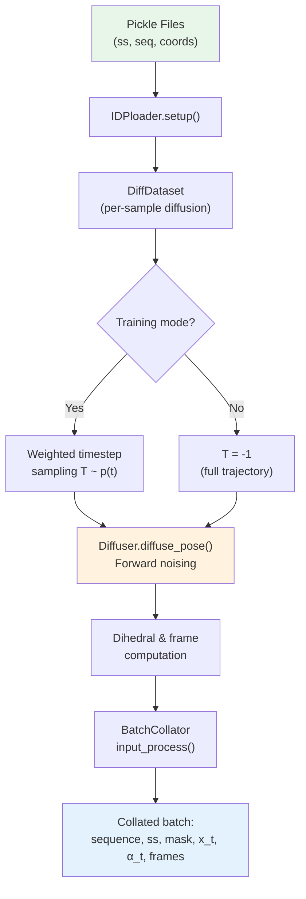

---
slug:11-data-loading-and-noising
blog_type:normal
---


IDPForge 的训练数据流水线将**结构化蛋白质数据加载**与**三因子前向扩散过程**耦合，后者联合对骨架平移 (ℝ³)、骨架旋转 (SO(3)) 和侧链扭转角进行加噪。该流水线将静态构象系综转换为按时间索引的带噪训练对，生成驱动去噪网络的 `(x_t, α_t) → (x_{t+1}, α_{t+1})` 监督信号。

## 数据格式与准备

训练数据以 Python pickle 文件的形式存储，其中包含三个平行列表：**二级结构编码**、**氨基酸序列**和**重原子坐标**（N, CA, C, O, CB, …，每个残基最多 9 个原子）。`IDPloader.setup()` 方法对这些文件进行反序列化，并将解包后的元组直接传递给 `DiffDataset` 构造函数。可以指定多个 pickle 路径用于训练集和验证集的划分，它们将通过 `ConcatDataset` 合并。

标准的准备流程会解析 PDB 构象（例如来自 IDPConformerGenerator），计算基于 Ramachandran 区域分配的二级结构，并将结果序列化：

| 列表索引 | 内容 | 每项形状 | 描述 |
|---|---|---|---|
| `data[0]` | 二级结构 | `str` (如 `"HHPPCCCLL"`) | H=螺旋, E=折叠, P=pre-pro, A=αR, B=βR, C=卷曲, L=左手 |
| `data[1]` | 氨基酸序列 | `str` (如 `"MAGKPL"`) | 单字母残基编码 |
| `data[2]` | 坐标 | `(N_res, 9, 3)` | 按 N,CA,C,O,CB,… 排列的重原子位置 |

二级结构编码使用 8 种离散类型 `["H", "E", "P", "A", "B", "C", "L", "-"]`，其中卷曲残基通过 Ramachandran 区域归属进一步细分（α-区域 → A，β-区域 → B，左手 → L，其他卷曲 → C）。当骨架扭转角不可用时，卷曲类型将从固定先验 `{A: 0.3, B: 0.5, L: 0.1, C: 0.1}` 中采样。

来源: [loader.py](idpforge/loader.py#L117-L133), [definitions.py](idpforge/utils/definitions.py#L9-L14), [README.md](data/README.md#L9-L39)

## 流水线架构

数据流水线被组织为一个 `LightningDataModule`，它将数据集构建、逐样本前向扩散和批次整理组合为一个单一的流式工作流：



`IDPloader` 类负责编排此流水线。在 `setup("fit")` 期间，它加载所有训练和验证的 pickle 文件，将每个文件包装在 `DiffDataset` 中，后者携带共享的 `Diffuser` 实例。`train_dataloader()` 返回一个带有随机打乱、锁页内存和自定义 `BatchCollator` 的 `DataLoader`；`val_dataloader()` 禁用随机打乱，但保留相同的整理逻辑。

来源: [loader.py](idpforge/loader.py#L102-L143), [train.py](train.py#L25-L36)

## 前向扩散：三因子加噪

数据流水线的核心是 `Diffuser.diffuse_pose()`，它对蛋白质结构应用**三个独立的前向扩散过程**，生成从 t=0（干净）到 t=T（最大加噪）的完整带噪轨迹：

### 1. SO(3) 骨架旋转扩散

`IGSO3` 扩散器通过从 SO(3) 上的各向同性高斯分布中采样，来扰动骨架旋转帧。对于每个时间步 t ∈ {1, …, T}，通过旋转角 ω 的 IGSO(3) 边际分布的逆 CDF 采样旋转向量。采样得到的旋转被应用于局部骨架帧 (N-CA-C)，同时保持 Cα 位置固定：

```
R_perturbed = R_sampled · R_true
x_perturbed = R_sampled · (x - Cα) + Cα
```

IGSO(3) 离散化通过 `calculate_igso3()` 预计算，该函数在 (σ, ω) 对的网格上制表 CDF 值、分数范数和期望分数范数。此缓存可作为 `diff_igso3.pkl` 持久化，以避免跨运行重复计算。

### 2. ℝ³ 骨架平移扩散

`EuclideanDiffuser` 在**线性方差调度** β(t) 下向 Cα 坐标添加高斯噪声，该调度从 `euclid_b0` 线性插值到 `euclid_bT`。在每一步中，加噪核产生：

```
mean = √(1 - β_t) · Cα_t
var  = β_t · I₃
Cα_{t+1} ~ N(mean, var)
```

位移 δ 均匀应用于每个残基的所有骨架原子，且每步位移差的累加和产生完整的平移轨迹。在加噪前，坐标按 `crd_scale=0.25` 缩放以改善数值条件。

### 3. 扭转角扩散

`TorsionDiffuser` 在其自身的线性 β 调度（`tor_b0` → `tor_bT`）下，对四个侧链 χ 角应用包裹高斯噪声。采样在角度空间中进行，使用 `wrap_rad` 将值保持在 [-π, π) 内，并使用 `exists_mask` 将未定义的 χ 角（例如丙氨酸的 χ2）置零为 -π。最终输出被转换为网络使用的 单位圆表示。

### 在 `diffuse_pose()` 中组合

三个扩散器独立运行，其输出被组合：SO(3) 扰动帧接收累积的平移位移，产生形状为 `(T+1, L, 5, 3)` 的最终扩散骨架坐标 `diffused_BB`。刚体变换 `(T+1, L, 4, 4)` 由旋转矩阵和受扰动的 Cα 位置组装而成。扭转轨迹以 形式返回，形状为 `(T+1, L, 4, 2)`。

来源: [diff_utils.py](idpforge/utils/diff_utils.py#L491-L570), [diff_utils.py](idpforge/utils/diff_utils.py#L205-L254), [diff_utils.py](idpforge/utils/diff_utils.py#L303-L451), [diff_utils.py](idpforge/utils/diff_utils.py#L257-L299)

## 噪声调度配置

扩散调度由训练配置的 `diffuse` 部分中的六个参数控制：

| 参数 | 默认值 | 范围 | 控制内容 |
|---|---|---|---|
| `n_tsteps` | 200 | 50–500 | 前向扩散时间步数 T |
| `n_tsteps_inf` | 40 | 10–100 | `Denoiser` 的反向（推理）步数 |
| `euclid_b0` | 0.01 | 0.001–0.05 | 平移噪声的初始 β（低 → 平缓启动） |
| `euclid_bT` | 0.08 | 0.04–0.15 | 平移噪声的最终 β（高 → 强破坏） |
| `torsion_b0` | 0.01 | 0.001–0.05 | 扭转噪声的初始 β |
| `torsion_bT` | 0.06 | 0.03–0.10 | 扭转噪声的最终 β |

`linear_beta_schedule` 函数将 `b0` 和 `bT` 重新缩放 `T/200` 倍（归一化至 200 步参考），然后进行线性插值。这确保了增加 T 会增加粒度，而不改变注入的总噪声量。SO(3) 调度使用二次 σ(t) = `min_sigma + t·min_b + t²·(max_b - min_b)/2`，对旋转噪声增长速率提供了更精细的控制。

来源: [diff_utils.py](idpforge/utils/diff_utils.py#L56-L76), [train.yml](configs/train.yml#L54-L60)

## 逐样本数据生成：`DiffDataset.__getitem__`

当从数据集中索引每个训练样本时，它们会经历以下转换：

**步骤 1 — 完整前向扩散**：`diffuse_pose()` 生成形状为 `(T+1, L, 5, 3)`、`(T+1, L, 4, 4)`、`(T+1, L, 4, 2)` 的完整轨迹 `(crd, R, tor)`。

**步骤 2 — 时间步采样**（仅限训练）：从**线性加权** `p(t) ∝ t` 中采样时间步 T，这使得训练偏向于较晚的（更带噪的）时间步，在这些时间步模型必须恢复更多信息。此加权方案抵消了自然的不平衡，即较早的时间步因较大的信噪比而主导损失。

**步骤 3 — 提取当前和下一状态**：提取时间 T 的带噪状态 `x_t = crd[T, :, :5]`（5 个骨架原子：N, CA, C, O, CB）和 `α_t = tor[T]`。对于训练，还会检索下一个更干净的状态 `x_{t+1}` 和 `α_{t+1}`（如果 t+1 超出轨迹则截断至 T）。

**步骤 4 — 骨架二面角计算**：从干净 (t=0) 的结构中，使用 `get_dih()` 计算四个骨架二面角（ω, φ, ψ 以及取反的 openfold ψ 约定），产生 形式的 `(L, 7, 2)` 张量。剩余的 3 个槽位携带来自 `tor[0]` 的侧链 χ 角。

**步骤 5 — 侧链帧组装**：`torsion_angles_to_frames()` 函数将残基特定的默认帧（`restype_rigid_group_default_frame`）与骨架刚体变换和计算出的扭转角组合，为每个残基的所有 7 个扭转驱动帧生成 `(L, 7, 4, 4)` 齐次变换矩阵。

来源: [loader.py](idpforge/loader.py#L62-L99), [diff_utils.py](idpforge/utils/diff_utils.py#L519-L570)

## 批次整理与输入处理

`BatchCollator` 将逐样本字典列表转换为适合 Transformer 网络的批处理张量字典。它将序列和二级结构编码委托给 `input_process()`，后者执行以下操作：

1. 通过 `batch_encode_sequences()`（来自 ESMFold）**编码氨基酸序列**，生成带有链 linker 填充（默认 25 个甘氨酸残基）的整数 token 张量。
2. 通过 `batch_encode_ss()` **编码二级结构**，将 SS 字符串转换为带有匹配链 linker 填充（25 个卷曲残基）的整数 token。
3. 通过 `assert torch.equal(aa_mask, ss_mask)` **验证对齐**氨基酸和二级结构掩码。
4. **处理残基索引**，除非显式提供，否则默认使用 ESMFold 计算的索引。

密集张量（坐标、扭转角、帧、带噪状态）通过 `collate_dense_tensors()` 进行整理，该函数将变长序列用零填充至批次最大长度。时间步 `T` 在序列维度上广播，以实现与网络的位置兼容性。对于携带回转半径目标的验证样本，`rg` 字段被堆叠为一个浮点张量。

最终整理的批次字典包含：

| 键 | 形状 | 描述 |
|---|---|---|
| `sequence` | `(B, L)` | 整数氨基酸 token |
| `ss` | `(B, L)` | 整数二级结构 token |
| `mask` | `(B, L)` | 布尔有效残基掩码 |
| `resi` | `(B, L)` | 残基索引（带链偏移） |
| `coord` | `(B, L, 9, 3)` | 干净的全原子坐标 |
| `torsion` | `(B, L, 7, 2)` | 所有 7 个扭转角 |
| `frame` | `(B, L, 7, 4, 4)` | 侧链刚体帧 |
| `x_t` | `(B, L, 5, 3)` | 时间步 T 的带噪骨架 |
| `alpha_t` | `(B, L, 4, 2)` | 时间步 T 的带噪侧链扭转角 |
| `T` | `(B, L)` | 时间步（广播）— 仅限训练 |
| `x_t+1` | `(B, L, 5, 3)` | 下一个更干净的骨架 — 仅限训练 |
| `alpha_t+1` | `(B, L, 4, 2)` | 下一个更干净的扭转角 — 仅限训练 |
| `rg` | `(B,)` | 回转半径目标 — 仅限验证 |

来源: [loader.py](idpforge/loader.py#L18-L45), [misc.py](idpforge/misc.py#L99-L116)

<CgxTip>准备训练数据时，请确保坐标每个残基恰好包含 9 个原子（N, CA, C, O, CB, + 最多 4 个侧链重原子）。`np_utils` 中的 `process_pdb()` 实用程序处理向 OpenFold atom14 约定重排原子，但 pickle 必须切片至 `[:, :9]`，因为加载器期望此固定宽度。</CgxTip>

<CgxTip>`DiffDataset.__getitem__` 中的线性时间步加权 `p(t) ∝ t` 对 IDP 训练至关重要：由于无序蛋白质在早期时间步需要恢复的结构信号较少，均匀加权将导致损失被几乎微不足道的去噪任务主导。向上偏置迫使模型练习恢复高度破坏的结构。</CgxTip>

## 连接训练与推理

在训练设置期间创建的 `Diffuser` 实例在所有 `DiffDataset` 对象之间共享，确保一致的噪声调度。互补的 `Denoiser` 类（在采样期间使用）包装了相同的 `Diffuser`，并通过 `get_next_pose()` 实现反向步骤，该方法将预测的干净结构与当前带噪状态对齐（Kabsch 对齐），然后使用各自的反向转移核独立逆转平移、旋转和扭转。推理步数 `n_tsteps_inf` 通常远小于 `n_tsteps`（默认为 40 vs. 200），利用学习到的去噪网络采取更大的反向步长。

有关如何使用训练对的后续步骤，请参见[损失函数](10-loss-functions)；有关数学基础，请参见[SE(3) 骨架扩散](6-se-3-backbone-diffusion)和[SO(3) 旋转扩散](7-so-3-rotational-diffusion)；有关反向流水线，请参见[IDP 采样（完全无序）](12-idp-sampling-fully-disordered)。