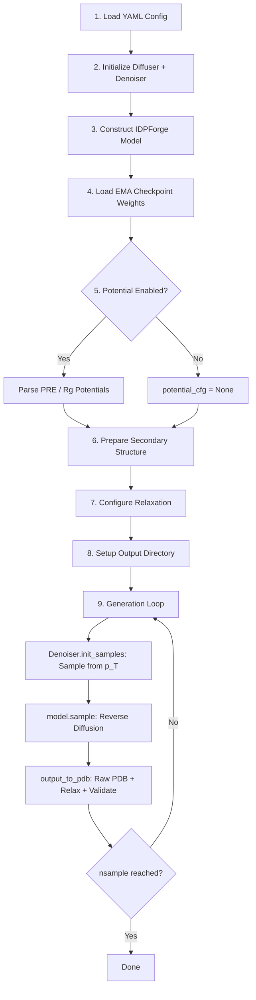

---
slug:12-idp-sampling-fully-disordered
blog_type:normal
---


IDPForge 的全无序采样流水线可为**天然无序蛋白 (IDPs)**——即没有稳定折叠核心的序列——生成结构系综。该流水线在三个耦合流形（欧几里得平移、SO(3) 骨架旋转和扭转角）上协调逆向扩散过程，由 IDPForge Transformer 网络驱动，并支持可选的实验引导势以及完整的 AMBER 弛豫 + 验证后处理。

## 流水线架构

端到端工作流由 `sample_idp.py` 启动，并依次经历九个逻辑独立的阶段。每个阶段都是可断点续传的操作：生成循环会在每批次处理前重新统计磁盘上现有的已验证 PDB 文件，因此中断的运行可以无缝继续。



步骤 9 中的循环是计算核心：它重复采样初始噪声，运行完整的逆向扩散轨迹，并写入已验证的构象体，直至满足目标 `nsample` 数量。

来源：[sample_idp.py](/sample_idp.py#L27-L170)

## 入口点与命令行接口

`sample_idp.py` 脚本提供了一个专为单序列 IDP 系综生成优化的极简命令行接口：

| 参数 | 类型 | 默认值 | 描述 |
|----------|------|---------|-------------|
| `seq` | 位置参数 | — | 氨基酸序列（单字母码） |
| `ckpt_path` | 位置参数 | — | EMA 检查点 `.ckpt` 的路径 |
| `output_dir` | 位置参数 | — | PDB 文件的输出目录 |
| `sample_cfg` | 位置参数 | — | 采样 YAML 配置的路径 |
| `--batch` | int | 32 | 每次_gpu_前向传播生成的构象体数 |
| `--nconf` | int | 100 | 要生成的构象体总数 |
| `--cuda` | flag | off | 启用 CUDA 加速 |
| `--ss_db` | str | None | 覆盖配置中 SS 数据库的 `data_path` |
| `--no_relax` | flag | off | 跳过 AMBER 弛豫（仅输出原始 PDB） |
| `--verbose` | flag | off | 打印每个构象体的结构验证细节 |

**使用示例：**
```bash
python sample_idp.py \
    "MDSKSSSKKSKDRSKYKDRSKYKDRSKYK" \
    checkpoints/idpforge_ema.ckpt \
    output/synuclein_ensemble/ \
    configs/sample.yml \
    --batch 32 --nconf 200 --cuda --verbose
```

来源：[sample_idp.py](/sample_idp.py#L172-L193)

## 扩散初始化：Diffuser 和 Denoiser

`Diffuser` 类组合了三个作用于不同几何自由度的独立扩散过程。`Denoiser` 类封装了 `Diffuser`，并提供了推理时所需的逆向步逻辑。

### Diffuser：三流形前向过程

`Diffuser.__init__` 根据 YAML 的 `diffuse` 配置段实例化三个子扩散器：

| 子扩散器 | 类 | 流形 | 配置键 |
|--------------|-------|----------|-------------|
| **骨架旋转** | `IGSO3` | SO(3) | `n_tsteps` (隐式) |
| **Cα 平移** | `EuclideanDiffuser` | ℝ³ | `euclid_b0`, `euclid_bT` |
| **侧链扭转** | `TorsionDiffuser` | [−π, π)⁴ | `torsion_b0`, `torsion_bT` |

`EuclideanDiffuser` 和 `TorsionDiffuser` 均使用**线性 beta 调度** `β(t) = linspace(b₀, b_T, T+1)`，并按 `T/steps` 缩放，以确保方差累积与离散化无关。`IGSO3` 类通过 `calculate_igso3()` 预计算离散化的 IGSO(3) 密度表，并将其缓存以供逆向采样步骤使用。

### Denoiser：逆向步编排

`Denoiser` 预计算平移和扭转通道的累积 alpha-bar 调度 `ᾱ(t) = ∏(1 − β(s))`。这些调度供 `get_next_pose()` 消耗，后者执行单步逆向扩散：

1. **Kabsch 对齐** — 通过 `align_coords()` 将预测的 x̂₀ 与当前的 x_t 对齐，以便在一致的坐标系中计算后续增量
2. **Cα 平移更新** — `get_next_ca()` 计算解析后验均值 μ(x_t, x̂₀, t) 并从高斯逆向核中采样
3. **骨架帧更新** — `get_next_frames()` 利用基于 IGSO(3) 分数的逆向采样，将每个残基帧从 R_t 旋转至 R̂₀
4. **扭转角更新** — `get_next_chi_angles()` 在环绕扭转角上应用相同的高斯逆向核，并遵循各残基的 `torsion_mask`（Gly、Ala 无 χ 角）

来源：[idpforge/utils/diff_utils.py](/idpforge/utils/diff_utils.py#L491-L685), [configs/sample.yml](/configs/sample.yml#L43-L50)

## 噪声初始化：从 p(x_T) 采样

在逆向扩散开始之前，每个构象体必须从终端噪声分布 p(x_T) 中初始化。`Denoiser.init_samples()` 方法按序列调用 `init_sample()`，执行三次独立抽取：

- **平移**：每个残基的 Cα 放置在 ℝ³ 中高斯偏移位置 `N(0, 1/crd_scale)` 处，其中 `crd_scale = 0.25`（实际上将残基分散至约 4 Å 标准差的范围）
- **旋转**：通过 `so3_diffuser.sample_vec()` 在最大噪声水平 t = T 下从 IGSO(3) 中采样旋转向量，然后应用于理想骨架原子位置 (N, Cα, C, O, Cβ)
- **扭转**：每个残基的四个 χ 角从 `N(0,1)` 中抽取并环绕至 [−π, π)，然后转换为 sin/cos 表示

这产生了完全解相关的原子位置——即最大熵起始状态，去噪网络将从此状态逐步细化结构。

来源：[idpforge/utils/diff_utils.py](/idpforge/utils/diff_utils.py#L187-L202), [idpforge/utils/diff_utils.py](/idpforge/utils/diff_utils.py#L609-L619)

## 逆向扩散：`recon()` 循环

`IDPForge.recon()` 方法实现了核心的逆向扩散轨迹。从 t = T 的噪声样本开始，它沿离散时间步向后迭代至 t = 0：

```python
for t in range(n_tsteps - 1, end_tsteps, -int(n_tsteps / inf_tsteps)):
```

这意味着当 `n_tsteps = 200` 且 `inference_steps = 40` 时，步长为 `200/40 = 5`，从而产生 40 次去噪迭代。在每个步骤中：

1. **网络预测** — `self.forward()` 接收当前带噪坐标 x_t、扭转特征 α_t、时间步索引 t、氨基酸嵌入和二级结构嵌入，然后预测去噪结构 x̂₀
2. **势引导** — 如果实验势处于激活状态，则应用基于梯度的修正：`p_x0 += clamp(∇V · scaler(t+1), max=grad_clip)`
3. **逆向步** — `denoiser.get_next_pose()` 使用以 x̂₀ 为条件的解析后验，从 x_t 转移至 x_{t-1}
4. **自条件化** — 如果 `self_condition: true`（默认），先前的输出将作为 `prev_outputs` 反馈至下一步，实现迭代细化

**自条件化**机制对于 IDP 采样质量至关重要：通过将先前的去噪预测作为附加输入信号回收利用，网络可以纠正跨扩散步累积的误差，从而为高度柔性链生成更具物理真实性的骨架几何结构。

来源：[idpforge/model.py](/idpforge/model.py#L155-L208)

## 模型前向传播：输入嵌入与主干

`IDPForge.forward()` 方法构建逐残基和成对的输入表示，以馈入 `FoldingTrunk`：

**逐残基序列状态** `s_s_0` 组合了三个加性信号：
- **时间步嵌入**：`time_embed(t)` — 扩散时间步的冻结正弦位置编码，经 `esm_s_mlp` 投影
- **扭转特征**：`α_t` 重塑为 8 维（4 个 χ 角 × sin/cos），与时间步嵌入拼接后输入 MLP
- **氨基酸嵌入**：`aa_embedding(aa_idx)` — 可学习的残基类型向量
- **二级结构嵌入**：`ss_embedding(ss_idx)` — 可学习的 SS 类型向量（H、E、C 等）

**成对状态** `s_z_0` 从 **2D 距离/角度特征** `xyz_to_t2d(x_t)` 初始化，该特征将带噪坐标中的成对 Cα 距离和残基间角度离散化至直方图桶中，然后经 `z_mlp` 投影。

在循环迭代（自条件化）时，上一轮循环的 `s_s`、`s_z` 和距离图会通过可学习的归一化层相加，然后再进入主干网络。

来源：[idpforge/model.py](/idpforge/model.py#L79-L153)

## 二级结构采样

对于全无序 IDP，不存在单一的基准二级结构分配。流水线通过从结构数据库中**采样多样的 SS 字符串**来解决此问题：

1. 将包含 (secondary_structure, sequence) 对的 pickle 数据库加载至 `DataFrame`
2. `fetch_sec_from_seq()` 将查询序列分割为重叠的 1–5 聚体（由 `xmer_prob = [1,1,3,3,1]` 加权）
3. 对于每个片段，查询数据库中观察到的 SS 注释，并按其出现频率的比例采样一个
4. 这将产生 `nsample × 2` 个 SS 字符串——超出所需数量以确保系综的多样性

随后，每个批次通过 `random.sample(ss, chunk)` 提取 SS 字符串，确保批次中的每个构象体都获得独特的局部结构偏好。这种多样性至关重要：SS 条件化告知网络局部片段应是螺旋、延伸还是卷曲状，而在不同样本间改变 SS 正是产生构象异质性的原因。

如果数据库查找失败（例如，序列包含稀有残基），流水线将优雅地回退至全卷曲注释 `"C" * seq_len`。

来源：[idpforge/utils/prep_sec.py](/idpforge/utils/prep_sec.py#L30-L62), [sample_idp.py](/sample_idp.py#L88-L108)

## 实验引导势

当配置中 `potential: true` 时，逆向扩散过程将通过实验可观测量的基于梯度的引导进行增强。`sample_idp.py` 主函数解析 `potential_cfg` 配置段，并构建供 `model.initialize_potential()` 消耗的 `potential_cfg` 字典。

### 可用势类型

| 键 | 类 | 实验数据 | 引导机制 |
|-----|-------|-------------------|-------------------|
| `pre` | `Contact` | PRE 距离界限 | 对成对 Cα 距离的谐波惩罚 |
| `rg` | `RoG` | 系综平均 Rg | 与目标回转半径的平方偏差 |

**时间尺度**参数通过衰减函数（`constant`、`linear` 或 `quadratic`）控制势对早期与后期扩散步的影响强弱。**grad_clip** 参数通过截断势梯度幅度来防止不稳定更新。

对于全无序采样，PRE_导出的接触约束是最常用的势，因为 NMR PRE 测量可直接探测无序态下的长程距离。`Contact` 势在 Cα–Cα 距离上实现了可微分的谐波上/下界，并带有随机掩码（`exp_mask_p`）以防止对任何单一约束的过拟合。

来源：[sample_idp.py](/sample_idp.py#L63-L86), [idpforge/utils/potential.py](/idpforge/utils/potential.py#L15-L98)

## 输出、弛豫与验证

`output_to_pdb()` 函数处理每个生成批次的完整后处理流水线：

1. 使用 OpenFold 的 `atom14_to_atom37()` 进行 **atom14 → atom37 转换**
2. **NaN 坐标过滤** — 静默丢弃具有任何 NaN 原子位置的构象体
3. **骨架连续性检查** — `check_backbone_continuity()` 验证沿链的 Cα–Cα 距离及 IDR–折叠连接处（当此函数被复用于 IDR 采样时相关）
4. **原始 PDB 写入** — 通过过滤的构象体被写入为 `{idx}_raw.pdb`

若启用弛豫（默认），每个原始 PDB 将经历：
5. **AMBER 弛豫** — 通过 `relax_protein()` 执行，具有可配置的 `max_iterations`、`tolerance`、`stiffness` 和 `max_outer_iterations`
6. **结构修复** — 手性校正（`repair_chirality()`）和组氨酸命名修正（`fix_histidine_naming()`），若应用了任何修复则重新弛豫
7. **完整结构验证** — `validate_structure_post_relax()` 检查手性、键完整性、空间位阻冲突和纽结拓扑
8. **已验证 PDB** — 通过的构象体被重命名为 `{idx}_validated.pdb` 并包裹在 `MODEL/ENDMDL` 块中；未通过的构象体被删除

生成循环仅统计 `*_validated.pdb` 文件（若 `--no_relax` 则为 `*_raw.pdb`），确保目标 `nsample` 指的是最终系综中**结构有效**的构象体数量。

来源：[idpforge/misc.py](/idpforge/misc.py#L119-L470), [configs/sample.yml](/configs/sample.yml#L51-L57)

## 生成循环与可续性

`sample_idp.py` 中的外层生成循环专为长时间运行的系综任务的鲁棒性而设计：

```python
while current_count < nsample:
    chunk = min(batch_size, nsample - current_count)
    ...
    current_count = count_done()  # re-count files on disk
```

关键可续性特性：
- **基于文件的进度追踪** — `count_done()` 使用 glob 匹配输出目录中的已验证 PDB，使进度在进程被杀后依然存活
- **无间隙索引** — `next_available_idx()` 查找最小的未用整数索引，防止部分运行后的文件名冲突
- **内存清理** — 每批次后调用 `gc.collect()` 和 `torch.cuda.empty_cache()`，防止 GPU 内存碎片化
- **批量大小调整** — 最后一批的大小精确填满剩余配额（`min(batch_size, nsample - current_count)`），避免过度生成

来源：[sample_idp.py](/sample_idp.py#L141-L170)

## 配置参考

`configs/sample.yml` 文件控制所有采样超参数。下表记录了每个参数及其在 IDP 采样流水线中的作用：

| 配置段 | 参数 | 默认值 | 作用 |
|---------|-----------|---------|------|
| `model` | `t_embed_dim` | 32 | 正弦时间步嵌入的维度 |
| `model` | `self_condition` | true | 启用自条件化（回收先前输出） |
| `model.trunk` | `num_blocks` | 2 | 主干中 Evoformer 块的数量 |
| `model.trunk` | `max_recycles` | 3 | 每扩散步主干内的循环迭代次数 |
| `model.trunk.structure_module` | `no_blocks` | 4 | 结构模块 IPA 块 |
| `model.trunk.structure_module` | `no_heads_ipa` | 8 | 不变点注意力头 |
| `diffuse` | `n_tsteps` | 200 | 总扩散时间步 T |
| `diffuse` | `inference_steps` | 40 | 逆向扩散步数（步长 = T/inf_steps） |
| `diffuse` | `euclid_b0` / `euclid_bT` | 0.01 / 0.06 | Cα 平移的线性 β 调度端点 |
| `diffuse` | `torsion_b0` / `torsion_bT` | 0.01 / 0.06 | 侧链扭转的线性 β 调度端点 |
| `potential` | — | false | 启用/禁用实验引导 |
| `potential_cfg.pre` | `exp_path` | — | PRE 实验约束文件路径 |
| `potential_cfg.pre` | `exp_mask_p` | 0.8 | PRE 约束的随机掩码概率 |
| `potential_cfg` | `timescale` | 10 | 势强度缩放因子 |
| `potential_cfg` | `grad_clip` | 0.1 | 最大势梯度幅度 |
| `sec_path` | — | null | 覆盖 SS 文件（null = 从数据库采样） |
| `data_path` | — | `data/example_data.pkl` | SS 数据库 pickle 路径 |
| `relax` | `max_iterations` | 0 | AMBER 最大迭代次数（0 = L-BFGS 默认） |
| `relax` | `tolerance` | 10.0 | 收敛容差 |
| `relax` | `stiffness` | 10.0 | 约束刚度 |
| `relax` | `max_outer_iterations` | 20 | 分阶段弛豫的外层迭代限制 |

来源：[configs/sample.yml](/configs/sample.yml#L1-L57)

## 对比：IDP 与 IDR 采样

全无序 IDP 流水线（`sample_idp.py`）与带模板 IDR 流水线（`sample_ldr.py`）在若干基本方面有所不同：

| 方面 | IDP 采样（全无序） | IDR 采样（带折叠模板） |
|--------|--------------------------------|-------------------------------------|
| **输入** | 仅序列 | 序列 + 折叠模板坐标 |
| **噪声初始化** | 所有残基从 p(x_T) 采样 | 模板残基固定于天然坐标；IDR 残基加噪 |
| **扩散掩码** | 所有残基自由扩散 | `motif_mask` 冻结模板位置 |
| **二级结构** | 每个构象体从数据库采样 | 从模板 + IDR 片段的数据库派生 |
| **Kabsch 对齐** | 对 x_t 全局对齐 | 锚定在基序上的部分对齐 |
| **典型用例** | α-突触核蛋白、tau、Sic1 系综 | p53 TAD、含折叠域的 CBP IDR |

<CgxTip>为获得最佳 IDP 系综质量，请将 `inference_steps` 增加至默认值 40 以上——对于长无序链（>100 个残基），60–80 的值可提供更平滑的去噪轨迹，代价是生成速度约减慢 1.5–2 倍。</CgxTip>

<CgxTip>使用基于 PRE 的势时，请将 `exp_mask_p` 设置在 0.5–0.8 之间，以防止引导对系综过度约束。过多的约束强制会产生人为紧凑的构象体，无法代表真实的无序态。</CgxTip>

来源：[sample_idp.py](/sample_idp.py#L27-L193), [idpforge/utils/diff_utils.py](/idpforge/utils/diff_utils.py#L622-L684)

## 后续步骤

- 如需采样**附着于折叠域的天然无序区**，请参阅 [IDR Sampling with Folded Templates](13-idr-sampling-with-folded-templates)
- 如需详细了解 **PRE、Rg 和其他实验约束**的配置，请参阅 [Experimental Guidance Potentials](14-experimental-guidance-potentials)
- 如需了解应用于每个构象体的 **AMBER 弛豫和结构验证**，请参阅 [AMBER Relaxation and Repair](15-amber-relaxation-and-repair)
- 如需了解三个耦合扩散过程的**数学基础**，请参阅 [SE(3) Backbone Diffusion](6-se-3-backbone-diffusion) 和 [SO(3) Rotational Diffusion](7-so-3-rotational-diffusion)