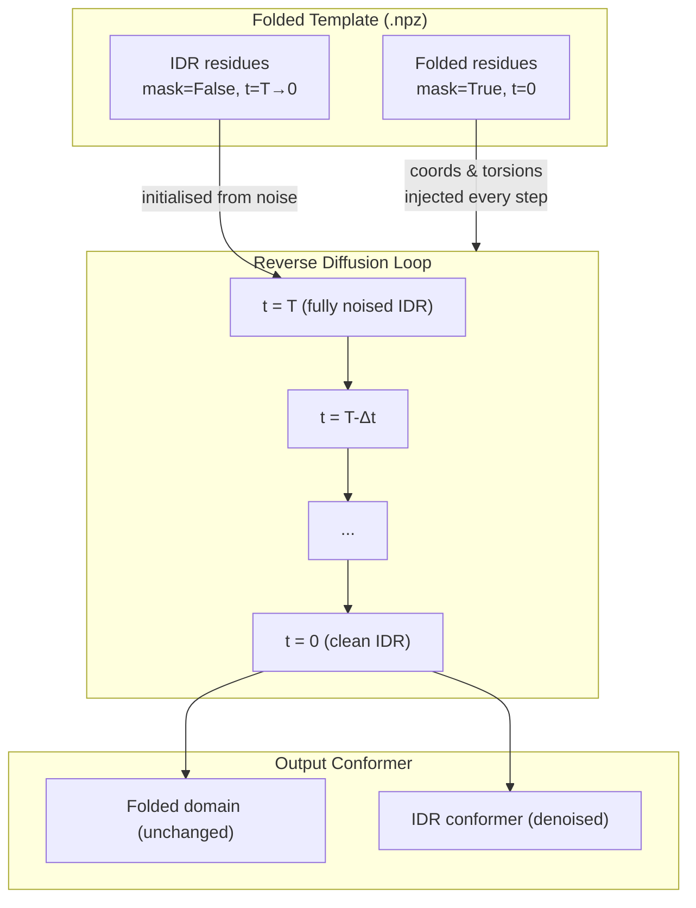
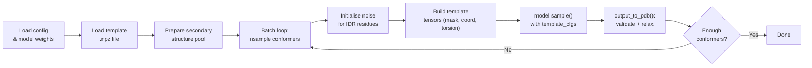
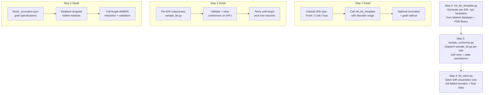

---
slug:13-idr-sampling-with-folded-templates
blog_type:normal
---


使用折叠模板的 IDR 采样是 IDPForge 针对同时包含**结构化域**和**本征无序区 (IDR)** 的蛋白质的核心推理模式。与从噪声开始扩散整条链的 [IDP 采样（完全无序）](12-idp-sampling-fully-disordered) 不同，此模式**将折叠骨架固定为模板**，仅对无序残基进行去噪——从而生成 IDR 构象体物理锚定在其天然结构化上下文中的系综。该工作流包含两个阶段：**模板准备**（`mk_ldr_template.py`）和**模板条件扩散**（`sample_ldr.py`），并通过 AlphaFlex 流水线（步骤 2–4）提供生产规模的编排。

来源：[sample_ldr.py](/sample_ldr.py#L1-L31), [mk_ldr_template.py](/mk_ldr_template.py#L1-L27)

## 模板条件化的工作原理

基本机制是 `IDPForge.recon()` 方法内部的**逐残基时间步掩码**。在逆向扩散循环中，模型在每个时间步检查是否提供了 `template_cfg` 字典。如果提供了，它会：

1. 对于 `template_cfg["mask"]` 为 `True`（折叠残基）的每个残基，**将扩散时间步设置为 0**，表明“该残基已处于干净的数据分布——无需对其去噪”。
2. 对于被掩码的残基，用模板的真实骨架坐标**覆盖加噪坐标** `x_t`。
3. 对于被掩码的残基，用模板的真实扭转角向量**覆盖加噪扭转角** `alpha_t`。

这意味着前向传播接收到**混合信号**：折叠残基处于时间步 0（完全干净），IDR 残基处于当前扩散时间步（加噪）。网络的结构模块随后预测整条链的干净坐标，但只有 IDR 残基会通过去噪器的 `get_next_pose()` 步骤进行更新——折叠残基通过 `motiff_mask` 被冻结。



<CgxTip>模板掩码是残基上的一个**布尔数组**：`True` = 折叠（固定），`False` = 无序（扩散）。它存储在 `.npz` 模板文件中，键名为 `"mask"`，并在推理时由 `sample_ldr.py` 直接加载。</CgxTip>

来源：[idpforge/model.py](/idpforge/model.py#L155-L208), [idpforge/model.py](/idpforge/model.py#L211-L256)

## 模板准备：`mk_ldr_template.py`

在开始采样之前，必须将折叠的 PDB 结构转换为包含扩散模型所需所有字段的**模板 `.npz` 文件**。`mk_ldr_template.py` 脚本通过以下流水线执行此转换：

| 阶段 | 操作 | 输出字段 |
|-------|-----------|--------------|
| 解析 PDB | 通过 `process_pdb()` 提取坐标 + 序列 | `coord` (L×37×3) |
| 扭转角编码 | 计算 χ 角 → sin/cos 向量化 | `torsion` (L×4×2) |
| 二级结构 | DSSP (H/E) + 无规卷曲的拉氏图盆地分配 | `sec` (字符串) |
| 掩码构建 | 折叠残基为 `True`，`--disorder_domain` 中的残基为 `False` | `mask` (L, 布尔值) |
| 种子生成 | 在折叠域周围的球面上采样 IDR 云中心 | `coord_offset` (N×3) |

### 锚点几何与种子布局

该脚本根据 IDR 相对于折叠域的位置，将其拓扑结构分为三种几何类型：

| 几何类型 | 条件 | 锚点 |
|----------|-----------|--------------|
| **N 端尾部** | `start_idx == 0` | 第一个折叠残基的 Cα（`end_idx + 1`） |
| **C 端尾部** | `end_idx == L - 1` | 最后一个折叠残基的 Cα（`start_idx - 1`） |
| **内部环** | 其他情况 | 两侧相邻 Cα 的中点 |

坐标以**锚点为中心**（原位减去锚点坐标），折叠域的 Cα 构成**排除面**。IDR 云中心的种子点在距离原点 `[seed_floor, seed_ceiling]` Å 的**绝对种子距离带**内的球面上采样，并由 `--seed_skew` 控制的**幂律偏斜**调节：

- **`seed_skew = 0`**：所有种子点位于下限（6.46 Å，经经验优化为单步采样的最优值）
- **`seed_skew = 0.5`**：在距离带内均匀分布
- **`seed_skew = 1`**：所有种子点位于上限（9.12 Å）
- **默认 0.3**：集中在下限附近，同时保持系综的广度

任何落在折叠 Cα 的 `--min_fold_dist` 范围内的种子点都将被**拒绝**（折叠保持禁区），以防止 IDR 云与结构化域重叠。

来源：[mk_ldr_template.py](/mk_ldr_template.py#L128-L271), [mk_ldr_template.py](/mk_ldr_template.py#L40-L56)

### 大型系统的截断

IDPForge 仅对 ≤ ~200 个残基的系统处于分布内。当 IDR 与折叠域的总长超过此限制时，`--max_residues` 会触发 `_truncate_to_size()` 函数，该函数会：

1. **保留完整的 IDR** 以及对称数量的连接处相邻的折叠残基（每侧至少 10 个）。
2. 从模板中**丢弃较远的折叠残基**，并在 `.npz` 文件中存储一个**嫁接规范**（`graft_offset`、`graft_idr_ranges`、`graft_fold_range`）。
3. `sample_ldr.py` 在生成时自动输出一个 `_truncation.json` 伴随文件，[蒙特卡罗拼接与组装](20-monte-carlo-stitching-and-assembly) 在步骤 4 中使用该文件将完整的折叠域嫁接回每个构象体。

或者，`--fold_per_side` 可显式设置每个连接处保留的折叠残基数量（例如，`--fold_per_side 50` → IDR + 50 个折叠残基），从而忽略预算计算。

来源：[mk_ldr_template.py](/mk_ldr_template.py#L59-L125), [sample_ldr.py](/sample_ldr.py#L114-L134)

### 超大 IDR 的步骤 2 延续

当单个 IDR 即使在最大截断下也超过分布上限时，**步骤 2 延续**机制会将 IDR 拆分为两个片段：

| 片段 | 角色 | 方向 |
|----------|------|-----------|
| **A**（现有构象体） | 片段 B 的固定伪折叠 | — |
| **B**（新尾部） | 新扩散的 IDR 块 | `--append_seq`（C 端）或 `--prepend_seq`（N 端） |

来自步骤 A 的构象体被加载，其序列通过为零坐标的残基占位符扩展至片段 B，IDR 掩码被设置为仅覆盖新范围。生成的模板带有 `step2_a_conformer` 标签，以便步骤 4 可以链接组装过程：`fold ← A ← B`。

来源：[mk_ldr_template.py](/mk_ldr_template.py#L146-L168), [mk_ldr_template.py](/mk_ldr_template.py#L259-L269), [sample_ldr.py](/sample_ldr.py#L136-L148)

## 采样：`sample_ldr.py`

主采样脚本编排了从模板加载到构象体输出的完整推理流水线：



### 模板张量构建

在每次批量迭代中，模板字典从 `.npz` 数据构建而成：

```python
template = {k: torch.tensor(np.tile(v[None, ...], (chunk,) + (1,) * len(v.shape)),
    device=model.device, dtype=torch.long if k=="mask" else torch.float)
    for k, v in fold_data.items() if k in ["torsion", "mask"]}
```

坐标接收特殊处理：如果存在 `coord_offset`（多个种子点），则每个批次会选择一个偏移量的**随机子集**，并从模板坐标中减去，将每个样本的 IDR 云置于不同的种子位置。这就是**系综多样性**注入的机制——每个构象体从相对于折叠域的不同空间位置开始。

来源：[sample_ldr.py](/sample_ldr.py#L33-L109), [sample_ldr.py](/sample_ldr.py#L170-L224)

### 二级结构组合

每个样本的二级结构是模板折叠二级结构与采样的 IDR 二级结构的**混合体**：

```python
def combine_sec(fold_ss, idr_ss, mask):
    return "".join(fold_ss[i] if m else idr_ss[i] for i, m in enumerate(mask))
```

IDR 二级结构字符串从**预计算的数据库**（`--ss_db`）、平面文件（`sec_path`）中提取，或默认为全卷曲（`"C" * L`）。这确保了扩散模型为无序区接收到物理上合理的二级结构信号，同时保留折叠域的真实分配。

来源：[sample_ldr.py](/sample_ldr.py#L30-L96)

### 带折叠约束的弛豫

当启用弛豫（默认情况）时，`sample_ldr.py` 将 AMBER 弛豫配置为**约束折叠域**，同时允许 IDR 自由最小化：

```python
relax_config["exclude_residues"] = np.where(~fold_data["mask"])[0].tolist()
```

这会将所有无序残基的索引作为 `exclude_residues` 传入，意味着位置约束**不应用**于 IDR——折叠骨架保持锁定，而 IDR 侧链和骨架进行能量最小化。

来源：[sample_ldr.py](/sample_ldr.py#L99-L108)

## 连接处质量门控

两个可选的过滤器会拒绝具有物理上不合理的连接处几何形状的构象体——即 IDR 与折叠域交汇处：

| 门控 | 标志 | 指标 | 拒绝条件 |
|------|------|--------|--------------|
| **折叠曲率** | `--fold_curv_ratio` | 构象体中连接处相邻折叠曲率与模板曲率的比值 | 构象体的曲率低于模板曲率的阈值分数（折叠变直） |
| **连接处 κ** | `--junction_kappa` | 连接处最后约 20 个 IDR 残基的平均骨架曲率 κ (Å⁻¹) | κ 低于阈值（IDR 被拉紧以触及锚点） |

折叠曲率窗口（默认为从每个连接处深入折叠域 15 个残基）和两个阈值的默认值均为 0.0（禁用）。例如，设置 `--fold_curv_ratio 0.8` 将丢弃折叠域连接处相邻曲率降至模板值 80% 以下的任何构象体——这是一种**刚体运动不变量**度量，替代了折叠 lDDT 用于模板质量评估。

来源：[sample_ldr.py](/sample_ldr.py#L202-L218), [sample_ldr.py](/sample_ldr.py#L248-L255)

## 拓扑约束：纽结筛选

对于具有非平凡拓扑的蛋白质，`--expected_knot_type` 接受按域指定的预期纽结类型的 **JSON 规范**：

```json
[
  {"range": [65, 280], "knot": null},
  {"range": [320, 450], "knot": "3_1"}
]
```

这允许不同的域具有不同的拓扑约束——例如，一个域必须是无结的，而另一个域必须是三叶结 (3₁)。违反指定拓扑的构象体在验证期间会被拒绝。省略此标志将应用旧版的全链无结基线。

来源：[sample_ldr.py](/sample_ldr.py#L256-L279)

## AlphaFlex 流水线集成

AlphaFlex 流水线通过三个连续的步骤在蛋白质组规模上自动化了完整的 IDR 采样工作流：



**步骤 2**（`AlphaFlex/Step_2_mk_ldr_template.py`）遍历标记的蛋白质数据库，按拓扑结构（N 端尾部、C 端尾部、内部环）对每个 IDR 进行分类，并通过子进程为每个 IDR 调用 `mk_ldr_template.py`。类别 0（完全无序）的蛋白质被分流到单独的 IDP 列表中，用于 [IDP 采样（完全无序）](12-idp-sampling-fully-disordered)。

**步骤 3**（`AlphaFlex/Step_3_sample_conformer.py`）管理受 GPU 约束的采样阶段。对于每个 IDR，它通过重试逻辑和持久状态（`.step3_state.json`）调度 `sample_ldr.py`，累积构象体直到达到目标池大小。纽结规范会自动过滤至截断窗口并重新编号。

**步骤 4**（`AlphaFlex/Step_4_ldr_stitch.py`）执行最终组装：读取 `_truncation.json` 伴随文件以将丢弃的折叠残基嫁接回构象体，在带有折叠约束的情况下运行全长的 AMBER 弛豫，验证结构完整性，并写入最终的系综 PDB。

来源：[AlphaFlex/Step_2_mk_ldr_template.py](/AlphaFlex/Step_2_mk_ldr_template.py#L1-L200), [AlphaFlex/Step_3_sample_conformer.py](/AlphaFlex/Step_3_sample_conformer.py#L84-L142), [AlphaFlex/Step_4_ldr_stitch.py](/AlphaFlex/Step_4_ldr_stitch.py#L1-L116)

## CLI 参考

### `mk_ldr_template.py`

| 参数 | 类型 | 默认值 | 描述 |
|----------|------|---------|-------------|
| `input` | pos | — | 输入 PDB 文件 |
| `disorder_domain` | pos | — | 残基范围（从 1 开始索引，含边界），例如 `38-129` |
| `output` | pos | — | 输出 `.npz` 路径 |
| `--nconf` | int | 400 | 要采样的种子点数量 |
| `--seed_skew` | float | 0.3 | 种子距离的幂律偏斜（0=下限，1=上限） |
| `--seed_floor` | float | 6.46 | 最小种子距离 (Å) |
| `--seed_ceiling` | float | 9.12 | 最大种子距离 (Å) |
| `--min_fold_dist` | float | 6.46 | 折叠 Cα 周围的保持禁区半径 (Å) |
| `--variant_seq` | str | None | 覆盖 IDR 氨基酸标识 |
| `--max_residues` | int | None | 系统总大小的硬性上限 |
| `--fold_per_side` | int | None | 每个连接处保留的精确折叠残基数（覆盖预算） |
| `--append_seq` | str | None | 步骤 2：要追加的 C 端 IDR 尾部 |
| `--prepend_seq` | str | None | 步骤 2：要前置的 N 端 IDR 块 |

### `sample_ldr.py`

| 参数 | 类型 | 默认值 | 描述 |
|----------|------|---------|-------------|
| `ckpt_path` | pos | — | 模型检查点路径 |
| `fold_input` | pos | — | 模板 `.npz` 文件 |
| `out_dir` | pos | — | 输出目录 |
| `sample_cfg` | pos | — | 采样 YAML 配置 |
| `--batch` | int | 32 | 每轮扩散的批量大小 |
| `--nconf` | int | 100 | 目标构象体数量 |
| `--attention_chunk` | int | None | 节省显存的注意力分块大小 |
| `--cuda` | flag | False | 使用 GPU |
| `--ss_db` | str | None | 二级结构数据库 (pickle) |
| `--no_relax` | flag | False | 跳过弛豫（输出原始 PDB） |
| `--fold_curv_ratio` | float | 0.0 | 折叠曲率拒绝阈值 |
| `--fold_curv_window` | int | 15 | 用于曲率平均的深入折叠域的残基数 |
| `--junction_kappa` | float | 0.0 | 连接处拉紧度拒绝阈值 (Å⁻¹) |
| `--expected_knot_type` | str | None | 按域指定的纽结规范 (JSON) |

来源：[mk_ldr_template.py](/mk_ldr_template.py#L274-L351), [sample_ldr.py](/sample_ldr.py#L233-L292)

## 典型使用工作流

对于具有折叠域（残基 16–230）和 N 端 IDR（残基 1–15）的蛋白质，最小的双命令工作流如下：

```bash
# 步骤 1：准备模板
python mk_ldr_template.py folded.pdb 1-15 template.npz --nconf 400

# 步骤 2：采样构象体
python sample_ldr.py checkpoint.pt template.npz output_dir/ configs/sample.yml \
    --nconf 200 --batch 32 --cuda --ss_db sec_db.pkl
```

对于超过 ~200 个残基的较大系统，添加截断：

```bash
python mk_ldr_template.py folded.pdb 1-15 template.npz --nconf 400 --max_residues 200
```

对于需要两步延续的超大 IDR：

```bash
# 片段 A：前 100 个 IDR 残基
python mk_ldr_template.py folded.pdb 1-100 fragment_a.npz --max_residues 200

# 采样片段 A 构象体...
python sample_ldr.py ckpt.pt fragment_a.npz pool_a/ configs/sample.yml --nconf 200 --cuda

# 片段 B：追加到片段 A 构象体的剩余 IDR 残基
python mk_ldr_template.py pool_a/1_validated.pdb 101-150 fragment_b.npz \
    --append_seq $(python -c "print('G'*50)") --max_residues 200

# 采样片段 B 构象体...
python sample_ldr.py ckpt.pt fragment_b.npz pool_b/ configs/sample.yml --nconf 200 --cuda
```

<CgxTip>模板中的每个种子点会在相对于折叠域的**不同空间偏移**处生成构象体。`mk_ldr_template.py` 中的 `--nconf` 应 ≥ `sample_ldr.py` 中的 `--nconf`，以确保每个批次具有唯一的偏移量。如果 `coord_offset` 耗尽，偏移量将被平铺（重用），这会降低空间多样性。</CgxTip>

来源：[sample_ldr.py](/sample_ldr.py#L186-L190), [mk_ldr_template.py](/mk_ldr_template.py#L230-L237)

## 后续步骤

一旦构象体生成并验证通过，自然的后续步骤是：

- 应用**实验引导势**以将系综偏向 NMR/SAXS/FRET 数据：[实验引导势](14-experimental-guidance-potentials)
- 运行 **X-EISD 评分**以选择最大一致性的子系综：[X-EISD 系综评分](17-x-eisd-ensemble-scoring)
- 对于截断的模板，完成**嫁接与拼接**工作流：[蒙特卡罗拼接与组装](20-monte-carlo-stitching-and-assembly)