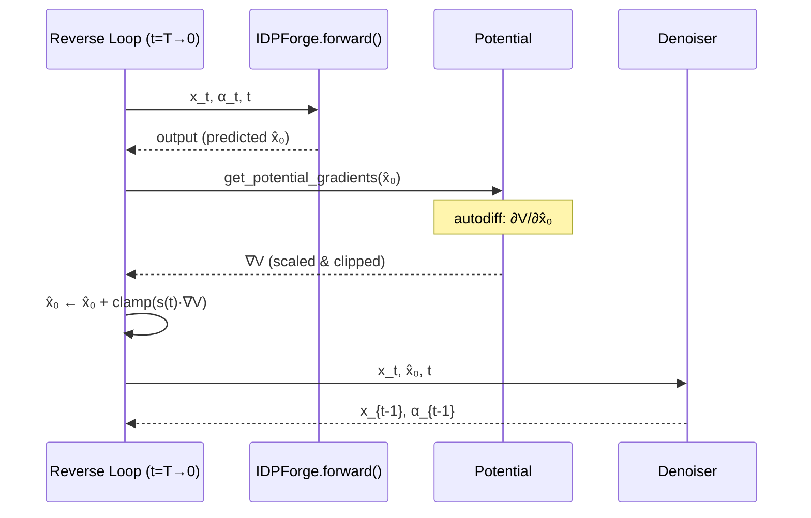

---
slug:14-experimental-guidance-potentials
blog_type:normal
---


IDPForge 将**可微的实验约束势**直接集成到逆向扩散轨迹中，使得结构采样在物理上与 NMR、FRET 和 SAXS 观测量保持一致。这些势并非事后过滤，而是在每个去噪时间步施加基于梯度的引导——在执行下一个逆向步骤之前，将模型的 $\hat{x}_0$ 预测偏向满足实验约束的构象。这种机制生成的系综不仅在结构上符合扩散模型的生成逻辑，而且在构建之初就经过了实验验证。

来源：[potential.py](idpforge/utils/potential.py#L1-L170), [model.py](idpforge/model.py#L155-L269)

## 架构集成至逆向扩散

引导势在 `IDPForge.recon()` 逆向扩散循环中运行。在每个时间步 $t$，模型预测去噪后的结构 $\hat{x}_0$。如果某个势处于激活状态，则通过自动微分计算其梯度 $\nabla_{\hat{x}_0} V(\hat{x}_0)$，经随时间变化的函数缩放和截断以保证稳定性，并在去噪器计算下一步 $x_{t-1}$ 之前**将其加到 $\hat{x}_0$ 上**。这意味着该势不会修改噪声调度或网络权重——它仅仅通过构象空间重定向每个样本的轨迹。



关键代码路径位于 `recon()` 中：在前向传播生成 `p_x0` 之后，如果存在势，则计算并应用势梯度，然后将修改后的 `p_x0` 传递给 `denoiser.get_next_pose()`。

来源：[model.py](idpforge/model.py#L187-L202)

## 势类与物理公式

所有势均继承自 `Potential` 基类，该基类定义了两个接口约定：`compute(xyz)` 返回一个待**最大化**的标量值（即负损失），而 `get_potential_gradients(xyz)` 则通过 `compute` 启用自动求导，并处理从 Cα 到所有五个骨架原子的梯度广播。

来源：[potential.py](idpforge/utils/potential.py#L15-L53)

### 回转半径

| 属性 | 详情 |
|-----------|--------|
| **键** | `rg` |
| **观测量** | 来自 SAXS 的系综平均 $R_g$ |
| **输入** | `target`：目标 $R_g$ 值 (Å) |
| **公式** | $V = -\frac{1}{2}(R_g - R_g^{\text{target}})^2$，其中 $R_g = \sqrt{\sum_i \|\mathbf{r}_i^{\text{Cα}} - \bar{\mathbf{r}}^{\text{Cα}}\|^2}$ |
| **梯度原子** | 仅 Cα（广播至所有骨架原子） |

RoG 势对链的紧凑度提供了全局约束。来自 SAXS 实验的**单一标量** $R_g^{\text{target}}$ 直接塑造了系综的整体维度，使其成为无序蛋白最简单却通常也是最具影响力的约束。

来源：[potential.py](idpforge/utils/potential.py#L56-L67)

### 接触 (PRE / NOE 距离界限)

| 属性 | 详情 |
|-----------|--------|
| **键** | `contact` |
| **观测量** | 顺磁弛豫增强 (PRE) 或 NOE 上下距离界限 |
| **输入** | `contact_bounds`：数组 `[L, L, 2]` — 距离下限和上限；`exp_mask_p`：随机掩码概率 |
| **公式** | $V = -\sum_{i,j} m_{ij} \left[\text{clamp}(d_{ij}^{\text{lo}} - \bar{d}_{ij})^2 + \text{clamp}(\bar{d}_{ij} - d_{ij}^{\text{hi}})^2\right]$，其中 $\bar{d}_{ij} = \left(\frac{1}{L}\sum_b (d_{ij}^{(b)} + \epsilon)^{-6}\right)^{-1/6}$ 为批次上的幂均值 |
| **梯度原子** | 仅 Cα（广播） |

**幂均值聚合**（$p = -6$，类调和均值）是可微的，避免了 `min` 操作的不连续性，其灵感源自 PLUMED 的 COORDINATION 集合变量。随机掩码 `exp_mask_p` 在每次梯度计算时随机丢弃部分约束，这引入了构象多样性，防止系综坍缩成同时最小化所有约束的单一结构——对于 IDP 系综而言，异质性具有物理意义，因此这一特性至关重要。

来源：[potential.py](idpforge/utils/potential.py#L70-L98)

### FRET 效率

| 属性 | 详情 |
|-----------|--------|
| **键** | `fret` |
| **观测量** | smFRET 效率 $E$ |
| **输入** | `exp_val`：数组 `[L, L, 2]` — 通道 0 = 目标效率，通道 1 = 福斯特半径 $R_0$；`exp_mask_p`：随机掩码概率 |
| **公式** | $V = -\sum_{i,j} m_{ij} \left| \bar{E}_{ij} - E_{ij}^{\text{target}} \right|$，其中 $E_{ij}^{(b)} = \frac{1}{1 + (d_{ij}^{(b)} / R_0)^6}$，$\bar{E}_{ij} = \frac{1}{B}\sum_b E_{ij}^{(b)}$ |
| **梯度原子** | 仅 Cα（广播） |

FRET 势使用经典的**福斯特方程**将残基间距离转换为转移效率。每个约束对的 $R_0$（福斯特半径）存储在 `exp_val` 的通道 1 中，允许在同一实验中使用不同染料对的 $R_0$ 值。绝对差损失（而非平方差）为异常效率值提供了鲁棒性。

来源：[potential.py](idpforge/utils/potential.py#L101-L123)

### J-耦合

| 属性 | 详情 |
|-----------|--------|
| **键** | `jcoup` |
| **观测量** | ${}^3J_{\text{HN-Hα}}$ 远程标量耦合 |
| **输入** | `exp_val`：数组 `[L-1]` — 每个残基的目标 $J$ 值；`exp_mask_p`：随机掩码概率 |
| **公式** | $V = -\frac{1}{2}\sum_i m_i (J_i^{\text{calc}} - J_i^{\text{target}})^2$，其中 $J_i^{\text{calc}} = 6.51\cos^2(\phi_i - 60°) - 1.76\cos(\phi_i - 60°) + 1.6$ (Karplus 方程) |
| **梯度原子** | 骨架 N–Cα–C（真实二面角梯度） |

J-耦合势在架构上与众不同：它在**真实的骨架原子** (N, Cα, C) 上计算梯度，而非仅基于 Cα，因为二面角 $\phi$ 依赖于相邻残基的精确几何结构。Karplus 关系将骨架扭转角映射为可观测的耦合值，梯度通过 `get_dih()` 流动，该函数从四个连续骨架原子计算精确的二面角。

来源：[potential.py](idpforge/utils/potential.py#L126-L148), [tensor_utils.py](idpforge/utils/tensor_utils.py#L86-L113)

### 复合多势

| 属性 | 详情 |
|-----------|--------|
| **键** | `multiple` |
| **目的** | 任意势的加权组合 |
| **公式** | $V = \frac{1}{\sum_k w_k} \sum_k w_k \cdot V_k(\mathbf{x})$ |

当配置指定了多种类型的势时，`initialize_potential()` 会自动构建一个 `Multiple` 势，该势独立评估每个子势并返回它们的**加权和**，且以总权重进行归一化。这使得例如 PRE 距离和 Rg 可以同时施加约束。

来源：[potential.py](idpforge/utils/potential.py#L151-L169), [model.py](idpforge/model.py#L258-L269)

## 梯度计算与安全机制

`Potential` 基类中的 `get_potential_gradients()` 方法实现了一个经过精心设计的自动微分管线，包含三种安全机制：

1. **梯度广播**：如果 Cα 以外的原子（索引 2–4）上的梯度为零，则 Cα 梯度将被平铺至所有五个骨架原子位置 `[N, Cα, C, O, Cβ]`。这确保了即使对于仅感知 Cα 位置的基于距离的势，去噪器也能接收格式正确的梯度张量。

2. **NaN 检测与置零**：Cα 梯度通道中的任何 NaN 值都会触发警告，并被替换为零。随后将对完整梯度张量进行扫描，以清除剩余的 NaN。这可以防止 `Contact` 势的幂均值计算在极短距离下出现数值不稳定的情况。

3. **梯度截断**：在 `recon()` 中通过 `torch.clamp(x_grad * scaler, max=potential_grad_clip)` 外部应用，防止过大的梯度步长破坏逆向扩散轨迹的稳定性。默认截断值为 `0.1`。

来源：[potential.py](idpforge/utils/potential.py#L33-L53), [model.py](idpforge/model.py#L190-L192)

## 随时间变化的势缩放

势的影响由**随时间变化的缩放函数** $s(t)$ 调制，该函数由 `timescale` 和 `time_schedule` 配置参数控制。共有三种调度策略：

| 调度策略 | 公式 | 行为 |
|----------|---------|----------|
| `constant` | $s(t) = \lambda$ | 在所有时间步施加完整约束强度 |
| `linear` | $s(t) = \frac{t}{T} \cdot \lambda$ | 从零（在 $t=0$，即最终结构处）线性增加至满强度（在 $t=T$，即纯噪声处） |
| `quadratic` | $s(t) = \frac{t^2}{T^2} \cdot \lambda$ | 缓慢增加；约束仅在早期（噪声较大）步骤占主导地位 |

**线性**调度是默认且最具物理意义的策略：在早期逆向扩散步骤（$t$ 较高，接近纯噪声）中，模型的 $\hat{x}_0$ 预测不可靠，因此强烈的实验梯度提供了有价值的结构信息。随着结构在 $t$ 较低时逐渐成型，模型自身学习到的先验变得更加可信，实验梯度自然减弱。`timescale` 参数 $\lambda$ 控制整体幅度。

来源：[model.py](idpforge/model.py#L258-L265)

## 实验数据格式与解析

### PRE / NOE 接触数据

接触约束从 CSV 文件中读取，列格式为：`index, res1, atom1, res2, atom2, dist_value, lower, upper`。`get_contact_map()` 解析器将其转换为对称的 `[L, L, 2]` 数组，其中通道 0 存储下限（$d_{\text{value}} - \text{lower}$），通道 1 存储上限（$d_{\text{value}} + \text{upper}$）。CSV 中的残基索引是**从 1 开始的**，在内部被转换为从 0 开始。

来自 `sic1_pre_exp.txt` 的条目示例：
```
index,res1,atom1,res2,atom2,dist_value,lower,upper
1,1,CA,3,H,10.79,5.0,5.0
```
此条目指定残基 1 的 Cα 与残基 3 的 H 之间的距离应在 5.79–15.79 Å 范围内。

### J-耦合数据

J-耦合值从 CSV 文件中读取，列格式为：`resnum, value`。`get_jcoup_array()` 解析器生成一个 `[L-1]` 数组，按残基索引（从 0 开始，偏移量为 `resnum - 2`）。

### FRET 效率数据

FRET 数据使用 CSV 格式，列格式为：`res1, res2, value, scale`，其中 `value` 为目标效率 $E$，`scale` 为福斯特半径 $R_0$。`get_efret_array()` 解析器生成一个对称的 `[L, L, 2]` 数组。

来源：[np_utils.py](idpforge/utils/np_utils.py#L42-L71), [sic1_pre_exp.txt](data/sic1_pre_exp.txt#L1-L5)

## 配置与激活

势在采样 YAML 的 `potential_cfg` 键下进行配置。必须设置顶层 `potential: true` 标志以激活它们。`sample_idp.py` 脚本解析该配置并构建一个 `potential_cfg` 字典，传递给 `model.sample()`。

```yaml
# configs/sample.yml — 示例配置
potential: true
potential_cfg:
  pre:                              # PRE 距离约束
    exp_path: data/sic1_pre_exp.txt # PRE CSV 路径
    exp_mask_p: 0.8                 # 随机掩码概率
    weight: 1.0                     # 势权重（用于 Multiple）
  rg:                               # 回转半径
    ens_avg: 25.4                   # 目标 Rg，单位 Å
    weight: 1.0
  timescale: 10                     # 整体缩放幅度 λ
  grad_clip: 0.1                    # 梯度截断阈值
```

`sample_idp.py` 中的配置解析器可识别 `pre`/`noe` 键（映射至 `contact`）和 `rg` 键。每个键的子字典将被转发至相应的势构造函数。

来源：[sample_idp.py](sample_idp.py#L64-L86), [sample.yml](configs/sample.yml#L34-L40)

### 完整参数参考

| 参数 | 位置 | 类型 | 默认值 | 描述 |
|-----------|----------|------|---------|-------------|
| `potential` | 顶层 | bool | `false` | 引导势的主开关 |
| `potential_cfg.pre.exp_path` | 在 `potential_cfg` 下 | str | — | PRE/NOE CSV 文件路径 |
| `potential_cfg.pre.exp_mask_p` | 在 `potential_cfg` 下 | float | `1.0` | 每个梯度步保留每个约束的概率 |
| `potential_cfg.pre.weight` | 在 `potential_cfg` 下 | float | `1.0` | `Multiple` 组合的权重 |
| `potential_cfg.rg.ens_avg` | 在 `potential_cfg` 下 | float | — | 目标系综平均 $R_g$ (Å) |
| `potential_cfg.rg.weight` | 在 `potential_cfg` 下 | float | `1.0` | `Multiple` 组合的权重 |
| `potential_cfg.timescale` | 在 `potential_cfg` 下 | float | — | $s(t)$ 的缩放幅度 $\lambda$ |
| `potential_cfg.grad_clip` | 在 `potential_cfg` 下 | float | — | 每步每原子的最大绝对梯度 |

<CgxTip>当组合 PRE 和 Rg 势时，请将 `exp_mask_p` 设置为 0.7–0.9 而非 1.0。随机掩码可防止系综过度收敛于满足单一约束的构象——这对于捕捉 IDP 固有的异质性至关重要。低于约 0.5 的值可能会产生违反过多约束的结构。</CgxTip>

来源：[sample_idp.py](sample_idp.py#L64-L86), [configs/sample.yml](configs/sample.yml#L34-L40)

## 势注册表与可扩展性

`Potentials` 字典用作**命名注册表**，将字符串键映射到势类：

```python
Potentials = {
    "rg":      RoG,
    "contact": Contact,
    "jcoup":   JCoup,
    "fret":    Efret,
    "multiple": Multiple,
}
```

添加自定义势的步骤：(1) 继承 `Potential` 子类，(2) 实现 `compute(self, xyz)` 返回待最大化的标量，(3) 在 `Potentials` 字典中注册它。基类方法 `get_potential_gradients()` 自动处理自动微分、广播和 NaN 安全——除非你的势需要标准 Cα 广播模式以外原子上的梯度，否则无需重写。

来源：[potential.py](idpforge/utils/potential.py#L162-L168)

## 与前向传播的交互

当势处于激活状态时，`use_potential=True` 标志会传递给 `IDPForge.forward()`，从而激活 `xyz_to_c6d()` 中的 `pseudo_beta` 模式。这使得成对距离表示使用**生成的 Cβ 位置**（根据 N, Cα, C 几何形状计算），而非来自含噪坐标的潜在不可靠 Cβ。这确保了当实验梯度引导结构时，模型内部的距离表示在几何上是一致的。

来源：[model.py](idpforge/model.py#L181-L186), [tensor_utils.py](idpforge/utils/tensor_utils.py#L169-L176)

## 系综生成实用指南

| 场景 | 推荐势 | 关键设置 |
|----------|----------------------|--------------|
| 仅 SAXS | `rg` | `timescale: 5–15`, `time_schedule: linear` |
| 有 PRE | `contact` + `rg` | `exp_mask_p: 0.8`, `timescale: 10` |
| PRE + smFRET | `contact` + `fret` + `rg` | 若 PRE 密度较高，将 FRET 权重调低 (0.5) |
| J-耦合丰富 | `jcoup` + `contact` | 使用 `time_schedule: quadratic` 实现渐进式扭转引导 |
| 稀疏约束 | 任意单一势 | 增大 `timescale` (15–20) 以加强引导 |

<CgxTip>从 `potential: false` 开始生成无引导系综，然后测量其 $R_g$ 分布和 PRE 违反情况。利用观测到的偏差来校准 `timescale`——如果无引导系综已部分满足约束，则较低的 `timescale` (3–5) 即可。若违反情况严重，则增至 10–20。始终使用 [X-EISD 系综评分](17-x-eisd-ensemble-scoring) 验证最终系综，以确认引导系综相比无引导基线提升了综合评分。</CgxTip>

来源：[model.py](idpforge/model.py#L258-L269), [sample_idp.py](sample_idp.py#L64-L86)

## 下一步

- 参阅 [IDP 采样（完全无序）](12-idp-sampling-fully-disordered)，了解调用这些势的完整采样工作流。
- 参阅 [X-EISD 系综评分](17-x-eisd-ensemble-scoring)，了解针对实验数据的引导系综定量验证。
- 参阅 [配置参考](22-configuration-reference)，了解包含所有势参数的完整 YAML 架构。