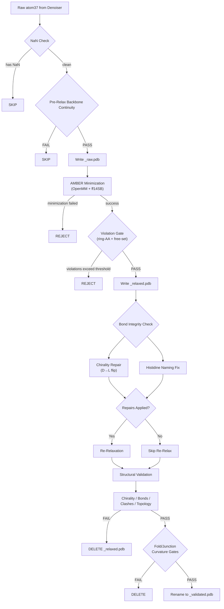

---
slug:15-amber-relaxation-and-repair
blog_type:normal
---


IDPForge 的 AMBER 弛弛与修复流水线通过三阶段协议将原始扩散输出转化为物理上合理的蛋白质构象体：**预弛豫筛选**、**AMBER 能量最小化**以及**结构修复与重新弛豫**。该流水线是去噪器的 atom37 坐标预测与进入下游评分的验证集成成员之间的关键桥梁——每个构象体必须通过一系列级联的几何和立体化学关卡，才能获得 `_validated.pdb` 后缀。

## 流水线架构

完整流水线在 `output_to_pdb` 内部作为一个顺序关卡链执行，每个阶段都可以在下一阶段运行前拒绝某个构象体。通过所有关卡的构象体会从 `_relaxed.pdb` 重命名为 `_validated.pdb`，并标记为干净的 MODEL 块以供下游使用。



来源：[misc.py](/idpforge/misc.py#L119-L470), [relax.py](/idpforge/utils/relax.py#L21-L92)

## 阶段 1：预弛豫筛选

在投入耗时的 AMBER 最小化之前，IDPForge 会应用一个轻量级的**主链连续性过滤器**，尽早捕获几何上不可能的扩散输出。该检查沿主链遍历每一个连续的 CA–CA 对，并验证其距离是否落在以下两种阈值之一内：

| 键类型 | CA–CA 阈值 (Å) | 依据 |
|-----------|---------------------|-----------|
| **主链**（两个残基属于同一结构域） | 9.12 | 对无序主链拉伸的容忍度 |
| **连接区**（残基跨越折叠/IDR 边界） | 6.46 | 在有序-无序界面处更严格的容忍度 |

当 `viol_mask[i] ≠ viol_mask[i+1]` 时，即当两个相邻残基属于不同结构域（折叠区 vs. IDR）时，该键被分类为连接区。未通过任一键检查的构象体将在 PDB 序列化之前被静默丢弃，从而节省大量计算资源。

来源：[pre_relax.py](/idpforge/utils/pre_relax.py#L1-L30), [misc.py](/idpforge/misc.py#L198-L237)

## 阶段 2：AMBER 最小化与违例关卡

### 能量最小化

核心弛豫委托给 OpenFold 的 `AmberRelaxation` 类，该类使用 AMBER ff14SB 力场封装了 OpenMM。最小化器通过采样 YAML 的 `relax` 部分进行配置：

| 参数 | 默认值 | 用途 |
|-----------|---------|---------|
| `max_iterations` | 0 | 内部 L-BFGS 迭代上限（0 = OpenMM 默认值） |
| `tolerance` | 10.0 | 能量收敛容忍度 (kJ/mol) |
| `stiffness` | 10.0 | 折叠残基的位置约束强度 |
| `max_outer_iterations` | 20 | 约束调度的外部迭代限制 |
| `exclude_residues` | `[]` | 排除位置约束的残基索引（在运行时从 `~mask` 填充） |

关键的设计选择是**位置约束不对称性**：折叠域残基通过谐约束（由 `stiffness` 控制）被保持在模板坐标附近，而 IDR 残基（列在 `exclude_residues` 中）在最小化期间可自由移动。这保留了实验确定的折叠结构，同时允许无序区域弛豫至低能构象。

来源：[relax.py](/idpforge/utils/relax.py#L21-L42), [sample.yml](/configs/sample.yml#L51-L57), [sample_ldr.py](/idpforge/../sample_ldr.py#L99-L108)

### 违例关卡

最小化后，`relax_protein` 对**自由残基集**（IDR + 连接区，由 `viol_mask` 定义）应用两个接受关卡：

**环状残基关卡。** 检查芳香族残基（F, Y, W, H, P）的立体违例。如果违例环状残基的比例超过 `viol_threshold`（默认为 2%），则拒绝该构象体。这可以捕获 AMBER 无法解决的环冲突——这常见于折叠/IDR 连接区，该处的主链应变会传播到侧链几何中。

**自由集违例关卡。** 检查所有自由残基中的总违例计数和比例是否符合分数阈值和绝对上限：`viol_cap = max(4, ⌈viol_threshold × n_free⌉)`。如果 `viol_frac > viol_threshold` 或 `viol_total > viol_cap`，则拒绝该构象体。双重标准可防止单个不良残基在长链中漏网。

```python
# 来自 relax.py 的双重拒绝标准
viol_cap = max(4, int(np.ceil(viol_threshold * n_free)))
if viol_frac > viol_threshold or viol_total > viol_cap:
    # REJECT
```

来源：[relax.py](/idpforge/utils/relax.py#L44-L76)

## 阶段 3：结构修复

即使 AMBER 最小化成功，仍可能保留两类系统性伪影：**D-型氨基酸手性翻转**和**组氨酸咪唑环原子重命名**。两者均在 `_relaxed.pdb` 文件上就地修复，任何修复都会触发强制重新弛豫，以确保校正后的几何结构在能量上保持一致。

### 手性修复：D→L 异构体反射

AMBER 的 OpenMM 后端偶尔会产生 D-型氨基酸构型，尤其是靠近高应变连接区的残基。修复算法如下：

1. **检测**使用由 N→CA, C→CA 和 CB→CA 向量计算的标量三重积 `vol = (v_N × v_C) · v_CB`。`vol < 1.0` 的残基被标记为 D-异构体（阈值为 1.0 而非 0.0 为近平面畸变提供了裕量）。这与 `structure_validation.py` 中 `check_chirality` 的检查一致。
2. **修复**将每个**侧链原子**跨 N-CA-C 平面进行反射。主链原子（N, H, CA, HA2, HA3, C, O, OXT）保持不变。位置为 `p` 的侧链原子的反射公式为：`p' = CA + v − 2(v·n̂)n̂`，其中 `v = p − CA`，`n̂` 是 N-CA-C 平面的单位法线。

<CgxTip>手性修复反射的是完整侧链，而不仅仅是 CB。部分反射（仅 CB）会使 CG、CD 等保留 D-构型，导致后续重新弛豫中出现键长伪影。</CgxTip>

来源：[structure_repair.py](/idpforge/utils/structure_repair.py#L35-L153)

### 组氨酸咪唑环命名修复

AMBER 弛豫可能会打乱 HIS 咪唑环内的原子标识（CG, ND1, CE1, NE2, CD2 及其氢原子），尤其是在 HID/HIE/HIP 质子化边界处。该修复纯粹是**几何的**——无需化学推断：

1. **寻找 CG** 作为最接近 CB 的侧链原子（预期约 1.51 Å）。
2. **追踪五元环** 通过键距邻接关系：彼此距离在 1.25–1.45 Å 内的原子形成环边。从 CG 开始的确定性遍历构建环顺序。
3. **确定环方向** 通过计算每个环原子的氢邻居数。氢计数模式唯一标识质子化状态和方向：
   - HID 正向：`[1, 1, 0, 1]`（ND1 质子化）
   - HIE 正向：`[0, 1, 1, 1]`（NE2 质子化）
   - HIP 正向：`[1, 1, 1, 1]`（两者均质子化；CG–ND1 距离约 1.38 Å 与 CG–CD2 约 1.35 Å 打破平局）
4. **重新分配原子名称** 在 PDB 文件中并重写元素列。

来源：[structure_repair.py](/idpforge/utils/structure_repair.py#L156-L358)

## 修复触发的重新弛豫

当 `repair_chirality` 或 `fix_histidine_naming` 进行校正时，`needs_rerelax` 标志被置位，构象体将经历第二次 AMBER 最小化过程。重新弛豫工作流如下：

1. 通过 `from_pdb_string` 重新加载修复后的 PDB。
2. 删除现有的 `_relaxed.pdb`。
3. 使用相同配置（stiffness, exclude_residues, 违例阈值）再次运行 `relax_protein`。
4. 如果重新弛豫失败或违例关卡拒绝，则完全丢弃该构象体。

这种两轮协议（弛豫 → 修复 → 重新弛豫）确保手性翻转和 HIS 重命名不会引入仅在几何校正后才会出现的新立体冲突或键畸变。

来源：[misc.py](/idpforge/misc.py#L308-L357), [relax_raw.py](/relax_raw.py#L127-L166)

## 独立弛豫：`relax_raw.py`

对于现有原始 PDB 文件的事后处理，`relax_raw.py` 脚本在采样循环之外提供了相同的弛豫和可选验证流水线：

```bash
# 仅基本弛豫
python relax_raw.py ./raw_conformers template.npz configs/sample.yml --cuda

# 完整的弛豫 + 修复 + 验证
python relax_raw.py ./raw_conformers template.npz configs/sample.yml \
    --cuda --validate --verbose

# 自定义输出目录
python relax_raw.py ./raw_conformers template.npz configs/sample.yml \
    --cuda --output_dir ./relaxed_conformers
```

该脚本从模板 `.npz` 文件加载折叠掩码（其中 `True` = 折叠，`False` = IDR），从 `~mask` 派生 `exclude_residues`，并按排序的数字顺序处理所有 `*_raw.pdb` 文件。使用 `--validate` 时，它运行完整的修复 + 验证链，并为通过所有关卡的构象体生成 `_validated.pdb` 文件。

来源：[relax_raw.py](/relax_raw.py#L1-L232)

## 文件生命周期摘要

流水线产生一种确定性文件命名约定，跟踪每个构象体通过关卡的进度：

| 阶段 | 文件名模式 | 条件 |
|-------|-----------------|-----------|
| 原始扩散输出 | `{n}_raw.pdb` | 通过预弛豫筛选后写入 |
| AMBER 弛豫后 | `{n}_relaxed.pdb` | 最小化 + 违例关卡通过后写入 |
| 完整验证后 | `{n}_validated.pdb` | 如果所有关卡通过则从 `_relaxed` 重命名 |

在任何关卡失败的构象体其中间文件将被删除。`_validated.pdb` 后缀是下游消费者（[X-EISD 集成评分](17-x-eisd-ensemble-scoring)，AlphaFlex 拼接）依赖的**契约**——它保证构象体已通过完整的几何、立体化学和拓扑验证链。

<CgxTip>在 `sample_ldr.py` 中使用 `--no_relax` 时，搜索模式会从 `*_validated.pdb` 切换为 `*_raw.pdb`。匹配 `*_validated.pdb` 的下游脚本将找不到任何文件——务必将 `--no_relax` 与随后的 `relax_raw.py --validate` 运行配对使用。</CgxTip>

来源：[misc.py](/idpforge/misc.py#L451-L465), [sample_ldr.py](/sample_ldr.py#L100-L108)

## 下一步

此流水线生成的已验证构象体将成为[结构验证流水线](16-structure-validation-pipeline)（提供详细的四轴验证逻辑）的输入，并最终馈入 [X-EISD 集成评分](17-x-eisd-ensemble-scoring)进行实验重新加权。