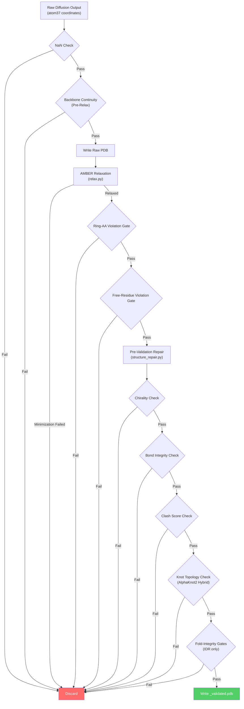
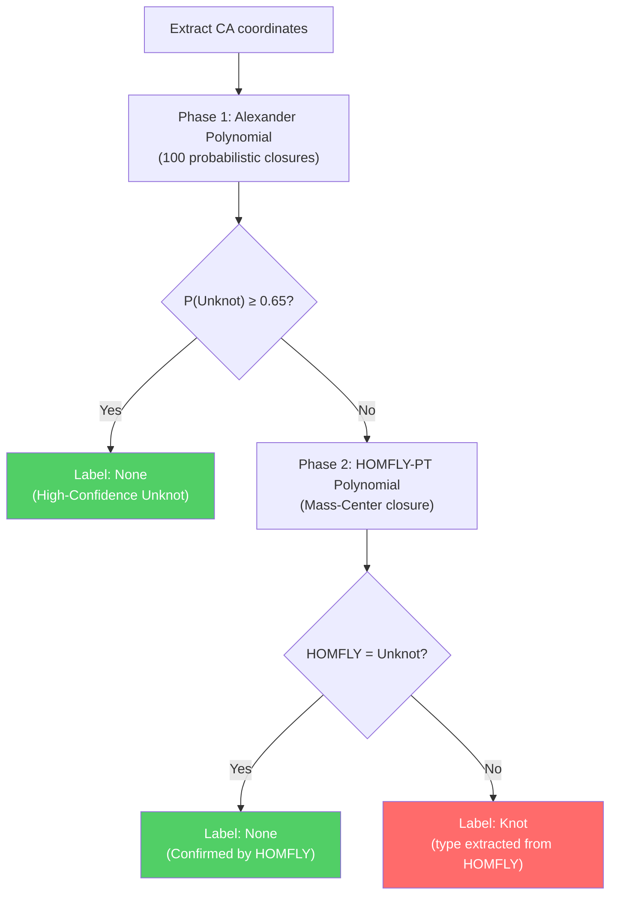

---
slug:16-structure-validation-pipeline
blog_type:normal
---


结构验证流水线是 IDPForge 的多阶段质量门控，它将原始扩散输出转化为具有物理可信度的蛋白质构象体。它作为一个**四阶段过滤器级联**运行——预弛豫筛选、带有违规门控的 AMBER 弛豫、结构验证以及可选的折叠完整性门控——每个阶段逐步消除几何或拓扑上有缺陷的结构。该流水线并非单一函数，而是嵌入到采样循环中的编排工作流；其中，未通过任何门控的构象体将被静默丢弃，并由新的扩散样本替换，直至达到目标系综大小。

来源: [structure_validation.py](idpforge/utils/structure_validation.py#L1-L725), [misc.py](idpforge/misc.py#L119-L200)

## 流水线架构

验证流水线在 `output_to_pdb` 内作为顺序门控链执行，`output_to_pdb` 是被 [IDP 采样（完全无序）](12-idp-sampling-fully-disordered) 和 [带折叠模板的 IDR 采样](13-idr-sampling-with-folded-templates) 共同调用的核心编排器。每个门控可以提前拒绝构象体（快速失败），从而避免在已经无法挽救的结构上浪费计算资源。下图展示了从原始扩散输出到验证后 PDB 的完整流程：



快速失败行为由 `validate_structure_post_relax` 中的 `full_report` 参数控制。当 `full_report=False`（默认值）时，函数在首次失败时立即返回，并生成最简诊断信息。当 `full_report=True` 时，所有检查都会运行完毕，且信息字典中将包含每个门控的结果，而不受中间失败的影响。

来源: [structure_validation.py](idpforge/utils/structure_validation.py#L583-L724), [misc.py](idpforge/misc.py#L119-L200)

## 阶段 1：预弛豫筛选

在任何耗时的 AMBER 最小化之前，轻量级的**主链连续性过滤器**会拒绝具有断裂肽链的构象体。此检查直接针对扩散输出中的 CA-CA 距离进行操作，无需 PDB I/O 或构建 OpenMM 拓扑。

函数 `check_backbone_continuity` 区分了两种距离阈值：

| 片段类型 | 阈值 | 依据 |
|---|---|---|
| **交界处**（IDR↔折叠边界） | 6.46 Å | 较宽松：IDR 到折叠锚点的转换本身就具有柔性 |
| **主链**（同一结构域内） | 9.12 Å | 较严格：连续结构域内相邻的 CA 原子应当距离相近 |

只要相邻残基的违规掩码不同（即一个位于折叠结构域，另一个位于 IDR），即可识别为交界处。非连续的残基索引（`residue_index` 中的间隔）将被跳过。该函数返回一个布尔型的通过/失败结果，以及用于调试的逐键详情。

来源: [pre_relax.py](idpforge/utils/pre_relax.py#L1-L30)

## 阶段 2：AMBER 弛豫与违规门控

通过预弛豫筛选后，原始坐标将被写入 PDB 文件并提交给 OpenMM 的 AMBER 弛豫。弛豫步骤本身记录在 [AMBER 弛豫与修复](15-amber-relaxation-and-repair) 中；这里我们重点讨论弛豫后结构必须满足的**接受门控**。

### 环状氨基酸违规门控

含环残基（F, Y, W, H, P）具有几何约束——AMBER 无法自由旋转它们的平面基团。如果最小化后仍有过多环状残基违规，则拒绝该构象体：

```
ring_violated / n_ring_total > viol_threshold  →  REJECT
```

默认的 `viol_threshold` 为 0.02（2%），这意味着即使只有少数扭曲的环状残基也会触发拒绝。此门控用于捕获扩散输出将侧链放置在弛豫无法解决的立体障碍构型中的情况。

### 自由残基违规门控

“自由”残基集是 IDR 和交界处残基的并集（即弛豫期间未受位置约束的所有残基）。必须同时满足以下两个条件：

| 条件 | 公式 | 目的 |
|---|---|---|
| **比例门控** | `viol_frac ≤ viol_threshold` | 全局质量：仅有少数残基保持扭曲 |
| **数量上限** | `viol_total ≤ max(4, ⌈threshold × n_free⌉)` | 绝对上限，防止大型 IDR 因许多微小违规而通过 |

来源: [relax.py](idpforge/utils/relax.py#L21-L92)

## 阶段 3：弛豫后结构验证

核心验证函数 `validate_structure_post_relax` 对弛豫后的 OpenMM 拓扑和位置运行四项独立检查。每项检查独立计时，结果累积至一个信息字典中。

### 手性检查

手性检查用于检测**D-型氨基酸**——即侧链跨越 N–CA–C 主链平面发生翻转的残基。对于每个非甘氨酸残基，它计算从 CA 到 N、C 和 CB 的向量的**标量三重积**：

$$V = (\vec{v_N} \times \vec{v_C}) \cdot \vec{v_{CB}}$$

| 体积 | 分类 | 操作 |
|---|---|---|
| V ≥ 1.0 | L-型氨基酸（正确） | 通过 |
| 0 < V < 1.0 | 平面/扭曲 | 标记为问题 |
| V < 0 | D-型氨基酸（翻转） | 标记为问题 |

甘氨酸被豁免（无手性）。体积阈值设为 1.0（而非 0.0）提供了一道安全边界，用于防范接近平面的扭曲，此类扭曲虽技术上呈 L-构型，但表明存在严重的几何应力。

来源: [structure_validation.py](idpforge/utils/structure_validation.py#L99-L119)

### 键完整性检查

键完整性检查以两种模式运行——**残基内**和**残基间**——采用与原子名称无关的几何/图混合方法：

**残基内**：对于每个残基，该检查将从 OpenMM 拓扑图获取的*预期*重原子键度序列，与基于距离的近邻计数（以 2.0 Å 共价截断）得出的*观测*度序列进行比较。如果排序后的度序列不一致，且观测图的键更少或存在断开连接的原子，则标记该残基。通过沿拓扑的显式键边测量距离，可识别出具体被拉伸的键。

**残基间**：直接检查跨越残基边界的每个重原子键：如果原子间距离超过 `threshold`（默认 2.2 Å），则报告该键断裂并给出测量距离。

这种双重策略既能捕获*图拓扑变化*（因大位移导致原子断开连接），也能捕获*特定键拉伸*（已知键的长度超出物理极限）。

来源: [structure_validation.py](idpforge/utils/structure_validation.py#L121-L207)

### 碰撞分数检查

碰撞检测使用**cKDTree 加速的主链-主链重叠**计算。仅考虑 N、CA 和 C 原子，并使用随元素变化的范德华半径：

| 元素 | 范德华半径 (Å) |
|---|---|
| C | 1.70 |
| N | 1.55 |
| O | 1.52 |
| S | 1.80 |
| P | 1.80 |
| H | 1.20 |

树查询 4.0 Å 内的所有原子对，并通过依次应用的三条排除规则对其进行过滤：

1. **链/键排除**：排除同一链上的相邻残基（|Δres_id| ≤ 1）——它们的近距离接触是预期的肽主链结构
2. **结构域逻辑**（IDR 模式）：当提供 `idr_start` 和 `idr_end` 时，排除*两个*原子均位于折叠结构域中的对——仅惩罚涉及 IDR 的碰撞，因为折叠结构域内的接触是预期行为
3. **重叠计算**：`overlap = (r_i + r_j) - distance`；当 `overlap ≥ overlap_cutoff`（默认 0.4 Å）时标记为违规

最终碰撞分数按 `(clash_count / n_backbone_atoms) × 1000` 归一化，如果该分数小于或等于 `strict_clash_threshold`（默认 10.0），则构象体通过。

来源: [structure_validation.py](idpforge/utils/structure_validation.py#L209-L269)

### 结拓扑检查（AlphaKnot2 混合）

拓扑检查使用**两阶段 Alexander→HOMFLY 混合**分类器，以平衡速度与严谨性。流水线同时支持**全局**（全链）和**逐域**结分类，具体取决于 `expected_knot_type` 是域规格列表还是单个值。



**阶段 1 — Alexander 多项式**通过 100 次概率闭合（`ALEXANDER_TRIES = 100`）计算得出。如果无结概率超过 `ALPHAKNOT_P_UNKNOT_MAX = 0.65`，则结构被高置信度归类为无结，并完全跳过 HOMFLY，从而节省大量计算。

**阶段 2 — HOMFLY-PT 多项式**仅在 Alexander 结果模棱两可时（即 P(Unknot) < 0.65 的“灰色地带”）调用。HOMFLY-PT 是一种更强大的结不变量，能够区分 Alexander 多项式无法区分的结类型。它使用 `Closure.MASS_CENTER` 进行确定性闭合。

**逐域分类**在 `expected_knot_type` 为域规格列表（从 `knot_screening.json` 加载）时触发。每个域的 CA 坐标被独立提取并分类。只有当每个域检测到的结类型与其预期类型匹配时（其中 `null`/`None` 表示无结），构象体才通过。

来源: [structure_validation.py](idpforge/utils/structure_validation.py#L274-L452), [structure_validation.py](idpforge/utils/structure_validation.py#L636-L707)

### 组合验证结果

主入口点 `validate_structure_post_relax` 编排所有四项检查并产生组合结果：

```python
all_pass, info = validate_structure_post_relax(
    topology, positions, pdb_path="",
    strict_clash_threshold=10.0,
    idr_start=None, idr_end=None,
    expected_knot_type=None,
    full_report=False
)
```

| 返回值 | 类型 | 描述 |
|---|---|---|
| `all_pass` | `bool` | 仅当所有四个门控均通过时为 `True` |
| `info["chirality_pass"]` | `bool` | 未检测到 D-型氨基酸 |
| `info["bonds_pass"]` | `bool` | 无断裂的残基内/残基间键 |
| `info["clash_pass"]` | `bool` | 碰撞分数 ≤ 阈值 |
| `info["knot_pass"]` | `bool` | 拓扑符合预期 |
| `info["reason"]` | `str` | 全部通过时为 `"OK"`；否则为逗号分隔的失败标签 |

每项检查的运行时记录在 `info` 中（例如 `Time_Chirality_s`、`Time_Bonds_s`、`Time_Clashes_s`、`Time_Knots_s`），从而支持对验证流水线进行性能分析。

来源: [structure_validation.py](idpforge/utils/structure_validation.py#L583-L724)

## 阶段 4：折叠完整性门控（仅限 IDR 采样）

对于[带折叠模板的 IDR 采样](13-idr-sampling-with-folded-templates)，两个额外的几何门控用于保护折叠结构域及其与 IDR 交界处的结构完整性。这些门控是**无叠加的**——它们完全基于对刚体运动不变的内在几何量（曲率、距离矩阵）进行操作，从而避免了基于 RMSD 阈值的脆弱性。

### 交界处曲率门控

交界处曲率门控拒绝 IDR 被**拉直**以触及折叠锚点的构象体——这是一种常见的失败模式，即扩散过程将 IDR 拉伸成不自然的直桥。它计算每个残基的离散主链曲率 κ：

$$\kappa_i = \frac{2 \sin(\theta_i / 2)}{|\mathbf{r}_{i+1} - \mathbf{r}_{i-1}|}$$

其中 θ_i 是 CA_i 处入射和出射 CA–CA 向量之间的夹角。超过 4.5 Å 的 CA–CA 距离被视为断链并被排除。该门控检查每个交界处 IDR 侧 20 个残基的窗口，并要求平均曲率满足最小阈值（`junction_kappa`，默认 0.0 = 禁用）。

来源: [structure_validation.py](idpforge/utils/structure_validation.py#L488-L530)

### 折叠曲率门控

折叠曲率门控拒绝交界处相邻的**折叠残基**被拉直的构象体——这表明 IDR 采样扭曲了固定模板。对于每个交界处，它比较模型中一个窗口（默认 15 个残基）的平均曲率与参考模板：

$$\frac{\bar{\kappa}_{\text{model}}}{\bar{\kappa}_{\text{ref}}} \geq \texttt{fold\_curv\_ratio}$$

该门控仅在窗口内的参考曲率超过 `min_ref_kappa`（0.03 Å⁻¹）时应用，从而避免对自然笔直的模板区域进行惩罚。这种基于比率的判据具有刚体运动不变性，可直接测量折叠是否相对于其天然几何形状变平。

来源: [structure_validation.py](idpforge/utils/structure_validation.py#L533-L576)

### 折叠 CA-lDDT 门控

无叠加的 **CA-lDDT 质量门控**评估折叠区域的局部距离精度。对于参考中包含半径（15 Å）内的所有残基对，它计算距离差落在多个阈值（0.5, 1.0, 2.0, 4.0 Å）内的残基对比例。lDDT 分数是这些阈值下的平均值，如果分数满足配置的 `threshold`，则构象体通过。

来源: [structure_validation.py](idpforge/utils/structure_validation.py#L458-L485)

## 验证前结构修复

在运行弛豫后验证检查之前，会应用两项修复操作以修复常见的 AMBER 弛豫伪影：

### 手性修复

当 `check_chirality` 检测到 D-型氨基酸时，`repair_chirality` 会将所有侧链原子沿 **N–CA–C 平面**镜像翻转，以恢复 L-异构体几何形状。翻转计算如下：

$$\mathbf{p}_{\text{new}} = \mathbf{CA} + \vec{v} - 2(\vec{v} \cdot \hat{n})\hat{n}$$

其中 **v** 是从 CA 到侧链原子的向量，**n̂** 是 N–CA–C 平面的单位法向量。主链原子（N, H, CA, HA2, HA3, C, O, OXT）在翻转期间保持固定。该修复通过直接编辑 PDB 行操作，避免了完整的写入-解析循环。

来源: [structure_repair.py](idpforge/utils/structure_repair.py#L35-L153)

### 组氨酸环命名修复

AMBER 弛豫可能会**打乱**组氨酸咪唑环内的原子标识，交换重原子和氢标签（例如 ND1↔CD2）。`fix_histidine_naming` 函数通过五步算法纯粹基于空间几何重新分配原子名称：

1. **寻找 CG**：距离 CB 最近的侧链原子（约 1.51 Å）
2. **通过键距邻接（1.25–1.45 Å 键）追溯五元环**
3. **统计每个环原子的氢近邻数**（N–H 键 ≤ 1.15 Å）
4. **根据氢计数模式确定环方向**（HID: [1,1,0,1], HIE: [0,1,1,1], HIP: [1,1,1,1]）
5. **重写 PDB 原子名称**及所有不匹配的环原子及其氢原子的元素符号

来源: [structure_repair.py](idpforge/utils/structure_repair.py#L156-L358)

## 验证指标

`validation_metrics` 模块提供 [X-EISD 系综评分](17-x-eisd-ensemble-scoring) 流水线使用的系综级质量指标：

| 函数 | 输入 | 输出 | 描述 |
|---|---|---|---|
| `calc_rg_with_mask` | CA 坐标 `[batch, nres, 3]`, 掩码 `[batch, nres]` | Rg `[batch]` | 基于有效（掩码）残基计算的回转半径 |
| `rg_dist_per_group` | 预测坐标, 真实 Rg 值, 序列, 掩码 | 标量 | 按序列同一性分组的平均绝对 Rg 散度 |

这些指标能够将预测的系综属性与实验可观测量进行比较，而无需残基级别的比对。

来源: [validation_metrics.py](idpforge/utils/validation_metrics.py#L1-L54)

## 与采样循环的集成

验证流水线嵌入在 `output_to_pdb` 函数中，该函数是扩散模型输出进入文件系统的唯一出口。两个采样脚本以相同方式调用它：

```python
# 在 sample_idp.py 中 — 完全无序蛋白质
output_to_pdb(outputs, relax=relax_opts,
    save_path=abs_output_dir, counter=start_idx,
    counter_cap=nsample, verbose=verbose)

# 在 sample_ldr.py 中 — 带折叠模板的 IDR
output_to_pdb(outputs, relax=relax_opts,
    save_path=abs_output_dir, counter=start_idx,
    counter_cap=nsample, viol_mask=~fold_data["mask"],
    fold_ref_ca=fold_ref_ca, fold_mask=fold_data["mask"],
    fold_curv_ratio=fold_curv_ratio,
    fold_curv_window=fold_curv_window,
    junction_kappa=junction_kappa,
    expected_knot_type=expected_knot_type)
```

采样循环持续进行，直到 `count_done()`——即磁盘上 `*_validated.pdb` 文件的数量——达到目标 `nsample`。被拒绝的构象体不会被写入，循环会生成新的扩散样本以替换它们。`*_raw.pdb` 文件（在弛豫前写入）会被保留用于调试，而只有 `*_validated.pdb` 文件会计入系综目标。

<CgxTip>验证流水线被设计为**仅拒绝过滤器**——它从不原地修改构象体（验证前的手性和组氨酸修复除外）。这意味着接受率直接控制采样效率：如果拒绝了过多构象体，请增加 `nsample` 或放宽阈值，而不是尝试修补单个结构。</CgxTip>

<CgxTip>当对带有打结折叠结构域的 IDR 进行采样时，务必将 `--expected_knot_type` 作为逐域 JSON 规格提供。否则，旧版的全链无结基线将拒绝任何整条链（包含结）未全局无结的构象体——这将错误地丢弃具有天然结的有效结构。</CgxTip>

来源: [sample_idp.py](sample_idp.py#L158-L160), [sample_ldr.py](sample_ldr.py#L207-L218)

## 门控配置摘要

| 门控 | 参数 | 默认值 | 范围 | 禁用方式 |
|---|---|---|---|---|
| NaN 坐标 | — | 始终开启 | 两者 | 无法禁用 |
| 主链连续性 | — | 始终开启 | 两者 | `--no_relax`（完全跳过） |
| 环状氨基酸违规 | `viol_threshold` | 0.02 | 两者 | 将阈值设为 1.0 |
| 自由残基违规 | `viol_threshold` | 0.02 | 两者 | 将阈值设为 1.0 |
| 手性 | — | 始终开启 | 两者 | 无法禁用 |
| 键完整性 | `threshold` | 2.2 Å | 两者 | 无法禁用 |
| 碰撞分数 | `strict_clash_threshold` | 10.0 | 两者 | 设为 ∞ |
| 结拓扑 | `expected_knot_type` | None（全局无结） | 两者 | 传入 `[]`（空列表） |
| 交界处曲率 | `--junction_kappa` | 0.0（关闭） | 仅 IDR | 保持为 0.0 |
| 折叠曲率 | `--fold_curv_ratio` | 0.0（关闭） | 仅 IDR | 保持为 0.0 |
| 折叠 CA-lDDT | `threshold` | 依配置而定 | 仅 IDR | 设为 0.0 |

来源: [structure_validation.py](idpforge/utils/structure_validation.py#L583-L590), [sample_ldr.py](sample_ldr.py#L248-L261)

## 后续步骤

验证后，接受的构象体将进入系综级质量评估：

- **[X-EISD 系综评分](17-x-eisd-ensemble-scoring)**：使用贝叶斯积分针对实验数据对验证后的系综进行评分和排序
- **[AMBER 弛豫与修复](15-amber-relaxation-and-repair)**：关于验证之前的 AMBER 最小化配置及约束策略的更多详细信息
- **[配置参考](22-configuration-reference)**：所有验证阈值的完整参数规格