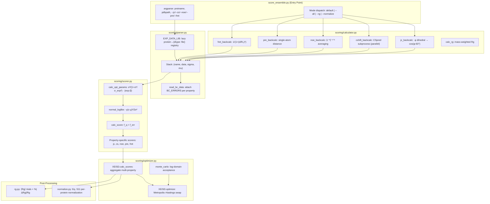
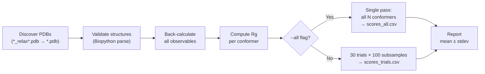

---
slug:17-x-eisd-ensemble-scoring
blog_type:normal
---


**X-EISD**（交叉系综信息分数差，Cross-Ensemble Information Score Difference）是 IDPForge 的最大对数似然框架，用于根据实验可观测值对内在无序蛋白质系综进行评分。它从 PDB 结构反算 NMR 和 FRET 可观测值，解析优化每种属性的误差模型参数，并计算系综级别的对数似然值，从而实现对构象系综严格的跨方法基准测试。该流程支持五种可观测类型——**J-耦合**、**化学位移**、**NOE 距离**、**PRE 距离**和 **FRET 效率**——并提供随机二次采样协议（30 次试验 × 100 个构象体）和确定性单次评分，以及可选的蒙特卡罗系综优化和用于生成可直接用于发表的基准表的 Eq. S11 跨方法归一化。

来源: [score_ensemble.py](/score_ensemble.py#L1-L171), [scoring/scorer.py](/scoring/scorer.py#L1-L136)

## 架构概述

评分系统在 `scoring/` 包内被组织为分层管道，以 [score_ensemble.py](/score_ensemble.py) 作为 CLI 入口点。每个模块承担独立的计算职责：**parser** 解析实验数据和反算不确定度，**calculator** 从 3D 结构正向建模可观测值，**scorer** 使用解析最优的误差参数计算每种属性的对数似然值，**optimizer** 协调多属性评分和可选的 Metropolis–Hastings 系综选择，**normalize**/**rg** 生成跨方法基准表和回转半径统计信息。



来源: [score_ensemble.py](/score_ensemble.py#L1-L171), [scoring/parser.py](/scoring/parser.py#L1-L81), [scoring/calculator.py](/scoring/calculator.py#L1-L250), [scoring/scorer.py](/scoring/scorer.py#L1-L136), [scoring/optimizer.py](/scoring/optimizer.py#L1-L108)

## X-EISD 评分模型

X-EISD 背后的核心洞察在于，**从系综反算的可观测值带有两个独立的来源的不确定度**：正向模型固有的反算误差 (σ_bc)，以及实验测量误差 (σ_exp)。X-EISD 并未将这些视为固定权重，而是解析推导出**最优潜校正参数**，以同时最大化两种误差模型的联合对数似然。对于具有系综平均反算值 β、实验值 μ_exp 和校正参数 θ 的通用可观测值，其分数分解为：

**log P = log N(θ; 0, σ_bc) + log N(μ_exp − θ − β; 0, σ_exp)**

最优 θ* 的闭式解为 `θ* = (σ²_bc / σ²_exp) · (μ_exp − β) / (1 + σ²_bc/σ²_exp)`，当反算远比实验精确时 (σ_bc ≪ σ_exp)，该式简化为实验残差；当情况相反时，该式简化为零。这种贝叶斯处理避免了数据来源之间的任意加权，并在所有可观测值上产生具有原则性的可加对数似然。

来源: [scoring/scorer.py](/scoring/scorer.py#L6-L46)

### 属性特定的评分函数

由于系综平均的执行方式和误差模型的参数化方式不同，每种实验可观测值类型都需要量身定制的评分函数：

| 可观测值 | 系综平均 | 误差参数 | 评分函数 |
|---|---|---|---|
| **J-耦合 (JC)** | ⟨cos(φ−60°)⟩, ⟨cos²(φ−60°)⟩ | A, B, C，具有来自 Karplus 校准的固定 μ, σ | `jc_score_ensemble` — 求解 (A\*, B\*, C\*) 的 3D 二次方程 |
| **化学位移 (CS)** | 每个原子类型的 ⟨δ_atom⟩ | 逐原子 σ_bc (C: 1.31, CA: 0.97, N: 2.16, …) | `cs_score_ensemble` — 逐位移 θ\*，带有 χ² 诊断 |
| **NOE 距离** | ⟨r⁻⁶⟩⁻¹ᐟ⁶ (r⁻⁶-加权) | σ_bc = 0.01 Å | `dist_score_ensemble` — 非对称边界 (上限/下限) |
| **PRE 距离** | 单原子距离 | σ_bc = 0.001 Å | `dist_score_ensemble` — 与 NOE 共享 |
| **FRET 效率** | ⟨1/(1+(d/R₀)⁶)⟩ | σ_bc = 0.0074 | `generic_score_ensemble` — 标准高斯 |

对于 **J-耦合**，Karplus 关系式 J = A·cos²(φ−60°) + B·cos(φ−60°) + C 使得对数似然成为三个 Karplus 参数 (A, B, C) 的函数，而非单个校正参数。优化器为每个耦合求解一个 3×3 线性方程组，以找到联合最优的 (A\*, B\*, C\*)，然后计算四个高斯对数似然之和：每个 Karplus 参数偏离其校准均值的似然各一个，加上实验残差似然。对于 **NOE/PRE 距离**，评分通过计算三次试验偏差（中心、上限、下限）中的最小绝对误差来考虑非对称实验边界。

来源: [scoring/scorer.py](/scoring/scorer.py#L48-L136), [scoring/parser.py](/scoring/parser.py#L15-L22)

## 反算引擎

反算层将 PDB 坐标转换为预测的实验可观测值。每个函数在整个构象体系上操作，并返回形状为 `(n_conformers, n_observations)` 的矩阵，该矩阵将输入到评分器中。

**J-耦合反算**提取实验数据文件中指定的每个残基处的骨架 φ 二面角，然后计算 cos(φ − 60°) 作为 Karplus 相关量。此步骤在 C(i−1)–N(i)–CA(i)–C(i) 原子上使用 Biopython 的 `calc_dihedral`。**NOE 距离反算**为每个 NOE 计算所有原子对分配的 r⁻⁶ 加权系综平均 ⟨r⁻⁶⟩⁻¹ᐟ⁶，通过 `hydrogen_abbrev` 和 `heavy_atom_hydrogen` 查找表处理模糊分配（例如，HB2/HB3 → CB）。**PRE 反算**使用相同的 `_dist_backcalc` 基础设施，但仅取第一个原子对距离（无 r⁻⁶ 平均）。**FRET 反算**使用来自实验数据的每对缩放因子 R₀ 计算每个标记残基对的 Förster 效率 1/(1+(d/R₀)⁶)。

**化学位移反算**是计算成本最高的步骤，其作为**外部子进程运行 CSpred (UCBShift)**，通过 `ProcessPoolExecutor` 最多支持 8 个并行工作器。子进程隔离（可通过 `CSPRED_PYTHON` 和 `CSPRED_PATH` 环境变量配置）适应了 CSpred 独立的 Python 环境。结果被缓存到 `{property}_cache.csv`，以避免在后续运行中重复计算。

来源: [scoring/calculator.py](/scoring/calculator.py#L1-L250)

### 氢原子映射

当实验数据引用了弛豫后 PDB 结构中不存在的氢原子时，计算器将通过两个映射字典回退到重原子代理。`hydrogen_abbrev` 字典在所有 20 种氨基酸中展开分组的氢名称（例如，ALA 的 `HB → [HB2, HB3]`，LEU 的 `HD → [HD11, HD12, HD13, HD21, HD22, HD23]`）。`heavy_atom_hydrogen` 字典将氢组映射到其父重原子（例如，PHE 的 `HB → [CB]`，`HD → [CD1, CD2]`），用于 `--heavy-atom-substitute` 模式。对于可能剥离了显式氢的 AMBER 弛豫结构，这两个字典对于准确的 NOE/PRE 反算都是必不可少的。

来源: [scoring/calculator.py](/scoring/calculator.py#L58-L117)

## 实验数据注册表

`parser` 模块管理原始实验数据文件与评分管道之间的接口。**`EXP_DATA_LIB`** 单例是一个延迟初始化的字典，将蛋白质名称映射到 `{data_type: file_path}`。它在 `$IDPFORGE_EXP_DATA` 目录（默认为 `Data/exp/`）下发现实验文件，遵循命名约定 `{protein}_{type}_exp.txt`。每个文件都是一个 CSV，其列特定于其可观测类型（例如，JC 的 `resnum, value, error`；PRE/NOE 的 `res1, atom1, res2, atom2, dist_value, lower, upper`；CS 的 `resnum, atomname, value, error`；FRET 的 `res1, res2, scale`）。

**`read_bc_data`** 函数将原始反算输出封装到 `Stack` 对象中，该对象携带计算出的数据矩阵以及来自 `BC_ERRORS` 字典的属性特定的反算不确定度。对于 J-耦合，这包括 σ 值（Karplus A, B, C 的 √0.14, √0.03, √0.08）和 μ 值（6.51, −1.76, 1.6）。对于化学位移，不确定度是一个逐原子类型的字典（C: 1.31, CA: 0.97, H: 0.38, N: 2.16 等），源自 UCBShift 验证统计数据。

来源: [scoring/parser.py](/scoring/parser.py#L1-L81)

## XEISD 优化器类

[optimizer.py](/scoring/optimizer.py) 中的 `XEISD` 类是核心协调器，它聚合每种属性的分数，并可选地执行 **Metropolis–Hastings 系综优化**。它使用完整的实验数据字典和预计算的反算 `Stack` 对象进行初始化，然后暴露两个主要方法：

**`calc_scores(dtypes, indices)`** 评估由 `indices` 定义的特定系综子集的对数似然。对于每个请求的数据类型，它分派到 `ENSEMBLE_Scorers` 中的相应函数，同时收集 MAE（平均绝对误差）和总对数似然分数。特别是对于化学位移，它还计算逐原子类型的 MAE、逐原子类型的 χ²，以及整体的 χ²_CS 诊断（补充信息中的公式 12）：`χ² = (1/N) Σ (δ_exp − δ_bc)² / σ²_bc,atom`。

**`optimize(opt_props, ens_size, beta, ...)`** 通过单结构交换与 Metropolis 接受准则执行随机系综选择。从由 `ens_size` 个构象体组成的随机初始系综开始，每次迭代（默认：5 × pool_size）从完整池中随机替换一个构象体，如果总对数似然提高（贪心模式，`opt_type='max'`）则以 Metropolis 概率 `min(1, exp(β · Δ_score))`（蒙特卡罗模式，`opt_type='mc'`）接受交换。`monte_carlo` 辅助函数实现了**对数域接受**，以避免当概率超出浮点数范围时发生溢出，当新旧概率均为有限值时，则回退到 `exp(β · Δ_score)` 比较。优化器在 `self.visited` 中跟踪已访问的构型，以避免冗余的重复计算，并返回最佳评分的系综索引、其每种属性的分数以及逐构象体统计信息（所有访问中总分数的均值和标准差）。

来源: [scoring/optimizer.py](/scoring/optimizer.py#L1-L108)

## 系综评分协议

`main()` 中的默认评分协议实现了基准标准流程：**30 次独立的 100 构象体随机二次采样试验**，从弛豫 PDB 结构的完整池中有放回地抽取。这种随机评估考虑了系综平均可观测值对特定构象体选择的依赖性，产生量化系综可重现性的均值和标准差统计量。



管道通过首先搜索 `*_relax*.pdb`（[AMBER 弛豫和修复](15-amber-relaxation-and-repair)后的结构），然后回退到 `traj_pdbs/*_relax*.pdb`，再回退到 `*.pdb` 来发现 PDB 文件。无效结构（未能通过 Biopython 解析或链 A 为空的结构）将被过滤掉并发出警告。化学位移反算被缓存到 `cs_cache.csv` 并在后续运行中恢复，以避免昂贵的 CSpred 子进程调用。每次试验在输出 CSV 中生成一行，包含每种可观测类型的列 `{prop}_mae`, `{prop}_score`，加上 `rg`（系综平均 Rg）和详细的 CS 诊断（`cs_{atom}_mae`, `cs_{atom}_chi2`, `cs_chi2`）。

来源: [score_ensemble.py](/score_ensemble.py#L44-L121)

### CLI 参考

| 标志 | 描述 |
|---|---|
| `protname pdbpath` | 蛋白质名称（必须匹配 `EXP_DATA_LIB` 键）和 PDB 目录路径 |
| `--jc / --cs / --noe / --pre / --fret` | 选择要评分的可观测类型（任意组合） |
| `--all` | 在单次遍历中评分每个构象体 → `scores_all.csv` |
| `--ens-size N` | 每次试验的二次采样大小（默认：100） |
| `--trials N` | 随机二次采样次数（默认：30） |
| `--force` | 即使输出 CSV 存在也重新评分 |
| `--normalize` | 从现有分数构建 Eq. S11 跨方法基准表 |
| `--rg` | 计算每个系综的 Rg → `rg_trials.csv` |
| `--ens-base DIR` | 具有 `{method}/{protein}/` 层级结构的基础目录（用于 `--normalize`/`--rg`） |
| `--score-file FILE` | 要聚合的逐蛋白质分数 CSV（默认：`scores_trials.csv`） |
| `--exclude-methods M1,M2` | 从基准中丢弃特定的方法目录 |
| `--proteins P1,P2` | 限制为蛋白质子集 |
| `--rg-json FILE` | 用于 `%|ΔRg|/Rg` 列的实验 Rg JSON |
| `--exp-dir DIR` | 覆盖实验数据目录 |

来源: [score_ensemble.py](/score_ensemble.py#L124-L171)

## 跨方法基准归一化

`--normalize` 模式生成论文风格的基准表 (Eq. S11)，支持跨系综生成方法的公平比较。它在目录层级 `{ens_base}/{method}/{protein}/{score_file}` 上操作，其中每个方法目录（例如，`idpforge`, `flexserv`, `md`）包含带有预计算 `scores_trials.csv` 文件的逐蛋白质子目录。

归一化分三个阶段进行。首先，通过扫描实验数据目录，为每个可观测类别导出**规范蛋白质集**：CS, JC, NOE, PRE, FRET，以及合并的 NOE/PRE 联合集。其次，通过从每种方法的分数 CSV 中提取每个类别的平均对数似然，构建**原始分数表**（方法 × 蛋白质）。NOE 和 PRE 分数被求和为单个 NOE/PRE 列。第三，应用**逐蛋白质的最小-最大归一化**：`X_norm = (X − X_min) / (X_max − X_min)`，其中 X_min 和 X_max 在每种蛋白质的方法间独立计算，确保蛋白质间分数范围的差异不会主导聚合排名。

输出基准表包含七列：**Total**（每种蛋白质的 CS + JC + NOE/PRE 归一化聚合，然后取平均），**CS**, **JC**, **NOE/PRE**（单个类别均值），**FRET**（因很少有蛋白质具有 FRET 数据而单独显示），**χ²_CS**（每种方法的平均化学位移 χ²，越低越好），以及 **%|ΔRg|/Rg**（具有容差 σ_rg 的平底 Rg 偏差：`max(|Rg − Rg_exp| − σ_rg, 0) / Rg_exp × 100`）。所有中间表（原始、归一化、逐类别）均保存为 CSV 以供下游分析。

来源: [scoring/normalize.py](/scoring/normalize.py#L1-L208)

## 回转半径管道

`--rg` 模式计算跨方法/蛋白质系综层级的链 A 所有原子（包括氢）的质量加权 Rg。它支持基于试验的协议（30 次试验 × 100 次二次采样 → `rg_trials.csv`）和逐帧计算（`--all` → `rg.csv`）。该实现使用纯 Python 的 PDB 解析器（无 Biopython 依赖）以提高速度，直接从 ATOM/HETATM 记录中提取坐标，元素识别来自 PDB 元素列（位置 77–78）或原子名称中的第一个字母字符。

一个关键的设计选择是**每个 (方法, 蛋白质) 对的确定性种子**，计算为被解释为十六进制整数的 `SHA1("{method}/{protein}")[:8]`。这确保了重复运行对同一系综产生相同的 Rg 试验统计信息，从而无需存储随机索引即可实现可重现的基准表。帧发现逻辑按优先级顺序搜索子目录（`_relaxed`, `traj_pdbs`, `trajs`）及文件名模式（`frame_*.pdb`, `*_validated.pdb`, `*_relaxed.pdb`, `*_relax.pdb`, `*_raw.pdb`, `conformer_*.pdb`），以匹配不同系综生成器的多样化输出约定。

来源: [scoring/rg.py](/scoring/rg.py#L1-L135)

<CgxTip>在对大型系综评分时，化学位移反算主导运行时间。确保正确设置 `CSPRED_PYTHON` 和 `CSPRED_PATH`，并依赖 `cs_cache.csv` 机制——一旦计算完成，后续运行的位移将从缓存中恢复，而无需调用 CSpred。</CgxTip>

<CgxTip>`--normalize` 标志不会重新对系综评分；它仅聚合现有的 `scores_trials.csv` 文件。请首先针对每种方法/蛋白质组合运行默认评分模式，然后使用指向多方法目录层级根目录的 `--ens-base` 调用一次 `--normalize`。</CgxTip>

## 模块交互图

```mermaid
classDiagram
    class Stack {
        +name: str
        +data: ndarray
        +sigma: dict|float
        +mu: dict|None
        +add(new_stack)
    }

    class XEISD {
        +exp_data: dict
        +bc_data: dict
        +pool_size: int
        +visited: dict
        +calc_scores(dtypes, indices) dict
        +optimize(opt_props, ens_size, beta) tuple
    }

    class BACK_Calculators {
        <<registry>>
        jc: jc_backcalc
        cs: cshift_backcalc
        noe: noe_backcalc
        pre: pre_backcalc
        fret: fret_backcalc
    }

    class ENSEMBLE_Scorers {
        <<registry>>
        jc: jc_score_ensemble
        cs: cs_score_ensemble
        noe: dist_score_ensemble
        pre: dist_score_ensemble
        fret: generic_score_ensemble
    }

    class EXP_DATA_LIB {
        <<lazy singleton>>
        protein → {dtype: filepath}
    }

    BACK_Calculators --> Stack : produces
    EXP_DATA_LIB --> XEISD : feeds
    Stack --> XEISD : initialized with
    ENSEMBLE_Scorers --> XEISD : dispatched by
    XEISD ..> Stack : reads bc_data
```

来源: [scoring/parser.py](/scoring/parser.py#L24-L81), [scoring/calculator.py](/scoring/calculator.py#L243-L250), [scoring/scorer.py](/scoring/scorer.py#L127-L136), [scoring/optimizer.py](/scoring/optimizer.py#L21-L108)

## 数据流：端到端示例

考虑使用 PRE 数据对 α-突触核蛋白 (asyn) 系综进行评分。CLI 调用 `python score_ensemble.py asyn ./output/asyn --pre` 触发以下流程：

1. **数据解析**：`EXP_DATA_LIB["asyn"]` 延迟扫描 `Data/exp/asyn/` 并发现 `asyn_pre_exp.txt`，其中包含自旋标记距离测量值，列名为 `index, res1, atom1, res2, atom2, dist_value, lower, upper`。
2. **结构发现**：通过 `glob("./output/asyn/*_relax*.pdb")` 找到 PDB，无效结构被剪除。
3. **反算**：`pre_backcalc` 计算所有构象体中每个 (res1, atom1)–(res2, atom2) 对的单原子距离，在需要时用重原子替代氢（例如，骨架酰胺的 H → N）。
4. **栈构造**：`read_bc_data` 将距离矩阵与 σ_bc = 0.001 Å 封装到 `Stack("pre", data, sigma=0.001)` 中。
5. **试验评分**：对于 30 次试验中的每一次，采样 100 个构象体索引；`dist_score_ensemble` 计算最优校正参数，评估对数似然，并计算具有非对称边界的 MAE。
6. **输出**：`scores_trials.csv`，包含列 `pre_mae, pre_score, rg`，加上均值 ± 标准差的控制台摘要。

来源: [score_ensemble.py](/score_ensemble.py#L44-L121), [scoring/calculator.py](/scoring/calculator.py#L155-L198), [data/asyn_pre_exp.txt](/data/asyn_pre_exp.txt#L1-L10)

## 与下游管道的集成

X-EISD 评分模块自然地与 IDPForge 的其他后处理阶段连接。由 [IDP 采样](12-idp-sampling-fully-disordered) 或 [IDR 采样](13-idr-sampling-with-folded-templates) 生成的系综应首先经过 [AMBER 弛豫和修复](15-amber-relaxation-and-repair)（生成 `*_relax*.pdb` 文件），并可选地经过 [结构验证](16-structure-validation-pipeline)（生成 `*_validated.pdb` 文件）再进行评分——反算精度依赖于物理上真实的几何结构。`--normalize` 工作流假定目录结构按生成方法组织，从而能够在同一基准框架内直接将 IDPForge 系综与 MD 轨迹、FlexServ 输出或其他生成器进行比较。