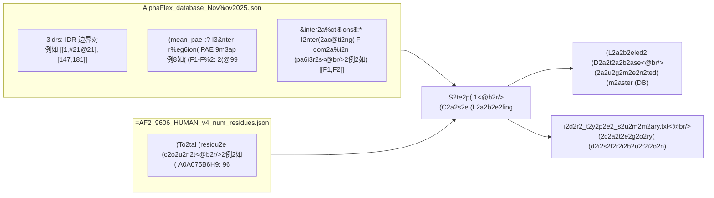
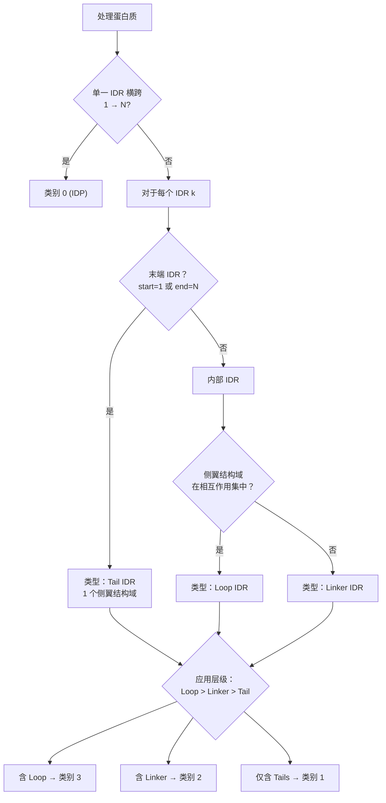

---
slug:19-case-labeling-and-idr-classification
blog_type:normal
---


AlphaFlex 流水线的入口点是一个**拓扑分类系统**，该系统根据每个蛋白质内在无序区域（IDR）的空间排布与相互作用环境，将其归入四个层级类别之一。此分类在 `Step_1_case_label.py` 中实现，将原始 AlphaFold2 衍生的注释数据转换为标签数据库，以此驱动所有下游的模板生成、构象采样与拼接决策。随后的 `Step_1B_subset_label.py` 则提供强大的过滤功能，用于筛选出特定的蛋白质子集进行批处理。这两个脚本共同构成了整个 AFX-IDPForge 流水线的分类与筛选网关。

来源：[Step_1_case_label.py](/AlphaFlex/Step_1_case_label.py#L1-L10), [Step_1B_subset_label.py](/AlphaFlex/Step_1B_subset_label.py#L1-L7)

## 四类别分类法

分类系统基于反映结构复杂性递增的**优先级层级**，将每个蛋白质精确分配至一个类别。包含任何 Loop IDR 的蛋白质会自动归为类别 3，即使它同时包含 Tails 或 Linkers——这是有意为之的设计，因为相互作用结构域之间的 Loop IDR 在构象组装时施加最严苛的几何约束，并需要最复杂的拼接策略。

| 类别 | 名称 | 定义 | IDR 拓扑 | 下游模板策略 |
|----------|------|------------|--------------|------------------------------|
| **0** | **IDP** | 完全无序——不存在折叠结构域 | 横跨残基 1 → N 的单一 IDR | 通过 `sample_idp.py` 进行全扩散（无折叠骨架） |
| **1** | **Tails** | 仅带有末端 IDR 的折叠结构域 | 一端或两端无序；无内部 IDR | 通过 `mk_ldr_template.py` 生成静态模板（冻结的折叠核心） |
| **2** | **Linkers** | 非相互作用折叠结构域之间的内部 IDR | 至少有一个内部 IDR，且其两侧的 F-结构域非相互作用（PAE ≥ 15Å） | 通过 `mk_flex_template.py` 生成柔性模板（可移动的结构域对象） |
| **3** | **Loops** | 相互作用折叠结构域之间的内部 IDR | 至少有一个内部 IDR，且其两侧的 F-结构域相互作用（PAE < 15Å） | 通过 `mk_ldr_template.py` 生成静态模板（相互作用结构域保持刚性） |

类别 2（Linkers）与类别 3（Loops）之间的关键区别在于，内部 IDR 两侧的折叠结构域是否**相互作用**。这由主数据库中的 `interactions` 字段决定，该字段记录了平均预测对齐误差（PAE）低于 15 埃的折叠结构域对——表明它们形成稳定的结构单元。当两侧结构域相互作用时，IDR 形成一个**环（Loop）**，桥接一个紧凑的结构单元，且在建模时必须保持两个结构域刚性。当它们不相互作用时，IDR 形成一个**链接子（Linker）**，连接可独立移动的结构域，这些结构域可在模板生成期间重新定位。

来源：[Step_1_case_label.py](/AlphaGym<del"5/Step_1_case_label.py#L4-L9), [AlphaFlex/=README.md](/AlphaFlex/README.md#L49-L62)

## 输入数据架构

分类引擎消费两个源自 AlphaFold2 960+6 Human v4 预测的预构建 JSON 数据库：



**主数据库**（`AlphaFlex_database_Nov2025.json`）以 UniProt 入藏号为键，每个蛋白质包含三个字段：`idrs`（定义每个无序片段的 `[start, end]` 残基对的有序列表）、`mean_pae`（所有区域对之间——包括折叠和无序——的平均 PAE 值字典），以及 `interactions`（结构域间 PAE 低于 15 Å 的折叠结构域对列表，标志着结构相互作用）。**长度参考**（`AF2_9606_HUMAN_v4_num_residues.json`）将每个 UniProt ID 映射至其总残基数，这对于检测 N/C 末端 IDR 和全 IDP 情况至关重要。

<CgxTip>`interactions` 字段是区分 Linker 与 Loop 的唯一决定因素。若 `interactions` 为空或不包含给定的 F-结构域对，则它们之间的 IDR 被分类为 Linker。这一二元决策对下游影响重大：Linker 会生成具有随机重定位折叠结构域的柔性模板，而 Loop 则被约束在静态骨架上。</CgxTip>

来源：[AlphaFlex_database_Nov2025.json](/AlphaFlex/Data_Inputs/AlphaFlex_database_Nov2025.json#L1-L55), [AF2_9606_HUMAN_v4_num_residues.json](/AlphaFlex/Data_Inputs/AF2_9606_HUMAN_v4_num_residues.json#L1-L12)

## 分类算法详解

分类过程对主数据库中的所有蛋白质进行单次遍历。对于每个蛋白质，算法遵循三阶段决策过程：

**阶段 1 — 全 IDP 检测（类别 0）：** 若蛋白质恰好包含一个 IDR，且该 IDR 横跨从残基 1 至蛋白质总长度，则整条链均为无序。此为最简情况：IDR 被标记为类型 `"IDP"`，标签为 `"D1"`，且无侧翼结构域。

**阶段 2 — 逐 IDR 类型分配（杂合蛋白质）：** 对于同时包含折叠与无序区域的蛋白质，每个 IDR 根据其位置与侧翼结构域环境独立分类：

- **Tail IDR**：IDR 起始于残基 1（N 末端）或终止于最后残基（C 末端）。其恰好有一个侧翼折叠结构域。
- **Linker IDR**：IDR 为内部（非末端）且其两个侧翼折叠结构域**不**在相互作用集中。这些结构域可独立移动。
- **Loop IDR**：IDR 为内部且其两个侧翼折叠结构域**在**相互作用集中（PAE < 15 Å）。这些结构域形成刚性结构对。

每个 IDR 接收一个序数标签（`D1`、`D2`、...）及其侧翼折叠结构域列表（`F1`、`F2`、...），其中 F-结构域编号在遍历 IDR 时沿序列递增。

**阶段 3 — 层级类别分配：** 蛋白质的最终类别由存在的**最复杂** IDR 类型决定，遵循优先级顺序：Loop (3) > Linker (2) > Tail (1) > IDP (0)。此层级确保需要最复杂组装策略的蛋白质能被正确标记，无论其同时包含多少更简单的 IDR 类型。



<CgxTip>折叠结构域计数器（`f_domain_counter`）基于连续 IDR 之间的间隔递增。若首个残基为折叠态（即首个 IDR 不起始于位置 1），则计数器始于 1 而非 0。这确保了即使对于 N 末端以折叠结构域开头的蛋白质，侧翼结构域标签也能被正确分配。</CgxTip>

来源：[Step_1_case_label.py](/AlphaFlex/Step_1_case_label.py#L83-L199)

## 标签输出模式

分类后，主数据库中的每个蛋白质条目会扩展两个新字段。`labeled_idrs` 列表用详尽注释的对象取代原始 `idrs` 边界，`category` 存储整数类别分配。一个包含两个 IDR 的蛋白质——例如一个 N 末端 tail 和一个内部 loop——会产生如下输出：

```json
{
  "idrs": [[1, 21], [73, 87]],
  "mean_pae": { "D1-D2": 18.28, "D1-F1": 16.56, "F1-F2": 2.99 },
  "interactions": [["F1", "F2"]],
  "labeled_idrs": [
    {
      "range": [1, 21],
      "type": "Tail IDR",
      "label": "D1",
      "flanking_domains": ["F1"]
    },
    {
      "range": [73, 87],
      "type": "Loop IDR",
      "label": "D2",
      "flanking_domains": ["F1", "F2"]
    }
  ],
  "category": 3
}
```

`category` 为 3，因为 Loop IDR（位于相互作用的 F1 和 F2 之间）在层级中优先于 Tail IDR。摘要文件（`idr_type_summary.txt`）报告所有四个类别的全局分布及各类型 IDR 计数，提供无序蛋白质组的普查数据。

来源：[Step_1_case_label.py](/AlphaFlex/Step_1_case_label.py#L105-L199), [Step_1_case_label.py](/AlphaFlex/Step_1_case_label.py#L214-L244)

## 子集过滤（Step 1B）

标签数据库通常包含数以万计的蛋白质——远超单次批处理能力。`Step_1B_subset_label.py` 提供双层过滤系统，用于提取目标子集以执行流水线：

### 基础模式（仅限长度）

当未指定高级过滤器时，唯一的约束是总蛋白质长度范围（`--min_len` 至 `--max_len`）。残基数落入该范围的每个蛋白质均被包含，无视其 IDR 组成或类别。此为最快路径，适用于广泛普查。

### 高级模式（IDR 感知）

激活五个高级过滤标志（`--tail_count`、`--linker_count`、`--loop_count`、`--idr_min_len`、`--idr_max_len`）中的任何一个，即可启用高级过滤流水线，该流水线应用三项顺序检查：

| 过滤器 | 参数 | 逻辑 |
|--------|-------------|-------|
| **蛋白质长度** | `--min_len`、`--max_len` | 始终激活；总残基数的包含边界 |
| **逐类型 IDR 计数** | `--tail_count`、`--linker_count`、`--loop_count` | 每类 IDR 计数必须匹配（精确模式）或超过（最小模式）指定值；`None` = 无约束 |
| **IDR 长度范围** | `--idr_min_len`、`--idr_max_len` | 蛋白质中的**每个** IDR 均须落入范围；单个越界 IDR 即淘汰整个蛋白质 |

计数匹配模式由 `--exact`（默认：`True`）或 `--min_mode` 控制。在精确模式下，具有 3 个 Tail IDR 的蛋白质在指定 `--tail_count 2` 时会被拒绝。在最小模式下，任何具有 ≥2 个 Tail IDR 的蛋白质均会通过。若同时传入，`--min_mode` 标志始终覆盖 `--exact`。

### 输出产物

Step 1B 在 `custom_subsets/` 和 `advanced_info/` 目录下最多生成四个输出文件，使用来自 `--output_name` 的基本名称：

| 文件 | 生成条件 | 内容 |
|------|-----------|---------|
| `{name}.txt` | 始终 | 换行分隔的 UniProt ID 列表（步骤 2–4 的直接输入） |
| `{name}_report.txt` | 始终 | 格式化表格，包含蛋白质 ID、长度、类别、类型计数及逐 IDR 详情 |
| `{name}_histogram.png` | 仅高级模式 | IDR 长度分布直方图 |
| `{name}_histogram_table.txt` | 仅高级模式 | 分箱直方图数据（50 残基箱） |

当设置了 `--max_samples` 且过滤集超出此上限时，蛋白质将被随机抽样降至指定计数。最终列表按 UniProt ID 字母顺序排序，以确保顺序确定性。

来源：[Step_1B_subset_label.py](/AlphaFlex/Step_1B_subset_label.py#L22-L48), [Step_1B_subset_label.py](/AlphaFlex/Step_1B_subset_label.py#L66-L260), [config.py](/AlphaFlex/config.py#L34-L51)

## 配置参考

所有分类与过滤参数均集中于 `config.py`，CLI 参数作为覆盖项。与步骤 1/1B 相关的参数为：

| 参数 | 默认值 | 描述 |
|-----------|---------|-------------|
| `VERBOSE` | `True` | 步骤 1 中的逐蛋白质日志记录 |
| `MASTER_DB_PATH` | `Data_Inputs/AlphaFlex_database_Nov2025.json` | 分类源数据库 |
| `LENGTH_REF_PATH` | `Data_Inputs/AF2_9606_HUMAN_v4_num_residues.json` | 残基计数参考 |
| `SUBSET_MIN_LENGTH` | `0` | 步骤 1B 的最小蛋白质长度 |
| `SUBSET_MAX_LENGTH` | `250` | 步骤 1B 的最大蛋白质长度 |
| `SUBSET_TAIL_COUNT` | `2` | 所需 Tail IDR 计数（高级过滤） |
| `SUBSET_LINKER_COUNT` | `1` | 所需 Linker IDR 计数（高级过滤） |
| `SUBSET_LOOP_COUNT` | `1` | 所需 Loop IDR 计数（高级过滤） |
| `SUBSET_EXACT_COUNT` | `True` | 精确与最小计数匹配 |
| `SUBSET_IDR_MIN_LENGTH` | `None` | 最小 IDR 长度（应用于所有 IDR） |
| `SUBSET_IDR_MAX_LENGTH` | `None` | 最大 IDR 长度（应用于所有 IDR） |
| `SUBSET_MAX_SAMPLES` | `None` | 输出蛋白质计数上限 |
| `SUBSET_OUTPUT_NAME` | `"test_subset"` | 步骤 1B 输出的基础文件名 |

来源：[config.py](/AlphaFlex/config.py#L1-L51), [Step_1_case_label.py](/AlphaFlex/Step_1_case_label.py#L246-L257), [Step_1B_subset_label.py](/AlphaFlex/Step_1B_subset_label.py#L262-L315)

## 运行分类

**步骤 1 — 全数据库分类：**

```bash
python Step_1_case_label.py
# 带覆盖项：
python Step_1_case_label.py --input_db path/to/db.json --length_ref path/to/lengths.json --output_dir path/to/output --verbose
```

**步骤 1B — 子集生成（基础模式）：**

```bash
python Step_1B_subset_label.py --min_len 50 --max_len 300
```

**步骤 1B — 子集生成（高级模式）：**

```bash
python Step_1B_subset_label.py --min_len 50 --max_len 300 \
    --tail_count 2 --linker_count 1 --loop_count 0 \
    --exact --idr_min_len 20 --idr_max_len 100 \
    --max_samples 500 --output_name my_subset
```

步骤 1 生成的标签数据库与步骤 1B 生成的 ID 列表共同定义了流入[蒙特卡洛拼接与组装](20-monte-carlo-stitching-and-assembly)的工作集，该过程经由 [AlphaFlex 工作流概览](18-alphaflex-workflow-overview)的步骤 2–4。有关分类在流水线中位置的更广视角，请参阅 [AlphaFlex 工作流概览](18-alphaflex-workflow-overview)。