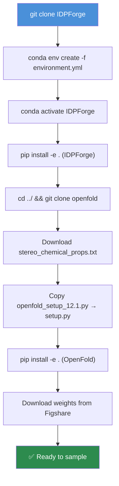

---
slug:2-quick-start
blog_type:normal
---


在你的机器上运行 IDPForge —— 从克隆仓库到生成你的首个本征无序蛋白质 (IDP) 系综。本指南将在 15 分钟内，引导你完成环境配置、权重获取以及首次采样命令的运行。

## 前提条件

在开始之前，请确保你的系统满足以下要求：

| 要求 | 详情 |
|---|---|
| **GPU** | NVIDIA GPU（默认安装支持 sm_60–sm_80；较新的 GPU 可能需要备选的 CUDA 12.8 路径） |
| **CUDA** | 12.1（默认）或 12.8（备选） |
| **Conda** | Miniconda 或 Anaconda，可选装 `mamba` 以加快依赖解析 |
| **磁盘** | 约 15 GB（用于环境 + 模型权重 + OpenFold） |
| **Git** | 用于克隆 IDPForge 和 OpenFold |

## 安装

完整安装分为三个阶段：**克隆 → 环境 → OpenFold**。下图展示了完整的流程：



### 步骤 1 — 克隆 IDPForge

```bash
git clone https://github.com/THGLab/IDPForge.git
cd IDPForge
```

### 步骤 2 — 创建 Conda 环境

```bash
conda env create -f environment.yml
conda activate IDPForge
pip install -e .
```

默认的 `environment.yml` 会安装 **PyTorch 2.5.1 + CUDA 12.1**。如果你使用的是较新的 GPU（2025 年第四季度之后发布）并遇到兼容性问题，请通过修改 `environment.yml` 中标记的四行来切换至备选配置：`cuda-toolkit=12.8`、`cuda-version=12.8`、`--extra-index-url` 改为 `cu128`，以及 `torch==2.7.1`。

<CgxTip>该环境包含 DeepSpeed、PyTorch Lightning、OpenMM、MDTraj 和 MMseqs2 —— 这些都是完整的“训练-采样-弛豫-验证”流程所必需的。</CgxTip>

来源: [README.md](/README.md#L15-L41), [environment.yml](/environment.yml#L1-L82)

### 步骤 3 — 安装 OpenFold

IDPForge 依赖 OpenFold 工具来进行蛋白质的 I/O 操作和特征计算。请将 OpenFold 克隆到与 IDPForge **相同的父目录**下：

```bash
cd ../
git clone https://github.com/aqlaboratory/openfold.git
cd openfold/openfold/resources
wget https://git.scicore.unibas.ch/schwede/openstructure/-/raw/7102c63615b64735c4941278d92b554ec94415f8/modules/mol/alg/src/stereo_chemical_props.txt
cd ../../
```

然后用 IDPForge 中修补过的版本替换 OpenFold 的 `setup.py` 并进行安装：

```bash
cp path/to/my/IDPForge/dockerfiles/openfold_setup_12.1.py path/to/my/openfold/setup.py
pip install -e .
```

> 如果你使用了 CUDA 12.8 备选方案，请改为复制 `openfold_setup_12.8.py`。

来源: [README.md](/README.md#L43-L98)

### 步骤 4 — 下载模型权重和数据

从 [Figshare](https://doi.org/10.6084/m9.figshare.28414937) 下载预训练权重、示例数据和推理输入。将下载的 `weights/` 目录直接放入 `IDPForge/weights/`，并将下载的 `data/` 内容合并到 `IDPForge/data/` 中。

```bash
# 从 Figshare 下载并解压后
cp -r weights/ /path/to/IDPForge/weights/
cp -r data/* /path/to/IDPForge/data/
```

来源: [README.md](/README.md#L200-L204)

### 备选方案：HPC / OpenFold 主导的安装

如果直接使用 `environment.yml` 的方式失败（在管理严格的集群上很常见），请改用 OpenFold 主导的路径进行安装。将两个仓库并排克隆，从 OpenFold 的环境文件中移除 `flash-attn`，使用 `mamba` 创建环境，然后手动添加 IDPForge 缺失的依赖项：

```bash
conda install einops mdtraj pdb-tools -c conda-forge
conda install mmseqs2 -c bioconda
pip install tensorboard topoly
```

然后使用 `pip install . --no-build-isolation` 安装这两个包（如果失败，则回退使用 `pip install -e .`）。容器化备选方案请参见 [Docker 和 HPC 设置](3-docker-and-hpc-setup)。

来源: [README.md](/README.md#L99-L198)

## 你的首个 IDP 系综

一旦环境激活且权重就位，生成系综只需一条命令。IDPForge 根据你的目标提供了两种采样模式：

| 模式 | 脚本 | 适用场景 |
|---|---|---|
| **完全无序** | `sample_idp.py` | 单链本征无序蛋白质 (IDPs) |
| **部分无序** | `sample_ldr.py` | 包含折叠结构域 + 本征无序区域 的蛋白质 |

### 采样完全无序蛋白质 (IDP)

`sample_idp.py` 脚本可直接在命令行接收蛋白质序列。这里我们为酵母 Sic1（一种被广泛研究的 IDP）生成 **10 个构象体**：

```bash
mkdir test
sequence="GSMTPSTPPRSRGTRYLAQPSGNTSSSALMQGQKTPQKPSQNLVPVTPSTTKSFKNAPLLAPPNSNMGMTSPFNGLTSPQRSPFPKSSVKRT"
python sample_idp.py $sequence weights/mdl.ckpt test configs/sample.yml \
    --nconf 10 --batch 4 --cuda --verbose
```

位置参数和可选参数如下：

| 参数 | 是否必需 | 描述 |
|---|---|---|
| `seq` | 是 | 氨基酸序列（单字母代码） |
| `ckpt_path` | 是 | 模型检查点路径（例如 `weights/mdl.ckpt`） |
| `output_dir` | 是 | 输出 PDB 文件的目录 |
| `sample_cfg` | 是 | 采样配置 YAML 的路径 |
| `--batch` | 否 | 每轮扩散的批大小（默认：32） |
| `--nconf` | 否 | 要生成的构象体总数（默认：100） |
| `--cuda` | 否 | 使用 GPU 加速 |
| `--verbose` | 否 | 打印结构验证细节 |

每个构象体会自动经过三阶段流程：**生成 + 弛豫**（AMBER 能量最小化）、**修复**（手性 + HIS 环修复）和 **验证**（键完整性、冲突分数、纽结检测）。通过验证的结构将保存为 `N_validated.pdb`。

来源: [README.md](/README.md#L282-L319), [sample_idp.py](/sample_idp.py#L172-L193)

### 采样含折叠结构域的蛋白质 (IDR)

对于同时包含结构化区域和无序区域的蛋白质，首先**准备折叠模板**，然后进行采样：

**步骤 A — 创建模板**，从 AlphaFold DB PDB 生成，指定无序残基范围：

```bash
python mk_ldr_template.py data/AF-P05231-F1-model_v4.pdb 1-41 data/AF-P05231_ndr.npz
```

这将写入一个 `.npz` 文件，其中包含折叠结构域坐标、扭转角和无序掩码，采样器将其用作固定骨架。

**步骤 B — 围绕该模板采样 IDR 系综**：

```bash
mkdir P05231_build
python sample_ldr.py weights/mdl.ckpt data/AF-P05231_ndr.npz P05231_build configs/sample.yml \
    --nconf 10 --batch 4 --cuda --verbose
```

对于长序列，可使用 `--attention_chunk` 管理 GPU 显存（值越低，显存占用越少，速度越慢）。提供的模型权重**不建议用于同时预测多个无序结构域** —— 多结构域场景请使用 AlphaFlex 流程。

来源: [README.md](/README.md#L336-L361), [mk_ldr_template.py](/mk_ldr_template.py#L1-L26), [sample_ldr.py](/sample_ldr.py#L233-L292)

## 配置一览

采样行为由 `configs/sample.yml` 控制。你最常交互的关键部分：

| 部分 | 关键参数 | 用途 |
|---|---|---|
| `diffuse` | `n_tsteps: 200`, `inference_steps: 40` | 扩散计划：总时间步和去噪步数 |
| `potential` | `false` / `potential_cfg` | 启用实验引导（PRE, NOE, Rg） |
| `relax` | `stiffness: 10.0`, `max_outer_iterations: 20` | AMBER 弛豫强度和迭代次数 |
| `model` | `trunk.*`, `structure_module.*` | Transformer 架构（通常保持默认） |

要**激活实验引导**，请设置 `potential: true` 并配置 `potential_cfg` 块。例如，Sic1 的 PRE 数据提供在 `data/sic1_pre_exp.txt` 中：

```yaml
potential: true
potential_cfg:
  pre:
    exp_path: data/sic1_pre_exp.txt
    exp_mask_p: 0.8
  timescale: 10
  grad_clip: 0.1
```

来源: [configs/sample.yml](/configs/sample.yml#L1-L57)

## 训练（可选）

要在你自己的数据上训练 IDPForge，请准备一个训练 pickle 文件（格式参见 `data/README.md`）并运行：

```bash
python train.py --model_config_path configs/train.yml
```

训练使用 PyTorch Lightning，可通过 `configs/train.yml` 中的 `trainer` 部分进行自定义（学习率、梯度裁剪、累积、周期等）。训练配置与采样配置的模型架构相呼应，但额外增加了损失权重、EMA 衰减和 OneCycleLR 调度器。

来源: [README.md](/README.md#L273-L279), [train.py](/train.py#L122-L155), [configs/train.yml](/configs/train.yml#L1-L94)

## 快速参考命令汇总

| 任务 | 命令 |
|---|---|
| **IDP 采样** | `python sample_idp.py SEQ weights/mdl.ckpt OUTDIR configs/sample.yml --nconf N --cuda` |
| **模板创建** | `python mk_ldr_template.py PDB RANGE output.npz` |
| **IDR 采样** | `python sample_ldr.py weights/mdl.ckpt TEMPLATE.npz OUTDIR configs/sample.yml --nconf N --cuda` |
| **训练** | `python train.py --model_config_path configs/train.yml` |
| **系综评分** | `python score_ensemble.py PROTEIN ENSDIR --jc --noe --pre --fret` |

<CgxTip>所有采样脚本都会自动从输出目录中现有的 `*_validated.pdb` 文件恢复 —— 只需重新运行相同命令，即可继续生成构象体，直至达到你设定的 `--nconf` 目标数量。</CgxTip>

## 接下来做什么？

既然你已经能够生成 IDP/IDR 系综，接下来可以探索更深入的架构和高级功能：

- **理解模型**：[架构概览](4-architecture-overview) → [IDPForge Transformer 网络](5-idpforge-transformer-network) → [SE(3) 骨架扩散](6-se-3-backbone-diffusion)
- **精通采样流程**：[IDP 采样](12-idp-sampling-fully-disordered) → [基于折叠模板的 IDR 采样](13-idr-sampling-with-folded-templates) → [实验引导势](14-experimental-guidance-potentials)
- **验证与评分**：[AMBER 弛豫与修复](15-amber-relaxation-and-repair) → [结构验证流程](16-structure-validation-pipeline) → [X-EISD 系综评分](17-x-eisd-ensemble-scoring)
- **集群部署**：[Docker 和 HPC 设置](3-docker-and-hpc-setup)