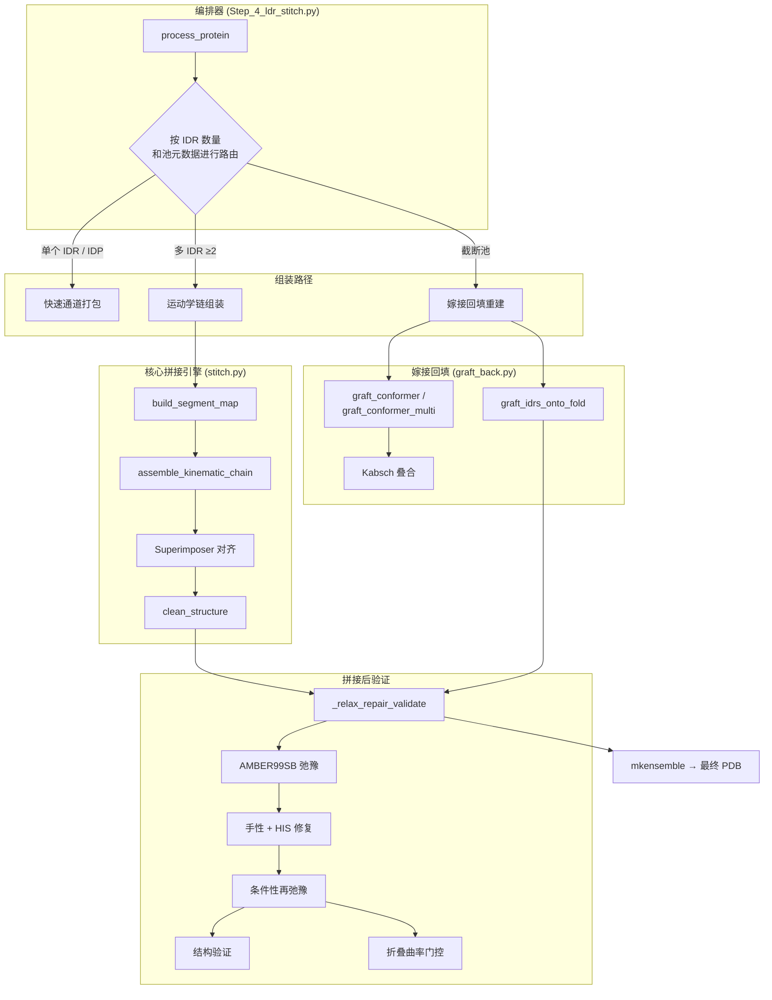
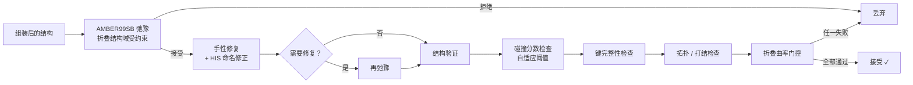

---
slug:20-monte-carlo-stitching-and-assembly
blog_type:normal
---


AlphaFlex 流水线的第 4 步通过蒙特卡洛采样循环，将每个 IDR 的构象池转换为**全长的、物理有效的结构系综**。该循环在运动学上将无序片段拼接至折叠骨架上，随后使每个候选结构经历 AMBER 弛豫、手性/键修复以及多标准验证。该流水线根据蛋白质的 IDR 拓扑类别自动选择，分派至三种架构路径——快速通道打包、截断池嫁接重建以及多 IDR 运动学组装。

来源：[Step_4_ldr_stitch.py](/AlphaFlex/Step_4_ldr_stitch.py#L1-L1119), [stitch.py](/AlphaFlex/utils/stitch.py#L1-L448), [graft_back.py](/AlphaFlex/utils/graft_back.py#L1-L334)

## 架构概述

拼接系统分解为四个协作层，每层实现为一个具有清晰数据流边界的独立模块：



编排器从[案例标注与 IDR 分类](19-case-labeling-and-idr-classification)中读取标注数据库，解析第 3 步生成的各 IDR 构象池，并将每个蛋白质路由至合适的组装路径，最后写入最终的多模型系综 PDB。

来源：[Step_4_ldr_stitch.py](/AlphaFlex/Step_4_ldr_stitch.py#L623-L903), [stitch.py](/AlphaFlex/utils/stitch.py#L1-L448)

## 路径分派逻辑

`process_protein` 函数根据每个蛋白质的 IDR 拓扑和池元数据对其进行分类，从而选择成本最低的组装路径：

| 条件 | 路径 | 依据 |
|-----------|---------|-----------|
| `Category_0_IDP`（完全无序）或单个 IDR | **快速通道打包** | 无需拼接；构象已是全长 |
| 带有 `_truncation.json` 伴随文件的单个 IDR | **嫁接回填重建** | 截断池必须恢复远端折叠结构域 |
| ≥2 个 IDR 且所有池均被截断 | **组合嵌合体重建** | 各 IDR 独立嫁接后通过 `graft_idrs_onto_fold` 合并 |
| ≥2 个 IDR，标准（非截断）池 | **运动学链组装** | 轮询构象抽取 + 逐片段叠合 |

蛋白质类别由 `get_protein_category` 确定，该函数将 IDR 复杂度划分为 **Category 0** (IDP)、**Category 1**（仅尾部）、**Category 2**（连接段）或 **Category 3**（环），反映了 IDR 与其两侧结构域之间逐渐增强的几何耦合关系。

来源：[Step_4_ldr_stitch.py](/AlphaFlex/Step_4_ldr_stitch.py#L623-L716), [stitch.py](/AlphaFlex/utils/stitch.py#L112-L129)

## 运动学链组装

多 IDR 蛋白质的核心算法基于**片段映射**运行——这是折叠结构域（F1, F2, …）和无序区域（D1, D2, …）的交替序列，对完整残基序列进行划分：

### 片段映射构建

`build_segment_map` 按位置对标注的 IDR 进行排序，并在它们之间穿插折叠结构域片段。对于一条 200 个残基的链中 IDR 范围为 (50–80) 和 (120–160) 的蛋白质，生成的映射为：

```
F1: [1–49]   D1: [50–80]   F2: [81–119]   D2: [120–160]   F3: [161–200]
```

该映射驱动序列化组装：每个片段要么从静态模板原样复制（折叠区域），要么从构象池中抽取并进行刚体对齐（无序区域）。

来源：[stitch.py](/AlphaFlex/utils/stitch.py#L224-L248)

### 基于桩点叠合的接缝对齐

将无序片段拼接到生长中的链上时，算法会计算一个**接缝桩点**——即前一个折叠结构域中点处的一个残基窗口：

1. **桩点选择**：`midpoint = median(anchor_residues)`，随后 `stub = [midpoint − HALF_SIZE … midpoint + HALF_SIZE]`。若中点窗口过小，则回退使用最后 `ALIGNMENT_JUNCTION_SIZE` 个残基。
2. **原子提取**：从生长链（`moving_anchor_atoms`）和候选构象（`static_anchor_atoms`）中提取桩点残基的骨架原子（N, CA, C）。
3. **刚体对齐**：BioPython 的 `Superimposer` 计算使两个桩点原子集间 RMSD 最小化的旋转 **R** 和平移 **t**，随后对整个构象进行变换：`conformer.transform(R, t)`。
4. **残基嫁接**：将 IDR 残基和侧翼结构域残基从对齐后的构象复制到最终链中，并对任何重叠残基更新坐标。

来源：[stitch.py](/AlphaFlex/utils/stitch.py#L292-L398)

### 轮询构象抽取

通过 `_next_conformer` 从各 IDR 的池中抽取构象，该函数为每个池维护一个乱序排列并循环遍历。当顺序耗尽时，会生成新的随机排列——确保在蒙特卡洛迭代中保证随机多样性，同时保证在任何构象被重复访问前，所有构象均已被遍历。

来源：[stitch.py](/AlphaFlex/utils/stitch.py#L252-L266)

## 嫁接回填重建

当第 3 步的构象由**大小受限（截断）的模板**生成时（这对于超出模型残基限制的蛋白质是必需的），构象池中会缺失远端折叠结构域。嫁接回填重建通过在 `graft_conformer` 中实现的三步过程来恢复它们：

| 步骤 | 操作 | 细节 |
|------|-----------|--------|
| **1. 边界桩点** | 识别截断边界处 `ANCHOR_RES=2` 个残基 | 构象片段与完整模板共享的残基 |
| **2. Kabsch 对齐** | 计算将模板映射至构象帧的最小二乘刚体变换 | 使用桩点残基的肽平面原子（N, CA, C） |
| **3. 拼接** | 原样写入构象，随后在应用 (R, t) 后追加模板中被丢弃的残基 | `dropped` resseq 处的模板原子执行 `xyz ← R·xyz + t` |

该函数报告对齐 RMSD、接缝间隙（IDR/折叠边界处的 CA–CA 距离）和缝合间隙（片段/模板边界处的 CA–CA 距离）——这些诊断信息可标记对齐不良的嫁接。对于多结构域截断，`graft_conformer_multi` 按顺序链式执行各结构域的独立嫁接。

来源：[graft_back.py](/AlphaFlex/utils/graft_back.py#L93-L202)

### 多尾组合嵌合体

具有 ≥2 个独立采样 IDR 尾部的蛋白质使用 `graft_idrs_onto_fold`，该函数通过 Kabsch 将各尾部构象独立对齐至共享的折叠结构域，随后将所有 IDR 行、片段折叠行以及未填充的模板折叠行合并为单一结构。构象配对从所有尾部池的笛卡尔积中抽取（第 1 阶段内不可复用），并在第 2 阶段通过随机放回抽取进行补足。

来源：[graft_back.py](/AlphaFlex/utils/graft_back.py#L272-L333), [Step_4_ldr_stitch.py](/AlphaFlex/Step_4_ldr_stitch.py#L498-L621)

## 拼接后验证流水线

每个组装的候选结构——无论经由哪条路径——均需通过 `_relax_repair_validate`，这是一个强制物理有效性的五阶段门控链：



### 折叠结构域受限的 AMBER 弛豫

`relax_with_established_method` 将 BioPython 结构转换为 OpenFold 蛋白质对象，随后使用 AMBER99SB 力场调用 `relax_protein`。IDR 残基索引作为 `viol_mask` 传入，使得最小化器仅对折叠结构域施加约束力——在允许无序区域弛豫至物理合理构象的同时，保持模板骨架几何形态。

来源：[Step_4_ldr_stitch.py](/AlphaFlex/Step_4_ldr_stitch.py#L128-L188)

### 自适应碰撞阈值

碰撞分数阈值通过 `get_smart_threshold` 自适应攀升：

```
threshold = base + (multiplier × increment)
其中 multiplier = attempts // 100  若 done == 0
                  attempts // 500  否则
```

此策略初始严格并逐渐放宽——早期候选结构面临严苛的碰撞过滤，但若蒙特卡洛循环陷入困境（尝试次数多，接受次数少），阈值将升高以避免拒绝那些可通过再弛豫改善的边缘可行结构。

来源：[smart_scoring.py](/AlphaFlex/utils/smart_scoring.py#L1-L6), [Step_4_ldr_stitch.py](/AlphaFlex/Step_4_ldr_stitch.py#L289-L291)

### 折叠曲率门控

折叠结构域曲率门控会拒绝接缝附近的折叠残基被拼接过程人为拉直的模型。它计算每个 IDR/折叠接缝两侧 `STITCH_FOLD_CURV_WINDOW` 个残基的滑动窗口内的局部曲率（离散 κ），并与参考模板曲率进行比较。若比值 `κ_model / κ_template` 低于 `STITCH_FOLD_CURV_RATIO`（默认 0.5），则拒绝该模型。

来源：[Step_4_ldr_stitch.py](/AlphaFlex/Step_4_ldr_stitch.py#L319-L336), [Step_4_ldr_stitch.py](/AlphaFlex/Step_4_ldr_stitch.py#L370-L382)

## 蒙特卡洛采样循环

`process_protein` 中的外层循环实现了两阶段的蒙特卡洛策略：

| 阶段 | 策略 | 终止条件 |
|-------|----------|-------------|
| **第 1 阶段：单次遍历** | 恰好访问每个构象（或构象配对）一次 | `done ≥ num_conformers` 或池耗尽 |
| **第 2 阶段：补充** | 从池中**有放回地**随机采样 | `done ≥ num_conformers` 或 `attempts ≥ STITCH_MAX_ATTEMPTS` |

第 1 阶段确保每个预生成的构象都能得到公平评估。第 2 阶段通过对随机构象的重新尝试来填补剩余空位——利用弛豫和验证的随机特性（最小化器中不同的随机种子可能对相同输入产生不同结果）。

该循环支持**恢复语义**：若检测到最终目标目录中已存在系综文件，且 `n_existing ≥ num_conformers`，则完全跳过该蛋白质。

来源：[Step_4_ldr_stitch.py](/AlphaFlex/Step_4_ldr_stitch.py#L826-L873), [Step_4_ldr_stitch.py](/AlphaFlex/Step_4_ldr_stitch.py#L464-L480)

## 系综组装与输出

通过验证的构象通过 `mkensemble` 收集为单一的多模型 PDB，该函数将各个构象文件拼接起来（去除 `PARENT`、`REMARK`、`MASTER`、`CRYST` 和 `END` 记录）并追加最终的 `END`。输出文件遵循以下命名规范：

```
<protein_id>_ensemble_n<N>.pdb
```

其中 `N` 为已接受模型的计数。输出按类别和长度区间进行组织：

```
Step_4_Final_Models/
├── Category_1/
│   ├── 0-250/
│   │   └── P05231/
│   │       └── P05231_ensemble_n10.pdb
│   └── 251-500/
├── Category_2/
└── Category_3/
```

长度分箱使用 `get_length_label`，其阈值设定为 250、500、1000、1500 和 2000 个残基。

来源：[Step_4_ldr_stitch.py](/AlphaFlex/Step_4_ldr_stitch.py#L38-L48), [stitch.py](/AlphaFlex/utils/stitch.py#L38-L46), [Step_4_ldr_stitch.py](/AlphaFlex/Step_4_ldr_stitch.py#L877-L894)

## 配置参考

第 4 步的所有参数均集中在 `config.py` 中，并可通过 CLI 参数覆盖：

| 参数 | 默认值 | 描述 |
|-----------|---------|-------------|
| `STITCH_N_CONFORMERS` | 10 | 每个蛋白质的目标系综大小 |
| `STITCH_MAX_ATTEMPTS` | 500 | 放弃前的最大蒙特卡洛尝试次数 |
| `STITCH_FOLD_CURV_RATIO` | 0.5 | 曲率门控阈值（0 表示禁用） |
| `STITCH_FOLD_CURV_WINDOW` | 15 | 从接缝起向折叠区域内用于曲率平均的残基数 |
| `RELAX_STIFFNESS` | 10.0 | 折叠结构域上的 AMBER 约束力常数 |
| `RELAX_MAX_OUTER_ITER` | 20 | 外部弛豫迭代次数 |
| `MINIMIZATION_MAX_ITER` | 0 | L-BFGS 迭代次数（0 = OpenMM 默认值） |
| `MINIMIZATION_TOLERANCE` | 10.0 | 收敛容差 (kJ/mol/nm) |
| `ALIGNMENT_STUB_HALF_SIZE` | 5 | 接缝桩点残基选择的半窗口 |
| `ALIGNMENT_JUNCTION_SIZE` | 5 | 中点窗口不足时的回退桩点大小 |
| `MIN_CONFORMER_POOL_SIZE` | 5 | 触发池大小警告前的最小构象数 |
| `STITCH_BASE_CLASH_THRESHOLD` | 10.0 | 初始碰撞分数阈值 |
| `STITCH_CLASH_INCREMENT` | 5.0 | 自适应阈值攀升步长 |

来源：[config.py](/AlphaFlex/config.py#L99-L123)

## 并行执行

CLI 通过 `--total_splits` 和 `--split_index` 支持**分片并行**，使用 `np.array_split` 将蛋白质 ID 列表均匀分配至各分片。对于节点内并行，`--workers N` 启动一个 `ProcessPoolExecutor`，各蛋白质的日志文件流式写入至 `logs/Step4/perprotein/<ID>.log`，支持通过 `tail -f` 进行实时监控。

<CgxTip>调试特定蛋白质的拼接失败时，请使用 `--workers 1 --verbose` 并检查每次尝试的日志输出。`[RESULT] FAILED` 行包含拒绝原因和自适应阈值，可揭示失败源于弛豫拒绝、碰撞分数、键完整性、手性还是折叠曲率——每种原因需要不同的修复策略。</CgxTip>

<CgxTip>对于具有 ≥2 个 IDR 且运动学链组装接受率较低的蛋白质，考虑同时增加 `STITCH_MAX_ATTEMPTS` 和 `STITCH_CLASH_INCREMENT`。自适应碰撞阈值将更快攀升，接受那些可通过再弛豫后续改善的边缘模型，同时更高的尝试上限确保有足够的候选结构进入验证阶段。</CgxTip>

来源：[Step_4_ldr_stitch.py](/AlphaFlex/Step_4_ldr_stitch.py#L906-L1119)

## 与流水线各阶段的关系

第 4 步消费由[使用折叠模板的 IDR 采样](13-idr-sampling-with-folded-templates)（第 3 步）生成的构象池，以及来自[案例标注与 IDR 分类](19-case-labeling-and-idr-classification)（第 1 步）的标注 IDR 注释。其输出的系综直接馈入 [X-EISD 系综评分](17-x-eisd-ensemble-scoring)进行实验重加权，以及馈入 [AMBER 弛豫与修复](15-amber-relaxation-and-repair)进行最终精修。折叠结构域曲率门控和打结拓扑检查利用了[结构验证流水线](16-structure-validation-pipeline)中记录的验证基础设施。