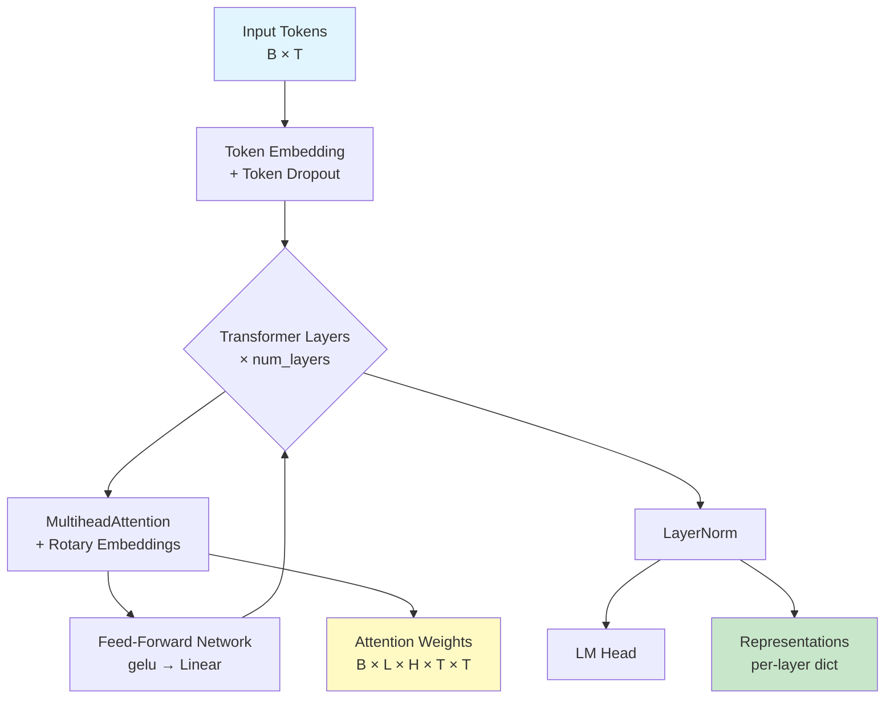
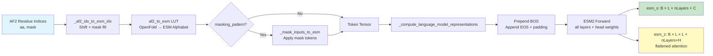
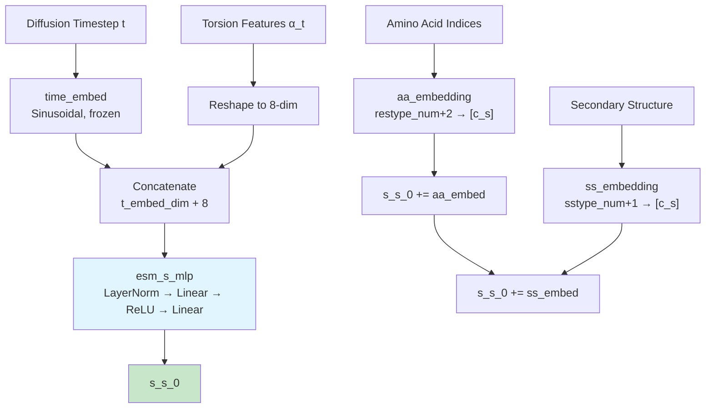

---
slug:21-esm2-integration-and-embeddings
blog_type:normal
---


IDPForge 将 **ESM-2 蛋白质语言模型** 作为基础编码子系统，提供预训练的序列表征，以增强基于扩散的结构生成流程。本页将深入剖析嵌入在 IDPForge 中的 ESM-2 架构、将 ESM-2 输出桥接至折叠主干的预处理封装器，以及 IDPForge 在训练和推理阶段用于其核心序列状态初始化的替代嵌入策略。

## ESM-2 模型架构

ESM-2 的实现位于 [`esm/esm2.py`](esm/esm2.py)，遵循标准的 BERT 风格 Transformer 编码器，并包含若干针对蛋白质的特定适配。`ESM2` 类是一个 `nn.Module`，由层数、嵌入维度和注意力头数进行参数化，所有配置均收敛于一个共享的架构模板：**token 嵌入 → 堆叠的 Transformer 层 → 层归一化 → 语言建模头**。



每个 `TransformerLayer` 应用 **pre-norm 残差连接**：输入在自注意力之前进行层归一化，并在前馈网络之前再次进行层归一化，每次子操作后添加残差。前馈网络使用 GELU 激活函数，扩展因子为 4×（即 `ffn_embed_dim = 4 * embed_dim`）。一个关键的架构细节是，所有 ESM-2 层都使用 **旋转位置嵌入** (RoPE)，它将相对位置信息直接编码到查询和键向量中，而不是通过加性位置嵌入。

来源：[esm2.py](esm/esm2.py#L14-L148)，[modules.py](esm/modules.py#L84-L142)

## 旋转位置嵌入

[`esm/rotary_embedding.py`](esm/rotary_embedding.py) 中的旋转嵌入实现遵循 RoFormer 公式，其中查询和键向量由以位置相关角度为参数的 **旋转矩阵** 进行变换。这将相对位置编码作为点积注意力计算的固有属性产生，而不需要显式的位置编码注入。

`RotaryEmbedding` 模块维护一个逆频率缓冲区 `inv_freq = 1.0 / (10000 ** (arange(0, dim, 2) / dim))`，并为当前序列长度缓存余弦/正弦表。`rotate_half` 操作将向量分成两半并应用 2D 旋转：`(x₁, x₂) → (x₁cos − x₂sin, x₁sin + x₂cos)`。这同样应用于查询和键，确保注意力逻辑值自然捕获相对位置关系。

来源：[rotary_embedding.py](esm/rotary_embedding.py#L1-L70)

## 预训练模型注册表

IDPForge 内置了 **包含 11 个 ESM-2 检查点变体的注册表**，涵盖六个参数规模，每个规模均提供完整的 UniRef50 训练检查点（270K 步）和中间检查点（部分规模为 500K 步）。该注册表定义在 [`idpforge/esm_wrapper.py`](idpforge/esm_wrapper.py) 中，使用 `functools.partial` 延迟模型加载：

| 注册表键 | 参数量 | 层数 | 嵌入维度 | 头数 | 检查点 |
|---|---|---|---|---|---|
| `esm2_8M` | 8M | 6 | 320 | 20 | UR50D 500K |
| `esm2_8M_270K` | 8M | 6 | 320 | 20 | UR50D 270K |
| `esm2_35M` | 35M | 12 | 480 | 20 | UR50D 500K |
| `esm2_35M_270K` | 35M | 12 | 480 | 20 | UR50D 270K |
| `esm2_150M` | 150M | 30 | 640 | 20 | UR50D 500K |
| `esm2_150M_270K` | 150M | 30 | 640 | 20 | UR50D 270K |
| `esm2_650M` | 650M | 33 | 1280 | 20 | UR50D 270K |
| `esm2_650M_270K` | 650M | 33 | 1280 | 20 | UR50D 270K |
| `esm2_3B` | 3B | 36 | 2560 | 40 | UR50D 270K |
| `esm2_3B_270K` | 3B | 36 | 2560 | 40 | UR50D 500K |
| `esm2_15B` | 15B | 48 | 3840 | 60 | UR50D 270K |

模型加载通过 [`esm/pretrained.py`](esm/pretrained.py) 进行：`load_model_and_alphabet_hub` 从 `https://dl.fbaipublicfiles.com/fair-esm/models/` 下载检查点，然后 `_load_model_and_alphabet_core_v2` 从保存的配置（`cfg.encoder_layers`、`cfg.encoder_embed_dim`、`cfg.encoder_attention_heads`）重建 `ESM2` 模型，并在剥离旧版前缀名（`encoder.sentence_encoder.`、`encoder.`）后加载状态字典。接触预测的回归权重在可用时会一并加载（对于 270K/500K 中间检查点则跳过）。

来源：[esm_wrapper.py](idpforge/esm_wrapper.py#L19-L32)，[pretrained.py](esm/pretrained.py#L85-L142)

## ESM_preprocess 封装器

[`idpforge/esm_wrapper.py`](idpforge/esm_wrapper.py) 中的 `ESM_preprocess` 类是 **ESM-2 语言模型表征与 IDPForge 结构流程之间的桥梁**。它封装了完整的预处理流程：氨基酸索引重映射、可选掩码、BOS/EOS token 插入、ESM-2 前向传播和表征提取。



**索引重映射** 是跨框架的关键问题。IDPForge 使用 OpenFold/AlphaFold2 残基索引（0 索引，20 种标准氨基酸 + X），而 ESM-2 使用其自有的 `Alphabet` token 排序。静态方法 `_af2_to_esm` 构建一个查找表，将 AF2 约定映射到 ESM 字母索引，并在位置 0 插入填充 token。前向路径首先将 AF2 索引偏移 +1（将 0 预留给填充），然后通过 `self.af2_to_esm[aa_embed.cpu()]` 应用查找表。

`_compute_language_model_representations` 方法处理语言模型接口：它前置 BOS token（`<cls>`），并通过替换序列后首个填充位置来追加 EOS token。调用 ESM-2 模型时传入 `repr_layers=range(num_layers + 1)` 以提取 **所有中间层表征**，并可选地传入 `need_head_weights=True` 获取注意力图。BOS/EOS 位置从输出中被切片移除（`esm_s[:, 1:-1]`），产生形状为 `B × L × nLayers × C` 的逐残基嵌入，以及（若请求）经过置换和展平后形状为 `B × L × L × (nLayers × H)` 的注意力图。

两个关键设计决策确保 ESM-2 作为 **冻结的特征提取器** 运行：模型通过 `self.esm.half()` 转换为半精度，并通过 `self.esm.requires_grad_(False)` 禁用所有梯度。输出表征在返回前被分离（`.detach()`），阻止任何梯度流回语言模型。

<CgxTip>`ESM_preprocess` 模块被设计为独立的预处理组件。它不会在 IDPForge 的默认训练或推理循环中被调用——相反，IDPForge 使用其自有的轻量级嵌入策略（见下一节）。`ESM_preprocess` 封装器适用于需要预计算的 ESM-2 嵌入作为辅助输入或用于分析流程的场景。</CgxTip>

来源：[esm_wrapper.py](idpforge/esm_wrapper.py#L34-L97)

## IDPForge 中的序列状态初始化

IDPForge 模型（[`idpforge/model.py`](idpforge/model.py)）通过自定义嵌入路径初始化其 **单一序列状态** `s_s_0`，该路径用扩散感知的替代方案取代了 ESM-2 编码器。这是与 ESMFold 的核心架构分歧：IDPForge 不消费冻结的 ESM-2 嵌入，而是从 **三个互补信号** 构建序列特征：



该构造通过三个加性阶段进行：

1. **扩散时间 + 扭转角投影**（`esm_s_mlp`）：正弦时间嵌入（维度 `t_embed_dim = 32`）与从 `alpha_t` 重塑的 8 维扭转特征向量拼接，产生 `(t_embed_dim + 8)` 维输入。这通过一个双层 MLP，包含 LayerNorm、ReLU，输出维度为 `c_s`（序列状态维度，根据配置通常为 1024 或 128）。

2. **氨基酸嵌入**（`aa_embedding`）：大小为 `(restype_num + 2) × c_s` 的可学习嵌入表将每个残基类型映射为添加至序列状态的向量。+2 考虑了填充（索引 0，设 `padding_idx=0`）和掩码 token。

3. **二级结构嵌入**（`ss_embedding`）：大小为 `(sstype_num + 1) × c_s` 的可学习嵌入表编码每个残基的二级结构分配。在训练期间，二级结构标签以 20% 的概率被随机置零（`torch.rand(1).item() < 0.2`），迫使模型对缺失的结构先验保持鲁棒性——这对于二级结构预测不可靠的内在无序区域是一个关键设计选择。

**成对状态** `s_z_0` 初始化为零，随后通过 `xyz_to_t2d` 加入从加噪主干坐标 `x_t` 派生的几何特征，该特征计算距离和方向分箱特征，编码扩散过程的当前状态。

来源：[model.py](idpforge/model.py#L36-L119)，[wrapper.py](idpforge/wrapper.py#L56-L83)

## 字母表与分词

ESM-2 的 `Alphabet` 类（[`esm/data.py`](esm/data.py)）定义了 token 词汇表及其组织结构。对于所有 ESM-2 模型使用的 ESM-1b 架构，token 布局如下：

| 位置 | Token | 描述 |
|---|---|---|
| 0 | `<cls>` | BOS / 分类 token |
| 1 | `<pad>` | 填充 |
| 2 | `<eos>` | 序列结束 |
| 3 | `<unk>` | 未知残基 |
| 4–29 | L A G V S E R T I D P K Q N F Y M H W C X B U Z O . - | 26 个蛋白质序列 token |
| 30–33 | `<null_1>` … `<null_4>` | 对齐填充至 8 的倍数 |
| 34 | `<mask>` | 用于 MLM 的掩码 token |

26 个标准 token（定义在 [`esm/constants.py`](esm/constants.py)）包括 20 种规范氨基酸以及歧义码（X, B, U, Z, O）和间隔字符（`.`，`-`）。词汇表被填充至 8 的倍数以提升硬件效率。`BatchConverter` 类（通过 `get_batch_converter` 引用）负责将原始序列字符串转换为适用于批量 ESM-2 推理的填充、分词张量。

来源：[data.py](esm/data.py#L91-L174)，[constants.py](esm/constants.py#L1-L11)

## 带旋转嵌入的多头注意力

[`esm/multihead_attention.py`](esm/multihead_attention.py) 中的 `MultiheadAttention` 模块实现了带有可选旋转位置编码的核心注意力计算。当 `use_rotary_embeddings=True` 时，会创建一个 `dim = head_dim` 的 `RotaryEmbedding` 实例，并在缩放点积注意力之前将其应用于查询和键：

```
q, k = rot_emb(q, k)  # 应用旋转位置编码
attn_weights = (q @ k^T) / sqrt(head_dim)
attn_probs = softmax(attn_weights)
output = attn_probs @ v
```

该模块支持可选的偏置键/值向量（`add_bias_kv`）、零注意力填充，以及用于自回归生成的增量解码状态。初始化在维度匹配时对 Q/K/V 投影使用 **增益为 1/√2 的 Xavier 均匀初始化**，这在经验上被观察到能改善 ESM-2 系列的收敛性。

来源：[multihead_attention.py](esm/multihead_attention.py#L67-L200)

## 嵌入维度流与模型选择

ESM-2 模型规模的选择决定了流经系统的嵌入维度。当使用 `ESM_preprocess` 时，输出表征的形状为 `B × L × nLayers × C`，其中 C 随模型规模缩放。这些表征必须经过投影，以匹配 IDPForge 主干的 `sequence_state_dim` 和 `pairwise_state_dim`：

| ESM-2 模型 | 嵌入维度 (C) | 层数 | 总表征维度 | VRAM (fp16) |
|---|---|---|---|---|
| 8M | 320 | 6 | 1,920 | ~0.3 GB |
| 35M | 480 | 12 | 5,760 | ~0.7 GB |
| 150M | 640 | 30 | 19,200 | ~1.5 GB |
| 650M | 1,280 | 33 | 42,240 | ~2.5 GB |
| 3B | 2,560 | 36 | 92,160 | ~10 GB |
| 15B | 3,840 | 48 | 184,320 | ~28 GB |

对于 IDPForge 的默认流程（不使用 `ESM_preprocess`），有效的逐残基输入维度为 `c_s`（可配置，在提供的训练配置中为 128），这远小于完整的 ESM-2 表征维度。这反映了 IDPForge 的设计哲学：**扩散时间步和加噪几何特征为结构去噪携带了充足的信息**，使得在去噪循环中不再需要庞大的 ESM-2 编码器。氨基酸和二级结构嵌入提供了轻量级的序列身份信号。

<CgxTip>在选择用于预计算嵌入分析的 ESM-2 变体时，150M 模型为 512 残基以下的序列提供了最佳的性价比。对于更长的无序区域，650M 模型在接触预测质量上提供了有意义的提升，这可为实验引导势提供信息。</CgxTip>

来源：[esm_wrapper.py](idpforge/esm_wrapper.py#L19-L32)，[model.py](idpforge/model.py#L30-L69)

## 架构关系：从 ESMFold 主干到 IDPForge

IDPForge 的 `FoldingTrunk`（[`esm/esmfold/trunk.py`](esm/esmfold/trunk.py)）在架构上派生自 ESMFold，但采用 **IDPForge 特定的初始化** 运行。该主干接收来自 IDPForge 模型嵌入路径（如上所述）预初始化的 `s_s_0` 和 `s_z_0`，而非原始 ESMFold 中的 ESM-2 嵌入。在主干内部，`TriangularSelfAttentionBlock` 实例通过相同的受 AlphaFold2 启发的操作处理序列和成对状态：三角形乘法更新（ outgoing + incoming）、三角形注意力（起始 + 终止节点）、序列到配对和配对到序列的通信，以及逐状态 MLP。

`FoldingTrunk.forward` 中的回收机制应用多达 `max_recycles` 次迭代（默认为 3），其中每次回收将前一次输出的单一/配对状态通过层归一化并添加基于直方图的配对校正。IDPForge 在推理期间通过其 `self_condition` 配置选项利用此回收机制，其中前一步去噪的输出作为回收输入——有效地在扩散去噪轨迹内创建了一个 **隐式自条件循环**。

来源：[trunk.py](esm/esmfold/trunk.py#L113-L200)，[tri_self_attn_block.py](esm/esmfold/tri_self_attn_block.py#L26-L169)，[model.py](idpforge/model.py#L121-L133)

## 下一步

- 有关使用这些嵌入的完整模型架构，请参阅 [IDPForge Transformer Network](5-idpforge-transformer-network)
- 有关扩散时间步嵌入如何与去噪循环交互，请参阅 [SE(3) Backbone Diffusion](6-se-3-backbone-diffusion)
- 有关执行该嵌入策略的训练流程，请参阅 [Training Workflow and Configuration](9-training-workflow-and-configuration)
- 有关如何为无序区域准备二级结构嵌入，请参阅 [IDP Sampling (Fully Disordered)](12-idp-sampling-fully-disordered)