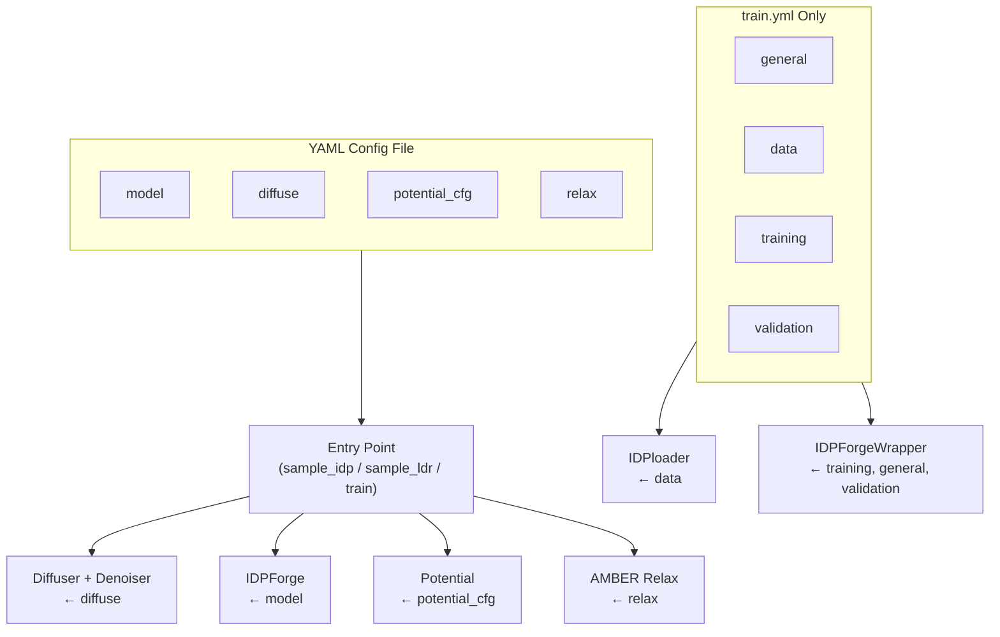

---
slug:22-configuration-reference
blog_type:normal
---


IDPForge 通过 **YAML 文件** 配置核心扩散模型和训练流水线，并通过 **Python 模块** (`AlphaFlex/config.py`) 配置 AlphaFlex 编排层。本参考文档记录了每个可配置参数、其类型、默认值以及消费它的代码路径。代码仓库中附带了两个标准的 YAML 配置文件：用于推理的 [`sample.yml`](configs/sample.yml) 和用于训练的 [`train.yml`](configs/train.yml)。

## 配置架构

IDPForge 的配置遵循**分层消费模型** —— YAML 文件是唯一事实来源，由入口脚本解析，然后通过字典切片分发到各子系统（diffusion、model、loss、relaxation、potentials）。加载时不强制执行配置验证模式；参数直接通过 `yaml.safe_load()` 消费，并在 OpenFold/ESM 子系统需要属性式访问时，作为 `ml_collections.ConfigDict` 对象传递。



来源: [sample_idp.py](sample_idp.py#L41-L47), [sample_ldr.py](sample_ldr.py#L41-L47), [train.py](train.py#L27-L34)

---

## 采样配置 (`configs/sample.yml`)

采样配置控制着完全无序 IDP 采样 (`sample_idp.py`) 和带有折叠模板的局部无序区域采样 (`sample_ldr.py`) 的**推理时**行为。

### `model` — Transformer 网络架构

这些参数定义了 IDPForge 去噪网络。它们在采样和训练配置中完全共享，并且在推理时**必须与检查点的训练配置相匹配**。

| 参数 | 类型 | 默认值 | 描述 |
|-----------|------|---------|-------------|
| `t_embed_dim` | int | `32` | 正弦时间步嵌入维度。输入到 `esm_s_mlp` 以将时间 + 扭转特征投影到序列状态空间。 |
| `self_condition` | bool | `true` | 启用自条件化：在训练期间以 50% 的概率，模型将自身上一步的预测作为附加输入接收。 |
| `t2d_params.DMIN` | float | `3.0` | 用于成对状态初始化的 2D 距离直方图箱的最小成对距离 (Å)。 |
| `t2d_params.DMAX` | float | `39.0` | 2D 距离直方图箱的最大成对距离 (Å)。 |
| `t2d_params.DBINS` | int | `32` | 成对特征直方图中的距离箱数。决定 `z_mlp` 的输入维度。 |
| `t2d_params.ABINS` | int | `32` | 成对特征直方图中的角度箱数。 |

来源: [configs/sample.yml](configs/sample.yml#L2-L22), [idpforge/model.py](idpforge/model.py#L30-L33)

### `model.trunk` — 折叠主干

主干封装了带有循环精修的 ESMFold 风格迭代折叠架构。

| 参数 | 类型 | 默认值 | 描述 |
|-----------|------|---------|-------------|
| `num_blocks` | int | `2` | 主干块的数量（每个包含注意力 + 转换层）。 |
| `sequence_state_dim` | int | `128` | 每残基单一表示维度 (`c_s`)。 |
| `pairwise_state_dim` | int | `64` | 每残基对表示维度 (`c_z`)。 |
| `sequence_head_width` | int | `32` | 序列（行）注意力中每个注意力头的宽度。 |
| `pairwise_head_width` | int | `32` | 成对（列）注意力中每个注意力头的宽度。 |
| `max_recycles` | int | `3` | 推理期间的最大循环迭代次数。 |
| `recycle_min_bin` | float | `3.375` | 循环距离图输入的最小距离箱。 |
| `recycle_max_bin` | float | `39.375` | 循环距离图输入的最大距离箱。 |

来源: [configs/sample.yml](configs/sample.yml#L8-L17)

### `model.trunk.structure_module` — IPA 结构模块

等变点注意力 (IPA) 结构模块输出 SE(3) 帧和扭转角。这些参数控制其容量和数值行为。

| 参数 | 类型 | 默认值 | 描述 |
|-----------|------|---------|-------------|
| `c_s` | int | `256` | 结构模块内部的单一通道维度。 |
| `c_z` | int | `64` | 结构模块内部的成对通道维度。 |
| `c_ipa` | int | `16` | 每个头的 IPA 隐藏通道维度。 |
| `c_resnet` | int | `128` | 角度更新网络中的 ResNet 隐藏维度。 |
| `no_heads_ipa` | int | `8` | IPA 注意力头的数量。 |
| `no_qk_points` | int | `4` | 每个 IPA 头的几何查询/关键点数量。 |
| `no_v_points` | int | `8` | 每个 IPA 头的几何值点数量。 |
| `dropout_rate` | float | `0.1` | 结构模块内应用的 Dropout 概率。 |
| `no_blocks` | int | `4` | 结构模块块的数量（每个：IPA → 转换 → 角度更新）。 |
| `no_transition_layers` | int | `1` | 每个块的转换 MLP 层数。 |
| `no_resnet_blocks` | int | `2` | 角度 ResNet 中的 ResNet 块数。 |
| `no_angles` | int | `7` | 预测的扭转角数量 (ω, φ, ψ, χ1–χ4)。 |
| `trans_scale_factor` | float | `10` | 应用于 IPA 平移输出的缩放因子。 |
| `epsilon` | float | `1e-8` | 用于归一化的数值稳定性常数。 |
| `inf` | float | `1e8` | 用于掩码注意力 logits 的大常数。 |

来源: [configs/sample.yml](configs/sample.yml#L18-L31), [idpforge/model.py](idpforge/model.py#L37-L52)

### `diffuse` — 扩散调度

控制所有三个扩散空间：欧几里得平移、SO(3) 旋转和扭转角中的前向（加噪）和反向（去噪）扩散过程。

| 参数 | 类型 | 默认值 (采样) | 默认值 (训练) | 描述 |
|-----------|------|---------|---------|-------------|
| `n_tsteps` | int | `200` | `200` | 离散化扩散时间步 **T** 的总数。控制噪声调度的粒度。 |
| `inference_steps` | int | `40` | — | 采样期间采取的反向扩散步数。步数越少 = 速度越快但越粗糙；在实践中必须能整除 `n_tsteps`。 |
| `n_tsteps_inf` | int | — | `40` | 训练配置为 Denoiser 使用 `n_tsteps_inf` 而不是 `inference_steps`。语义相同。 |
| `euclid_b0` | float | `0.01` | `0.01` | 欧几里得（平移）扩散的初始 (t=0) 噪声水平 β₀。 |
| `euclid_bT` | float | `0.06` | `0.08` | 欧几里得扩散的终止 (t=T) 噪声水平 β_T。训练使用更宽的调度 (`0.08`)。 |
| `torsion_b0` | float | `0.01` | `0.01` | 扭转角扩散的初始噪声水平 β₀。 |
| `torsion_bT` | float | `0.06` | `0.06` | 扭转角扩散的终止噪声水平 β_T。 |
| `tseed` | int | `49` | — | 扩散采样的随机种子（仅限采样配置）。 |

<CgxTip>`euclid_bT` 参数在采样 (`0.06`) 和训练 (`0.08`) 配置之间故意不同 —— 训练使用稍宽的平移噪声调度以提高鲁棒性。从检查点恢复时，请确保 `diffuse` 部分与训练配置完全匹配。</CgxTip>

来源: [configs/sample.yml](configs/sample.yml#L34-L41), [configs/train.yml](configs/train.yml#L51-L58), [idpforge/utils/diff_utils.py](idpforge/utils/diff_utils.py#L473-L505)

### `potential` 和 `potential_cfg` — 实验引导势

在采样期间，可微势将反向扩散引导向与实验一致的构象。顶层 `potential` 布尔值控制整个系统；当为 `false` 时，`potential_cfg` 块将被忽略。

| 参数 | 类型 | 默认值 | 描述 |
|-----------|------|---------|-------------|
| `potential` | bool | `false` | 采样期间引导势的主开关。 |
| `potential_cfg.timescale` | int | `10` | 势梯度缩放函数的乘数；值越高，在较早的时间步越积极地应用引导。 |
| `potential_cfg.grad_clip` | float | `0.1` | 每个原子的最大梯度幅度；防止势爆炸破坏去噪器的稳定性。 |

#### 接触 (PRE/NOE) 势

| 参数 | 类型 | 默认值 | 描述 |
|-----------|------|---------|-------------|
| `potential_cfg.pre.exp_path` | str | `data/sic1_pre_exp.txt` | 实验 PRE/NOE 距离约束文件的路径。 |
| `potential_cfg.pre.exp_mask_p` | float | `0.8` | 每个去噪步应用每个成对约束的概率（随机掩码降低梯度相关性）。 |
| `potential_cfg.pre.weight` | float | `1.0` | 复合梯度中接触势的权重。省略以使用默认值。 |

#### 回转半径 势

| 参数 | 类型 | 默认值 | 描述 |
|-----------|------|---------|-------------|
| `potential_cfg.rg.ens_avg` | float | — | RoG 势的靶标系综平均 Rg (Å)。 |
| `potential_cfg.rg.weight` | float | `1.0` | 复合梯度中 Rg 势的权重。省略以使用默认值。 |

`potential_cfg` 块可包含 `pre`、`noe` 或 `rg` 键。每个键触发相应 `Potential` 子类的构造。复合梯度在运行时组装：`potential_type` 累积活跃势名称，`weights` 将每个名称映射到其标量乘数。

来源: [configs/sample.yml](configs/sample.yml#L32-L40), [sample_idp.py](sample_idp.py#L56-L79), [idpforge/utils/potential.py](idpforge/utils/potential.py#L62-L170)

### `relax` — AMBER 弛豫

采样后对每个构象体应用的 AMBER 约束最小化。当 `max_iterations` 为 `0` 时，L-BFGS 执行单次能量评估（除非容差触发早期精修，否则实际上是空操作）。

| 参数 | 类型 | 默认值 | 描述 |
|-----------|------|---------|-------------|
| `max_iterations` | int | `0` | 每次最小化调用的最大 L-BFGS 迭代次数。`0` = 自动/受限。 |
| `tolerance` | float | `10.0` | 最小化器的收敛容差。 |
| `stiffness` | float | `10.0` | 应用于折叠残基的位置约束力常数。 |
| `max_outer_iterations` | int | `20` | 外部约束最小化循环数。 |
| `exclude_residues` | list[int] | `[]` | 排除在位置约束之外的残基索引。对于 LDR 采样，这在运行时自动填充 IDR 索引。 |

来源: [configs/sample.yml](configs/sample.yml#L42-L48), [sample_ldr.py](sample_ldr.py#L93-L96)

### 顶层采样字段

| 参数 | 类型 | 默认值 | 描述 |
|-----------|------|---------|-------------|
| `sec_path` | str/null | `null` | 预计算二级结构字符串（每行一个）的文件路径。当为 `null` 时，从 `data_path` 处的数据库采样 SS。 |
| `data_path` | str | `data/example_data.pkl` | 二级结构数据库 pickle (元组 `(sec_list, seq_list)`) 的路径。被 `--ss_db` CLI 参数覆盖。 |

来源: [configs/sample.yml](configs/sample.yml#L32-L33), [sample_idp.py](sample_idp.py#L82-L94)

---

## 训练配置 (`configs/train.yml`)

训练配置扩展了采样配置，增加了优化器、数据加载、损失和验证部分。

### `general` — 运行管理

| 参数 | 类型 | 默认值 | 描述 |
|-----------|------|---------|-------------|
| `me` | str | `train_cfg.yml` | 自引用配置文件名（仅提供信息）。 |
| `output` | str | `local` | TensorBoard 日志和检查点的输出目录根。 |
| `run_name` | str | `test` | 实验名称；用作 TensorBoard 日志子目录。 |
| `save_pdb` | bool | `true` | 是否定期将预测的 PDB 写入日志目录。 |
| `batch_save_freq` | int | `2` | PDB 保存频率：仅在 `(batch_idx + 1) % (batch_save_freq * 10) == 0` 时保存。 |
| `epoch_save_freq` | int | `5` | PDB 保存频率：仅在 `(epoch + 1) % epoch_save_freq == 0` 时保存。 |

来源: [configs/train.yml](configs/train.yml#L2-L8), [idpforge/wrapper.py](idpforge/wrapper.py#L21-L24)

### `data` — 数据加载

| 参数 | 类型 | 默认值 | 描述 |
|-----------|------|---------|-------------|
| `train_path` | list[str] | `["data/"]` | 训练数据的目录或 pickle 文件列表。每个条目作为 `(ss, seq, coords)` 元组加载。 |
| `val_path` | list[str] | `["data/"]` | 验证数据的目录或 pickle 文件列表。 |
| `tr_batch_size` | int | `16` | 训练批次大小（每 GPU）。 |
| `val_batch_size` | int | `64` | 验证批次大小。由于不存储梯度，通常可以更大。 |

来源: [configs/train.yml](configs/train.yml#L9-L15), [train.py](train.py#L34-L40)

### `training` — 优化器和训练循环

#### `training.lr_scheduler` — 学习率调度

使用来自 OpenFold 的 `AlphaFoldLRScheduler`：线性预热后接余弦衰减。

| 参数 | 类型 | 默认值 | 描述 |
|-----------|------|---------|-------------|
| `max_lr` | float | `0.001` | 预热后的峰值学习率。 |
| `warmup_no_steps` | int | `1000` | 线性预热的训练步数。 |
| `start_decay_after_n_steps` | int | `5000` | 开始余弦衰减的步数。 |
| `decay_every_n_steps` | int | `5000` | 余弦衰减周期的步数间隔。 |

#### `training.trainer` — PyTorch Lightning 训练器

这些关键字参数直接解包到 `Trainer` 构造函数中。

| 参数 | 类型 | 默认值 | 描述 |
|-----------|------|---------|-------------|
| `gradient_clip_val` | float | `0.1` | 梯度范数裁剪阈值。 |
| `accumulate_grad_batches` | int | `4` | 在执行优化器步之前累积的批次数量。有效批次大小 = `tr_batch_size × accumulate_grad_batches × num_gpus`。 |
| `accelerator` | str | `gpu` | PyTorch Lightning 加速器 (`gpu`、`cpu`、`auto`)。 |
| `devices` | int | `1` | GPU 设备数量。 |
| `max_epochs` | int | `100` | 最大训练轮数。 |
| `num_sanity_val_steps` | int | `0` | 训练开始前的健全性验证步数。 |

#### `training.ema_decay` — 指数移动平均

| 参数 | 类型 | 默认值 | 描述 |
|-----------|------|---------|-------------|
| `ema_decay` | float | `0.99` | 模型权重的 EMA 衰减。EMA 参数在验证和检查点保存时使用。 |

#### `training.diff_pkl`

| 参数 | 类型 | 默认值 | 描述 |
|-----------|------|---------|-------------|
| `diff_pkl` | str | `data/diff_igso3.pkl` | SO(3) 扩散器的预计算 IGSO(3) 缓存文件。避免在启动时对 `igso3_vals` 进行昂贵的重复计算。 |

来源: [configs/train.yml](configs/train.yml#L16-L41), [idpforge/wrapper.py](idpforge/wrapper.py#L106-L128)

### `training.loss` — 损失函数配置

复合训练损失是加权和：**L = w_fape·L_fape + w_dist·L_dist + w_angular·L_angular + w_violation·L_violation**。

#### `training.loss.weights`

| 参数 | 类型 | 默认值 | 描述 |
|-----------|------|---------|-------------|
| `fape` | float | `1` | 帧对齐点误差（骨架 + 侧链 FAPE）的权重。 |
| `dist` | float | `0.005` | Cβ 距离分布损失的权重。 |
| `angular` | float | `0.1` | 扭转角损失的权重。 |
| `violation` | float | `0.01` | 结构违背损失（冲突、键长偏差）的权重。 |

#### `training.loss.fape`

| 参数 | 类型 | 默认值 | 描述 |
|-----------|------|---------|-------------|
| `use_clamp` | float | `0.5` | 是否使用裁剪 FAPE（值 > 0 启用裁剪）。 |
| `clamp_distance` | float | `10` | FAPE 裁剪距离 (Å)。 |

#### `training.loss.dist`

| 参数 | 类型 | 默认值 | 描述 |
|-----------|------|---------|-------------|
| `start_epoch` | int | `50` | 距离损失生效的轮数（课程学习）。 |
| `loop_clamp` | float | `10` | Cβ 距离误差中环/IDR 部分的裁剪距离 (Å)。 |
| `sidechain` | float | `0` | 侧链距离损失项的权重。`0` = 禁用。 |
| `sidechain_clamp` | float | `8` | 侧链距离损失的裁剪距离。 |

#### `training.loss.violation_cfg`

| 参数 | 类型 | 默认值 | 描述 |
|-----------|------|---------|-------------|
| `start_epoch` | int | `80` | 违背损失生效的轮数。 |

<CgxTip>损失采用两阶段课程：距离损失在第 50 轮激活，违背损失在第 80 轮激活。在这些轮次之前，无论 `weights` 值如何设置，相应的权重实际上都为零。这可以防止早期的训练不稳定性受到冲突梯度噪声的影响。</CgxTip>

来源: [configs/train.yml](configs/train.yml#L42-L50), [idpforge/loss.py](idpforge/loss.py#L48-L80)

### `validation` — 验证指标

| 参数 | 类型 | 默认值 | 描述 |
|-----------|------|---------|-------------|
| `loss_weights.ca_drmsd` | float | `0.1` | 复合验证损失中 Cα DRMSD 的权重。 |
| `loss_weights.violation` | float | `0.0` | 验证损失中违背项的权重。 |
| `loss_weights.dist` | float | `0.05` | 验证损失中 Cβ 距离的权重。 |
| `loss_weights.rg_error` | float | `1.0` | 验证损失中 Rg 误差的权重。 |
| `compute_cb_dist` | bool | `true` | 是否在验证期间计算 Cβ 距离分布误差。 |
| `compute_rg` | bool | `true` | 是否在验证期间计算 Rg 误差（要求数据中包含 `rg`）。 |

来源: [configs/train.yml](configs/train.yml#L59-L67), [idpforge/wrapper.py](idpforge/wrapper.py#L67-L85)

---

## 命令行接口参考

### `sample_idp.py` — 完全无序 IDP 采样

```
python sample_idp.py <seq> <ckpt_path> <output_dir> <sample_cfg> [options]
```

| 参数 | 类型 | 默认值 | 描述 |
|----------|------|---------|-------------|
| `seq` | pos | — | 氨基酸序列（单字母代码，例如 `MDEKR...`）。 |
| `ckpt_path` | pos | — | 模型检查点 (`.ckpt`) 的路径。 |
| `output_dir` | pos | — | 输出 PDB 文件的目录。 |
| `sample_cfg` | pos | — | 采样 YAML 配置的路径。 |
| `--batch` | int | `32` | 每次前向传播生成的构象体数量。 |
| `--nconf` | int | `100` | 要生成的构象体总数。 |
| `--cuda` | flag | `false` | 如果可用，使用 CUDA。 |
| `--ss_db` | str | `None` | 从配置中覆盖 SS 数据库 pickle 的 `data_path`。 |
| `--no_relax` | flag | `false` | 跳过 AMBER 弛豫；输出原始 PDB (`*_raw.pdb`)。 |
| `--verbose` | flag | `false` | 打印每个构象体的结构验证详细信息。 |

来源: [sample_idp.py](sample_idp.py#L171-L193)

### `sample_ldr.py` — 带折叠模板的 IDR 采样

```
python sample_ldr.py <ckpt_path> <fold_template> <output_dir> <sample_cfg> [options]
```

| 参数 | 类型 | 默认值 | 描述 |
|----------|------|---------|-------------|
| `ckpt_path` | pos | — | 模型检查点的路径。 |
| `fold_template` | pos | — | `.npz` 模板文件的路径（来自 `mk_ldr_template.py`）。 |
| `output_dir` | pos | — | 输出 PDB 文件的目录。 |
| `sample_cfg` | pos | — | 采样 YAML 配置的路径。 |
| `--batch` | int | `32` | 每次前向传播的批次大小。 |
| `--nconf` | int | `200` | 要生成的构象体总数。 |
| `--attn_chunk_size` | int | `None` | 节省内存的注意力机制的块大小（减少 VRAM）。 |
| `--cuda` | flag | `false` | 使用 CUDA。 |
| `--ss_db` | str | `None` | 覆盖 SS 数据库路径。 |
| `--no_relax` | flag | `false` | 跳过弛豫。 |
| `--verbose` | flag | `false` | 详细验证输出。 |
| `--fold_curv_ratio` | float | `0.0` | 折叠曲率门控比率 —— 拒绝在折叠-IDR 连接处超过此曲率阈值的构象体。 |
| `--fold_curv_window` | int | `15` | 折叠曲率检查的残基窗口大小。 |
| `--junction_kappa` | float | `0.0` | 连接曲率门控 (Å⁻¹) —— 拒绝在连接处骨干曲率超过 κ 的构象体。 |
| `--expected_knot_type` | str | `None` | 用于拓扑筛选的预期纽结类型。 |

来源: [sample_ldr.py](sample_ldr.py#L170-L194)

### `train.py` — 训练

```
python train.py --model_config_path <path> [options]
```

| 参数 | 类型 | 默认值 | 描述 |
|----------|------|---------|-------------|
| `--model_config_path` | str | `config.yml` | 训练 YAML 配置的路径。 |
| `--seed` | int | `42` | 全局随机种子。 |
| `--run_version` | int | `None` | TensorBoard 运行版本覆盖。 |
| `--early_stopping` | flag | `false` | 在 `val_loss` 上启用早停。 |
| `--resume_from_ckpt` | str | `None` | 用于恢复训练的检查点路径。 |
| `--load_weights_only` | flag | `false` | 仅加载模型权重（忽略优化器状态）。 |
| `--log_lr` | flag | `true` | 将学习率记录到 TensorBoard。 |

来源: [train.py](train.py#L105-L153)

### `score_ensemble.py` — X-EISD 系综评分

```
python score_ensemble.py <protname> <pdbpath> [--jc] [--cs] [--noe] [--pre] [--fret] [options]
```

| 参数 | 类型 | 默认值 | 描述 |
|----------|------|---------|-------------|
| `protname` | pos | — | `EXP_DATA_LIB` 中的蛋白质名称键。 |
| `pdbpath` | pos | — | 包含 PDB 系综的目录。 |
| `--jc` / `--cs` / `--noe` / `--pre` / `--fret` | flags | — | 启用特定实验数据类型进行评分。 |
| `--all` | flag | `false` | 在单次遍历中对每个构象体评分（对比 30 次试验 × 100 子采样）。 |
| `--ens-size` | int | `100` | 每次随机子采样试验的构象体数。 |
| `--trials` | int | `30` | 随机子采样试验次数。 |
| `--force` | flag | `false` | 即使输出 CSV 存在也重新评分。 |
| `--normalize` | flag | `false` | 构建跨方法基准表（公式 S11）。 |
| `--rg` | flag | `false` | 为 `|%dRg|/Rg` 列计算每个系综的 Rg。 |

来源: [score_ensemble.py](score_ensemble.py#L107-L162)

---

## AlphaFlex 流水线配置 (`AlphaFlex/config.py`)

AlphaFlex 流水线使用**基于 Python 的配置模块**而不是 YAML。所有参数都是按流水线步骤组织的模块级常量。路径构建为相对于 `AlphaFlex/` 目录。

### 全局路径

| 常量 | 默认值 | 描述 |
|----------|---------|-------------|
| `PROJECT_ROOT` | `os.path.dirname(__file__)` | AlphaFlex 目录根。 |
| `MASTER_DB_PATH` | `Data_Inputs/AlphaFlex_database_Nov2025.json` | 主 AlphaFold 数据库。 |
| `LENGTH_REF_PATH` | `Data_Inputs/AF2_9606_HUMAN_v4_num_residues.json` | 残基计数参考。 |
| `PDB_LIBRARY_PATH` | `Data_Inputs/Test_Structures/` | PDB 结构库。 |
| `KNOT_SCREENING_PATH` | `Data_Inputs/knot_screening.json` | 纽结类型筛选数据。 |

来源: [AlphaFlex/config.py](AlphaFlex/config.py#L17-L29)

### 步骤 1：用例标记

| 常量 | 默认值 | 描述 |
|----------|---------|-------------|
| `LABELED_DB_PATH` | `Pipeline_Outputs/Step_1_Labeling/Labeled_...json` | 已标记数据库的输出路径。 |
| `SUMMARY_TEXT_PATH` | `Pipeline_Outputs/Step_1_Labeling/idr_type_summary.txt` | IDR 类型摘要输出。 |

### 步骤 1B：子集过滤

| 常量 | 默认值 | 描述 |
|----------|---------|-------------|
| `SUBSET_MIN_LENGTH` | `0` | 子集过滤的最小蛋白质长度。 |
| `SUBSET_MAX_LENGTH` | `250` | 最大蛋白质长度。 |
| `SUBSET_TAIL_COUNT` | `2` | 所需的无序尾数。 |
| `SUBSET_LINKER_COUNT` | `1` | 所需的无序连接数。 |
| `SUBSET_LOOP_COUNT` | `1` | 所需的无序环数。 |
| `SUBSET_EXACT_COUNT` | `True` | 要求尾/连接/环计数的精确匹配（对比最小值）。 |
| `SUBSET_IDR_MIN_LENGTH` | `None` | 最小 IDR 片段长度过滤器。 |
| `SUBSET_IDR_MAX_LENGTH` | `None` | 最大 IDR 片段长度过滤器。 |
| `SUBSET_MAX_SAMPLES` | `None` | 子集中条目数量的上限。 |

来源: [AlphaFlex/config.py](AlphaFlex/config.py#L40-L56)

### 步骤 2：模板生成

| 常量 | 默认值 | 描述 |
|----------|---------|-------------|
| `TEMPLATE_N_CONFS` | `200` | 每个模板生成的种子构象体数量。 |
| `TEMPLATE_SEED_SKEW` | `0.5` | 种子距离偏斜因子 —— 控制相对于折叠锚点的 IDR 种子放置分布。 |
| `TEMPLATE_MAX_RESIDUES` | `None` | 嫁接模式大小截断的最大总残基数。`None` = 无截断。 |
| `TEMPLATE_FOLD_PER_SIDE` | `10` | 截断后每侧连接保留的最小折叠残基数。 |
| `TIMEOUT_STATIC_TEMPLATE` | `60` | 静态模板生成的超时时间（秒）。 |
| `TIMEOUT_DYNAMIC_TEMPLATE` | `1000` | 动态（柔性）模板生成的超时时间（秒）。 |
| `TRUNCATE_TO_ADJACENT` | `False` | 是否将模板截断为仅相邻的折叠残基。 |

来源: [AlphaFlex/config.py](AlphaFlex/config.py#L59-L78)

### 步骤 3：构象体生成

| 常量 | 默认值 | 描述 |
|----------|---------|-------------|
| `SAMPLE_N_CONFS` | `10` | 每个 IDR 的目标构象体数量。 |
| `SAMPLE_BATCH_SIZE` | `6` | 构象体生成调用的批次大小。 |
| `SAMPLE_MAX_TOTAL_ATTEMPTS` | `500` | 放弃前的最大总生成尝试次数。 |
| `DEVICE` | `"cuda"` | 采样的计算设备 (`"cuda"` 或 `"cpu"`)。 |
| `SAMPLE_FOLD_CURV_RATIO` | `0.5` | 构象体接受的折叠曲率门控比率。 |
| `SAMPLE_FOLD_CURV_WINDOW` | `15` | 折叠曲率检查的残基窗口。 |
| `SAMPLE_JUNCTION_KAPPA` | `0.12` | 连接曲率门控阈值 (Å⁻¹)。 |
| `MODEL_WEIGHTS_PATH` | `weights/mdl.ckpt` | IDPForge 模型检查点的路径。 |
| `MODEL_CONFIG_PATH` | `configs/sample.yml` | 采样 YAML 配置的路径。 |
| `SS_DB_PATH` | `data/example_data.pkl` | 二级结构数据库的路径。 |

来源: [AlphaFlex/config.py](AlphaFlex/config.py#L81-L106)

### 步骤 4：拼接与弛豫

| 常量 | 默认值 | 描述 |
|----------|---------|-------------|
| `STITCH_N_CONFORMERS` | `10` | 每个蛋白质的目标拼接构象体数量。 |
| `STITCH_MAX_ATTEMPTS` | `500` | 最大拼接尝试次数。 |
| `STITCH_FOLD_CURV_RATIO` | `0.5` | 拼接构象体的折叠曲率门控。 |
| `STITCH_FOLD_CURV_WINDOW` | `15` | 曲率检查的残基窗口。 |
| `RELAX_STIFFNESS` | `10.0` | AMBER 约束力常数。 |
| `RELAX_MAX_OUTER_ITER` | `20` | 外部 AMBER 弛豫迭代次数。 |
| `MINIMIZATION_MAX_ITER` | `0` | L-BFGS 内部迭代次数 (`0` = 自动)。 |
| `MINIMIZATION_TOLERANCE` | `10.0` | L-BFGS 收敛容差。 |
| `ALIGNMENT_STUB_HALF_SIZE` | `5` | 对齐桩构造的半窗口大小。 |
| `ALIGNMENT_JUNCTION_SIZE` | `5` | 连接处的备用桩大小。 |
| `MIN_CONFORMER_POOL_SIZE` | `5` | 最小构象体池大小（警告阈值）。 |
| `STITCH_BASE_CLASH_THRESHOLD` | `10.0` | 构象体接受的基础冲突分数阈值。 |
| `STITCH_CLASH_INCREMENT` | `5.0` | 自适应冲突阈值升级步长。 |

来源: [AlphaFlex/config.py](AlphaFlex/config.py#L109-L123)

---

## 配置消费映射

下表将每个 YAML 部分追溯到消费它的类/函数，从而实现针对性修改而不会产生意外的副作用。

| YAML 部分 | 消费者 | 入口点 |
|-------------|----------|-------------|
| `model` | `IDPForge.__init__` via `mlc.ConfigDict` | 全部 |
| `model.trunk` | `FoldingTrunk.__init__` | 全部 |
| `model.trunk.structure_module` | `StructureModule.__init__` | 全部 |
| `diffuse` | `Diffuser.__init__`, `Denoiser.__init__` | 全部 |
| `diffuse.inference_steps` / `n_tsteps_inf` | `Denoiser.__init__` | 采样 / 训练 |
| `potential_cfg` | `sample_idp.main` → `Potential` 子类 | 仅 `sample_idp.py` |
| `relax` | `output_to_pdb` → AMBER 最小化器 | `sample_idp.py`, `sample_ldr.py` |
| `data` | `IDPloader.__init__` | 仅 `train.py` |
| `training.loss` | `calc_loss` | 仅 `train.py` |
| `training.lr_scheduler` | `AlphaFoldLRScheduler` | 仅 `train.py` |
| `training.trainer` | `Trainer(**kwargs)` | 仅 `train.py` |
| `training.ema_decay` | `ExponentialMovingAverage` | 仅 `train.py` |
| `validation` | `IDPForgeWrapper.validation_step` | 仅 `train.py` |

来源: [idpforge/model.py](idpforge/model.py#L35-L52), [idpforge/wrapper.py](idpforge/wrapper.py#L14-L24), [idpforge/utils/diff_utils.py](idpforge/utils/diff_utils.py#L473-L505)

---

## 延伸阅读

有关这些配置如何组合成端到端工作流的上下文，请参阅训练流水线的 [训练工作流与配置](9-training-workflow-and-configuration)，采样用法的 [IDP 采样（完全无序）](12-idp-sampling-fully-disordered)，以及基于势引导的 [实验引导势](14-experimental-guidance-potentials)。