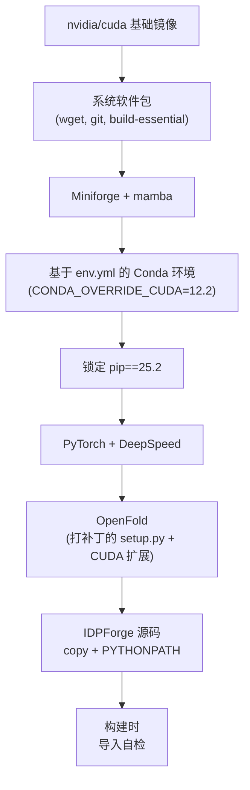

---
slug:3-docker-and-hpc-setup
blog_type:normal
---


IDPForge 提供 **三种部署格式** —— Docker 镜像、Apptainer (Singularity) 定义文件和纯 Conda 环境 —— 每种格式均提供 **两种 GPU 架构变体**：Ampere (CUDA 12.1) 和 Blackwell (CUDA 12.8)。本页将引导你选择合适的变体、构建容器或环境，并在其中运行你的首次采样任务。构建流水线在各格式间刻意保持统一：每条路径共享相同的 Conda 依赖清单、相同的 pip 版本锁定以及相同的 OpenFold CUDA 扩展补丁 —— 唯一的变量轴是与你的硬件匹配的 CUDA/PyTorch 版本对。

## GPU 架构变体

之所以存在这两种变体，是因为 OpenFold 的自定义 CUDA 内核 (`attn_core_inplace_cuda`) 必须针对与目标 GPU 相匹配的计算能力进行编译。IDPForge 对 OpenFold 的 `setup.py` 打了补丁，以精确控制在构建期间生成哪些 `sm_*` 代码。

| 变体 | CUDA 工具包 | PyTorch | 计算能力 | 目标 GPU |
|---------|-------------|---------|---------------------|-------------|
| **Ampere** | 12.1 | 2.5.1 | sm_61 (Pascal), sm_70 (Volta), sm_80 (Ampere) | A40, A100, V100, T4, GTX 1080+ |
| **Blackwell** | 12.8 | 2.7.1 | sm_61–sm_80 + sm_90 (Hopper/Ada), sm_120 (Blackwell) | H100, B200, RTX 5090, L40S |

OpenFold 的设置补丁使这种区别具体化。Ampere 变体针对三种架构进行编译：

```python
compute_capabilities = set([
    (6, 1), # Pascal
    (7, 0), # Volta
    (8, 0), # Ampere (A40/A100)
])
```

而 Blackwell 变体则在该集合中扩展了 Hopper 和 Blackwell 的代码：

```python
compute_capabilities = set([
    (6, 1),  # Pascal
    (7, 0),  # Volta
    (8, 0),  # Ampere (A40/A100)
    (9, 0),  # Hopper/Ada
    (12, 0), # Blackwell
])
```

<CgxTip>如果你的 HPC 集群运行 NVIDIA A100/A40 或更早的 GPU，请选择 **Ampere** 变体 —— 这是更稳妥的默认选项。仅当你确认目标机器拥有 Hopper (sm_90) 或 Blackwell (sm_120) 硬件时，才使用 **Blackwell** 变体；额外的计算能力标志会增加编译时间和镜像大小。</CgxTip>

来源: [openfold_setup_12.1.py](dockerfiles/openfold_setup_12.1.py#L55-L61), [openfold_setup_12.8.py](dockerfiles/openfold_setup_12.8.py#L55-L65)

## Docker 部署

### 构建

在仓库根目录下，构建与你的 GPU 架构相匹配的镜像：

```bash
# Ampere 变体 (适用于大多数集群)
docker build -f dockerfiles/Dockerfile_Ampere -t idpforge:ampere .

# Blackwell 变体 (适用于 H100 / B200 集群)
docker build -f dockerfiles/Dockerfile_Blackwell -t idpforge:blackwell .
```

两个 Dockerfile 遵循相同的分层构建策略，仅在基础镜像标签和 PyTorch wheel 索引上有所不同。构建流水线按以下阶段进行：



### 运行

通过 GPU 直通调用采样。容器内访问 CUDA 必须使用 `--gpus all` 标志：

```bash
docker run --gpus all -v $(pwd)/out:/app/out idpforge:ampere \
    python sample_idp.py \
    "MVKETFYTVGD" ./weights/mdl.ckpt /app/out \
    ./configs/sample.yml --nconf 10 --cuda --verbose
```

对于集成评分，将实验数据作为额外的卷挂载：

```bash
docker run --gpus all \
    -v $(pwd)/out:/app/out \
    -v $(pwd)/exp_data:/data \
    -e IDPFORGE_EXP_DATA=/data \
    idpforge:ampere \
    python score_ensemble.py asyn /app/out --jc --noe --pre --fret
```

<CgxTip>在 Conda 环境创建步骤中设置了 `CONDA_OVERRIDE_CUDA=12.2` 环境变量。这一点至关重要，因为 Docker 构建在 CPU 上执行 —— 若无此变量，Conda 将解析 OpenMM 的 **纯 CPU** 变体，从而无法在运行时执行 GPU 加速的 AMBER 弛豫。</CgxTip>

来源: [Dockerfile_Ampere](dockerfiles/Dockerfile_Ampere#L1-L64), [Dockerfile_Blackwell](dockerfiles/Dockerfile_Blackwell#L1-L64)

## 面向 HPC 的 Apptainer (Singularity) 部署

HPC 集群通常限制使用 Docker，但允许 Apptainer/Singularity 容器。IDPForge 提供了 `.def` 定义文件，使用 Apptainer 的 fakeroot 构建模式从相同的 NVIDIA CUDA 基础镜像构建 SIF 镜像。

### 构建

```bash
# Ampere 变体
apptainer build idpforge_ampere.sif dockerfiles/idpforge_ampere.def

# Blackwell 变体
apptainer build idpforge_blackwell.sif dockerfiles/idpforge_blackwell.def
```

> **构建前的先决条件**：你的仓库目录树中必须存在模型检查点 (`weights/mdl.ckpt`) 和片段库 (`data/example_data.pkl`) —— `%files` 部分会将 `weights/` 和 `data/` 目录复制到镜像的 `/opt/IDPForge/` 中。

### 运行

`--nv` 标志将宿主机的 NVIDIA 驱动和 CUDA 库绑定到容器中。绑定挂载输出目录，以使采样生成的结构持久保存在宿主机文件系统中：

```bash
# 采样
apptainer run --nv --pwd /opt/IDPForge \
    -B "$PWD/out":/app/out \
    idpforge_ampere.sif /opt/IDPForge/sample_idp.py \
        "MVKETFYTVGD" /opt/IDPForge/weights/mdl.ckpt /app/out \
        /opt/IDPForge/configs/sample.yml --nconf 10 --cuda --verbose
```

```bash
# 评分 (未内置实验数据 —— 需单独挂载)
apptainer run --nv \
    -B "$PWD/../Data/exp":/data \
    --env IDPFORGE_EXP_DATA=/data \
    idpforge_ampere.sif /opt/IDPForge/score_ensemble.py \
        asyn /app/out --jc --noe --pre --fret
```

### Apptainer 与 Docker：结构差异

| 方面 | Docker | Apptainer |
|--------|--------|-----------|
| 源码包含 | `COPY . /app` (完整目录树) | `%files` —— 显式按目录复制到 `/opt/IDPForge/` |
| Python 路径 | `ENV PYTHONPATH="/app"` | `%environment` 导出 `PYTHONPATH=/opt/IDPForge` |
| 入口点 | 无 (在 `docker run` 中显式指定 `python`) | `%runscript exec python "$@"` —— 脚本路径是唯一参数 |
| GPU 访问 | `--gpus all` (Docker 运行时) | `--nv` (宿主机驱动绑定) |
| 自检 | `RUN python - <<'PY' ...` (构建时快速失败) | `%test` 块 (通过 `apptainer test` 运行) |
| 语言环境配置 | 未设置 | `LC_ALL=C.UTF-8`, `LANG=C.UTF-8` |
| 构建用户 | Root | Fakeroot (Apptainer 默认) |

来源: [idpforge_ampere.def](dockerfiles/idpforge_ampere.def#L1-L121), [idpforge_blackwell.def](dockerfiles/idpforge_blackwell.def#L1-L121)

## Conda 环境 (裸机)

如果你偏好原生的 Conda 安装 —— 例如，在配备受支持 NVIDIA 驱动的工作站上 —— 请使用根目录下的 `environment.yml`。其中包含内联注释，标记了从 Ampere 默认配置切换到 Blackwell 备选配置时必须修改的四行内容。

### 设置

```bash
# 创建环境 (Ampere 默认)
mamba env create -f environment.yml
conda activate IDPForge

# 以可编辑模式安装 IDPForge
pip install -e .
```

### 切换到 Blackwell 变体

编辑 `environment.yml` 并更改 **四行标记内容**：

| 行 | 默认配置 (Ampere) | 备选配置 (Blackwell) |
|------|-------------------|------------------------|
| `cuda-toolkit` | `nvidia::cuda-toolkit=12.1` | `nvidia::cuda-toolkit=12.8` |
| `cuda-version` | `conda-forge::cuda-version=12.1` | `conda-forge::cuda-version=12.8` |
| `--extra-index-url` | `https://download.pytorch.org/whl/cu121` | `https://download.pytorch.org/whl/cu128` |
| `torch` | `torch==2.5.1` | `torch==2.7.1` |

编辑后，重新创建环境：

```bash
mamba env remove -n IDPForge
mamba env create -f environment.yml
conda activate IDPForge
pip install -e .
```

来源: [environment.yml](environment.yml#L1-L82)

## 共享依赖清单

Docker 和 Apptainer 构建均使用 `dockerfiles/env.yml` 作为其 Conda 依赖来源。此清单是根目录 `environment.yml` 的一个专注子集 —— 它省略了 `cuda-toolkit` (由基础镜像提供) 和 `gcc` (由 devel 镜像的系统软件包提供)，将它们委托给容器层处理。核心依赖组如下：

| 组 | 软件包 | 用途 |
|-------|----------|---------|
| 科学计算与 MD | `openmm`, `pdbfixer`, `mdtraj`, `biopython`, `scipy` | AMBER 弛豫、结构 I/O、轨迹分析 |
| 生物信息学 | `hmmer`, `hhsuite`, `kalign2`, `mmseqs2` | 为 OpenFold 生成 MSA |
| ML 核心 | `torch`, `pytorch-lightning`, `deepspeed` | 扩散模型训练与推理 |
| 数据与日志 | `numpy`, `pandas`, `tensorboard`, `wandb` | 实验追踪、数据处理 |
| 实用工具 | `PyYAML`, `tqdm`, `einops`, `ml-collections`, `aria2` | 配置解析、进度条、张量重塑、下载 |

所有三种部署格式均强制执行 **对 pip 25.2 版本的严格锁定**。Dockerfile 和 `.def` 文件在每次调用 `pip install` 后都会断言此不变量：

```bash
pip install --no-deps "pip==25.2" && \
    test "$(pip --version | awk '{print $2}')" = "25.2"
```

这确保了没有任何下游依赖会将 pip 静默升级到破坏 IDPForge 安装图的版本。

来源: [env.yml](dockerfiles/env.yml#L1-L51), [Dockerfile_Ampere](dockerfiles/Dockerfile_Ampere#L30-L32)

## 构建时验证

所有容器镜像都嵌入了在构建结束时运行的 **自检**。它导入每个关键软件包并打印 PyTorch/CUDA 版本对，如果缺少任何依赖或配置错误，将导致构建立即失败：

```python
import torch, numpy, scipy, pandas, mdtraj, yaml, tqdm
import ml_collections, einops
import Bio.PDB
import openmm, pdbfixer
import pytorch_lightning, tensorboard, modelcif
import openfold, idpforge, esm
print("torch:", torch.__version__, "cuda build:", torch.version.cuda)
print("idpforge ok, openfold ok, esm ok")
```

在 Docker 中，这作为 `RUN` 步骤执行 —— 导入失败将 **导致构建失败**。在 Apptainer 中，它位于 `%test` 部分，可以通过 `apptainer test idpforge.sif` 事后调用。

来源: [Dockerfile_Ampere](dockerfiles/Dockerfile_Ampere#L58-L64), [idpforge_ampere.def](dockerfiles/idpforge_ampere.def#L107-L115)

## 故障排除

| 症状 | 原因 | 修复方法 |
|---------|-------|-----|
| `openmm` 可导入但在 CPU 上运行 | 构建期间未设置 `CONDA_OVERRIDE_CUDA` | 重新构建 —— env.yml 步骤必须在 `CONDA_OVERRIDE_CUDA=12.2` 下运行 |
| OpenFold CUDA 扩展编译失败 | GPU 的计算能力设置错误 | 使用 `nvidia-smi --query-gpu=compute_cap --format=csv` 验证 GPU 架构，并选择匹配的变体 |
| `pip` 版本不匹配导致安装失败 | 下游软件包将 pip 升级到了 25.2 以上 | 重新锁定：`pip install --no-deps "pip==25.2"` |
| Apptainer 构建在 `%post` 中失败 | Fakeroot 无法写入 `/opt` | 使用 `apptainer build --fakeroot` 或在构建节点上以 root 身份运行 |
| 运行时出现 `ImportError: No module named 'idpforge'` | 容器中未导出 `PYTHONPATH` | Docker：检查 `ENV PYTHONPATH`；Apptainer：验证 `%environment` 块 |
| `--cs` 评分标志无效 | 未内置 CSpred 外部工具 | 在宿主机上安装 CSpred 并将其挂载到容器中 |

## 后续去向

环境就绪后，请继续阅读核心工作流页面：

- **[架构概览](4-architecture-overview)** —— 了解你刚安装的组件在运行时如何交互
- **[IDP 采样 (完全无序)](12-idp-sampling-fully-disordered)** —— 使用你刚构建的容器运行首个端到端采样任务
- **[配置参考](22-configuration-reference)** —— 针对你的硬件和序列调整 `sample.yml` 与 `train.yml` 配置