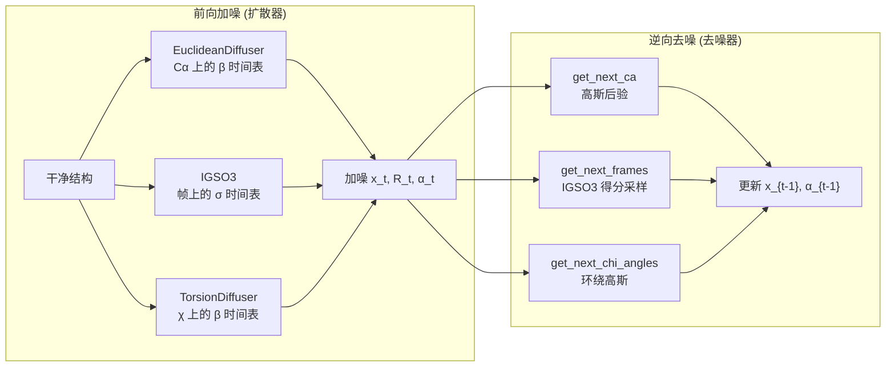
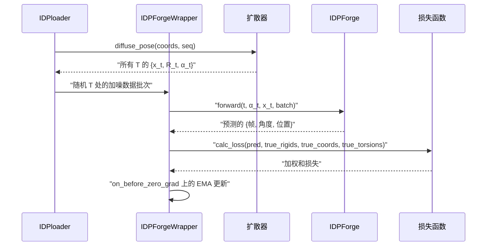
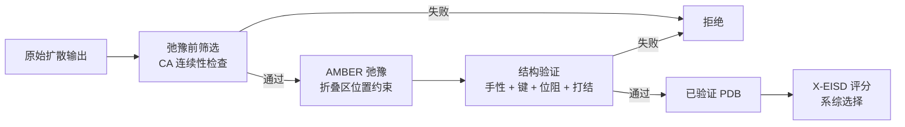

---
slug:4-architecture-overview
blog_type:normal
---


IDPForge 是一个 **Transformer 蛋白质语言扩散模型**，用于为内在无序蛋白（IDP）和保持折叠结构域的内在无序区域（IDR）生成全原子结构系综。该系统将修改后的 ESMFold 主干与运行在 SE(3) 骨架帧、SO(3) 旋转分量和扭转角空间上的三因子扩散过程相耦合——随后通过实验引导势、AMBER 弛豫和 X-EISD 系综评分闭环。

## 系统架构

```mermaid
graph TB
    subgraph Training["训练流水线"]
        TL[IDPloader<br/>数据 + 扩散] --> TW[IDPForgeWrapper<br/>Lightning + EMA]
        TW --> TM[IDPForge 模型"]
        TM --> TF[FoldingTrunk<br/>ESMFold Transformer]
        TL -->|加噪批次| TW
        TW -->|损失信号| TL
    end

    subgraph Diffusion["三因子扩散引擎"]
        D[扩散器] --> D1[EuclideanDiffuser<br/>Cα 平移]
        D --> D2[IGSO3<br/>骨架旋转]
        D --> D3[TorsionDiffuser<br/>侧链 χ 角]
        DN[去噪器] --> D
        DN --> GNP[get_next_pose<br/>逆向步骤]
        GNP --> GCA[get_next_ca]
        GNP --> GF[get_next_frames]
        GNP --> GT[get_next_chi_angles]
    end

    subgraph Inference["采样与推理"]
        SIDP[sample_idp.py<br/>完整 IDP] --> DN
        SLDR[sample_ldr.py<br/>IDR + 模板] --> DN
        DN --> RECON[model.recon<br/>逆向扩散循环]
        RECON --> POT[势梯度<br/>实验引导]
    end

    subgraph PostProc["后处理"]
        POT --> PR[弛豫前筛选]
        PR --> RLX[AMBER 弛豫<br/>+ 修复]
        RLX --> SV[结构验证]
        SV --> XE[X-EISD 系综评分]
    end

    TW -.->|EMA 权重| RECON
    D -.->|前向加噪| TL
```

该架构分为四个主要子系统：**(1)** 训练流水线，联合对真实结构加噪并训练去噪网络；**(2)** 扩散引擎，提供跨三个几何因子的前向加噪和逆向去噪；**(3)** 推理子系统，支持全无序和模板条件采样及实验势；**(4)** 后处理链，对生成的构象体进行筛选、弛豫、验证和评分。

来源: [model.py](/idpforge/model.py#L1-L283), [wrapper.py](/idpforge/wrapper.py#L1-L208), [diff_utils.py](/idpforge/utils/diff_utils.py#L1-L685)

## 核心模型：IDPForge Transformer

`IDPForge` 模块是神经去噪网络。它通过扩散特定的输入条件扩展了 ESMFold 的 `FoldingTrunk`——将时间步 *t* 的加噪结构转换为预测的干净结构。该模型接收四个输入流：**正弦时间步嵌入**、**加噪扭转角特征** (α_t)、**氨基酸标识嵌入** 和 **二级结构类型嵌入**。这些融合成每个残基的单状态向量 *s_s*，它与由加噪骨架几何衍生的成对状态 *s_z* 一起，输入到 FoldingTrunk 基于注意力的结构预测流水线中。

| 组件 | 输入 | 输出 | 维度 |
|---|---|---|---|
| `time_embed` | 时间步索引 *t* | 正弦嵌入 | → `t_embed_dim` (32) |
| `esm_s_mlp` | [time_embed ⊕ α_t] | 单状态 *s_s* | → `c_s` (384) |
| `z_mlp` | 成对距离区间 | 成对状态 *s_z* | → `c_z` (128) |
| `aa_embedding` | 残基类型 | 加至 *s_s* | → `c_s` |
| `ss_embedding` | SS 类型 (H/E/C/…) | 加至 *s_s* | → `c_s* |
| `FoldingTrunk` | *s_s*, *s_z*, 序列 | 帧, 角度, 位置 | SE(3) + 扭转输出 |

前向传播通过循环支持**自条件化**：来自上一次迭代输出的预测通过 `recycle_s_norm`、`recycle_z_norm` 和 `recycle_disto` 作为额外偏置项注入，从而在单步去噪内实现迭代细化。`recon` 方法实现了完整的逆向扩散循环，从 *t = T* 递减至 *t = 0*，同时可选择将模板残基固定在其天然坐标上。

<CgxTip>在训练期间，二级结构嵌入以 20% 的概率随机丢弃为全卷曲 (sstype=7)，这教会模型即使在没有显式 SS 引导的情况下也能生成无序构象——这对 IDP 系综多样性至关重要。</CgxTip>

来源: [model.py](/idpforge/model.py#L30-L120), [model.py](/idpforge/model.py#L122-L200), [model.py](/idpforge/model.py#L202-L283)

## 三因子扩散引擎

IDPForge 将蛋白质结构扩散分解为三个独立的几何通道，每个通道具有自身的噪声时间表和逆向步骤算法。这种因子化反映了蛋白质骨架几何的自然对称性：平移位于 ℝ³，骨架旋转位于 SO(3)，侧链构象位于扭转角环面。



**欧几里得 Cα 扩散**应用具有从 `euclid_b0` 到 `euclid_bT` 线性 β 的保方差时间表。逆向步骤使用标准 DDPM 推导计算高斯后验均值 μ(x_t, x̂_0) 和方差 σ²，然后添加缩放噪声以产生 x_{t-1}。所有骨架原子 (N, Cα, C, O, Cβ) 逐残基平移相同的 δ。

**IGSO(3) 帧扩散**作用于由骨架三元组 (N-Cα-C) 导出的旋转矩阵。前向传播使用预计算的 CDF 从 IGSO(3) 分布采样旋转向量。逆向步骤从预测的 R_0 和当前 R_t 计算得分近似，然后将其与由漂移系数 g(t) 缩放的随机噪声结合。这改编自 RFdiffusion SO(3) 框架。

**扭转角扩散**对侧链 χ 角应用相同的保方差时间表，并环绕至 [-π, π) 以遵从圆形拓扑。`torsion_mask` 确保仅对具有有效 χ 角的残基（如非丙氨酸或甘氨酸）进行扩散。

| 扩散通道 | 空间 | 时间表 | 逆向方法 |
|---|---|---|---|
| Cα 平移 | ℝ³ | 线性 β (DDPM) | 高斯后验 + 噪声 |
| 骨架旋转 | SO(3) | 二次 σ (IGSO3) | 基于得分的 SDE 离散化 |
| 扭转角 | [-π, π)⁴ | 线性 β (环绕) | 环绕高斯后验 |

来源: [diff_utils.py](/idpforge/utils/diff_utils.py#L1-L200), [diff_utils.py](/idpforge/utils/diff_utils.py#L200-L400), [diff_utils.py](/idpforge/utils/diff_utils.py#L400-L685)

## 训练流水线

训练循环由 `IDPForgeWrapper` 编排，这是一个 PyTorch Lightning 模块，管理模型、扩散器、数据加载器和损失计算间的交互。在每个训练步中，以线性递增权重采样随机时间步 *T*（偏向较晚、噪声更大的时间步），并训练模型从该时间步的加噪快照预测干净结构。



**数据流水线**（`IDPloader` → `DiffDataset` → `BatchCollator`）在设置时为每个训练结构预计算完整的前向扩散轨迹。每次 `__getitem__` 调用选择一个随机时间步，并返回 *t* 和 *t+1*（后者用于自条件化）处的加噪快照。`BatchCollator` 通过填充和稠密张量整理处理变长序列。

**损失函数**结合了四个互补项：**FAPE**（帧对齐点误差）测量骨架和侧链刚体对齐，**角度损失**作用于预测与真实扭转角之间，**违规损失**惩罚空间位阻和键几何偏差，**Cβ 距离损失**强制残基间距离一致性并对二级结构区域特殊处理。

来源: [wrapper.py](/idpforge/wrapper.py#L1-L208), [loader.py](/idpforge/loader.py#L1-L145), [loss.py](/idpforge/loss.py#L1-L189)

## 采样与推理

IDPForge 提供两种采样模式，它们共享相同的逆向扩散引擎，但在处理模板约束和初始条件上有所不同。

**完整 IDP 采样**（`sample_idp.py`）为完全无序的蛋白质生成构象系综。每个构象体从平移的各向同性高斯噪声、IGSO(3) 采样旋转和均匀扭转角开始。二级结构分配从按序列匹配的预构建 SS 数据库中采样，每个构象体随机选择以捕获结构多样性。生成循环运行直至达到请求的已验证构象体数量，并通过文件计数支持自动恢复。

**带折叠模板的 IDR 采样**（`sample_ldr.py`）在保留折叠结构模板的同时生成无序区域。模板残基的时间步强制为 *t = 0*，其坐标/扭转角在整个逆向扩散过程中固定为天然值，因此去噪器仅更新 IDR 位置。模板 `.npz` 文件提供序列、折叠坐标、二级结构、二元掩码和扭转角。对于大型模板，截断机制会输出 `_truncation.json` 嫁接规范，以便下游通过 AlphaFlex 拼接流水线重组。

| 特性 | IDP 采样 | IDR 采样 |
|---|---|---|
| 初始状态 | 各向同性噪声 | IDR 为噪声；折叠区为天然态 |
| 模板约束 | 无 | t=0 处固定坐标 |
| SS 来源 | 数据库查找 | 混合 (折叠区 SS + IDR SS) |
| 典型用例 | 完全无序蛋白质 | 部分结构化蛋白质 |
| 脚本 | `sample_idp.py` | `sample_ldr.py` |

来源: [sample_idp.py](/sample_idp.py#L1-L194), [sample_ldr.py](/sample_ldr.py#L1-L200), [model.py](/idpforge/model.py#L202-L283)

## 实验引导势

在逆向扩散期间，可微势函数使去噪轨迹偏向与实验数据的一致。每个势从当前预测结构计算标量能量，其梯度（通过 autograd 计算）在逆向步骤前加到预测的 x̂_0。`Potential` 基类定义了接口；具体实现包括：

| 势 | 实验数据 | 计算 |
|---|---|---|
| `RoG` | 系综平均 Rg | (Rg_pred − Rg_target)² |
| `Contact` | PRE / NOE 距离 | 切换逆距离匹配 |
| `Efret` | FRET 效率 | Förster 共振转移模型 |
| `JCoup` | J-耦合常数 | 骨架 φ 上的 Karplus 方程 |

`Multiple` 势允许上述任一项的加权组合。势由时间尺度参数（决定其在扩散中何时激活）和梯度裁剪阈值控制，以防不稳定。梯度仅应用于 Cα 位置并广播至所有骨架原子。

来源: [potential.py](/idpforge/utils/potential.py#L1-L170)

## 后处理链

每个生成的构象体在被接受进入最终系综前，都需通过多阶段验证和细化流水线。



**弛豫前筛选**在任何昂贵弛豫前检查连续 Cα-Cα 距离。连接残基（在折叠-IDR 边界处）使用比内部骨架键 (9.12 Å) 更宽松的阈值 (6.46 Å)。这可尽早过滤掉严重破坏的构象体。

**AMBER 弛豫**应用基于 OpenMM 的能量最小化，对折叠结构域残基施加位置约束（从约束中排除 IDR 残基）。`structure_repair` 模块在最小化前处理常见伪影，如翻转手性和断键。

**结构验证**执行全面检查：手性（通过三重积检测 D-型氨基酸）、键完整性（重原子图与规范连通性比较）、空间位阻（通过 KD 树的 VDW 重叠）和打结拓扑（Alexander 多项式筛选配合 AlphaKnot2 混合检测）。可按结构域通过 JSON 筛选文件指定打结期望。

**X-EISD 系综评分**针对实验数据（化学位移、J-耦合、PRE/NOE 距离、FRET）计算系综的最大对数似然得分。每个属性使用属性特定的反算器和最优参数估计计算对数似然，总分决定最优系综子集。

来源: [pre_relax.py](/idpforge/utils/pre_relax.py#L1-L30), [structure_validation.py](/idpforge/utils/structure_validation.py#L1-L200), [scorer.py](/scoring/scorer.py#L1-L136)

## ESM2 集成

`ESM_preprocess` 模块封装了 Meta 的 ESM2 蛋白质语言模型，以计算逐残基嵌入和可选的注意力图。它支持完整的 ESM2 模型家族（8M 到 15B 参数）。在基于模板的数据准备期间（`mk_flex_template.py`、`mk_ldr_template.py`），ESM2 嵌入可预计算并缓存，避免训练期间冗余推理。该封装器将 AlphaFold2 残基索引映射到 ESM 词元索引，添加 BOS/EOS 词元，并提取中间层表示。

来源: [esm_wrapper.py](/idpforge/esm_wrapper.py#L1-L100)

## 模块组织

```
idpforge/                        # 核心库
├── model.py                     # IDPForge transformer (去噪网络)
├── wrapper.py                   # PyTorch Lightning 训练封装器 + EMA
├── loader.py                    # DiffDataset + IDPloader (加噪数据流水线)
├── loss.py                      # 多组件损失 (FAPE, 角度, 违规, 距离)
├── misc.py                      # I/O: PDB 写入, SS 编码, 输入处理
├── esm_wrapper.py               # ESM2 嵌入预计算
└── utils/
    ├── diff_utils.py            # 扩散器 + 去噪器 + 三因子扩散
    ├── igso3_utils.py           # IGSO(3) 分布计算
    ├── potential.py             # 实验引导势
    ├── pre_relax.py             # 弛豫前骨架筛选
    ├── relax.py                 # 通过 OpenMM 的 AMBER 弛豫
    ├── structure_repair.py      # 弛豫前手性/键修复
    ├── structure_validation.py  # 全面构象体验证
    └── validation_metrics.py    # Rg 和其他系综指标

scoring/                         # X-EISD 系综评分
├── scorer.py                    # 逐属性对数似然评分
├── calculator.py                # 反算器编排
├── optimizer.py                 # 系综子集优化
└── normalize.py                 # 得分归一化

AlphaFlex/                       # AlphaFold + IDPForge 混合流水线
├── Step_1_case_label.py         # 从 AF2 结构进行 IDR 分类
├── Step_1B_subset_label.py      # 子集重新标记
├── Step_2_mk_ldr_template.py   # IDR 采样的模板创建
├── Step_3_sample_conformer.py   # 构象体生成 (调用 sample_ldr)
├── Step_4_ldr_stitch.py         # 截断结构域的蒙特卡洛拼接
└── utils/
    ├── stitch.py                # 蒙特卡洛组装逻辑
    ├── graft_back.py            # 折叠结构域的嫁接回溯
    └── smart_scoring.py         # 拼接的综合评分
```

来源: [model.py](/idpforge/model.py#L1-L283), [wrapper.py](/idpforge/wrapper.py#L1-L208), [diff_utils.py](/idpforge/utils/diff_utils.py#L1-L685), [loss.py](/idpforge/loss.py#L1-L189)

## 下一步

架构概述建立了系统级图景。要深入理解每个子系统，请遵循此进阶路径：

1. **核心模型** — 从 [IDPForge Transformer 网络](5-idpforge-transformer-network) 开始了解去噪网络内部机制，然后通过 [SE(3) 骨架扩散](6-se-3-backbone-diffusion) 和 [SO(3) 旋转扩散](7-so-3-rotational-diffusion) 了解几何扩散机制，并通过 [扭转角扩散](8-torsion-angle-diffusion) 了解侧链建模。
2. **训练** — 参见 [训练工作流与配置](9-training-workflow-and-configuration) 和 [损失函数](10-loss-functions) 了解优化设置。
3. **推理** — [IDP 采样（完全无序）](12-idp-sampling-fully-disordered) 和 [带折叠模板的 IDR 采样](13-idr-sampling-with-folded-templates) 涵盖两种采样模式；[实验引导势](14-experimental-guidance-potentials) 解释 NMR/FRET 数据如何引导生成。
4. **质量控制** — [AMBER 弛豫与修复](15-amber-relaxation-and-repair)、[结构验证流水线](16-structure-validation-pipeline) 和 [X-EISD 系综评分](17-x-eisd-ensemble-scoring) 详述后处理链。
5. **混合流水线** — [AlphaFlex 工作流概述](18-alphaflex-workflow-overview) 和 [蒙特卡洛拼接与组装](20-monte-carlo-stitching-and-assembly) 涵盖部分结构化蛋白质的端到端工作流。