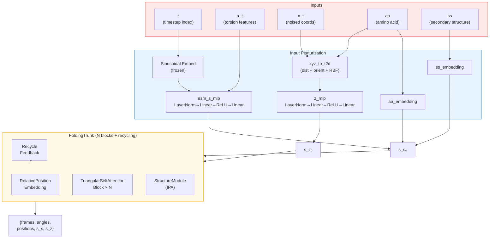
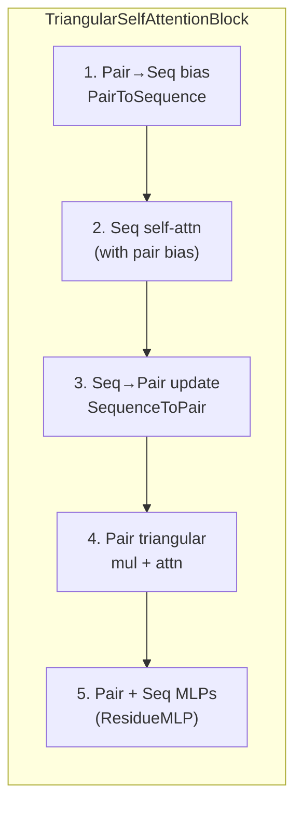

---
slug:5-idpforge-transformer-network
blog_type:normal
---


IDPForge Transformer 网络是在扩散框架内驱动结构预测的核心神经架构。它通过扩散时间步条件化、含噪坐标成对特征化以及二级结构嵌入对 ESMFold 主干进行了扩展——将单步结构预测器转化为一个**去噪网络**，该网络能够从噪声中迭代地精细化本质上无序的蛋白质构象。

## 架构概述

该网络遵循**双轨 Transformer** 范式：序列状态轨（逐残基）和成对状态轨（残基对）通过耦合注意力块交换信息，最终汇聚于一个不变点注意力（IPA）结构模块。IDPForge 与基础 ESMFold 主干的区别在于其**扩散感知输入特征化**，该机制将时间步、扭转角和含噪几何信号注入到初始隐状态中。



来源: [model.py](/idpforge/model.py#L36-L153), [trunk.py](/esm/esmfold/trunk.py#L113-L227)

## IDPForge 模块

`IDPForge` 类是顶层 `nn.Module`，负责统筹特征化并委派给 `FoldingTrunk`。其构造器接收两个关键扩散参数——`n_tsteps`（总训练时间步）和 `inf_tsteps`（推理子步），以及一个控制所有架构维度的 `IDPConfig` 数据类。

### 配置数据类

| 参数 | 默认值 | 作用 |
|---|---|---|
| `t_embed_dim` | 32 | 正弦时间步嵌入的维度 |
| `trunk` | `FoldingTrunkConfig()` | FoldingTrunk 的嵌套配置（块数、维度、循环） |

`FoldingTrunkConfig` 进而暴露了定义 Transformer 容量的各项维度：

| 参数 | 默认值 | 训练配置 | 作用 |
|---|---|---|---|
| `num_blocks` | 48 | 2 | TriangularSelfAttention 块的数量 |
| `sequence_state_dim` | 1024 | 128 | 逐残基隐维度 (c_s) |
| `pairwise_state_dim` | 128 | 64 | 逐对隐维度 (c_z) |
| `sequence_head_width` | 32 | 32 | 序列轨每个注意力头的宽度 |
| `pairwise_head_width` | 32 | 32 | 成对轨每个注意力头的宽度 |
| `max_recycles` | 3 | 3 | 推理期间的循环迭代次数 |
| `structure_module.c_s` | 384 | 256 | 结构模块单状态维度 |
| `structure_module.c_z` | 128 | 64 | 结构模块对状态维度 |
| `structure_module.no_blocks` | 8 | 4 | IPA 结构模块层数 |

来源: [model.py](/idpforge/model.py#L30-L33), [trunk.py](/esm/esmfold/trunk.py#L17-L54), [train.yml](/configs/train.yml#L61-L93)

### 嵌入与投影层

`__init__` 方法构建了五个核心参数组：

**时间步嵌入** — 一个冻结的正弦嵌入表，使用以 1000 为基的标准位置编码公式，将整数时间步索引 ∈ [0, n_tsteps) 映射为 `t_embed_dim` 维向量。此嵌入不会因梯度而更新，确保扩散调度在整个训练过程中保持固定。

**序列状态投影** (`esm_s_mlp`) — 一个带有 LayerNorm 输入和 ReLU 激活的两层 MLP，将时间步嵌入（32 维）和扭转角特征（8 维）的拼接投影到序列状态维度 c_s。这是扩散状态与 Transformer 内部表示之间的关键桥梁。

**成对状态投影** (`z_mlp`) — 结构类似，此 MLP 将含噪坐标的二维距离-方向特征化投影到 c_z。其输入维度为 `2 × DBINS + 6 + 1`（独热距离分箱 + 正弦方向角 + RBF Cα–Cα 特征）。

**氨基酸与二级结构嵌入** — 两个独立的 `nn.Embedding` 表将残基类型和二级结构类别映射到 c_s。填充索引为 0，两者均使用偏移 1 约定，其中 0 表示填充，有效索引从 1 开始。

来源: [model.py](/idpforge/model.py#L37-L69), [tensor_utils.py](/idpforge/utils/tensor_utils.py#L116-L125)

## 前向传播：从扩散状态到结构

`forward` 方法实现了单步去噪预测。它接收当前扩散状态（时间步 `t`、扭转角 `alpha_t`、含噪主链 `x_t`）以及包含序列、二级结构、掩码和残基索引的批处理字典。

### 第 1 步 — 序列状态初始化

初始逐残基隐状态 `s_s_0` 由三个信息流求和组装而成：

```
s_s_0 = MLP( [sin_emb(t) ‖ α_t] ) + Embed_aa(aa) + Embed_ss(ss)
```

时间步嵌入与扭转角特征沿特征维度拼接，经 `esm_s_mlp` 投影后，氨基酸与二级结构嵌入以**加法形式组合**。这种加性融合确保每个信号能被下游注意力层独立解释，而非通过乘性交互纠缠在一起。

`IDPForgeWrapper.training_step` 中一个值得注意的训练增强是：以 20% 的概率随机将二级结构标签置零（`torch.rand(1).item() < 0.2`），迫使模型学会在不依赖二级结构（SS）标注的情况下进行稳健预测。

来源: [model.py](/idpforge/model.py#L110-L114), [wrapper.py](/idpforge/wrapper.py#L56-L83)

### 第 2 步 — 成对状态初始化

含噪主链坐标 `x_t`（形状为 B × L × 5 × 3，代表 N, Cα, C, O, Cβ 原子）通过 `xyz_to_t2d` 转换为丰富的二维特征图：

| 特征 | 维度 | 计算方式 |
|---|---|---|
| Cβ–Cβ 距离独热编码 | DBINS + 1 | 分桶后的残基间距离 |
| Cα–Cα RBF | DBINS | 高斯径向基函数 |
| 方向 (sin/cos) | 6 | sin(ω), cos(ω), sin(θ), cos(θ), sin(φ), cos(φ) |

距离特征捕获**全局空间邻近性**，而方向特征（二面角 ω、θ 和平面角 φ）编码残基对之间的**局部坐标系关系**。它们共同为 Transformer 提供了当前含噪构象的几何快照。组合后的特征向量通过 `z_mlp` 投影，得到 `s_z_0`。

来源: [model.py](/idpforge/model.py#L117-L119), [tensor_utils.py](/idpforge/utils/tensor_utils.py#L147-L219)

### 第 3 步 — 循环反馈

如果提供了 `prev_outputs`（来自上一轮循环迭代或自条件化），模型会注入三种循环信号：

1. **序列循环** — 对前一步 `s_s` 进行 LayerNorm，加至 `s_s_0`
2. **成对循环** — 对前一步 `s_z` 进行 LayerNorm，加至 `s_z_0`
3. **距离图循环** — 根据前一步预测坐标生成分桶的 Cβ–Cβ 距离直方图，嵌入至 `s_z_0`

训练期间的自条件化是随机应用的（启用时概率为 50%）：在时间步 t+1 使用 `torch.no_grad()` 运行一次模型以获取 `prev_outputs`，随后以此为条件在时间步 t 执行实际的前向传播。这教会网络利用自身预测作为输入，从而提升迭代采样时的收敛性。

来源: [model.py](/idpforge/model.py#L121-L129), [wrapper.py](/idpforge/wrapper.py#L64-L68)

### 第 4 步 — FoldingTrunk 执行

初始化后的 `s_s_0` 和 `s_z_0` 被传入 `FoldingTrunk.forward`，执行主 Transformer 循环：

1. 将**相对位置嵌入**加至成对状态
2. 执行 N × **TriangularSelfAttentionBlock** 迭代（可选循环）
3. **StructureModule**（基于 IPA）将最终隐状态转换为三维坐标

主干返回一个包含单/对状态、主链帧、侧链帧、扭转角（归一化与未归一化）及原子位置的字典。`IDPForge.forward` 方法将其筛选为下游所需的七个键，附上原子掩码和残基索引，并返回结构预测结果。

来源: [model.py](/idpforge/model.py#L131-L153), [trunk.py](/esm/esmfold/trunk.py#L160-L227)

## TriangularSelfAttentionBlock

每个块实现了双轨 Transformer 的核心信息处理基元。单个块内的计算依序通过五个阶段：



### 阶段 1 — 成对到序列的偏置

`PairToSequence` 对成对状态应用 LayerNorm，随后进行从 c_z 到 `num_heads` 的线性投影。其输出作为**注意力偏置**加至序列自注意力的查询-键点积中，使得成对几何关系能够调节残基间的注意力分配。

### 阶段 2 — 门控序列自注意力

标准的多头自注意力作用于序列状态，并由阶段 1 的成对偏置增强。该注意力机制采用**门控输出**，即输入经 sigmoid 激活的线性投影后，与注意力输出逐元素相乘，提供了一个可学习的逐特征开关。此门控注意力机制与 AlphaFold2 的 EvoFormer 中使用的机制相同。

### 阶段 3 — 序列到成对的更新

`SequenceToPair` 将更新后的序列状态经线性层投影，将结果拆分为查询和键分量，随后计算所有残基对的**外积**（q ⊙ k）和**外差**（q − k）。这些结果拼接后投影至 c_z，捕获残基表示间的乘性与加性交互。

### 阶段 4 — 三角成对更新

四种操作依次更新成对状态，均使用**零初始化**的最终投影（确保块初始为恒等映射）：

| 操作 | OpenFold 组件 | 方向 |
|---|---|---|
| 三角乘法（出向） | `TriangleMultiplicationOutgoing` | 行聚合 → 列广播 |
| 三角乘法（入向） | `TriangleMultiplicationIncoming` | 列聚合 → 行广播 |
| 三角注意力（起始节点） | `TriangleAttentionStartingNode` | 沿行注意力 |
| 三角注意力（终止节点） | `TriangleAttentionEndingNode` | 沿列注意力 |

三角乘法操作实现了 AlphaFold2 中的**几何推理**基元：若残基 i 邻近 j，且 j 邻近 k，则可通过中间节点 j 推断 i–k 关系的信息。行与列的 Dropout（以 2 倍基础比率）为各轴向方向提供了专属的正则化。

### 阶段 5 — 残差 MLP

序列与成对状态均通过 `ResidueMLP` 模块（LayerNorm → Linear → ReLU → Linear → 带残差连接的 Dropout），其内层维度为状态维度的 4 倍。这些模块在下一个块之前提供逐位置的前馈处理，以精细化表示。

来源: [tri_self_attn_block.py](/esm/esmfold/tri_self_attn_block.py#L26-L169), [misc.py](/esm/esmfold/misc.py#L120-L280)

## 零初始化策略

贯穿 TriangularSelfAttentionBlock 的一个关键架构决策是对所有输出投影进行**零初始化**。每个 `linear_z`、`linear_o`、`o_proj`，以及 `mlp_seq` 和 `mlp_pair` 中的最终 MLP 层，其权重与偏置均初始化为零。这意味着每个块在训练初期近似为恒等映射，整个主干最初将输入特征直接传递给结构模块。此策略通过确保网络从状态良好的基线而非随机投影起步，稳定了早期训练。

来源: [tri_self_attn_block.py](/esm/esmfold/tri_self_attn_block.py#L88-L105)

## 迭代去噪：`recon` 方法

`forward` 执行单步去噪，而 `recon` 统筹从 T → 0 的**完整反向扩散轨迹**。它沿时间步反向迭代，在每一步调用 `forward` 并将坐标/扭转角的更新委派给外部的 `denoiser` 对象：

```python
for t in range(n_tsteps - 1, end_tsteps, -int(n_tsteps / inf_tsteps)):
```

此循环内运行三种条件化机制：

**模板条件化** — 当提供 `template_cfg` 时，被模板掩码覆盖的残基被强制设定为时间步 0 并赋予模板坐标与扭转角，确保折叠区域保持锚定，而无序区域自由扩散。参见 [带有折叠模板的 IDR 采样](13-idr-sampling-with-folded-templates)。

**实验引导** — 当激活 `potential` 时，对去噪预测应用基于梯度的修正：`p_x0 += clamp(x_grad × scaler(t), max=clip)`。缩放器遵循可配置的衰减调度（常数、线性或二次），在结构接近成型的晚期时间步放大引导力度。参见 [实验引导势](14-experimental-guidance-potentials)。

**自条件化** — 启用时，每步去噪的输出作为下一步的 `prev_outputs` 反馈，在反向扩散内部构建渐进式精细化循环。

来源: [model.py](/idpforge/model.py#L155-L208)

## `sample` 方法：端到端推理

`sample` 方法提供了生成构象的完整公共 API。它处理序列/二级结构编码（通过甘氨酸连接符和残基索引偏移支持多链）、张量合并、可选掩码模式、势能初始化，并委派给 `recon`。输出字典包含最终原子位置、残基类型、原子掩码及二级结构分配——可直接用于 PDB 写入或下游打分。

`initialize_potential` 工厂支持单势能与复合（加权多势能）配置，其衰减调度控制实验数据在各时间步对去噪的引导强度。

来源: [model.py](/idpforge/model.py#L211-L269)

## 训练封装器：IDPForgeWrapper

`IDPForgeWrapper` PyTorch Lightning 模块用训练基础设施封装了 `IDPForge`：

| 组件 | 实现 |
|---|---|
| **优化器** | Adam 配合 AlphaFold 风格学习率调度器（预热 + 衰减） |
| **EMA** | 指数移动平均，在梯度清零前应用；验证时加载，之后恢复 |
| **验证** | 完整反向扩散 (`model.recon`)，复合损失：CA-DRMSD、违规项、Cβ 距离和 Rg 误差的加权和 |
| **检查点** | EMA 状态字典与模型权重一同保存/加载 |

训练步骤在标准数据加载之外应用两种随机增强：(1) 随机 SS 丢弃（20% 概率将所有 SS 标签替换为掩码类），以及 (2) 自条件化（启用时 50% 概率，仅在非最终时间步应用）。损失计算委派给 [损失函数](10-loss-functions)，其结合了 FAPE、角度、距离和违规项。

来源: [wrapper.py](/idpforge/wrapper.py#L17-L208)

## 二级结构分类体系

IDPForge 定义了 8 种二级结构类别，通过无序特异性类别扩展了标准 DSSP 字母表：

| 索引 | 符号 | 描述 |
|---|---|---|
| 0 | H | α-螺旋 |
| 1 | E | β-折叠 |
| 2 | P | 聚脯氨酸螺旋 |
| 3 | A | α-螺旋卷曲 |
| 4 | B | β-桥接卷曲 |
| 5 | C | 卷曲（通用） |
| 6> 6 | L | 环 |
| 7 | − | 掩码 / 未知 |

当无显式的基于拉氏图分配时，卷曲子类型 (A, B, C, L) 依学习概率 {A: 0.3, B: 0.5, L: 0.1, C: 0.1} 进行采样。这种细粒度的 SS 词汇表为 Transformer 提供了比二值有序/无序标签更丰富的结构先验。

来源: [definitions.py](/idpforge/utils/definitions.py#L9-L14), [misc.py](/idpforge/misc.py#L55-L73)

## 内存高效推理

`set_chunk_size` 方法启用**轴向注意力分块**，通过以固定大小的块处理三角注意力维度，将内存复杂度从 O(L²) 降低至约 O(L)。这对于采样序列长度可超过 500 个残基的长无序区域至关重要。块大小会传播至主干内所有的 TriangularSelfAttentionBlock 实例。

<CgxTip>在为 IDP 采样配置主干时，默认的 ESMFold 规模架构（48 块，c_s=1024，c_z=128）会被有意缩减为 2 块及 c_s=128，c_z=64。这种约 200 倍的参数缩减之所以可行，是因为扩散框架将序列到结构的映射分解为许多小的去噪步骤，每一步所需的表示容量远低于单次预测。</CgxTip>

<CgxTip>每个 TriangularSelfAttentionBlock 中零初始化的输出投影意味着主干最初充当直通层——结构模块在首次前向传播中接收原始特征化输入。此架构选择消除了针对 Transformer 块精心设计学习率预热的需求，并允许扩散时间步嵌入从训练的第 0 步起即刻影响预测。</CgxTip>

来源: [model.py](/idpforge/model.py#L272-L278), [trunk.py](/esm/esmfold/trunk.py#L153-L158)

## 与子系统的架构关系

IDPForge Transformer 网络位于三个交互子系统的中心。其**输入**由 [SE(3) 主链扩散](6-se-3-backbone-diffusion) 和 [SO(3) 旋转扩散](7-so-3-rotational-diffusion)（生成含噪坐标与旋转）以及 [扭转角扩散](8-torsion-angle-diffusion)（提供 α_t）准备。其**输出**在 [IDP 采样](12-idp-sampling-fully-disordered) 或 [IDR 采样](13-idr-sampling-with-folded-templates) 期间被去噪器消费，其**训练**则由 [损失函数](10-loss-functions) 和 [数据加载与加噪](11-data-loading-and-noising) 中记录的损失函数与数据流水线所管控。