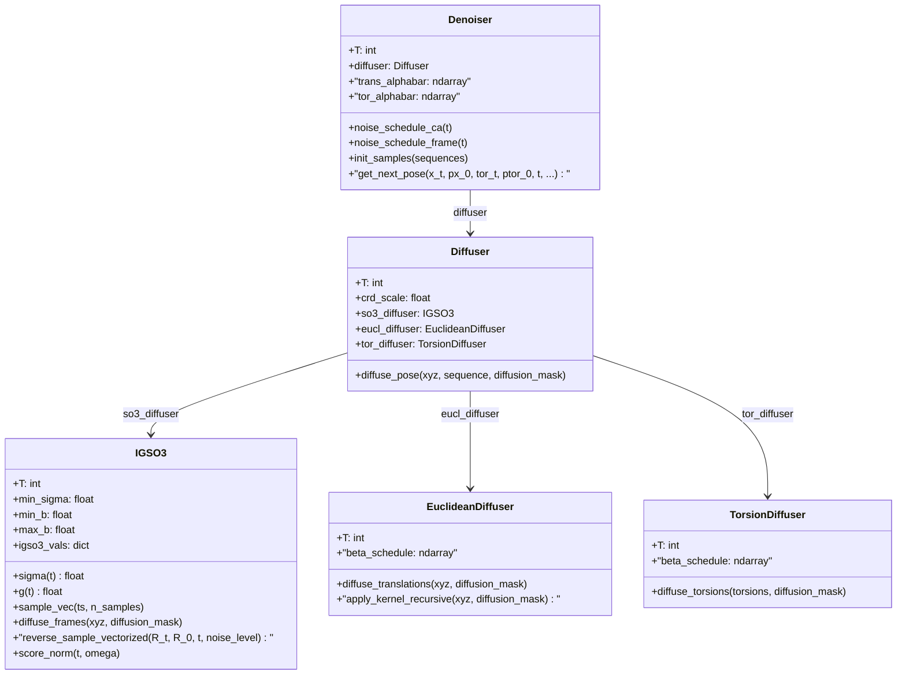
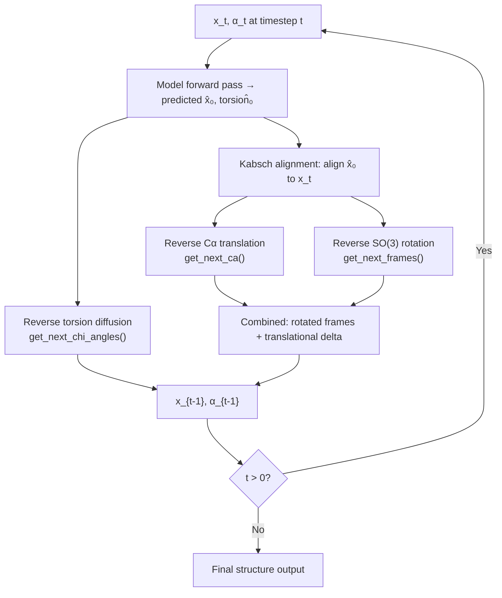

---
slug:6-se-3-backbone-diffusion
blog_type:normal
---

IDPForge 通过逆转 **SE(3)** 流形上的结构化扩散过程来生成内禀无序蛋白构象体——该流形是控制主链原子放置的刚体变换群（旋转 + 平移）。IDPForge 并未将原始笛卡尔坐标作为整体的 ℝ³ᴺ 问题进行扩散，而是**将 SE(3) 分解为其旋转群 SO(3) 和平移群 ℝ³**，在 SO(3) 上应用各向同性高斯分布（IGSO(3)）处理主链帧旋转，并使用标准高斯核处理 Cα 平移。这种分解在加噪和去噪过程中均保持了肽帧的几何结构，从而在每个时间步产生物理上合理的中间态。侧链扭转角（SO(2)⁴）上的第三个扩散通道并行运行，完成了完整的主链与侧链生成过程。

## 数学基础

SE(3) 群是半直积 **SE(3) = SO(3) ⋊ ℝ³**，这意味着每个刚体变换都可分解为旋转 R ∈ SO(3) 和随后的平移 t ∈ ℝ³。IDPForge 利用了这一点，定义了三个独立的扩散通道，它们在前向过程中联合应用，并在逆向推理中按序组合：

| 通道 | 流形 | 分布 | 参数 | 实现 |
|---------|----------|-------------|------------|----------------|
| **主链旋转** | SO(3) | IGSO(3) — 各向同性高斯 | σ(t) 调度: min_σ=0.05, min_b=1.5, max_b=2.5 | `IGSO3` 类 |
| **Cα 平移** | ℝ³ | 各向同性高斯 (DDPM) | 线性 β 调度: β₀=0.01, β_T=0.06–0.08 | `EuclideanDiffuser` 类 |
| **侧链扭转** | SO(2)⁴ | 包裹高斯 | 线性 β 调度: β₀=0.01, β_T=0.06 | `TorsionDiffuser` 类 |

具有方差参数 t 的旋转角 ω 处的 IGSO(3) 密度，通过截断幂级数计算（Leach 等人, 2022, 公式 5）：

**f(ω, t) = Σ_{l=0}^{L} (2l+1) · exp(−l(l+1)t/2) · sin(ω(l+½)) / sin(ω/2)**

其中 L=2000 为截断级别，重参数化 σ = √2·ε 将 IGSO(3) 与 SO(3) 上标准内积 ⟨u, v⟩_SO3 = Trace(uvᵀ)/2 下的布朗运动对齐。

来源: [igso3_utils.py](/idpforge/utils/igso3_utils.py#L42-L64), [diff_utils.py](/idpforge/utils/diff_utils.py#L303-L314)

## 架构：扩散层次结构

扩散系统被组织为类层次结构，顶层 `Diffuser` 编排三个子扩散器，而 `Denoiser` 协调逆向过程。下图展示了归属与数据流关系：

`Diffuser` 由总时间步数 T（默认为 200）和每个通道的调度参数构建。每个子扩散器在初始化时预计算其噪声调度。`Denoiser` 封装了 `Diffuser`，并额外预计算了逆向后验分布所需的累积 alpha-bar 调度。

来源: [diff_utils.py](/idpforge/utils/diff_utils.py#L491-L517), [diff_utils.py](/idpforge/utils/diff_utils.py#L574-L607)

## 前向过程：对蛋白质结构加噪

前向扩散通过 T 个序列步将真实蛋白质结构转化为噪声。`diffuse_pose` 方法通过将输入坐标分解为帧、平移和扭转角，然后独立应用每个子扩散器来编排此过程。

### 帧提取

主链帧（旋转矩阵）通过 Gram-Schmidt 正交化从每个残基的 N–Cα–C 原子中提取。给定主链原子 N, Cα, C 的坐标，旋转矩阵 R 构造如下：

- **e₁** = (C − Cα) / ‖C − Cα‖  
- **e₂** = normalize((N − Cα) − ⟨N − Cα, e₁⟩·e₁)  
- **e₃** = e₁ × e₂  
- **R** = [e₁ | e₂ | e₃]

这为每个残基产生一个 SO(3) 元素，编码了局部主链方向。

### 基于 IGSO(3) 的旋转扩散

在每个时间步 t，使用在预计算离散分布上的逆 CDF 采样从 IGSO(3) 中采样旋转向量。采样旋转通过左乘应用于真实帧：**R_perturbed = R_sampled · R_true**。扰动的坐标通过围绕 Cα 旋转局部主链原子来重建：**xyz_perturbed = R_sampled · (xyz − Cα) + Cα**。

### 平移扩散

Cα 位置通过具有线性 β 调度的标准 DDPM 前向核加噪。在每个步 t，该核应用：**x_t = √(1−β_t) · x_{t−1} + √β_t · ε**，其中 ε ~ N(0, I)。`apply_kernel_recursive` 方法应用此过程 T 次，累积平移增量。坐标在加噪前按 `crd_scale=0.25` 缩放，以标准化空间尺度。

### 组合加噪输出

最终扩散主链是旋转扰动坐标与累积平移位移之和：**diffused_BB = diffused_frame_crds + cumsum(deltas)**。刚体变换被组装成 4×4 齐次矩阵，同时编码旋转和 Cα 位置。

来源: [diff_utils.py](/idpforge/utils/diff_utils.py#L519-L570), [np_utils.py](/idpforge/utils/np_utils.py#L194-L210), [diff_utils.py](/idpforge/utils/diff_utils.py#L426-L451), [diff_utils.py](/idpforge/utils/diff_utils.py#L216-L254)

## 逆向过程：去噪生成结构

逆向过程通过从 T→0 迭代去噪来重建蛋白质结构。`Denoiser.get_next_pose` 方法实现了一个逆向步，获取当前加噪状态 x_t 和网络预测 x̂₀ 以产生 x_{t−1}。

### 逐步逆向流水线

### Kabsch 对齐

在去噪之前，预测结构 x̂₀ 使用 Kabsch 算法（基于 SVD 的最优旋转）与当前加噪状态 x_t 对齐。这消除了会破坏逐残基更新的虚假全局旋转。当存在模板（折叠基序）时，对齐仅使用基序残基作为锚点。

来源: [diff_utils.py](/idpforge/utils/diff_utils.py#L25-L53), [diff_utils.py](/idpforge/utils/diff_utils.py#L622-L684)

### 逆向平移（Cα 坐标）

逆向平移步使用标准 DDPM 后验。给定加噪的 Cα 位置 x_t 和预测的干净位置 x̂₀，后验均值和方差为：

- **μ = (√ᾱ_{t−1} · β_t)/(1−ᾱ_t) · x̂₀ + (√(1−β_t) · (1−ᾱ_{t−1}))/(1−ᾱ_t) · x_t**
- **σ = (1−ᾱ_{t−1})/(1−ᾱ_t) · β_t**

下一个 Cα 采样为 **x_{t−1} ~ N(μ, σ·noise_scale)**，其中 `noise_scale` 遵循可配置调度，可在推理步中从 `noise_scale_ca=0.2` 退火至 `final_noise_scale_ca=1.0`。然后将平移增量统一应用于所有五个主链原子（N, Cα, C, O, Cβ）。

### 逆向旋转（基于 IGSO(3) 分数）

逆向旋转步在 `IGSO3.reverse_sample_vectorized` 中实现。它使用预测的干净旋转 R₀ 近似 IGSO(3) 分数：

1. **计算相对旋转**：R_{0t} = R_t · R₀ᵀ（从当前到预测的旋转）
2. **提取旋转向量**：ω = ‖Log(R_{0t})‖, axis = Log(R_{0t})/ω
3. **近似分数**：s ≈ (score_norm(t, ω)/ω) · Log(R_{0t})，其中 score_norm 从预计算值中插值
4. **离散化逆向 SDE**：Δ_r = g(t)² · Δt · s, Perturb = Exp(Δ_r + g(t)·√Δt · Z)

漂移系数 g(t) = √(dσ²/dt) 通过对 σ 调度的自动微分计算。将生成的旋转 `Perturb` 应用于围绕 Cα 的当前坐标。

### 噪声调度配置

推理噪声调度对平移和旋转是独立可配置的，允许不对称退火策略：

| 参数 | 默认值 | 用途 |
|-----------|---------|---------|
| `noise_scale_ca` | 0.2 | t=T 时的初始 Cα 噪声尺度 |
| `final_noise_scale_ca` | 1.0 | t=0 时的最终 Cα 噪声尺度 |
| `noise_scale_frame` | 1.0 | 初始帧（SO(3)）噪声尺度 |
| `final_noise_scale_frame` | 0.0 | 最终帧噪声尺度（t=0 时确定性） |

当 `final_noise_scale_frame=0` 时，旋转更新在最后几步变为确定性，产生更锐利的主链几何。CA 噪声调度在“恒定”（若 final=0）到“线性”之间转换。

来源: [diff_utils.py](/idpforge/utils/diff_utils.py#L78-L124), [diff_utils.py](/idpforge/utils/diff_utils.py#L126-L160), [diff_utils.py](/idpforge/utils/diff_utils.py#L454-L488), [diff_utils.py](/idpforge/utils/diff_utils.py#L574-L607)

## IGSO(3) 预计算与缓存

IGSO(3) 幂级数及其导数的数值计算成本高昂。`calculate_igso3` 函数在离散化的 σ 值网格（500 个点，从 min_σ 到 max_σ 指数间隔）和 ω 值网格（1000 个点，从 0 到 π 线性间隔）上预计算四个查找表：

| 量 | 计算 | 用法 |
|----------|-------------|-------|
| **CDF** | `igso3_density_angle` 的累加和 | 前向扩散中的逆 CDF 采样 |
| **分数范数** | 通过对 log(f) 的自动微分求 `d_logf_d_omega` | 逆向扩散中的分数近似 |
| **期望分数范数** | √(E[‖score‖²]) | 诊断/归一化 |
| **离散 σ/ω 网格** | 指数和线性间隔 | 插值索引 |

这些值作为 pickle 文件（例如 `data/diff_igso3.pkl`）缓存，并在后续运行时加载，消除了重复计算。σ 调度使用指数离散化：**σ_n = min_σ^(1−n/N) · max_σ^(n/N)**，确保在分布最尖锐的低噪声级别处具有精细分辨率。

来源: [igso3_utils.py](/idpforge/utils/igso3_utils.py#L88-L132), [diff_utils.py](/idpforge/utils/diff_utils.py#L324-L334)

## 旋转扩散的 σ(t) 调度

IGSO(3) 噪声级别遵循时间二次调度，控制旋转噪声增加的速率：

**σ(t) = min_σ + t · min_b + t² · (max_b − min_b) / 2**

默认参数为 min_σ=0.05, min_b=1.5, max_b=2.5。此调度确保 σ(0)=min_σ（在 t=0 时接近恒等变换），并提供平滑、单调递增的噪声级别。逆向 SDE 的相应漂移系数为：

**g(t) = √(dσ²/dt) = √(2σ(t) · σ'(t))**

通过 PyTorch autograd 计算。此调度至关重要：噪声增加过激会导致 IGSO(3) 分布过早坍缩为 SO(3) 上的均匀分布，从而丢失结构信息；过于保守则没有足够的噪声来实现多样化采样。

来源: [diff_utils.py](/idpforge/utils/diff_utils.py#L354-L372)

## 初始化：从先验中采样

在逆向推理开始时（t=T），结构通过 `init_sample` 从噪声分布中初始化。该函数执行以下操作：

1. 从残基特异模板（`backbone_atom_positions`）放置理想主链原子位置
2. 采样随机 Cα 平移：**t ~ N(0, I/crd_scale²)**，在缩放空间中提供均匀分布的位置
3. 从 t=T 时的 IGSO(3) 采样随机旋转：**R ~ IGSO(3; I₃, σ(T)²)**，给出均匀分布的方向
4. 应用采样的刚体变换：**xyz = R · xyz_local + t**
5. 采样随机扭转角：**χ ~ Unif([−π, π))**，编码为 (sin χ, cos χ)

对于带有折叠模板的 IDR 采样，模板残基固定在其天然坐标处，并从初始噪声中排除，`diffusion_mask` 控制哪些残基参与扩散。

来源: [diff_utils.py](/idpforge/utils/diff_utils.py#L187-L202), [definitions.py](/idpforge/utils/definitions.py#L27-L32)

## 与 IDPForge Transformer 网络的集成

SE(3) 扩散过程通过 `IDPForge.recon` 方法与神经网络紧密耦合，该方法编排了完整的逆向推理循环。在每个去噪步：

1. **时间步嵌入**：当前时间步 t 通过固定的正弦位置编码（32 维）嵌入，与 8 维扭转特征向量（4 个 χ 角的 sin/cos）拼接，并通过 `esm_s_mlp` 投影，产生初始逐残基状态 s_s₀。

2. **成对几何编码**：加噪的主链坐标 x_t 通过 `xyz_to_t2d` 转换为二维距离与方向表示，计算 Cβ–Cβ 距离（在 32 个箱上独热编码）、RBF 特征和三个角特征（ω, θ, φ 二面角）。这通过 `z_mlp` 投影形成初始成对状态 s_z₀。

3. **主干预测**：ESMFold 主干通过其注意力块和结构模块处理 (s_s₀, s_z₀)，输出预测的干净坐标 x̂₀ 和扭转角 α̂₀。

4. **去噪步**：`denoiser.get_next_pose` 从 (x_t, x̂₀, α_t, α̂₀) 计算 x_{t−1} 和 α_{t−1}。

5. **自条件化**：启用时，上一步的输出作为 `prev_outputs` 反馈，提供循环式精炼，改善预测质量，特别是在中间噪声级别。

6. **模板固定**：对于 IDR 采样，模板残基完全绕过扩散——其时间步设为 0，其坐标/扭转角在每步被模板值覆盖。

推理循环从 t=T−1 迭代至 `end_tsteps`（默认 −1，即步 0），步长由 `n_tsteps/n_tsteps_inf` 控制以允许子步进（例如，200 训练步 → 40 推理步 = 每 5 步执行一次）。

来源: [model.py](/idpforge/model.py#L155-L208), [model.py](/idpforge/model.py#L79-L153), [tensor_utils.py](/idpforge/utils/tensor_utils.py#L197-L219)

## 训练数据准备

训练期间，`DiffDataset.__getitem__` 方法通过 `diffuser.diffuse_pose` 对每个训练结构应用完整前向扩散，产生从 t=0 到 t=T 加噪状态的完整轨迹。时间步 T 以线性权重（p(t) ∝ t）采样，使训练偏向较高噪声级别，在这些级别模型必须做出更大校正。数据集返回当前状态 (x_t, α_t) 以及用于自条件化的下一状态 (x_{t+1}, α_{t+1})，连同用于损失计算的真实帧和扭转角。

来源: [loader.py](/idpforge/loader.py#L48-L99)

## 简并处理与数值稳定性

实现包含多项针对在 SO(3) 上操作时出现的数值简并的安全措施：

- **简并旋转矩阵**：当 `rigid_from_3_points_np` 产生 |det(R)| < 10⁻⁶ 的矩阵（由共线 N–Cα–C 原子引起）时，在 SVD 分解前将其替换为单位矩阵。
- **SVD 收敛失败**：`align_coords` 和 `reverse_sample_vectorized` 均捕获 scipy SVD 的 `LinAlgError`，回退到单位旋转（不应用更新）。
- **除以 ω**：分数计算除以旋转角 ω，对于接近恒等的旋转，该值趋近于零。使用 10⁻⁶ 的 epsilon 作为下限：`Omega[Omega == 0] = eps`。
- **右手性强制**：Kabsch 对齐显式检查 `det(R)` 并在 U 的最后一列为负时翻转该列，确保真旋转（det=+1）而非反射。

来源: [diff_utils.py](/idpforge/utils/diff_utils.py#L133-L145), [diff_utils.py](/idpforge/utils/diff_utils.py#L459-L467), [diff_utils.py](/idpforge/utils/diff_utils.py#L44-L46)

<CgxTip>IDPForge 中的 SE(3) 分解不仅是一种计算上的便利——它在架构上具有重要意义。通过 IGSO(3) 在 SO(3) 上扩散旋转，而非在 ℝ³ 中扰动笛卡尔坐标，模型确保每个中间主链帧都是有效的旋转矩阵。这消除了“帧漂移”问题，即朴素扩散的坐标可能产生非物理的键角和肽平面方向，这对于没有强结构先验约束去噪轨迹的高度柔性 IDP 主链尤为关键。</CgxTip>

<CgxTip>推理噪声不对称——`noise_scale_frame` 退火至 0（确定性旋转）而 `noise_scale_ca` 退火至 1.0（随机平移）——反映了一种深思熟虑的设计选择：主链方向应锐利地收敛至网络预测，而 Cα 位置保留随机多样性。这产生具有一致局部几何但全局构象展宽的系综，符合 IDP 的物理现实，即局部肽几何明确而长程结构高度可变。</CgxTip>

## 下一步

SE(3) 主链扩散是三个相互交联的扩散通道之一。欲深入了解旋转组件，请参阅 [SO(3) 旋转扩散](7-so-3-rotational-diffusion)；关于侧链通道，请参阅 [扭转角扩散](8-torsion-angle-diffusion)。完整的推理流水线记录于 [IDP 采样（完全无序）](12-idp-sampling-fully-disordered) 和 [带折叠模板的 IDR 采样](13-idr-sampling-with-folded-templates)。训练时加噪涵盖于 [数据加载与加噪](11-data-loading-and-noising)。