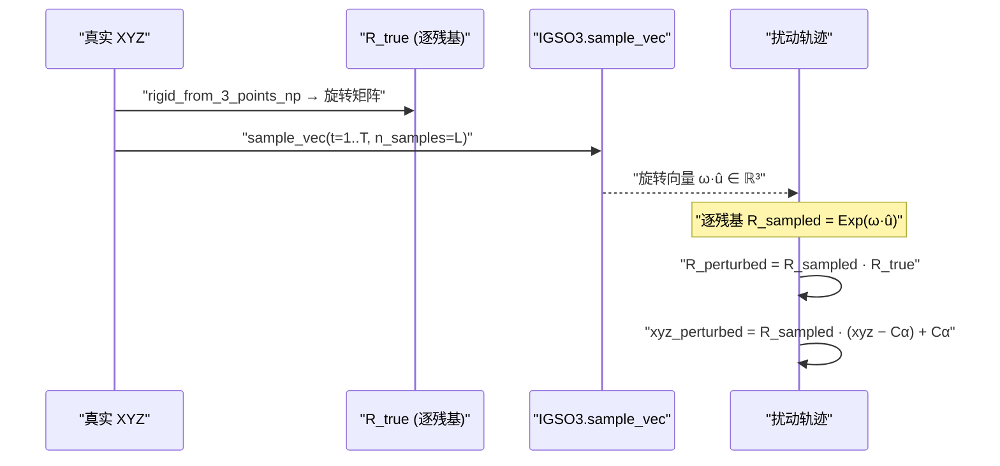
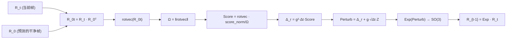
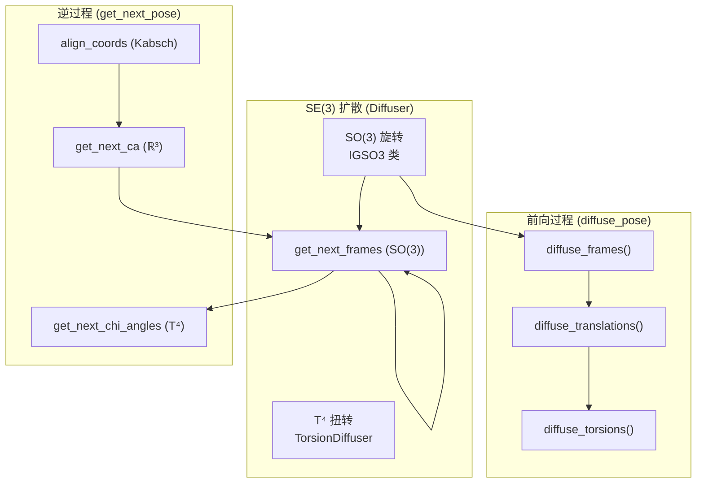

---
slug:7-so-3-rotational-diffusion
blog_type:normal
---


IDPForge 通过 SO(3) 上的各向同性高斯分布（缩写为 **IGSO(3)**），对主链残基帧在 **SO(3) 旋转群**上的随机演化进行建模。IGSO(3) 是更广泛的 SE(3) 扩散过程的旋转分量；该过程在训练期间联合破坏平移和旋转，并在推理期间逆转该破坏过程，从而生成本质无序蛋白构象体。其实现清晰地分为两层：`igso3_utils.py` 中的**纯数学原语**（流形映射、密度函数、分数场）以及 `diff_utils.py` 中的**操作类** `IGSO3`（预计算查找表、前向加噪、反向采样）。二者共同为旋转流形上的布朗运动扩散提供了一种数值稳定、由预计算表驱动的方法。

来源：[igso3_utils.py](idpforge/utils/igso3_utils.py#L1-L133), [diff_utils.py](idpforge/utils/diff_utils.py#L303-L488)

## 数学基础

SO(3) 群——即所有 3×3 正常旋转矩阵的集合——是一个具有丰富几何结构的紧李群。IDPForge 通过一系列规范映射将该群与其李代数以及 ℝ³ 中的旋转向量联系起来，并充分利用了这一结构。这些映射构成了后续所有操作（加噪、打分和反向采样）的骨干。

来源：[igso3_utils.py](idpforge/utils/igso3_utils.py#L18-L40)

### 李代数映射

**帽子映射** `hat(v)` 将向量 **v** ∈ ℝ³ 提升为斜对称矩阵 **v̂** ∈ so(3)，即 SO(3) 的李代数。它是无穷小生成元：对于任意旋转向量 **ω**，矩阵指数 `exp(hat(ω))` 可生成对应的旋转矩阵。该实现直接由向量分量构造 3×3 斜对称矩阵，并通过转置强制反对称性：

```python
hat_v[:, 0, 1], hat_v[:, 0, 2], hat_v[:, 1, 2] = -v[:, 2], v[:, 1], -v[:, 0]
return hat_v + -hat_v.transpose(2, 1)
```

两个指数-对数桥接函数将旋转向量与旋转矩阵联系起来：

| 映射 | 签名 | 方向 | 机制 |
|-----|-----------|-----------|-----------|
| `Log(R)` | SO(3) → ℝ³ | 矩阵 → 旋转向量 | `Rotation.from_matrix(R).as_rotvec()` |
| `log(R)` | SO(3) → so(3) | 矩阵 → 斜对称矩阵 | `hat(Log(R))` |
| `Exp(A)` | ℝ³ → SO(3) | 旋转向量 → 矩阵 | `Rotation.from_rotvec(A).as_matrix()` |

这些函数委托给 `scipy.spatial.transform.Rotation` 进行稳健的数值转换，并通过类型分派同时支持 NumPy 数组和 PyTorch 张量。

来源：[igso3_utils.py](idpforge/utils/igso3_utils.py#L21-L40)

### IGSO(3) 密度

**SO(3) 上的各向同性高斯**是旋转群上布朗运动的热核。它由方差 **t**（映射至扩散时间）参数化，其相对于 Haar 测度的密度可通过 **Peter-Weyl 定理** 分解为整数格 ℓ ∈ ℕ 上的截断傅里叶级数：

$$f(\omega, t) = \sum_{\ell=0}^{L} (2\ell+1) \, e^{-\ell(\ell+1)t/2} \, \frac{\sin((\ell+\frac{1}{2})\omega)}{\sin(\omega/2)}$$

其中 **ω** 为旋转角（即 SO(3) 上到恒等元的测地距离）。函数 `f_igso3` 计算该截断和，默认截断项数为 **L = 2000**。一个关键的重新参数化注意点：相对于 Leach 等人 (2022) 的约定，IDPForge 使用 **σ = √2 · ε**，从而使 IGSO(3) 与标准布朗运动内积 ⟨u, v⟩_SO3 = Tr(uvᵀ)/2 保持一致。

**角度边际密度**——即旋转角 ω 相对于 [0, π] 上勒贝格测度的密度——包含了 SO(3) 体积形式因子 `(1 − cos ω)/π`：

```python
def igso3_density_angle(omega, t, L=2000):
    return f_igso3(torch.tensor(omega), t, L).numpy() * (1 - np.cos(omega)) / np.pi
```

来源：[igso3_utils.py](idpforge/utils/igso3_utils.py#L42-L76)

### SO(3) 分数函数

逆时扩散需要**分数** ∇_R log p(R; I, t)——即对数密度相对于旋转矩阵的梯度。在 SO(3) 上，该分数可分解为**标量分数范数**乘以沿旋转轴方向的**单位方向向量**：

```python
def igso3_score(R, t, L=2000):
    omega = Omega(R)
    unit_vector = np.einsum('Nij,Njk->Nik', R, log(R)) / omega[:, None, None]
    return unit_vector * d_logf_d_omega(omega, t, L)[:, None, None]
```

标量导数 `d_logf_d_omega` 通过 PyTorch 的 autograd 对 `log(f_igso3)` 计算求得，无需手动求导即可保证数值精度。旋转角提取 `Omega(R)` 计算基于 Frobenius 范数的测地距离：`||log(R)||_F / √2`。

来源：[igso3_utils.py](idpforge/utils/igso3_utils.py#L66-L86)

## IGSO3 操作类

`IGSO3` 类将上述解析公式转换为**预计算查找表系统**，使得前向加噪和反向采样在推理时均十分快速。这至关重要，因为在每个去噪步骤中为每个残基评估截断级数及其基于 autograd 的分数导数的计算成本极其高昂。

来源：[diff_utils.py](idpforge/utils/diff_utils.py#L303-L488)

### 预计算策略

在初始化时，`IGSO3` 调用 `calculate_igso3` 来填充一个离散量字典，该字典基于由 **500 个 sigma 值**（从 `min_sigma=0.05` 到 `max_sigma=σ(1.0)` 指数间隔分布）和 **1000 个 omega 值**（在 (0, π] 中线性间隔分布）构成的网格：

| 键 | 形状 | 内容 |
|-----|-------|---------|
| `cdf` | (500, 1000) | 每个 σ 对应的累积分布函数值 |
| `score_norm` | (500, 1000) | 每个 σ 对应的 ∂/∂ω log f(ω, σ²) |
| `exp_score_norms` | (500,) | 每个 σ 下的期望 ‖score‖ |
| `discrete_omega` | (1000,) | ω 网格点 |
| `discrete_sigma` | (500,) | σ 网格点（指数调度） |

σ 的指数噪声调度定义为 `discrete_sigma[n] = min_eps^(1−n/N) · max_eps^(n/N)`，这与逆 SDE 仿真的缩放密切相关。结果可通过 pickle 缓存至磁盘以便跨运行复用——训练配置引用 `data/diff_igso3.pkl` 作为缓存路径。

来源：[igso3_utils.py](idpforge/utils/igso3_utils.py#L88-L132), [diff_utils.py](idpforge/utils/diff_utils.py#L306-L335)

### Sigma 调度与漂移系数

连续的 **sigma 调度** 通过二次多项式将归一化时间 t ∈ [0, 1] 映射到噪声规模：

```python
def sigma(self, t):
    return self.min_sigma + t * self.min_b + (t**2) * (self.max_b - self.min_b) / 2
```

默认值为 `min_b=1.5`，`max_b=2.5`。**漂移系数** `g(t)`——控制逆 SDE 中噪声幅值——通过 autograd 由 σ²(t) 求导得出：

```python
def g(self, t):
    sigma_sqr = self.sigma(t) ** 2
    grads = torch.autograd.grad(sigma_sqr.sum(), t)[0]
    return np.sqrt(grads.detach().numpy())
```

来源：[diff_utils.py](idpforge/utils/diff_utils.py#L354-L372)

### 索引映射

两种索引映射方法将连续时间桥接至预计算表：

- **`sigma_idx(σ)`**——使用 `np.digitize` 定位最近的预计算 sigma 索引。
- **`t_to_idx(t)`**——复合 `sigma_idx ∘ sigma(t/T)`，从离散扩散时间步映射至表行。

来源：[diff_utils.py](idpforge/utils/diff_utils.py#L345-L352)

## 前向过程：帧加噪

前向扩散通过将每个残基的真实旋转矩阵 **R_true** 与 IGSO(3) 采样的扰动进行复合，来破坏真实的主链帧。`diffuse_frames` 方法实现了跨越所有 T 个时间步的完整前向轨迹：



核心洞察在于**旋转是围绕每个残基自身的 Cα 中心施加的**——局部帧原地旋转，保留了平移分量。该方法返回扰动后的坐标（形状为 `[T+1, L, 5, 3]`，包括 t=0 处的原始坐标）和扰动后的旋转矩阵，这些矩阵随后由父 `Diffuser.diffuse_pose` 方法堆叠成 4×4 刚体矩阵。`diffusion_mask` 选择性地将保留（ motif ）残基的采样旋转置零。

来源：[diff_utils.py](idpforge/utils/diff_utils.py#L426-L451), [diff_utils.py](idpforge/utils/diff_utils.py#L519-L570)

### 从 IGSO(3) 采样

存在两种互补的采样方法：

- **`sample(ts, n_samples)`**——通过逆 CDF 插值对照预计算的 `cdf` 表抽取旋转**角度** ω，然后返回这些角度。
- **`sample_vec(ts, n_samples)`**——扩展 `sample`，将采样角度乘以均匀随机的单位轴方向 û ∈ S²，生成完整的 ℝ³ 旋转向量，以备 `Exp()` 转换。

来源：[diff_utils.py](idpforge/utils/diff_utils.py#L374-L392)

## 逆过程：帧去噪

逆扩散步骤是构象生成的计算核心。给定当前加噪帧 **R_t** 和模型预测的干净帧 **R_0**，`reverse_sample_vectorized` 计算单步逆时更新，使帧分布更接近数据流形。

来源：[diff_utils.py](idpforge/utils/diff_utils.py#L454-L488)

### 逆采样算法

该方法分四个阶段进行：

**1. 相对旋转。** 计算从当前帧到预测干净帧的旋转：`R_0t = R_t · R_0ᵀ`。退化矩阵（含 NaN 条目）在通过 `scipy_R.from_matrix` 转换为旋转向量之前，会被替换为单位矩阵。

**2. 分数近似。** 使用预测的 R_0 作为数据分布的代理，近似 IGSO(3) 转移密度的分数：

```python
Omega = np.linalg.norm(R_0t_rotvec, axis=-1)
Score_approx = R_0t_rotvec * (self.score_norm(t, Omega) / Omega)[..., None]
```

`score_norm` 方法利用时间索引的 sigma 和观测到的旋转角，对预计算的 `score_norm` 表执行双线性插值。

**3. 漂移与噪声缩放。** 确定性漂移项 `Δ_r = g(t)² · Δt · Score_approx` 沿分数场移动，而随机噪声 `g(t) · √Δt · Z`（其中 Z ∼ N(0, I₃)）则保持分布的正确性。`noise_level` 参数对 Z 进行全局缩放，从而实现退火去噪调度。

**4. 指数映射。** 组合后的切空间扰动通过 `Exp(Perturb_tangent)` 映射回 SO(3)，生成此步需要应用的旋转矩阵。



来源：[diff_utils.py](idpforge/utils/diff_utils.py#L454-L488)

### 与主链坐标的整合

函数 `get_next_frames` 协调完整的逐残基逆向步骤。它使用 `rigid_from_3_points_np`（由 N–Cα–C 骨架原子构造正交帧）从当前加噪坐标 `x_t` 和预测干净坐标 `p_x0` 中提取旋转矩阵，对退化矩阵进行清理，委托调用 `reverse_sample_vectorized`，然后围绕每个 Cα 中心应用返回的旋转矩阵：

```python
next_crds = np.einsum("...ij,...aj->...ai", all_rot_transitions,
                      xt - Ca_t[..., None, :]) + Ca_t[..., None, :]
```

非扩散残基（受 `diffusion_mask` 控制）保留单位旋转，确保 motif 区域在 IDR 采样期间保持固定。

来源：[diff_utils.py](idpforge/utils/diff_utils.py#L126-L160), [np_utils.py](idpforge/utils/np_utils.py#L194-L210)

## 最大噪声下的初始化

在推理开始时，构象体在**最大噪声水平** t = T 处初始化。函数 `init_sample` 将每个残基置于原点并赋予理想的主链几何结构，随后：

1. **平移**——从 N(0, I₃/crd_scale) 中采样，其中 `crd_scale=0.25`（等效于 σ = 4 Å）。
2. **旋转**——在时间 T 通过 `so3_diffuser.sample_vec([T], n_samples=L)` 从 IGSO(3) 中采样，然后通过 `Exp` 应用以旋转每个残基的局部帧。
3. **扭转角**——在 [−π, π) 中均匀采样 sin/cos 对。

这产生了一个完全无结构的起始状态，逆向过程将从此状态逐步解析出类天然的主链几何结构。

来源：[diff_utils.py](idpforge/utils/diff_utils.py#L187-L202)

## 编排：Diffuser 与 Denoiser

`Diffuser` 类聚合了所有三个扩散通道——SO(3) 旋转（`IGSO3`）、ℝ³ 平移（`EuclideanDiffuser`）和扭转角（`TorsionDiffuser`）——为统一的 `diffuse_pose` 方法，该方法返回加噪坐标、刚体矩阵和扭转角的完整前向轨迹。`Denoiser` 类封装了 `Diffuser` 并提供 `get_next_pose`，其在每个逆向时间步：

1. 通过 Kabsch 算法将预测的 p_x0 **对齐**至 x_t（遵循 motif 掩码）。
2. 通过 `get_next_ca`（高斯逆向核）**更新平移**。
3. 通过 `get_next_frames`（IGSO(3) 逆采样）**更新旋转**。
4. 通过 `get_next_chi_angles`（包裹高斯逆向核）**更新扭转角**。
5. 将平移增量与旋转坐标**复合**。

噪声退火由两个独立的调度控制：用于平移的 `noise_schedule_ca` 和用于旋转的 `noise_schedule_frame`，二者均支持 `constant` 或 `linear` 衰减模式。

来源：[diff_utils.py](idpforge/utils/diff_utils.py#L491-L685)

## 配置参数

SO(3) 扩散由 YAML 配置的 `diffuse` 部分中设置的参数控制。请注意，IGSO(3) 特定参数（`min_sigma`、`min_b`、`max_b`、`num_omega`）使用 `IGSO3` 构造函数中的硬编码默认值，而非配置项。

| 参数 | 默认值 (训练) | 默认值 (采样) | 描述 |
|-----------|----------------|------------------|-------------|
| `n_tsteps` | 200 | 200 | 总扩散时间步 T |
| `n_tsteps_inf` / `inference_steps` | 40 | 40 | 逆过程子步（步长 = T/inf） |
| `euclid_b0` | 0.01 | 0.01 | 平移 β 调度起点 |
| `euclid_bT` | 0.08 | 0.06 | 平移 β 调度终点 |
| `torsion_b0` | 0.01 | 0.01 | 扭转 β 调度起点 |
| `torsion_bT` | 0.06 | 0.06 | 扭转 β 调度终点 |
| `min_sigma` *(硬编码)* | 0.05 | 0.05 | IGSO(3) 最小噪声规模 |
| `min_b` *(硬编码)* | 1.5 | 1.5 | σ(t) 线性系数 |
| `max_b` *(硬编码)* | 2.5 | 2.5 | σ(t) 二次系数 |
| `num_omega` *(硬编码)* | 1000 | 1000 | ω 离散化分辨率 |

来源：[configs/train.yml](configs/train.yml#L54-L60), [configs/sample.yml](configs/sample.yml#L43-L50), [diff_utils.py](idpforge/utils/diff_utils.py#L306-L314)

<CgxTip>在为新的蛋白质系统调整 IGSO(3) 参数时，`min_sigma=0.05` 的下限至关重要——将其设置得过低会导致在 ω=0 附近（此时 `sin(ω/2)` 趋近于零）的分数范数计算出现数值不稳定。每当 `min_sigma`、`min_b`、`max_b` 或 `num_omega` 发生更改时，必须重新生成预计算缓存（`diff_igso3.pkl`）。</CgxTip>

## 与 SE(3) 扩散的架构关系

SO(3) 旋转扩散作为完整 SE(3) = SO(3) ⋉ ℝ³ 扩散框架内的旋转分量运行。该分解呈**乘积结构**：旋转和平移独立地进行加噪与去噪，随后在坐标重建时进行复合。这不是一种简化——对于具有标准双不变度量的 SE(3) 上的布朗运动，其旋转与平移分量在统计上是独立的，这使得乘积分解是精确的。



SO(3) 分量与欧几里得及扭转分量的独特区别在于其**流形值分数计算**和**预计算表方法**——ℝ³ 和 T⁴ 扩散均不需要 CDF/分数范数预计算基础设施，因为它们的高斯核具有闭式逆向更新。

来源：[diff_utils.py](idpforge/utils/diff_utils.py#L491-L570), [diff_utils.py](idpforge/utils/diff_utils.py#L622-L684)

<CgxTip>`Denoiser` 构造函数中的 `noise_scale_frame` 参数（默认=1，最终=0）控制 `reverse_sample_vectorized` 中随机噪声项 Z 的退火调度。设置 `final_noise_scale_frame=0` 可在最后几步实现确定性逆采样，这在保持早期随机探索的同时，提高了后期去噪阶段的结构精度。</CgxTip>

## 下一步

SO(3) 旋转扩散是完整 SE(3) 主链过程的一个分量。要了解全貌：

- **[SE(3) 主链扩散](6-se-3-backbone-diffusion)**——旋转和平移如何组合为完整的刚体扩散
- **[扭转角扩散](8-torsion-angle-diffusion)**——完成逐残基自由度破坏的侧链扭转分量
- **[IDP 采样（完全无序）](12-idp-sampling-fully-disordered)**——逆向 SO(3) 过程如何驱动端到端构象体生成
- **[实验引导势](14-experimental-guidance-potentials)**——外部约束如何与基于分数的逆 SDE 交互