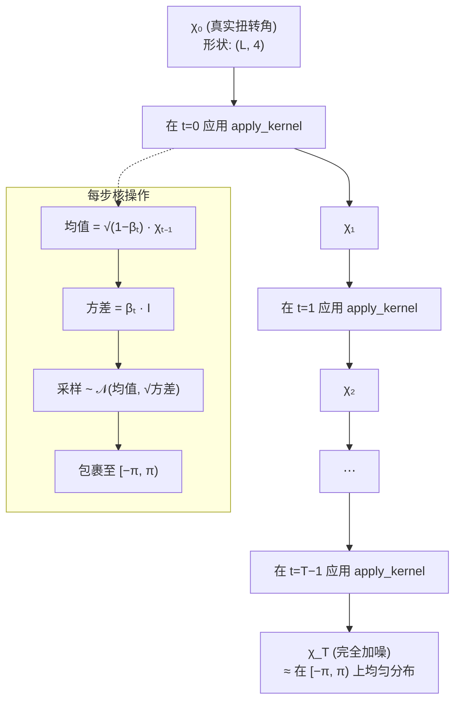
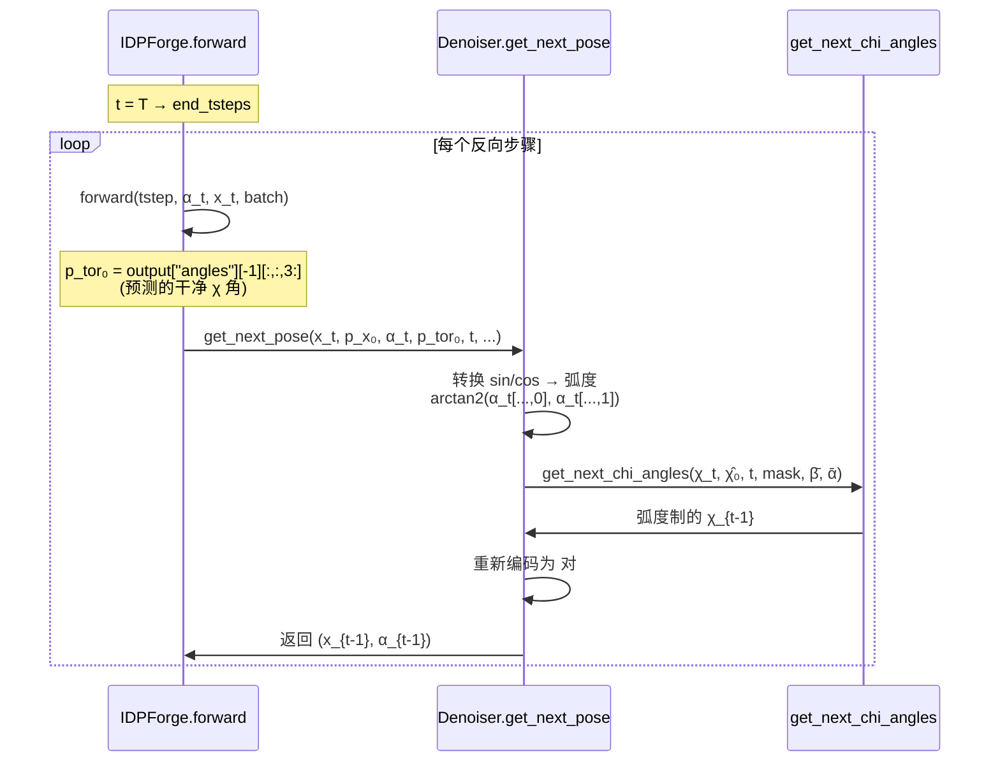

---
slug:8-torsion-angle-diffusion
blog_type:normal
---

扭转角扩散控制了 IDPForge 在其三组件扩散框架中如何逐步对侧链 χ₁–χ₄ 二面角进行加噪与恢复。不同于在笛卡尔坐标和旋转框架上操作的 [SE(3) 骨架扩散](6-se-3-backbone-diffusion) 和 [SO(3) 旋转扩散](7-so-3-rotational-diffusion) 通道，扭转扩散直接在角度域上进行操作——这使其成为最直接控制侧链旋转异构体身份的组件，进而决定了对于内禀无序蛋白系综至关重要的局部结构多样性。

## 数学基础

IDPForge 对扭转角采用了**保方差 扩散**过程，镜像了经典的 DDPM 公式，但将其适配至循环域 $[-\pi, \pi)$。在每个离散时间步 $t$，前向过程应用一个高斯加噪核，其均值向零收缩，方差根据线性 $\beta$-调度增长：

$$q(\chi_t \mid \chi_{t-1}) = \mathcal{N}\!\left(\chi_t;\; \sqrt{1 - \beta_t}\,\chi_{t-1},\; \beta_t \mathbf{I}\right)$$

经过 $t$ 步边缘化后，这得出了标准的闭式解：

$$q(\chi_t \mid \chi_0) = \mathcal{N}\!\left(\chi_t;\; \sqrt{\bar\alpha_t}\,\chi_0,\; (1 - \bar\alpha_t)\mathbf{I}\right)$$

其中 $\bar\alpha_t = \prod_{s=1}^{t}(1 - \beta_s)$。从该高斯分布中采样后，结果通过模映射 `wrap_rad(x) = mod(x + π, 2π) − π` 被**包裹** 至 $[-\pi, \pi)$ 内，确保加噪后的角度始终保留在圆上。这种包裹操作是区别于欧几里得扩散的关键所在——若无此操作，角度可能会漂移出有效域，从而破坏二面角的几何意义。

来源: [diff_utils.py](idpforge/utils/diff_utils.py#L20-L22), [diff_utils.py](idpforge/utils/diff_utils.py#L257-L299)

## 前向扩散：TorsionDiffuser

`TorsionDiffuser` 类封装了侧链扭转角的完整前向加噪轨迹。它由总时间步数 `T` 以及界限为 `b_0=0.01` 和 `b_T=0.06` 的线性 $\beta$-调度构建而成——其上界刻意设定得比欧几里得扩散器的上界 (0.08) 更窄，这反映出相较于 $\mathbb{R}^3$ 中的无界平移，扭转角只需更少的噪声便可在圆上达到近似均匀分布。

`apply_kernel` 方法执行单步加噪。它计算收缩均值 `sqrt(1 - b_t) * x`，从具有逐元素方差 `b_t` 的高斯分布中进行采样，随后包裹结果。两种掩码机制控制着哪些残基参与加噪：**`diffusion_mask`**（布尔型，形状 `(L, 4)`）冻结不应加噪的残基（例如，IDR 采样期间由模板固定的区域）；**`exists_mask`**（布尔型，形状 `(L, 4)`）将不存在的 chi 角设为 $-\pi$ 作为哨兵值——例如，丙氨酸仅有 $\chi_1$，因此 $\chi_2$–$\chi_4$ 会被掩码屏蔽。

`diffuse_torsions` 方法迭代调用 `apply_kernel` 共 `T` 步，将完整轨迹以形状为 `(T+1, L, 4)` 的数组返回。该轨迹由训练数据加载器消费，以生成配对的加噪/干净样本。

来源: [diff_utils.py](idpforge/utils/diff_utils.py#L257-L299), [diff_utils.py](idpforge/utils/diff_utils.py#L56-L76)

## 角度表示：Sin/Cos 单位圆编码

一个关键的实现细节是，扭转角在整个流程中**并非**以原始弧度存储。相反，它们被编码为 `(sin(χ), cos(χ))` 对——这种单位圆参数化消除了 $\pm\pi$ 处的不连续性，并提供了一种天然适合神经网络处理的表示。该编码出现在三个关键点：

| 流水线阶段 | 表示方式 | 形状 | 转换 |
|---|---|---|---|
| 前向扩散（内部） | 原始弧度 | `(L, 4)` | — |
| 存储于扩散轨迹中 | Sin/cos 对 | `(L, 4, 2)` | `stack(sin(χ), cos(χ), axis=-1)` |
| 模型输入 (`alpha_t`) | Sin/cos 对 | `(B, L, 8)` | 从 `(L, 4, 2)` 重塑为 `(L, 8)` |
| 反向扩散（内部） | 原始弧度 | `(L, 4)` | `arctan2(sin, cos)` |
| 去噪器输出 | Sin/cos 对 | `(L, 4, 2)` | `stack(sin(χ_next), cos(χ_next))` |

在初始化期间 (`init_sample`)，扭转角从 $\mathcal{N}(0, 1)$ 中采样并包裹至 $[-\pi, \pi)$，随后立即转换为 sin/cos 对。在反向扩散期间，`Denoiser.get_next_pose` 方法通过 `arctan2(tor_t[..., 0], tor_t[..., 1])` 将 sin/cos 对转换回原始弧度，应用去噪更新，然后对结果重新编码。这种往返转换是必要的，因为反向扩散中使用的高斯后验是在线性（弧度）域上操作的。

来源: [diff_utils.py](idpforge/utils/diff_utils.py#L187-L202), [diff_utils.py](idpforge/utils/diff_utils.py#L666-L679), [model.py](idpforge/model.py#L110-L111)

## 反向扩散：解析后验采样

反向步骤 `get_next_chi_angles` 实现了标准的 DDPM 解析后验。给定当前加噪状态 $\chi_t$、模型预测 $\hat\chi_0$ 以及预计算的 $\bar\alpha$ 调度，它计算：

$$\mu = \frac{\sqrt{\bar\alpha_{t-2}}\,\beta_{t-1}}{1 - \bar\alpha_{t-1}}\,\hat\chi_0 + \frac{\sqrt{1 - \beta_{t-1}}\,(1 - \bar\alpha_{t-2})}{1 - \bar\alpha_{t-1}}\,\chi_t$$

$$\sigma^2 = \frac{(1 - \bar\alpha_{t-2})}{(1 - \bar\alpha_{t-1})}\,\beta_{t-1}$$

下一个状态采样为 $\chi_{t-1} \sim \mathcal{N}(\mu, \sigma \cdot \text{noise\_scale})$ 并包裹至 $[-\pi, \pi)$。`noise_scale` 参数（与 CA 噪声调度绑定）允许**确定性退火**——随着反向过程趋近 $t=0$ 降低随机性，从而生成更锐利的最终结构。

复合**扭转扩散掩码**将残基层级的扩散掩码与逐角度的存在掩码结合：`torsion_mask & diffusion_mask[..., None]`。这确保了：(1) 模板固定的残基永不更新，以及 (2) 给定残基类型中不存在的 chi 角始终保持其哨兵值冻结。

来源: [diff_utils.py](idpforge/utils/diff_utils.py#L162-L185), [diff_utils.py](idpforge/utils/diff_utils.py#L666-L679)

## Chi 角提取与掩码

在扩散开始之前，必须从原子坐标中提取真实的 chi 角。`get_chi_angles` 函数利用 OpenFold 的 `chi_angles_atoms` 常量中定义的标准原子四元组，根据重原子位置计算二面角：

| Chi 角 | 原子序列 | 适用残基 |
|---|---|---|
| χ₁ | N, CA, CB, CG (或等效原子) | 所有非 Gly、非 Ala |
| χ₂ | CA, CB, CG, CD (或等效原子) | Asp, Asn, Leu, Ile 等 |
| χ₃ | CB, CG, CD, CE (或等效原子) | Glu, Gln, Met, Lys, Arg |
| χ₄ | CG, CD, CE, NZ (或等效原子) | Lys, Arg |

一个特殊情况处理异亮氨酸的 χ₂，由于其支链伽马碳，它使用原子 N, CA, CB, CG2（原子索引为 7 而非 6）。返回的 `torsion_mask`（形状 `(L, 4)`）为布尔类型，指示每个残基定义了四个 chi 角中的哪些。该掩码将传播至整个扩散流程，以防止对不存在的角度进行加噪或去噪。

来源: [np_utils.py](idpforge/utils/np_utils.py#L239-L285), [tensor_utils.py](idpforge/utils/tensor_utils.py#L5-L7)

## 与反向扩散循环的集成

`IDPForge.recon` 方法编排了从 $t = T$ 到 $t = 0$ 的完整反向扩散。在每一步中，模型从当前加噪状态预测干净的扭转角，随后 `Denoiser.get_next_pose` 方法在所有三个扩散通道上同时应用解析后验更新。此循环中扭转角特定部分的处理流程如下：

模型通过 `output["angles"][-1]` 预测**全部七个角对** (ω, φ, ψ, χ₁, χ₂, χ₃, χ₄)，但仅有 chi 角（索引 3 及以后）被馈送至扭转去噪器。骨架角 (ω, φ, ψ) 则通过 SE(3) 和 SO(3) 骨架扩散通道隐式恢复。这种关注点分离——通过框架扩散处理骨架几何，通过扭转扩散处理侧链旋转异构体——是 IDPForge 的核心架构原则。

当模板约束激活时（针对包含折叠区域的 IDR 采样），循环在每步中都会覆盖模板固定残基的坐标和扭转角，将其时间步设为 0 并用模板的干净值替换其加噪值。这确保了折叠结构域保持结构固定，而无序区域则自由生成。

来源: [model.py](idpforge/model.py#L155-L208), [diff_utils.py](idpforge/utils/diff_utils.py#L622-L684)

## 训练数据加噪

在训练期间，`DiffDataset` 通过 `Diffuser.diffuse_pose` 对每个训练结构应用完整的前向扩散。该方法按顺序排列三个扩散组件：(1) IGSO(3) 框架加噪，(2) 欧几里得平移加噪，(3) 扭转角加噪。扭转部分从输入坐标中提取 chi 角，使用组合的扩散与存在掩码应用 `TorsionDiffuser.diffuse_torsions`，并将结果编码为 sin/cos 对。

数据集以正比于 $\frac{1}{Z}(t)$ 的概率采样随机时间步 $T$（线性增加的权重偏向于更晚的时间步），随后同时返回 $\alpha_t$ 和 $\alpha_{t+1}$（后者用于训练下一步预测目标）。整理后的批次将这些数据作为 `alpha_t`（形状 `(B, L, 4, 2)`）与加噪坐标 `x_t` 一同馈入模型。

来源: [loader.py](idpforge/utils/../loader.py#L48-L99), [diff_utils.py](idpforge/utils/diff_utils.py#L519-L570)

## 损失监督

扭转扩散由 `torsion_loss` 函数监督，该函数计算两项：(1) ?测与真实 sin/cos@@对之间的**归一化角度误差** $\|\hat{a}_{\text{norm}} - a_{\text{true}}\|$，由逐角度的存在掩码屏蔽；(2) 一项微小的**范数正则化**惩罚（$\lambda = 0.02$），鼓励未归一化的角度预测位于单位圆上（$\|\hat{a}\| \approx 1$）。这种组合损失确保了预测扭转角的方向准确性与几何一致性。

损失计算中使用的扭转掩码通过将骨架角掩码（3 个角度，对于有效残基始终存在）与来自 `get_chi_mask` 的 chi 角存在掩码拼接来构建，随后仅选择 chi 部分用于侧链 FAPE 损失。这确保了损失根据角度对给定残基类型的 relevance 按比例加权。

来源: [loss.py](idpforge/loss.py#L159-L164), [loss.py](idpforge/loss.py#L42-L52)

## 跨扩散通道的调度比较

三个扩散通道使用针对其各自几何特性调制的不同噪声调度：

| 通道 | 类 | β₀ | β_T | 域 | 调度 |
|---|---|---|---|---|---|
| 平移 | `EuclideanDiffuser` | 0.01 | 0.08 | ℝ³ | 线性 |
| 旋转 | `IGSO3` | — | — | SO(3) | 二次 σ(t) |
| **扭转** | **`TorsionDiffuser`** | **0.01** | **0.06** | **[−π, π)⁴** | **线性** |

扭转调度的 $\beta_T$ 更低（0.06 对比 平移的 0.08），这反映了角度域的紧致性：与在无界 3D 空间中散布点相比，在圆上达到近似均匀分布所需的噪声更少。这种校准可防止过度加噪，过度加噪会将角度分布坍缩为退化状态，而无法达到所需的均匀先验。

<CgxTip>sin/cos 编码不仅是一种便利手段——它在架构上是必不可少的。若无此编码，±π 处的不连续性将在反向传播期间产生梯度病态，因为越过边界的一个微小角度扰动会导致原始弧度出现巨大的数值跳变。单位圆参数化彻底消除了这一边界。</CgxTip>

<CgxTip>在将扭转扩散适配至新残基类型或修改后的骨架时，请确保 `get_chi_mask_np`（NumPy，用于前向扩散）和 `get_chi_mask`（PyTorch，用于损失计算）保持一致——二者最终均源自 OpenFold 的 `chi_angles_mask` 常量，但不一致的修改可能会导致静默训练失败，即角度被加噪却从未被监督。</CgxTip>

来源: [diff_utils.py](idpforge/utils/diff_utils.py#L205-L263), [diff_utils.py](idpforge/utils/diff_utils.py#L491-L517)

## 下一步

扭转角扩散通道并非孤立运行——它与决定侧链嫁接其上的刚体框架的骨架扩散通道紧密耦合。要理解这三个通道如何组合成统一的 SE(3)-等变扩散过程，请继续阅读 [SE(3) 骨架扩散](6-se-3-backbone-diffusion) 和 [SO(3) 旋转扩散](7-so-3-rotational-diffusion)。有关联合监督所有通道的训练目标，请参阅 [损失函数](10-loss-functions)。