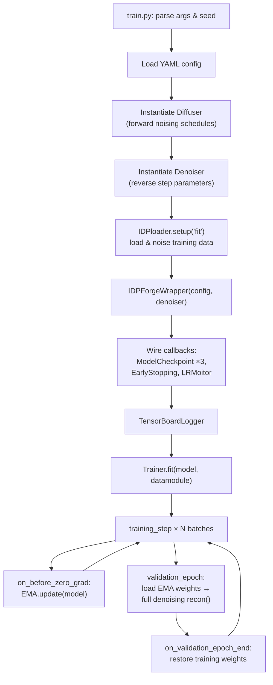

---
slug:9-training-workflow-and-configuration
blog_type:normal
---


IDPForge 训练了一个条件扩散去噪器，该去噪器学习逆转一个三因子加噪过程——SE(3) 骨架平移、SO(3) 骨架旋转和侧链扭转角——从而在推理阶段，模型能够逐步将纯噪声去噪为物理上合理的内在无序蛋白构象体。整个训练循环由 PyTorch Lightning 统一调度，其配置由单个 YAML 文件驱动，该文件控制着数据路径、扩散调度、损失加权、优化器设置以及模型架构超参数。

## 训练入口与生命周期

训练脚本 [`train.py`](train.py) 作为标准入口点。它解析命令行参数，加载 YAML 配置，实例化前向扩散器和反向去噪器，构建数据模块，创建 `IDPForgeWrapper` Lightning 模块，串联检查点和日志回调，最后委托给 `Trainer.fit()`。整个生命周期经历四个紧密耦合的阶段：**初始化 → 数据加载 → 训练循环 → 验证循环**，其中指数移动平均（EMA）权重跟踪桥接了后两个阶段。



每次调用 `training_step` 都会抽取一个均匀随机的扩散时间步（偏向更高噪声），通过 `IDPForge` 运行一次前向传播，计算组合损失，并返回。在梯度清零之前，EMA 参数会进行更新。在验证阶段，EMA 权重会被换入，通过 `model.recon()` 运行完整的反向扩散轨迹，并在恢复训练权重之前记录组合验证指标。

来源: [train.py](train.py#L1-L155), [idpforge/wrapper.py](idpforge/wrapper.py#L17-L36)

## 配置文件剖析

训练配置位于 [`configs/train.yml`](configs/train.yml) 中，分为六个顶层部分。每个部分控制一个独立的子系统，它们共同完全参数化一次训练运行，而无需修改源代码。

| 部分 | 用途 | 关键字段 |
|---|---|---|
| `general` | 输出路径、PDB 日志记录、运行标识 | `output`, `run_name`, `save_pdb`, `batch_save_freq`, `epoch_save_freq` |
| `data` | 数据集路径和批次大小 | `train_path`, `val_path`, `tr_batch_size`, `val_batch_size` |
| `training` | 优化器、学习率调度、EMA、损失权重、训练器参数 | `lr_scheduler`, `ema_decay`, `trainer`, `loss` |
| `validation` | 验证损失权重和指标开关 | `loss_weights`, `compute_cb_dist`, `compute_rg` |
| `diffuse` | 前向扩散调度边界 | `n_tsteps`, `n_tsteps_inf`, `euclid_b0/bT`, `torsion_b0/bT` |
| `model` | 架构超参数 | `t_embed_dim`, `t2d_params`, `self_condition`, `trunk`, `structure_module` |

### General 部分

`general` 部分控制产物的写入位置以及训练预测的 PDB 快照保存到磁盘的频率。`output` 设置 TensorBoard 日志和检查点的根目录。`save_pdb` 完全启用或禁用 PDB 日志记录；启用时，在训练期间每隔 `epoch_save_freq × 2` 个 epoch 的第 `batch_save_freq × 10` 个批次写入预测结构，在验证期间每隔 `epoch_save_freq` 个 epoch 写入一次。

来源: [configs/train.yml](configs/train.yml#L1-L7), [idpforge/wrapper.py](idpforge/wrapper.py#L33-L36)

### Data 部分

训练和验证数据被指定为目录或文件路径列表，每个路径包含序列化元组 `(sequences, secondary_structure, coordinates[, radii_of_gyration])`。`IDPloader` 迭代这些路径，对每个进行反序列化，并将内容包装在 `DiffDataset` 实例中。多个路径通过 `ConcatDataset` 进行拼接。训练和验证的批次大小通过 `tr_batch_size` 和 `val_batch_size` 独立设置。

来源: [configs/train.yml](configs/train.yml#L8-L14), [idpforge/loader.py](idpforge/loader.py#L102-L143)

### Training 部分

这是最密集的部分。它包含四个子块：

- **`lr_scheduler`**：使用来自 OpenFold 的 `AlphaFoldLRScheduler`，实现了线性预热后接余弦衰减。`max_lr` 是峰值学习率，`warmup_no_steps` 控制预热持续时间，`start_decay_after_n_steps` / `decay_every_n_steps` 控制衰减阶段。
- **`ema_decay`**：跟踪影子权重的 `ExponentialMovingAverage` 的衰减因子。值为 `0.99` 意味着每个 EMA 参数更新为 `ema = 0.99 × ema + 0.01 × current`。
- **`trainer`**：直接转发给 `pytorch_lightning.Trainer` 的关键字参数。典型条目包括 `gradient_clip_val`（全局梯度范数裁剪）、`accumulate_grad_batches`（有效批次大小乘数）、`accelerator`、`devices` 和 `max_epochs`。
- **`loss`**：损失项权重和逐项超参数，详见[损失函数](10-loss-functions)。

来源: [configs/train.yml](configs/train.yml#L15-L49), [idpforge/wrapper.py](idpforge/wrapper.py#L136-L166)

### Validation 部分

验证指标与训练损失不同。验证不是单步去噪，而是使用 EMA 权重运行**完整的反向扩散轨迹**（从 `t = T` 到 `t = 0`），然后计算四个指标的可配置组合：Cα dRMSD (`ca_drmsd`)、结构违规惩罚 (`violation`)、Cβ 距离误差 (`dist`) 和回转半径误差 (`rg_error`)。`loss_weights` 字典控制它们的线性组合。`compute_cb_dist` 和 `compute_rg` 是布尔开关，必须为 `true` 才能评估各自的指标。

来源: [configs/train.yml](configs/train.yml#L47-L53), [idpforge/wrapper.py](idpforge/wrapper.py#L85-L131)

### Diffusion 部分

前向扩散超参数定义了应用于每个几何自由度的加噪调度：

| 参数 | 域 | 默认值 | 含义 |
|---|---|---|---|
| `n_tsteps` | 整数 | 200 | 前向扩散时间步数（训练噪声级别） |
| `n_tsteps_inf` | 整数 | 40 | 反向扩散步数（推理/验证步幅） |
| `euclid_b0` | 浮点数 | 0.01 | 欧几里得（平移）噪声调度的起始 β |
| `euclid_bT` | 浮点数 | 0.08 | 欧几里得噪声调度的结束 β |
| `torsion_b0` | 浮点数 | 0.01 | 扭转角噪声调度的起始 β |
| `torsion_bT` | 浮点数 | 0.06 | 扭转角噪声调度的结束 β |

SO(3) 旋转扩散由 `IGSO3` 类隐式控制，其具有内部校准的 σ 调度。`Diffuser` 类将三个扩散器——`IGSO3`、`EuclideanDiffuser` 和 `TorsionDiffuser`——组合成一个单一的 `diffuse_pose()` 方法，生成完整的加噪轨迹 `(x_0, x_1, …, x_T)` 以及加噪扭转角和旋转矩阵。

<CgxTip>`n_tsteps`（前向）和 `n_tsteps_inf`（反向）之间的关系至关重要：`n_tsteps` 设定训练期间噪声调度的分辨率，而 `n_tsteps_inf` 控制推理期间去噪器采取的步数。200:40 的比率意味着模型学习 200 个噪声级别，但在反向采样时以步幅 5 跳跃。</CgxTip>

来源: [configs/train.yml](configs/train.yml#L54-L60), [idpforge/utils/diff_utils.py](idpforge/utils/diff_utils.py#L491-L570)

### Model 部分

模型架构参数作为 `ml_collections.ConfigDict` 传递给 `IDPForge`。关键参数如下：

- **`t_embed_dim`**：正弦时间步嵌入的维度（冻结，不学习）。
- **`t2d_params`**：成对几何特征变换的分箱边界——`DMIN`/`DMAX` 定义距离范围，`DBINS` 和 `ABINS` 设定距离和角度直方图箱的数量。
- **`self_condition`**：为 `true` 时，在训练期间启用自条件——50% 的时间里，模型将在时间步 `t+1` 的自身预测作为额外输入，遵循 RFdiffusion 范式。
- **`trunk`**：`FoldingTrunk` 的参数（块数、状态维度、头宽度、循环计数）以及嵌套的 `structure_module`（IPA 头数、点数、丢弃率、块深度）。

来源: [configs/train.yml](configs/train.yml#L61-L94), [idpforge/model.py](idpforge/model.py#L36-L69)

## 训练步内部机制

`IDPForgeWrapper` 中的 `training_step` 方法实现了超越简单前向传播与损失计算的若干重要机制：

**二级结构丢弃。** 以 20% 的概率，整个批次的二级结构标签被替换为填充值 (7)，迫使模型学习不依赖二级结构（SS）标注的鲁棒预测。这对于在推理时进行 IDP 采样至关重要，因为此时的 SS 标签通常不可用。

**自条件。** 当配置中启用 `self_condition` 且随机抽取成功（50% 概率）时，模型首先在时间步 `t+1` 运行一次 `torch.no_grad()` 前向传播以产生 `prev` 输出。这些输出随后作为 `prev_outputs` 馈入时间步 `t` 的主前向传播，允许模型细化自身早期的预测——这一技术借鉴自 RFdiffusion，可显著提升样本质量。

**时间步采样。** 训练期间，扩散时间步 `T` 采用偏向更高时间步（更多噪声输入）的线性加权进行采样，使用概率分布 `p(t) ∝ t`。这确保模型能见到足够多的高噪声样本，这些样本更难去噪，但对反向过程从近随机构型开始至关重要。

来源: [idpforge/wrapper.py](idpforge/wrapper.py#L56-L83), [idpforge/loader.py](idpforge/loader.py#L62-L99)

## 验证步内部机制

验证在两个基本方面与训练不同。首先，在每个验证 epoch 开始时**加载 EMA 权重**，并在结束时**恢复**训练权重，确保验证指标反映平滑的参数轨迹而非噪声严重的训练时权重。其次，验证不进行单步去噪预测，而是运行 `model.recon()`——一个**完整的反向扩散循环**，以 `n_tsteps / n_tsteps_inf` 为步幅从 `t = n_tsteps − 1` 迭代至 `t = 0`，每步调用模型前向传播，然后应用 `Denoiser.get_next_pose()` 方法转换至 `t − 1`。

随后，使用验证专用的组合损失对生成的完全去噪结构对照真实值进行评估。四个可用指标及其默认权重为：

| 指标 | 默认权重 | 描述 |
|---|---|---|
| `ca_drmsd` | 0.1 | 预测结构与真实结构间的 Cα 距离 RMSD |
| `violation` | 0.0 | 结构违规惩罚（键长、空间冲突） |
| `dist` | 0.05 | 带有 CA 连通性正则化的 Cβ 伪距离误差 |
| `rg_error` | 1.0 | 相对实验 Rg 值的回转半径误差 |

来源: [idpforge/wrapper.py](idpforge/wrapper.py#L85-L131), [idpforge/loss.py](idpforge/loss.py#L176-L188)

## 优化器与学习率调度

优化器采用标准的 `torch.optim.Adam`（`eps = 1e-5`），以配置中的 `max_lr` 进行初始化。学习率调度为 `AlphaFoldLRScheduler`，其实现如下：

1. 从 0 到 `max_lr` 的**线性预热**，持续 `warmup_no_steps` 步。
2. **平台保持**直至 `start_decay_after_n_steps`。
3. 每 `decay_every_n_steps` 步进行**余弦衰减**直至收敛。

该调度以**步级粒度**（`interval: "step"`）而非 epoch 级运行，这一点很重要，因为有效学习率的变化取决于总优化器步数（epochs × batches_per_epoch / accumulate_grad_batches）。

来源: [idpforge/wrapper.py](idpforge/wrapper.py#L136-L166)

## 检查点策略

三个独立的 `ModelCheckpoint` 回调提供了重叠覆盖：

| 回调 | 触发条件 | 保留 | 文件名模式 |
|---|---|---|---|
| `mc_best` | 每 epoch | 按 `val_loss` (min) 的前 5 + 最近 | `best-{epoch}-{step}` |
| `mc_recent` | 每 epoch | 按 `step` (max) 的前 10 | `latest-{epoch}-{step}` |
| `mc_periodic` | 每 10 epoch | 全部（无限制） | `periodic-{epoch}-{step}` |

**最佳检查点**是下游推理的主要产物——它捕获了五个具有最低验证损失的快照。**最近检查点**通过保留最后 10 个检查点（不论指标如何）来防范后期过拟合。**周期检查点**以较粗的粒度提供完整的历史记录，用于分析或回滚。

通过 `on_save_checkpoint` / `on_load_checkpoint` 钩子，EMA 状态被显式序列化到检查点中，确保 EMA 影子权重在重启后得以留存。

来源: [train.py](train.py#L58-L98), [idpforge/wrapper.py](idpforge/wrapper.py#L171-L176)

## 早停

早停通过 `--early_stopping` 命令行标志**选择启用**。启用时，它通过 `min_delta` 阈值和 `patience` 计数器监控 `val_loss`（二者均可在 YAML 的 `early_stopping` 下配置）。该实现使用来自 OpenFold 的 `EarlyStoppingVerbose`，增加了 `check_finite=True` 和 `strict=True` 保护——如果观察到任何 NaN/Inf 验证损失，或监控指标在日志中缺失，训练将停止。

来源: [train.py](train.py#L88-L98), [configs/train.yml](configs/train.yml#L47-L49)

## 恢复与仅权重加载

通过命令行参数提供两种互斥的恢复模式：

- **`--resume_from_ckpt`**（不带 `--load_weights_only`）：完整训练状态恢复。从检查点中提取全局步数，通过 `resume_last_lr_step()` 将学习率调度倒回至该步，并将 `ckpt_path` 传递给 `Trainer.fit()`，从而恢复优化器状态、epoch 计数器和回调。
- **`--resume_from_ckpt --load_weights_only`**：仅通过 `load_state_dict()` 加载模型权重。优化器状态、epoch 和学习率调度从头开始。这在微调或迁移学习场景中非常有用，此时你希望在预训练权重上使用全新的优化器轨迹。

来源: [train.py](train.py#L42-L56), [idpforge/wrapper.py](idpforge/wrapper.py#L168-L169)

## 命令行界面

`train.py` 的完整参数集：

| 参数 | 类型 | 默认值 | 描述 |
|---|---|---|---|
| `--model_config_path` | str | `config.yml` | YAML 配置文件的路径 |
| `--seed` | int | 42 | 全局随机种子（通过 `seed_everything`） |
| `--run_version` | int | None | TensorBoard 日志版本号 |
| `--early_stopping` | flag | False | 对 `val_loss` 启用早停 |
| `--resume_from_ckpt` | str | None | 用于恢复或权重加载的检查点路径 |
| `--load_weights_only` | flag | False | 仅加载权重（忽略优化器/LR 状态） |
| `--log_lr` | flag | True | 每 epoch 记录实际学习率 |

来源: [train.py](train.py#L122-L154)

## 启动训练运行

最小训练调用仅需配置文件：

```bash
python train.py --model_config_path configs/train.yml
```

包含所有选项的生产运行：

```bash
python train.py \
    --model_config_path configs/train.yml \
    --seed 42 \
    --early_stopping \
    --log_lr
```

从检查点恢复：

```bash
python train.py \
    --model_config_path configs/train.yml \
    --resume_from_ckpt lightning_logs/test/version_0/checkpoints/best-epoch=50-step=10000.ckpt
```

使用全新优化器从预训练权重微调：

```bash
python train.py \
    --model_config_path configs/train.yml \
    --resume_from_ckpt pretrained.ckpt \
    --load_weights_only
```

<CgxTip>在 `train.py` 的模块级别调用了 `torch.set_float32_matmul_precision('medium')`，以允许在 Ampere+ GPU 上执行 TF32 操作，这能在对扩散训练精度影响可忽略不计的情况下带来约 2 倍的吞吐量提升。</CgxTip>

来源: [train.py](train.py#L19-L20), [train.py](train.py#L122-L154)

## 配置快速参考

下表总结了 [`configs/train.yml`](configs/train.yml) 中的每个字段及其默认值和作用：

| 字段 | 默认值 | 作用 |
|---|---|---|
| `general.output` | `local` | 日志和检查点的根目录 |
| `general.run_name` | `test` | 输出下的子目录名 |
| `general.save_pdb` | `true` | 是否在训练/验证期间记录预测的 PDB |
| `general.batch_save_freq` | 2 | PDB 日志记录频率除数（批次） |
| `general.epoch_save_freq` | 5 | PDB 日志记录频率除数（epoch） |
| `data.train_path` | `["data/"]` | 序列化训练数据的路径列表 |
| `data.val_path` | `["data/"]` | 序列化验证数据的路径列表 |
| `data.tr_batch_size` | 16 | 训练批次大小 |
| `data.val_batch_size` | 64 | 验证批次大小 |
| `training.lr_scheduler.max_lr` | 0.001 | 峰值学习率 |
| `training.lr_scheduler.warmup_no_steps` | 1000 | 线性预热持续时间（步） |
| `training.lr_scheduler.start_decay_after_n_steps` | 5000 | 开始余弦衰减的步数 |
| `training.lr_scheduler.decay_every_n_steps` | 5000 | 余弦衰减周期 |
| `training.ema_decay` | 0.99 | 指数移动平均衰减 |
| `training.trainer.gradient_clip_val` | 0.1 | 全局梯度范数裁剪 |
| `training.trainer.accumulate_grad_batches` | 4 | 梯度累积（有效批次 = 16×4 = 64） |
| `training.trainer.accelerator` | `gpu` | PyTorch Lightning 加速器 |
| `training.trainer.devices` | 1 | GPU 数量 |
| `training.trainer.max_epochs` | 100 | 最大训练 epoch |
| `training.loss.weights.fape` | 1 | 帧对齐点误差权重 |
| `training.loss.weights.dist` | 0.005 | 距离损失权重 |
| `training.loss.weights.angular` | 0.1 | 扭转角损失权重 |
| `training.loss.weights.violation` | 0.01 | 结构违规损失权重 |
| `training.loss.dist.start_epoch` | 50 | 距离损失激活的 epoch |
| `training.loss.violation_cfg.start_epoch` | 80 | 违规损失激活的 epoch |
| `validation.loss_weights.ca_drmsd` | 0.1 | 验证 Cα dRMSD 权重 |
| `validation.loss_weights.violation` | 0.0 | 验证违规权重 |
| `validation.loss_weights.dist` | 0.05 | 验证距离权重 |
| `validation.loss_weights.rg_error` | 1.0 | 验证 Rg 误差权重 |
| `diffuse.n_tsteps` | 200 | 前向扩散时间步 |
| `diffuse.n_tsteps_inf` | 40 | 反向扩散步（推理） |
| `diffuse.euclid_b0` | 0.01 | 平移噪声调度起始值 |
| `diffuse.euclid_bT` | 0.08 | 平移噪声调度结束值 |
| `diffuse.torsion_b0` | 0.01 | 扭转噪声调度起始值 |
| `diffuse.torsion_bT` | 0.06 | 扭转噪声调度结束值 |

来源: [configs/train.yml](configs/train.yml#L1-L94)

## 损失课程调度

训练配置中一个值得注意的设计模式是通过 `start_epoch` 阈值对损失项的**延迟激活**。距离损失（`dist.start_epoch: 50`）和违规损失（`violation_cfg.start_epoch: 80`）最初权重为零，仅在各自 epoch 之后才开始产生贡献。这实现了一种课程：首先训练模型使帧对齐和扭转角大致正确（FAPE + 角度损失），然后细化残基间距离，最后惩罚结构违规——逐步收紧物理合理性约束。

来源: [idpforge/loss.py](idpforge/loss.py#L70-L86), [configs/train.yml](configs/train.yml#L40-L45)

---

**下一步**：有关各项损失及其数学公式的详细信息，请参阅[损失函数](10-loss-functions)。有关数据流水线在结构进入训练循环之前如何准备和加噪，请参阅[数据加载与加噪](11-data-loading-and-noising)。有关包括模型架构字段在内的完整参数参考，请参阅[配置参考](22-configuration-reference)。