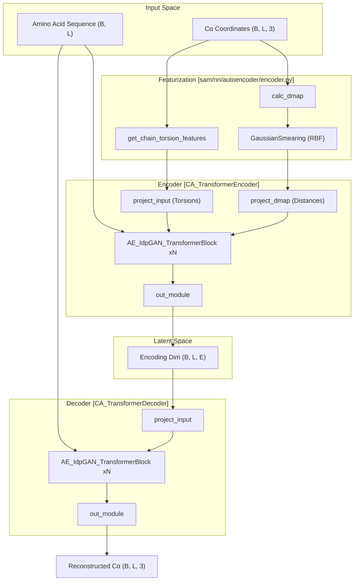
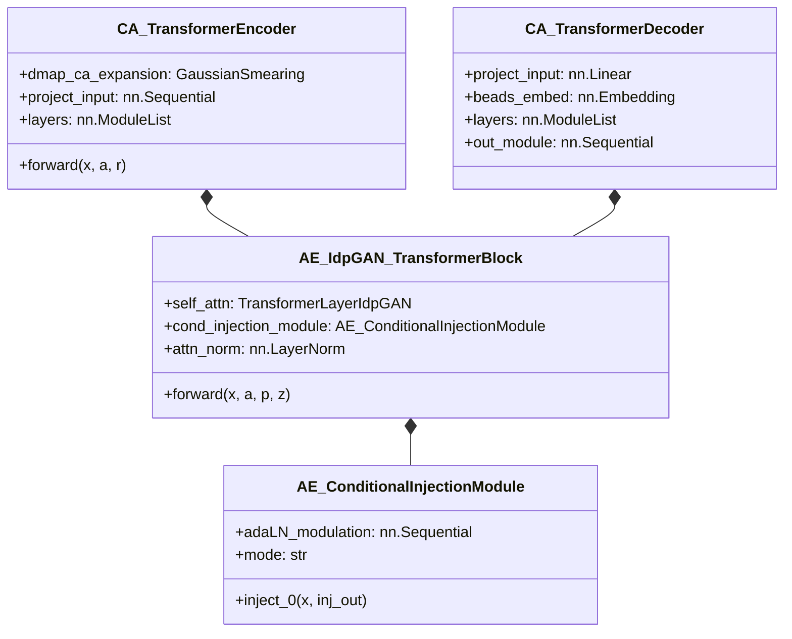

# Autoencoder: Encoder and Decoder

> **Relevant source files**
> - [sam/nn/autoencoder/\_\_init\_\_\.py](https://github.com/giacomo-janson/idpsam/blob/ec63c24a/sam/nn/autoencoder/__init__.py)
> - [sam/nn/autoencoder/ca\_models\.py](https://github.com/giacomo-janson/idpsam/blob/ec63c24a/sam/nn/autoencoder/ca_models.py)
> - [sam/nn/autoencoder/decoder\.py](https://github.com/giacomo-janson/idpsam/blob/ec63c24a/sam/nn/autoencoder/decoder.py)
> - [sam/nn/autoencoder/encoder\.py](https://github.com/giacomo-janson/idpsam/blob/ec63c24a/sam/nn/autoencoder/encoder.py)

 The autoencoder subsystem in idpSAM is responsible for compressing 3D protein structures into a low\-dimensional latent space \(encoding\) and reconstructing the 3D coordinates from those latent vectors \(decoding\)\. It utilizes a transformer\-based architecture optimized for Intrinsically Disordered Proteins \(IDPs\), incorporating geometric features such as distance maps and torsion angles\.

## Architectural Overview

 The autoencoder consists of two primary networks:

 1. **`CA_TransformerEncoder`**: Maps Cα coordinates and sequence information to a latent representation $z$\.
2. **`CA_TransformerDecoder`**: Maps the latent representation $z$ back to 3D Cα coordinates\.

 Both networks share a common building block, the `AE_IdpGAN_TransformerBlock`, which handles the injection of conditional information \(amino acid types\) and positional embeddings\.

### Data Flow Diagram

 This diagram illustrates how structural data is featurized and passed through the encoder and decoder modules\.

 **Sources:** [encoder\.py L32-L182](https://github.com/giacomo-janson/idpsam/blob/ec63c24a/sam/nn/autoencoder/encoder.py#L32-L182) [decoder\.py L18-L160](https://github.com/giacomo-janson/idpsam/blob/ec63c24a/sam/nn/autoencoder/decoder.py#L18-L160) [ca\_models\.py L15-L158](https://github.com/giacomo-janson/idpsam/blob/ec63c24a/sam/nn/autoencoder/ca_models.py#L15-L158)

---

## Encoder: `CA_TransformerEncoder`

 The encoder processes structural information into two streams: 1D node features \(torsions\) and 2D edge features \(distance maps\)\.

### Input Featurization

 - **Torsion Features**: The function `get_chain_torsion_features` calculates the dihedrals of the Cα chain using `torch_chain_dihedrals`\. These are transformed into $\[\\cos\(\\phi\), \\sin\(\\phi\), mask\]$ to ensure periodicity [encoder\.py L20-L25](https://github.com/giacomo-janson/idpsam/blob/ec63c24a/sam/nn/autoencoder/encoder.py#L20-L25)
- **Distance Map RBF**: Pairwise Cα\-Cα distances are calculated via `calc_dmap` and expanded into radial basis functions using `GaussianSmearing` or `ExpNormalSmearing` [encoder\.py L91-L103](https://github.com/giacomo-janson/idpsam/blob/ec63c24a/sam/nn/autoencoder/encoder.py#L91-L103) These serve as the 2D bias for the transformer attention layers\.

### Implementation Details

 The encoder uses a stack of `AE_IdpGAN_TransformerBlock` layers\. In the encoder, these blocks typically use `embed_2d_inject_mode="concat"` to merge the RBF\-encoded distance maps with the relative positional embeddings [encoder\.py L56](https://github.com/giacomo-janson/idpsam/blob/ec63c24a/sam/nn/autoencoder/encoder.py#L56-L56)

 **Sources:** [encoder\.py L89-L130](https://github.com/giacomo-janson/idpsam/blob/ec63c24a/sam/nn/autoencoder/encoder.py#L89-L130) [coords\.py L10](https://github.com/giacomo-janson/idpsam/blob/ec63c24a/sam/coords.py#L10-L10)

---

## Decoder: `CA_TransformerDecoder`

 The decoder reverses the process, taking the latent encoding $e$ and reconstructing the Cartesian coordinates $\(x, y, z\)$\.

### Key Differences from Encoder

 - **Input**: It only takes the latent vector $e$ and conditional sequence information $a$ [decoder\.py L134-L139](https://github.com/giacomo-janson/idpsam/blob/ec63c24a/sam/nn/autoencoder/decoder.py#L134-L139)
- **Attention Type**: It can utilize a specialized `attention_type="timewarp"`, which refers to the `TransformerTimewarpLayer` [decoder\.py L26](https://github.com/giacomo-janson/idpsam/blob/ec63c24a/sam/nn/autoencoder/decoder.py#L26-L26) [ca\_models\.py L83-L89](https://github.com/giacomo-janson/idpsam/blob/ec63c24a/sam/nn/autoencoder/ca_models.py#L83-L89)
- **Output**: The final layer is a linear projection `out_module` that maps the hidden `embed_dim` to the `output_dim` \(usually 3 for x, y, z coordinates\) [decoder\.py L114-L116](https://github.com/giacomo-janson/idpsam/blob/ec63c24a/sam/nn/autoencoder/decoder.py#L114-L116)

 **Sources:** [decoder\.py L64-L128](https://github.com/giacomo-janson/idpsam/blob/ec63c24a/sam/nn/autoencoder/decoder.py#L64-L128) [ca\_models\.py L83-L89](https://github.com/giacomo-janson/idpsam/blob/ec63c24a/sam/nn/autoencoder/ca_models.py#L83-L89)

---

## Shared Block: `AE_IdpGAN_TransformerBlock`

 This class is the fundamental computational unit for both the encoder and decoder\. It integrates node features, edge features, and conditional embeddings\.

### Conditional Injection

 The block uses an `AE_ConditionalInjectionModule` to incorporate amino acid information\. The `embed_inject_mode` parameter determines how this is done:

 - **`adanorm`**: Uses Adaptive Layer Normalization\. A sequence embedding is passed through `adaLN_modulation` to produce scale and shift parameters for the `modulate` function [ca\_models\.py L182-L186](https://github.com/giacomo-janson/idpsam/blob/ec63c24a/sam/nn/autoencoder/ca_models.py#L182-L186) [ca\_models\.py L164-L165](https://github.com/giacomo-janson/idpsam/blob/ec63c24a/sam/nn/autoencoder/ca_models.py#L164-L165)
- **`concat`**: Simply concatenates the sequence embedding to the node features [ca\_models\.py L187-L191](https://github.com/giacomo-janson/idpsam/blob/ec63c24a/sam/nn/autoencoder/ca_models.py#L187-L191)

### Transformer Layer Logic

 The block orchestrates the flow between normalization, attention, and the MLP feed\-forward network:

| Component | Logic / Code Reference |
| --- | --- |
| Normalization | Supports pre or post normalization via self\.attn\_norm sam/nn/autoencoder/ca\_models\.py43\-45 |
| Attention | Uses TransformerLayerIdpGAN or TransformerTimewarpLayer sam/nn/autoencoder/ca\_models\.py75\-89 |
| 2D Injection | Distances/Positional embeddings are injected into attention via z\_hat \(either add or concat\) sam/nn/autoencoder/ca\_models\.py128\-136 |
| MLP | A two\-layer linear network \(fc1, fc2\) with a configurable activation function sam/nn/autoencoder/ca\_models\.py102\-108 |

 **Sources:** [ca\_models\.py L15-L158](https://github.com/giacomo-janson/idpsam/blob/ec63c24a/sam/nn/autoencoder/ca_models.py#L15-L158) [ca\_models\.py L167-L250](https://github.com/giacomo-janson/idpsam/blob/ec63c24a/sam/nn/autoencoder/ca_models.py#L167-L250)

---

## Structural Mapping: Code Entities

 This diagram maps the conceptual components of the Autoencoder to their specific class and function implementations within the `sam/nn/autoencoder/` directory\.

 **Sources:** [encoder\.py L32-L74](https://github.com/giacomo-janson/idpsam/blob/ec63c24a/sam/nn/autoencoder/encoder.py#L32-L74) [decoder\.py L18-L49](https://github.com/giacomo-janson/idpsam/blob/ec63c24a/sam/nn/autoencoder/decoder.py#L18-L49) [ca\_models\.py L15-L36](https://github.com/giacomo-janson/idpsam/blob/ec63c24a/sam/nn/autoencoder/ca_models.py#L15-L36) [ca\_models\.py L167-L195](https://github.com/giacomo-janson/idpsam/blob/ec63c24a/sam/nn/autoencoder/ca_models.py#L167-L195)
