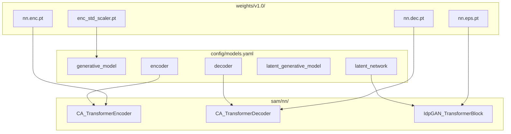
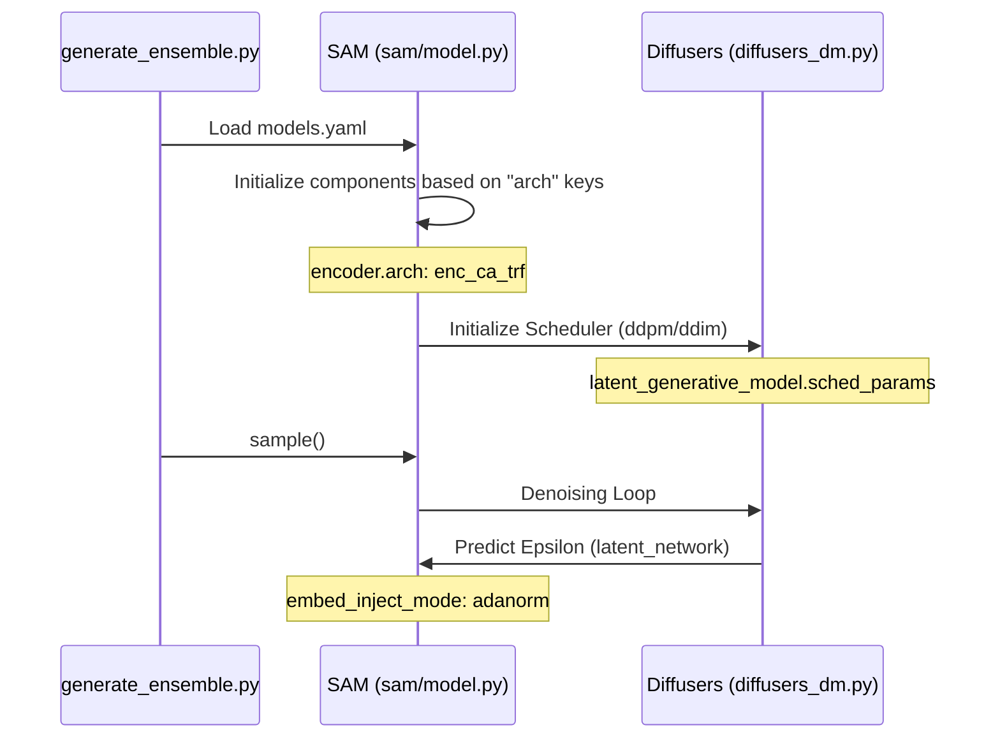

# Configuration System

> **Relevant source files**
> * [config/README.md](https://github.com/giacomo-janson/idpsam/blob/ec63c24a/config/README.md?plain=1)
> * [config/models.yaml](https://github.com/giacomo-janson/idpsam/blob/ec63c24a/config/models.yaml)

The idpSAM configuration system is centered around a centralized YAML file, `config/models.yaml`, which defines the hyperparameters, architectural choices, and weight locations for the entire three-stage latent diffusion pipeline. This system ensures that the `SAM` model class can be instantiated with consistent settings across encoding, diffusion, and decoding phases.

## Overview of config/models.yaml

The configuration is structured into five top-level blocks, each corresponding to a specific component of the generative framework. The `SAM` class constructor parses these blocks to initialize the underlying neural networks and diffusion schedulers [sam/model.py L27-L66](https://github.com/giacomo-janson/idpsam/blob/ec63c24a/sam/model.py#L27-L66)

### Configuration Block Mapping

| Block Name | Code Entity | Purpose |
| --- | --- | --- |
| `generative_model` | `SAM` (Global Settings) | High-level parameters like latent dimensionality and max sequence length. |
| `encoder` | `CA_TransformerEncoder` | Configuration for the Cα-to-latent transformer. |
| `decoder` | `CA_TransformerDecoder` | Configuration for the latent-to-Cα transformer. |
| `latent_generative_model` | `Diffusers` | Parameters for the DDPM/DDIM diffusion process. |
| `latent_network` | `IdpGAN_TransformerBlock` | Architecture for the epsilon-prediction ($\epsilon$) network. |

**Sources:** [config/models.yaml L4-L106](https://github.com/giacomo-janson/idpsam/blob/ec63c24a/config/models.yaml#L4-L106)

 [sam/model.py L27-L66](https://github.com/giacomo-janson/idpsam/blob/ec63c24a/sam/model.py#L27-L66)

---

## 1. Generative Model Settings (generative_model)

This block defines global constraints and the nature of the latent space used by idpSAM.

* **`encoding_dim` (16):** The size of the latent vector per residue [config/models.yaml L7](https://github.com/giacomo-janson/idpsam/blob/ec63c24a/config/models.yaml#L7-L7)
* **`max_len` (60):** The maximum sequence length supported by the positional embeddings [config/models.yaml L9](https://github.com/giacomo-janson/idpsam/blob/ec63c24a/config/models.yaml#L9-L9)
* **`use_enc_std_scaler` (true):** A boolean flag indicating if the latent representations should be normalized using pre-computed statistics [config/models.yaml L8](https://github.com/giacomo-janson/idpsam/blob/ec63c24a/config/models.yaml#L8-L8)

**Sources:** [config/models.yaml L4-L9](https://github.com/giacomo-janson/idpsam/blob/ec63c24a/config/models.yaml#L4-L9)

---

## 2. Encoder and Decoder Configurations

These blocks define the Autoencoder (AE) architecture used to compress 3D coordinates into a continuous latent space.

### Encoder (encoder)

The encoder uses a `enc_ca_trf` architecture [config/models.yaml L12](https://github.com/giacomo-janson/idpsam/blob/ec63c24a/config/models.yaml#L12-L12)

 It transforms Cα distances and torsion angles into latent vectors.

* **Featurization:** Uses RBF (Radial Basis Function) kernels for distances with `dmap_ca_num_gaussians: 320` [config/models.yaml L32](https://github.com/giacomo-janson/idpsam/blob/ec63c24a/config/models.yaml#L32-L32)
* **Torsions:** `use_torsions: true` enables the inclusion of backbone dihedral information [config/models.yaml L35](https://github.com/giacomo-janson/idpsam/blob/ec63c24a/config/models.yaml#L35-L35)
* **Injection:** Uses `concat` mode for embedding injection [config/models.yaml L28-L29](https://github.com/giacomo-janson/idpsam/blob/ec63c24a/config/models.yaml#L28-L29)

### Decoder (decoder)

The decoder uses a `dec_ca_trf` architecture [config/models.yaml L41](https://github.com/giacomo-janson/idpsam/blob/ec63c24a/config/models.yaml#L41-L41)

* **Attention:** Employs `attention_type: timewarp` [config/models.yaml L44](https://github.com/giacomo-janson/idpsam/blob/ec63c24a/config/models.yaml#L44-L44)  a specialized variant for handling sequence-structure relationships.
* **Projection:** Includes an input MLP (`use_input_mlp: true`) to project latent vectors back to the transformer dimension [config/models.yaml L42](https://github.com/giacomo-janson/idpsam/blob/ec63c24a/config/models.yaml#L42-L42)

**Sources:** [config/models.yaml L11-L59](https://github.com/giacomo-janson/idpsam/blob/ec63c24a/config/models.yaml#L11-L59)

---

## 3. Latent Diffusion Configuration

The diffusion process is split between the scheduler logic and the neural network that predicts noise.

### Latent Generative Model (latent_generative_model)

This block configures the `Diffusers` wrapper [sam/diffusion/diffusers_dm.py L17](https://github.com/giacomo-janson/idpsam/blob/ec63c24a/sam/diffusion/diffusers_dm.py#L17-L17)

 and the underlying `DDPMScheduler`.

* **Scheduler:** Defaults to `ddpm` with 1000 training timesteps [config/models.yaml L63-L64](https://github.com/giacomo-janson/idpsam/blob/ec63c24a/config/models.yaml#L63-L64)
* **Beta Schedule:** Uses a `sigmoid` schedule starting at `0.0001` and ending at `0.02` [config/models.yaml L65-L67](https://github.com/giacomo-janson/idpsam/blob/ec63c24a/config/models.yaml#L65-L67)

### Latent Network (latent_network)

Configures the `eps_trf` (Epsilon Transformer) [config/models.yaml L73](https://github.com/giacomo-janson/idpsam/blob/ec63c24a/config/models.yaml#L73-L73)

* **Conditioning:** Uses `adanorm` (Adaptive Layer Normalization) for injecting the diffusion timestep and residue embeddings [config/models.yaml L97](https://github.com/giacomo-janson/idpsam/blob/ec63c24a/config/models.yaml#L97-L97)
* **EMA:** Configures Exponential Moving Average (`_use_ema: true`) with a beta of `0.9999` to stabilize inference [config/models.yaml L101-L103](https://github.com/giacomo-janson/idpsam/blob/ec63c24a/config/models.yaml#L101-L103)

**Sources:** [config/models.yaml L60-L106](https://github.com/giacomo-janson/idpsam/blob/ec63c24a/config/models.yaml#L60-L106)

 [sam/diffusion/diffusers_dm.py L17-L40](https://github.com/giacomo-janson/idpsam/blob/ec63c24a/sam/diffusion/diffusers_dm.py#L17-L40)

---

## Weight Resolution and File Paths

The configuration file contains relative paths to PyTorch weight files (`.pt`).

### Resolution Logic

1. **Relative Paths:** Paths like `./weights/v1.0/nn.enc.pt` are resolved relative to the **current working directory** where the script is executed [config/README.md L2](https://github.com/giacomo-janson/idpsam/blob/ec63c24a/config/README.md?plain=1#L2-L2)
2. **SAM Initialization:** When the `SAM` class is instantiated, it reads these paths and calls `torch.load()` to populate the model parameters [sam/model.py L68-L85](https://github.com/giacomo-janson/idpsam/blob/ec63c24a/sam/model.py#L68-L85)
3. **Standard Scaler:** The `std_scaler_fp` [config/models.yaml L37](https://github.com/giacomo-janson/idpsam/blob/ec63c24a/config/models.yaml#L37-L37)  points to a serialized `StandardScaler` object used to normalize the latent space before diffusion [sam/model.py L82-L85](https://github.com/giacomo-janson/idpsam/blob/ec63c24a/sam/model.py#L82-L85)

### Configuration to Code Entity Mapping

The following diagram illustrates how the `models.yaml` blocks map to specific Python classes and weight files.

**Model Component Architecture**

**Sources:** [config/models.yaml L1-L106](https://github.com/giacomo-janson/idpsam/blob/ec63c24a/config/models.yaml#L1-L106)

 [sam/model.py L27-L85](https://github.com/giacomo-janson/idpsam/blob/ec63c24a/sam/model.py#L27-L85)

---

## Data Flow and Configuration Injection

The configuration parameters dictate the tensor shapes and interaction modes during the sampling loop.

**Configuration-Driven Data Flow**

**Sources:** [sam/model.py L27-L120](https://github.com/giacomo-janson/idpsam/blob/ec63c24a/sam/model.py#L27-L120)

 [sam/diffusion/diffusers_dm.py L100-L150](https://github.com/giacomo-janson/idpsam/blob/ec63c24a/sam/diffusion/diffusers_dm.py#L100-L150)

 [config/models.yaml L62-L69](https://github.com/giacomo-janson/idpsam/blob/ec63c24a/config/models.yaml#L62-L69)