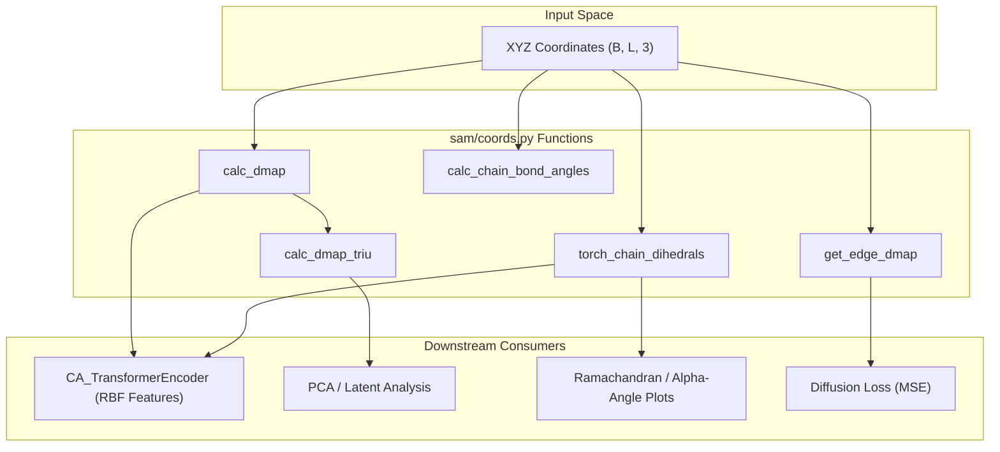
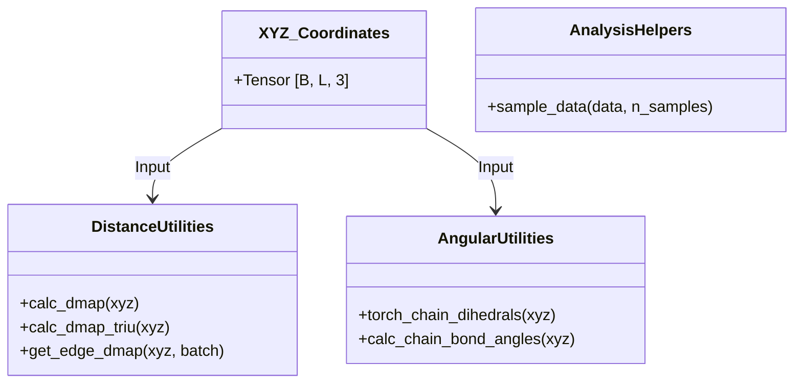

# Coordinate and Structural Analysis Utilities

> **Relevant source files**
> * [notebooks/idpsam_experiments.ipynb](https://github.com/giacomo-janson/idpsam/blob/ec63c24a/notebooks/idpsam_experiments.ipynb)
> * [sam/coords.py](https://github.com/giacomo-janson/idpsam/blob/ec63c24a/sam/coords.py)

The `sam/coords.py` module provides a suite of geometric utilities used to transform Cartesian coordinates (XYZ) into structural descriptors. These utilities are critical for two primary workflows in idpSAM:

1. **Input Featurization**: Converting 3D coordinates into distance maps and torsion angles for the `CA_TransformerEncoder` [sam/nn/autoencoder/enc_ca_trf.py L1-L20](https://github.com/giacomo-janson/idpsam/blob/ec63c24a/sam/nn/autoencoder/enc_ca_trf.py#L1-L20)
2. **Post-Generation Analysis**: Evaluating the quality of generated ensembles using metrics like Alpha-carbon ($\text{C}\alpha$) dihedrals, bond angles, and contact maps [notebooks/idpsam_experiments.ipynb L37](https://github.com/giacomo-janson/idpsam/blob/ec63c24a/notebooks/idpsam_experiments.ipynb#L37-L37)

### Geometric Logic Flow

The following diagram illustrates how Cartesian coordinates are processed by the functions in `sam/coords.py` to serve both the neural network modules and evaluation scripts.

**Coordinate Processing Pipeline**

**Sources:** [sam/coords.py L5-L150](https://github.com/giacomo-janson/idpsam/blob/ec63c24a/sam/coords.py#L5-L150)

 [sam/nn/autoencoder/enc_ca_trf.py L1-L50](https://github.com/giacomo-janson/idpsam/blob/ec63c24a/sam/nn/autoencoder/enc_ca_trf.py#L1-L50)

---

### Distance Map Calculations

Distance maps represent the pairwise Euclidean distances between $\text{C}\alpha$ atoms. The utilities support both `torch` and `numpy` backends to facilitate use during GPU-accelerated training and CPU-based post-processing [sam/coords.py L6-L11](https://github.com/giacomo-janson/idpsam/blob/ec63c24a/sam/coords.py#L6-L11)

* **`calc_dmap`**: Computes the full $L \times L$ distance matrix for a given set of coordinates [sam/coords.py L5-L37](https://github.com/giacomo-janson/idpsam/blob/ec63c24a/sam/coords.py#L5-L37)
* **`calc_dmap_triu`**: Extracts the upper triangle of the distance map, typically used to reduce dimensionality for PCA or structural clustering [sam/coords.py L40-L71](https://github.com/giacomo-janson/idpsam/blob/ec63c24a/sam/coords.py#L40-L71)
* **`get_edge_dmap`**: A specialized version that computes distances only for specific edges defined in a `batch.nr_edge_index`, used in graph-based representations [sam/coords.py L144-L150](https://github.com/giacomo-janson/idpsam/blob/ec63c24a/sam/coords.py#L144-L150)

For details on tensor shapes and backend integration, see [Distance Map Calculations](/giacomo-janson/idpsam/6.1-distance-map-calculations).

**Sources:** [sam/coords.py L5-L71](https://github.com/giacomo-janson/idpsam/blob/ec63c24a/sam/coords.py#L5-L71)

 [sam/coords.py L144-L150](https://github.com/giacomo-janson/idpsam/blob/ec63c24a/sam/coords.py#L144-L150)

---

### Torsion Angles and Bond Geometry

Because IDPs are highly flexible, their local geometry is often characterized by torsion (dihedral) angles and bond angles rather than rigid structures.

* **`torch_chain_dihedrals`**: Calculates the $\text{C}\alpha$ dihedrals (pseudo-torsions) along the protein backbone [sam/coords.py L73-L93](https://github.com/giacomo-janson/idpsam/blob/ec63c24a/sam/coords.py#L73-L93)  These values are often normalized by $\pi$ for neural network input [sam/coords.py L92](https://github.com/giacomo-janson/idpsam/blob/ec63c24a/sam/coords.py#L92-L92)
* **`calc_chain_bond_angles`**: Computes the angles between three consecutive $\text{C}\alpha$ atoms [sam/coords.py L95-L97](https://github.com/giacomo-janson/idpsam/blob/ec63c24a/sam/coords.py#L95-L97)  This is used to validate that the generated ensembles maintain physically realistic chain geometry.

For details on the mathematical implementation and their use in ensemble validation, see [Torsion Angles and Bond Geometry](/giacomo-janson/idpsam/6.2-torsion-angles-and-bond-geometry).

**Sources:** [sam/coords.py L73-L114](https://github.com/giacomo-janson/idpsam/blob/ec63c24a/sam/coords.py#L73-L114)

---

### Data Sampling Utility

The module also includes a helper for handling large ensembles during analysis.

* **`sample_data`**: A utility to randomly downsample generated conformations (e.g., selecting 1,000 frames from a 10,000-frame DCD trajectory) for visualization or statistical analysis [sam/coords.py L131-L142](https://github.com/giacomo-janson/idpsam/blob/ec63c24a/sam/coords.py#L131-L142)

**Sources:** [sam/coords.py L131-L142](https://github.com/giacomo-janson/idpsam/blob/ec63c24a/sam/coords.py#L131-L142)

---

### Code Entity Map

The following diagram maps the geometric concepts to the specific functions implemented in `sam/coords.py`.

**Geometric Entity Mapping**

**Sources:** [sam/coords.py L1-L150](https://github.com/giacomo-janson/idpsam/blob/ec63c24a/sam/coords.py#L1-L150)