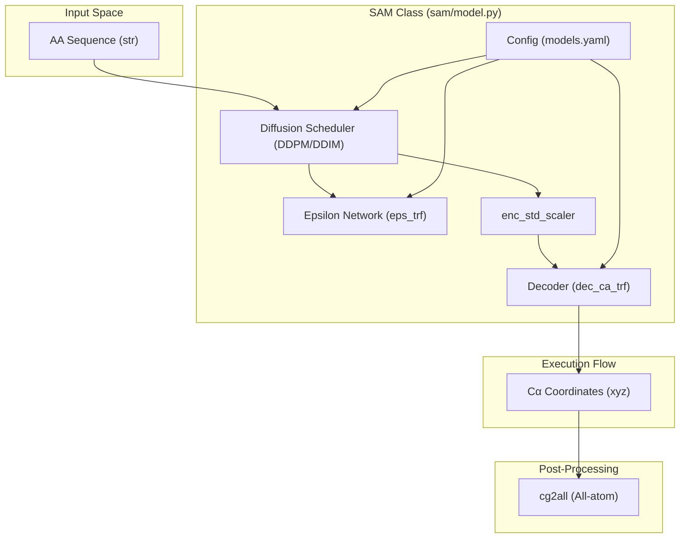
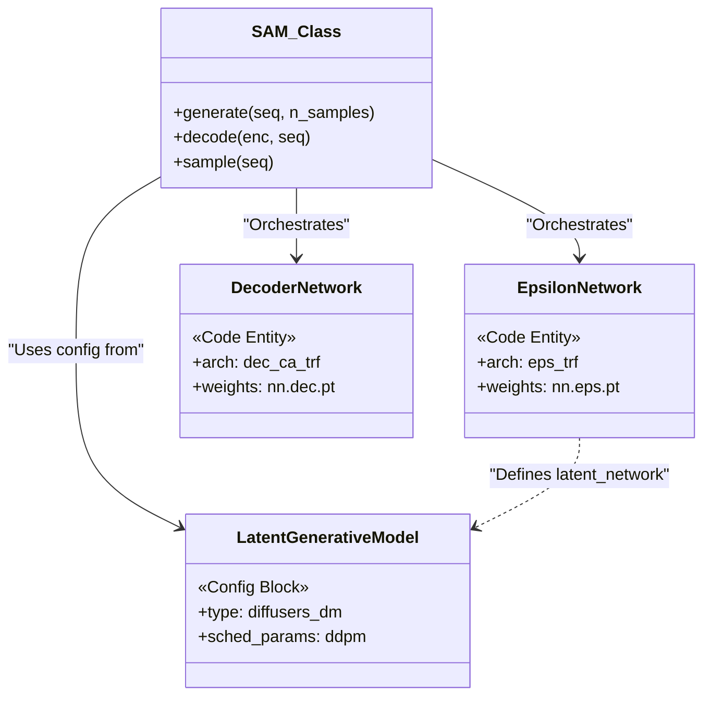

# Core Architecture

> **Relevant source files**
> * [config/models.yaml](https://github.com/giacomo-janson/idpsam/blob/ec63c24a/config/models.yaml)
> * [sam/model.py](https://github.com/giacomo-janson/idpsam/blob/ec63c24a/sam/model.py)

The idpSAM architecture implements a **latent diffusion** framework specifically designed for generating ensembles of intrinsically disordered proteins (IDPs). Rather than diffusing 3D Cartesian coordinates directly—which is computationally expensive and geometrically constrained—idpSAM operates in a compressed latent space.

The system is structured as a three-stage pipeline:

1. **Encoding**: Mapping protein structures to a low-dimensional latent representation.
2. **Latent Diffusion**: Learning the distribution of these latents using a denoising diffusion probabilistic model (DDPM).
3. **Decoding**: Mapping generated latents back to 3D $C\alpha$ coordinates.

### The SAM Orchestrator

The `SAM` class in [sam/model.py L41-L44](https://github.com/giacomo-janson/idpsam/blob/ec63c24a/sam/model.py#L41-L44)

 serves as the primary entry point for inference. It orchestrates the interaction between the configuration system, the pre-trained neural networks, and the diffusion scheduler.

#### Data Flow and Component Interaction

The diagram below illustrates how a sequence is transformed into a structural ensemble through the internal components of the `SAM` class.

**idpSAM Inference Pipeline**

**Sources:** [sam/model.py L41-L123](https://github.com/giacomo-janson/idpsam/blob/ec63c24a/sam/model.py#L41-L123)

 [sam/model.py L134-L190](https://github.com/giacomo-janson/idpsam/blob/ec63c24a/sam/model.py#L134-L190)

 [config/models.yaml L4-L106](https://github.com/giacomo-janson/idpsam/blob/ec63c24a/config/models.yaml#L4-L106)

---

### Three-Stage Pipeline

#### 1. Encoding (Latent Space Definition)

During training, a `CA_TransformerEncoder` ([config/models.yaml L12](https://github.com/giacomo-janson/idpsam/blob/ec63c24a/config/models.yaml#L12-L12)

) compresses $C\alpha$ distance maps and torsion angles into a latent vector of dimension 16 ([config/models.yaml L7](https://github.com/giacomo-janson/idpsam/blob/ec63c24a/config/models.yaml#L7-L7)

). At inference time, the `SAM` class uses a pre-computed `enc_std_scaler` ([sam/model.py L96-L106](https://github.com/giacomo-janson/idpsam/blob/ec63c24a/sam/model.py#L96-L106)

) to normalize the latent space, ensuring the diffusion process operates on a standard normal distribution.

#### 2. Latent Diffusion (Sampling)

The core generative step occurs in the `SAM.generate()` method ([sam/model.py L201-L260](https://github.com/giacomo-janson/idpsam/blob/ec63c24a/sam/model.py#L201-L260)

).

* **Noise Prediction**: The `eps_trf` (Epsilon Transformer) network predicts the noise added to a latent representation at a given timestep.
* **Scheduler**: The `Diffusion` class ([sam/model.py L109-L111](https://github.com/giacomo-janson/idpsam/blob/ec63c24a/sam/model.py#L109-L111) ) manages the DDPM/DDIM schedules, iteratively refining Gaussian noise into valid protein latents.

#### 3. Decoding (Coordinate Reconstruction)

The `SAM.decode()` method ([sam/model.py L262-L306](https://github.com/giacomo-janson/idpsam/blob/ec63c24a/sam/model.py#L262-L306)

) takes the generated latents and passes them through the `dec_ca_trf` (Transformer Decoder). This module uses a specialized **timewarp attention** mechanism ([config/models.yaml L44](https://github.com/giacomo-janson/idpsam/blob/ec63c24a/config/models.yaml#L44-L44)

) to reconstruct 3D $C\alpha$ coordinates from the 1D latent sequence.

---

### Component Mapping

The following diagram maps the logical generative stages to the specific Python classes and configuration blocks that define them.

**Logical to Entity Mapping**

**Sources:** [sam/model.py L46-L50](https://github.com/giacomo-janson/idpsam/blob/ec63c24a/sam/model.py#L46-L50)

 [config/models.yaml L39-L58](https://github.com/giacomo-janson/idpsam/blob/ec63c24a/config/models.yaml#L39-L58)

 [config/models.yaml L60-L70](https://github.com/giacomo-janson/idpsam/blob/ec63c24a/config/models.yaml#L60-L70)

 [config/models.yaml L72-L106](https://github.com/giacomo-janson/idpsam/blob/ec63c24a/config/models.yaml#L72-L106)

---

### Detailed Subsystems

For technical deep-dives into each part of the architecture, refer to the following child pages:

* **[SAM Model Class](/giacomo-janson/idpsam/2.1-sam-model-class)**: Detailed API reference for `sam/model.py`, including device management and the `cg2all` all-atom reconstruction wrapper.
* **[Configuration System](/giacomo-janson/idpsam/2.2-configuration-system)**: Breakdown of `config/models.yaml`, explaining how to modify model dimensions, diffusion timesteps, and injection modes.
* **[Pre-trained Weights](/giacomo-janson/idpsam/2.3-pre-trained-weights)**: Information on the `v1.0` weight files, their contents (Encoder, Decoder, Epsilon, Scaler), and how the system resolves file paths.