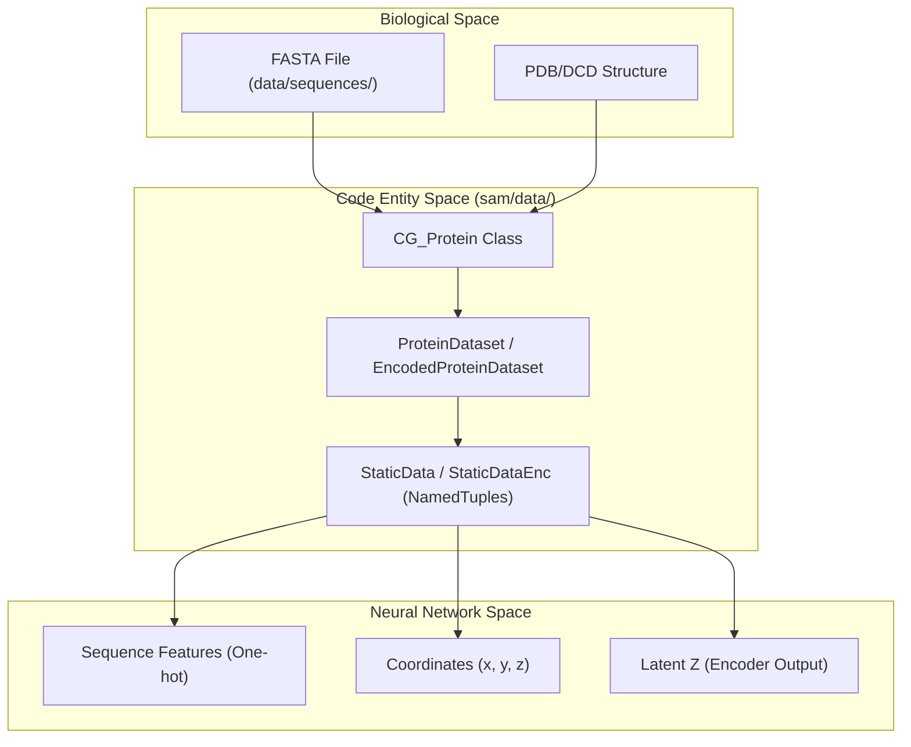
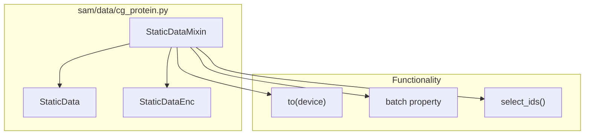

# Data Layer

> **Relevant source files**
> * [sam/data/__init__.py](https://github.com/giacomo-janson/idpsam/blob/ec63c24a/sam/data/__init__.py)
> * [sam/data/cg_protein.py](https://github.com/giacomo-janson/idpsam/blob/ec63c24a/sam/data/cg_protein.py)
> * [sam/data/sequences.py](https://github.com/giacomo-janson/idpsam/blob/ec63c24a/sam/data/sequences.py)
> * [sam/data/topology.py](https://github.com/giacomo-janson/idpsam/blob/ec63c24a/sam/data/topology.py)
> * [setup.py](https://github.com/giacomo-janson/idpsam/blob/ec63c24a/setup.py)

The **Data Layer** in idpSAM manages the transition from raw biological sequences and structures into the tensor representations required by the diffusion model. It encompasses protein data containers, specialized PyTorch datasets for both coordinate and latent-space training, and utilities for handling molecular topologies and amino acid properties.

## System Overview

The data layer is organized into the `sam/data/` package and the `data/` directory. It bridges the gap between biological data (FASTA, PDB/DCD) and the neural network inputs (distance maps, torsion angles, and one-hot sequence encodings).

### Data Flow and Entity Mapping

The following diagram illustrates how biological entities are mapped to code structures within the `sam/data/` package.

**Entity Mapping: Sequence to Model Input**

**Sources:** [sam/data/cg_protein.py L94-L125](https://github.com/giacomo-janson/idpsam/blob/ec63c24a/sam/data/cg_protein.py#L94-L125)

 [sam/data/cg_protein.py L32-L39](https://github.com/giacomo-janson/idpsam/blob/ec63c24a/sam/data/cg_protein.py#L32-L39)

---

## Protein Dataset Classes

The core of the data layer resides in `sam/data/cg_protein.py`, which defines the containers for intrinsically disordered protein (IDP) data.

* **`CG_Protein`**: The primary container for a single protein, holding its name, amino acid sequence, and coarse-grained coordinates [sam/data/cg_protein.py L94-L125](https://github.com/giacomo-janson/idpsam/blob/ec63c24a/sam/data/cg_protein.py#L94-L125)
* **`StaticData` and `StaticDataEnc`**: Specialized `namedtuple` subclasses that emulate `torch_geometric` batches. They group coordinates (`x`), latent encodings (`z`), sequence indices (`a`), and residue IDs (`r`) for efficient batch processing [sam/data/cg_protein.py L32-L88](https://github.com/giacomo-janson/idpsam/blob/ec63c24a/sam/data/cg_protein.py#L32-L88)
* **Dataset Variants**: * `ProteinDataset`: Handles raw Cartesian coordinates, supporting `frames_mode` for sampling specific snapshots from a trajectory. * `EncodedProteinDataset`: Used for training the latent diffusion model (Stage 2), providing pre-computed latent vectors `z` instead of raw coordinates. * **Augmentation**: Supports `xyz_perturb` for adding noise to coordinates during training to improve robustness.

For details, see [Protein Dataset Classes](/giacomo-janson/idpsam/5.1-protein-dataset-classes).

**Sources:** [sam/data/cg_protein.py L32-L125](https://github.com/giacomo-janson/idpsam/blob/ec63c24a/sam/data/cg_protein.py#L32-L125)

---

## Sequence and Topology Utilities

The `sam/data/sequences.py` and `sam/data/topology.py` modules provide the necessary biological context for the structural data.

| Module | Key Functions / Variables | Purpose |
| --- | --- | --- |
| `sequences.py` | `aa_list`, `aa_one_to_three_dict` | Mappings between one-letter and three-letter amino acid codes [sam/data/sequences.py L1-L21](https://github.com/giacomo-janson/idpsam/blob/ec63c24a/sam/data/sequences.py#L1-L21) |
| `sequences.py` | `get_net_q_res` | Calculates the net charge of a sequence [sam/data/sequences.py L27-L34](https://github.com/giacomo-janson/idpsam/blob/ec63c24a/sam/data/sequences.py#L27-L34) |
| `topology.py` | `get_ca_topology` | Generates an `mdtraj.Topology` object consisting only of Alpha Carbons (CA) [sam/data/topology.py L7-L13](https://github.com/giacomo-janson/idpsam/blob/ec63c24a/sam/data/topology.py#L7-L13) |
| `topology.py` | `slice_traj_to_com` | Computes Center of Mass (COM) trajectories for residues [sam/data/topology.py L16-L36](https://github.com/giacomo-janson/idpsam/blob/ec63c24a/sam/data/topology.py#L16-L36) |

For details, see [Sequence and Topology Utilities](/giacomo-janson/idpsam/5.2-sequence-and-topology-utilities).

**Sources:** [sam/data/sequences.py L1-L34](https://github.com/giacomo-janson/idpsam/blob/ec63c24a/sam/data/sequences.py#L1-L34)

 [sam/data/topology.py L7-L36](https://github.com/giacomo-janson/idpsam/blob/ec63c24a/sam/data/topology.py#L7-L36)

---

## Training and Evaluation Sequence Data

The `data/sequences/` directory contains the FASTA files used to define the idpSAM training and benchmark sets. These sequences represent a diverse range of IDP properties, including varying lengths and charge distributions.

* **`training.fasta`**: The primary sequence set used for model optimization.
* **`validation.fasta`**: Used for hyperparameter tuning and monitoring over-fitting.
* **`test.fasta`**: The held-out set used for final performance reporting in the idpSAM publication.

For details, see [Training and Evaluation Sequence Data](/giacomo-janson/idpsam/5.3-training-and-evaluation-sequence-data).

---

## Data Interaction Diagram

This diagram shows how the `StaticDataMixin` allows standard PyTorch batches to behave like geometric data structures, facilitating the movement of data to GPUs.

**Code Entity Space: Batch Handling**

**Sources:** [sam/data/cg_protein.py L41-L72](https://github.com/giacomo-janson/idpsam/blob/ec63c24a/sam/data/cg_protein.py#L41-L72)