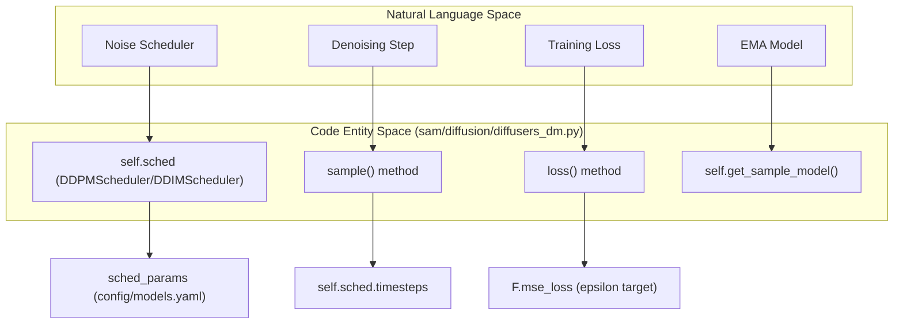

# Diffusers Integration (DDPM/DDIM Scheduler)

> **Relevant source files**
> * [config/models.yaml](https://github.com/giacomo-janson/idpsam/blob/ec63c24a/config/models.yaml)
> * [sam/diffusion/diffusers_dm.py](https://github.com/giacomo-janson/idpsam/blob/ec63c24a/sam/diffusion/diffusers_dm.py)

The `Diffusers` class in `idpSAM` serves as the primary interface between the latent generative model and the Hugging Face `diffusers` library. It encapsulates the noise scheduling, loss computation (epsilon prediction), and the iterative denoising loop required for generating protein latent representations.

## The Diffusers Class

The `Diffusers` class inherits from `DiffusionCommon` and acts as a wrapper around the noise prediction network (`eps_model`) and the specific scheduler (DDPM or DDIM). It manages the transition from Gaussian noise back to the structured latent space defined by the encoder.

### Data Flow and System Mapping

The following diagram maps the high-level diffusion concepts to the specific code entities within the `sam/diffusion/diffusers_dm.py` file.

**Diffusion Logic to Code Mapping**



**Sources:** [sam/diffusion/diffusers_dm.py L10-L187](https://github.com/giacomo-janson/idpsam/blob/ec63c24a/sam/diffusion/diffusers_dm.py#L10-L187)

 [config/models.yaml L60-L70](https://github.com/giacomo-janson/idpsam/blob/ec63c24a/config/models.yaml#L60-L70)

## Scheduler Configuration

The system supports two primary schedulers defined in `config/models.yaml` under the `latent_generative_model` block:

1. **DDPM (Denoising Diffusion Probabilistic Models):** Typically used for training and high-quality sampling.
2. **DDIM (Denoising Diffusion Implicit Models):** Often used for faster sampling with fewer steps.

The `__init__` method of the `Diffusers` class initializes these based on the `sched_params` dictionary:

| Parameter | Role | Source |
| --- | --- | --- |
| `num_train_timesteps` | Total diffusion steps (default: 1000) | [config/models.yaml L64](https://github.com/giacomo-janson/idpsam/blob/ec63c24a/config/models.yaml#L64-L64) |
| `beta_schedule` | The noise schedule type (e.g., `sigmoid`) | [config/models.yaml L67](https://github.com/giacomo-janson/idpsam/blob/ec63c24a/config/models.yaml#L67-L67) |
| `prediction_type` | Model target (default: `epsilon`) | [config/models.yaml L69](https://github.com/giacomo-janson/idpsam/blob/ec63c24a/config/models.yaml#L69-L69) |
| `variance_type` | Noise variance setting for DDPM | [config/models.yaml L68](https://github.com/giacomo-janson/idpsam/blob/ec63c24a/config/models.yaml#L68-L68) |

**Sources:** [sam/diffusion/diffusers_dm.py L26-L67](https://github.com/giacomo-janson/idpsam/blob/ec63c24a/sam/diffusion/diffusers_dm.py#L26-L67)

 [config/models.yaml L60-L70](https://github.com/giacomo-janson/idpsam/blob/ec63c24a/config/models.yaml#L60-L70)

## Training Loss: Epsilon Prediction

The `loss()` method implements the standard MSE loss for diffusion models. It follows these steps:

1. **Time Sampling:** Randomly selects a timestep $t$ for each sample in the batch using `sample_time()` [sam/diffusion/diffusers_dm.py L103](https://github.com/giacomo-janson/idpsam/blob/ec63c24a/sam/diffusion/diffusers_dm.py#L103-L103)
2. **Noise Injection:** Generates Gaussian noise $\epsilon$ and adds it to the clean latent $x_0$ via `self.sched.add_noise()` [sam/diffusion/diffusers_dm.py L108-L111](https://github.com/giacomo-janson/idpsam/blob/ec63c24a/sam/diffusion/diffusers_dm.py#L108-L111)
3. **Model Inference:** The `eps_model` predicts the noise added to the latent [sam/diffusion/diffusers_dm.py L116-L118](https://github.com/giacomo-janson/idpsam/blob/ec63c24a/sam/diffusion/diffusers_dm.py#L116-L118)
4. **MSE Calculation:** Computes the difference between the added noise and the predicted noise [sam/diffusion/diffusers_dm.py L133-L134](https://github.com/giacomo-janson/idpsam/blob/ec63c24a/sam/diffusion/diffusers_dm.py#L133-L134)

**Sources:** [sam/diffusion/diffusers_dm.py L89-L148](https://github.com/giacomo-janson/idpsam/blob/ec63c24a/sam/diffusion/diffusers_dm.py#L89-L148)

## Inference: The Sample Loop

The `sample()` method performs the iterative denoising process. It utilizes Exponential Moving Average (EMA) weights if configured, ensuring more stable generation.

**Inference Execution Flow**

```mermaid
sequenceDiagram
  participant SAM Class
  participant Diffusers.sample()
  participant EMA/EpsModel
  participant Scheduler (DDPM/DDIM)

  SAM Class->>Diffusers.sample(): call sample(batch)
  Diffusers.sample()->>Diffusers.sample(): Initialize x_t ~ N(0, I)
  Diffusers.sample()->>Diffusers.sample(): Get model via get_sample_model()
  loop [Every t in sched.timesteps]
    Diffusers.sample()->>EMA/EpsModel: model(xt, t, batch)
    EMA/EpsModel-->>Diffusers.sample(): noise_prediction
    Diffusers.sample()->>Scheduler (DDPM/DDIM): scale_model_input(noise_prediction)
    Diffusers.sample()->>Scheduler (DDPM/DDIM): step(noisy_residual, i, x_t)
    Scheduler (DDPM/DDIM)-->>Diffusers.sample(): prev_sample (x_{t-1})
  end
  Diffusers.sample()-->>SAM Class: return final latent x_0
```

**Sources:** [sam/diffusion/diffusers_dm.py L151-L187](https://github.com/giacomo-janson/idpsam/blob/ec63c24a/sam/diffusion/diffusers_dm.py#L151-L187)

 [sam/diffusion/common.py L1-L11](https://github.com/giacomo-janson/idpsam/blob/ec63c24a/sam/diffusion/common.py#L1-L11)

### Key Implementation Details:

* **EMA Selection:** The method calls `self.get_sample_model()` [sam/diffusion/diffusers_dm.py L175](https://github.com/giacomo-janson/idpsam/blob/ec63c24a/sam/diffusion/diffusers_dm.py#L175-L175)  which is defined in the base `DiffusionCommon` class. This switches the model to use EMA weights if `_use_ema` is set to true in the configuration [config/models.yaml L101](https://github.com/giacomo-janson/idpsam/blob/ec63c24a/config/models.yaml#L101-L101)
* **Timestep Handling:** Timesteps are handled as a tensor of shape `(batch_size,)` filled with the current step index $i$ [sam/diffusion/diffusers_dm.py L178-L180](https://github.com/giacomo-janson/idpsam/blob/ec63c24a/sam/diffusion/diffusers_dm.py#L178-L180)
* **Self-Conditioning Scaffolding:** The class contains logic for self-conditioning (`use_sc`), though the training implementation for this feature is currently marked as `NotImplementedError` in the provided version [sam/diffusion/diffusers_dm.py L121-L123](https://github.com/giacomo-janson/idpsam/blob/ec63c24a/sam/diffusion/diffusers_dm.py#L121-L123)

**Sources:** [sam/diffusion/diffusers_dm.py L121-L123](https://github.com/giacomo-janson/idpsam/blob/ec63c24a/sam/diffusion/diffusers_dm.py#L121-L123)

 [sam/diffusion/diffusers_dm.py L175-L185](https://github.com/giacomo-janson/idpsam/blob/ec63c24a/sam/diffusion/diffusers_dm.py#L175-L185)

 [config/models.yaml L101-L106](https://github.com/giacomo-janson/idpsam/blob/ec63c24a/config/models.yaml#L101-L106)