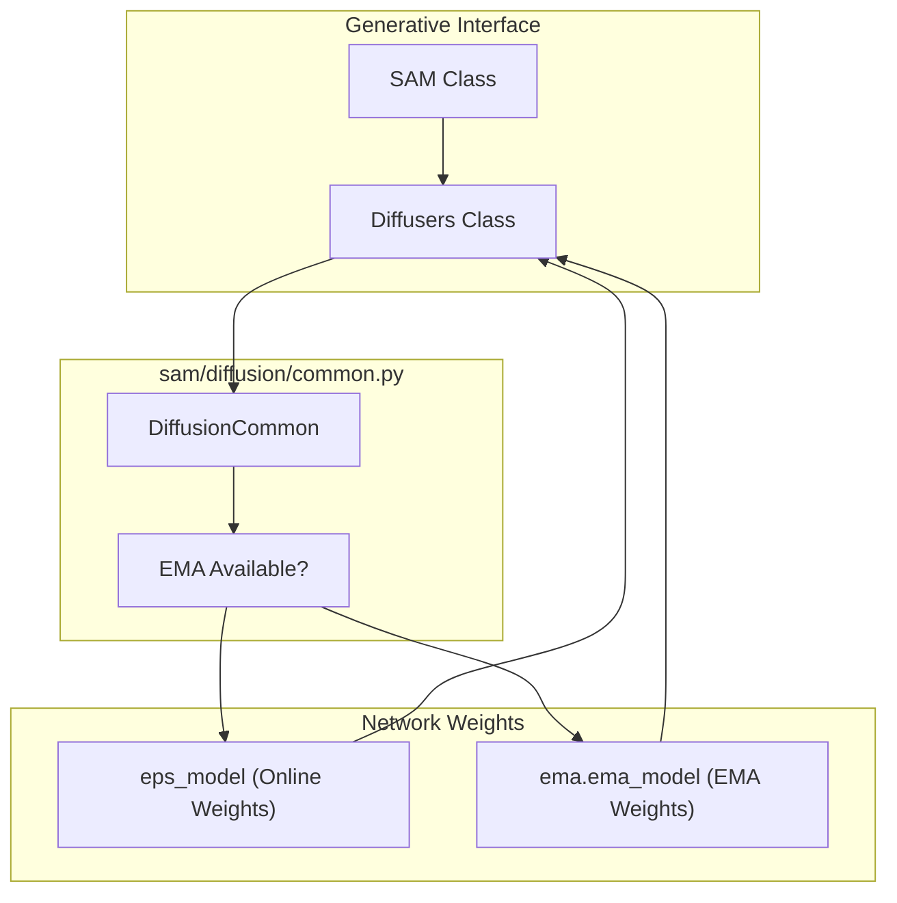
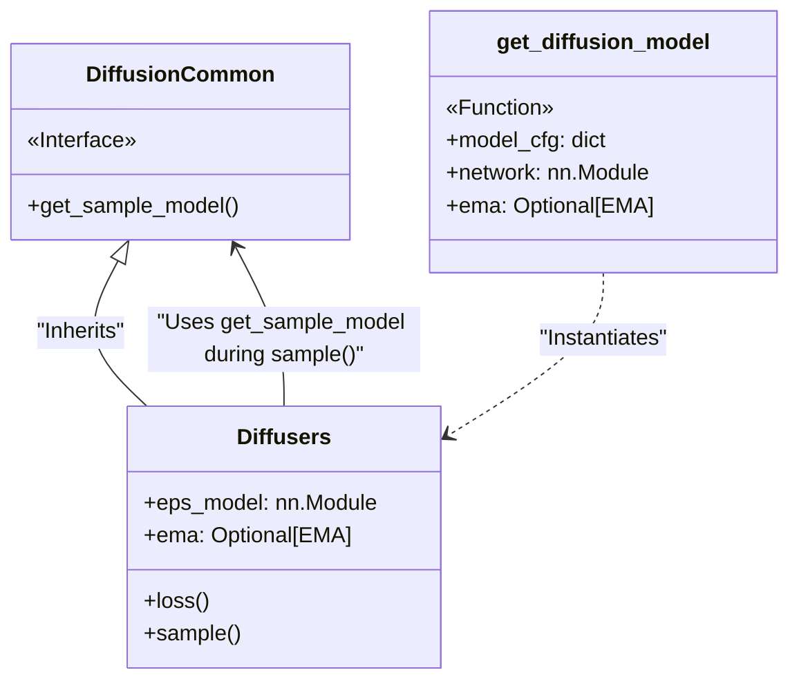

# Diffusion Base and EMA

> **Relevant source files**
> * [sam/diffusion/__init__.py](https://github.com/giacomo-janson/idpsam/blob/ec63c24a/sam/diffusion/__init__.py)
> * [sam/diffusion/common.py](https://github.com/giacomo-janson/idpsam/blob/ec63c24a/sam/diffusion/common.py)

The `idpSAM` diffusion system utilizes a shared base class to manage the transition between training and inference modes, specifically handling the selection of model weights. During inference, the system prioritizes Exponential Moving Average (EMA) weights to ensure structural stability and generation quality.

## DiffusionCommon Base Class

The `DiffusionCommon` class serves as the foundational parent for specific diffusion implementations, such as the `Diffusers` class used for latent diffusion [sam/diffusion/common.py L5](https://github.com/giacomo-janson/idpsam/blob/ec63c24a/sam/diffusion/common.py#L5-L5)

 Its primary responsibility is to abstract the logic for retrieving the active model instance based on whether EMA is enabled.

### Model Selection Logic

The `get_sample_model` method is the critical interface for the sampling loop. It determines whether to use the online (training) weights or the smoothed EMA weights [sam/diffusion/common.py L7-L11](https://github.com/giacomo-janson/idpsam/blob/ec63c24a/sam/diffusion/common.py#L7-L11)

| Condition | Returned Model | Description |
| --- | --- | --- |
| `self.ema is None` | `self.eps_model` | Returns the raw `eps_trf` network currently being optimized. |
| `self.ema is not None` | `self.ema.ema_model` | Returns the model instance containing the averaged weights. |

### System Integration Diagram

The following diagram illustrates how the `DiffusionCommon` logic bridges the high-level `SAM` model requests to the underlying neural network weights.

**Model Selection Data Flow**

Sources: [sam/diffusion/common.py L5-L11](https://github.com/giacomo-janson/idpsam/blob/ec63c24a/sam/diffusion/common.py#L5-L11)

 [sam/diffusion/diffusers_dm.py L7-L13](https://github.com/giacomo-janson/idpsam/blob/ec63c24a/sam/diffusion/diffusers_dm.py#L7-L13)

## Exponential Moving Average (EMA) in Inference

EMA is a technique where a second set of model weights is maintained as a moving average of the weights optimized during training. In the context of `idpSAM`, these weights are loaded during the initialization of the `SAM` class and passed into the diffusion wrapper [sam/diffusion/__init__.py L4-L13](https://github.com/giacomo-janson/idpsam/blob/ec63c24a/sam/diffusion/__init__.py#L4-L13)

### EMA Switching Mechanism

When the `SAM` model performs inference (e.g., via `generate()` or `sample()`), the `Diffusers` implementation calls `get_sample_model()` to obtain the network instance for epsilon prediction.

1. **Initialization**: The `get_diffusion_model` function receives an optional `ema` object [sam/diffusion/__init__.py L4](https://github.com/giacomo-janson/idpsam/blob/ec63c24a/sam/diffusion/__init__.py#L4-L4)
2. **Configuration**: The `Diffusers` instance is instantiated with this `ema` reference [sam/diffusion/__init__.py L7-L13](https://github.com/giacomo-janson/idpsam/blob/ec63c24a/sam/diffusion/__init__.py#L7-L13)
3. **Inference**: During the denoising loop, the code accesses the model via `self.get_sample_model()`. If EMA weights were provided in the `ema` parameter, `self.ema.ema_model` is used for all noise predictions [sam/diffusion/common.py L10-L11](https://github.com/giacomo-janson/idpsam/blob/ec63c24a/sam/diffusion/common.py#L10-L11)

### Code Entity Mapping

This diagram maps the logical concept of EMA to the specific code entities defined in the `sam/diffusion` package.

**EMA Entity Mapping**

Sources: [sam/diffusion/common.py L5-L11](https://github.com/giacomo-janson/idpsam/blob/ec63c24a/sam/diffusion/common.py#L5-L11)

 [sam/diffusion/__init__.py L4-L16](https://github.com/giacomo-janson/idpsam/blob/ec63c24a/sam/diffusion/__init__.py#L4-L16)

## Implementation Details

The factory function `get_diffusion_model` acts as the entry point for the diffusion subsystem. It checks the `latent_generative_model` type from the configuration (defaulting to `diffusers_dm`) and constructs the appropriate object with the provided network and EMA handles [sam/diffusion/__init__.py L5-L13](https://github.com/giacomo-janson/idpsam/blob/ec63c24a/sam/diffusion/__init__.py#L5-L13)

* **Network Injection**: The `eps_model` (typically an `IdpGAN_TransformerBlock` based network) is passed directly [sam/diffusion/__init__.py L8](https://github.com/giacomo-janson/idpsam/blob/ec63c24a/sam/diffusion/__init__.py#L8-L8)
* **EMA Injection**: The `ema` object, if present, is passed to the constructor, allowing the `DiffusionCommon` base to toggle weight sets [sam/diffusion/__init__.py L11](https://github.com/giacomo-janson/idpsam/blob/ec63c24a/sam/diffusion/__init__.py#L11-L11)

Sources: [sam/diffusion/__init__.py L4-L16](https://github.com/giacomo-janson/idpsam/blob/ec63c24a/sam/diffusion/__init__.py#L4-L16)

 [sam/diffusion/common.py L1-L11](https://github.com/giacomo-janson/idpsam/blob/ec63c24a/sam/diffusion/common.py#L1-L11)