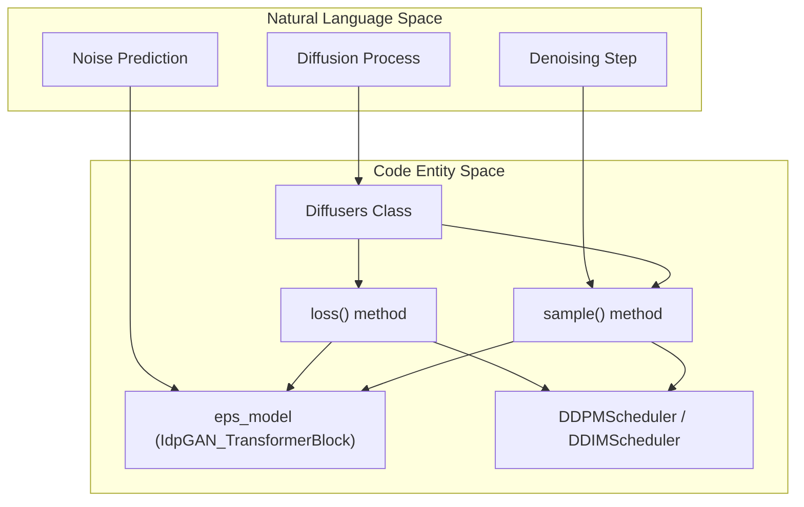

# Diffusion System

> **Relevant source files**
> * [sam/diffusion/__init__.py](https://github.com/giacomo-janson/idpsam/blob/ec63c24a/sam/diffusion/__init__.py)
> * [sam/diffusion/common.py](https://github.com/giacomo-janson/idpsam/blob/ec63c24a/sam/diffusion/common.py)
> * [sam/diffusion/diffusers_dm.py](https://github.com/giacomo-janson/idpsam/blob/ec63c24a/sam/diffusion/diffusers_dm.py)

The `sam/diffusion/` package manages the generative process of idpSAM. It abstracts the diffusion probabilistic modeling logic, integrating external schedulers with the internal noise prediction networks to perform both training (loss calculation) and inference (iterative denoising).

The system is designed to work within the latent space produced by the autoencoder, diffusing and denoising the compressed structural representations rather than raw Cartesian coordinates.

### Diffusion Orchestration Logic

The diffusion system is initialized via a factory function that maps configuration parameters to specific diffusion implementations. Currently, the system primarily utilizes the `Diffusers` class, which wraps the Hugging Face `diffusers` library to provide standard DDPM and DDIM scheduling.

| Component | Code Entity | Responsibility |
| --- | --- | --- |
| **Model Factory** | `get_diffusion_model` | Instantiates the diffusion wrapper based on `model_cfg`. |
| **Base Class** | `DiffusionCommon` | Provides shared utilities, such as EMA model selection. |
| **Implementation** | `Diffusers` | Handles noise scheduling, loss computation, and sampling loops. |

**Sources:**

* `sam/diffusion/__init__.py:4-16` (get_diffusion_model implementation)
* `sam/diffusion/diffusers_dm.py:10-17` (Diffusers class definition)
* `sam/diffusion/common.py:5-11` (DiffusionCommon base class)

### System Architecture and Data Flow

The following diagram illustrates how the `Diffusers` class bridges the high-level sampling requirements with the low-level `eps_model` (the noise prediction transformer).



**Sources:**

* `sam/diffusion/diffusers_dm.py:10-67` (Class structure and scheduler initialization)
* `sam/diffusion/diffusers_dm.py:89-148` (Loss calculation logic)
* `sam/diffusion/diffusers_dm.py:151-187` (Sampling loop logic)

### Training and Loss Computation

During training, the `loss()` method in `Diffusers` performs the forward diffusion process. It samples a random timestep $t$, adds Gaussian noise to the latent representation $z$, and queries the `eps_model` to predict the added noise. The training objective is typically the Mean Squared Error (MSE) between the predicted and actual noise.

* **Noise Injection**: Uses `self.sched.add_noise` to transition from $x_0$ to $x_t$ [sam/diffusion/diffusers_dm.py L111](https://github.com/giacomo-janson/idpsam/blob/ec63c24a/sam/diffusion/diffusers_dm.py#L111-L111) .
* **Prediction**: The model predicts the "epsilon" (noise) component [sam/diffusion/diffusers_dm.py L116-L118](https://github.com/giacomo-janson/idpsam/blob/ec63c24a/sam/diffusion/diffusers_dm.py#L116-L118) .
* **Loss Function**: Supports `l1`, `l2` (MSE), and `huber` losses [sam/diffusion/diffusers_dm.py L131-L138](https://github.com/giacomo-janson/idpsam/blob/ec63c24a/sam/diffusion/diffusers_dm.py#L131-L138) .

**Sources:**

* `sam/diffusion/diffusers_dm.py:89-148` (Detailed loss implementation)

### Iterative Denoising (Sampling)

The `sample()` method implements the reverse diffusion process. Starting from pure Gaussian noise in the latent space, it iteratively applies the noise prediction network and the scheduler's step function to recover the denoised latent representation.

```mermaid
sequenceDiagram
  participant SAM Class
  participant Diffusers.sample()
  participant Scheduler (DDPM/DDIM)
  participant eps_model

  SAM Class->>Diffusers.sample(): call sample(batch)
  Diffusers.sample()->>Diffusers.sample(): Generate x_t (Gaussian Noise)
  loop [for t in timesteps]
    Diffusers.sample()->>eps_model: Forward(x_t, t, batch)
    eps_model-->>Diffusers.sample(): noisy_residual
    Diffusers.sample()->>Scheduler (DDPM/DDIM): step(noisy_residual, t, x_t)
    Scheduler (DDPM/DDIM)-->>Diffusers.sample(): prev_sample (x_{t-1})
  end
  Diffusers.sample()-->>SAM Class: Return denoised latent (out)
```

**Sources:**

* `sam/diffusion/diffusers_dm.py:176-187` (The denoising loop)
* `sam/diffusion/common.py:7-11` (Selection of the sampling model)

---

## Child Pages

* **[Diffusers Integration (DDPM/DDIM Scheduler)](/giacomo-janson/idpsam/4.1-diffusers-integration-(ddpmddim-scheduler))** Detailed breakdown of `sam/diffusion/diffusers_dm.py`, including scheduler parameterization, self-conditioning hooks, and the specific mechanics of the `loss()` and `sample()` functions.
* **[Diffusion Base and EMA](/giacomo-janson/idpsam/4.2-diffusion-base-and-ema)** Exploration of `sam/diffusion/common.py` and the `DiffusionCommon` base class. This page explains how the system handles Exponential Moving Average (EMA) weights to improve generative stability during inference.